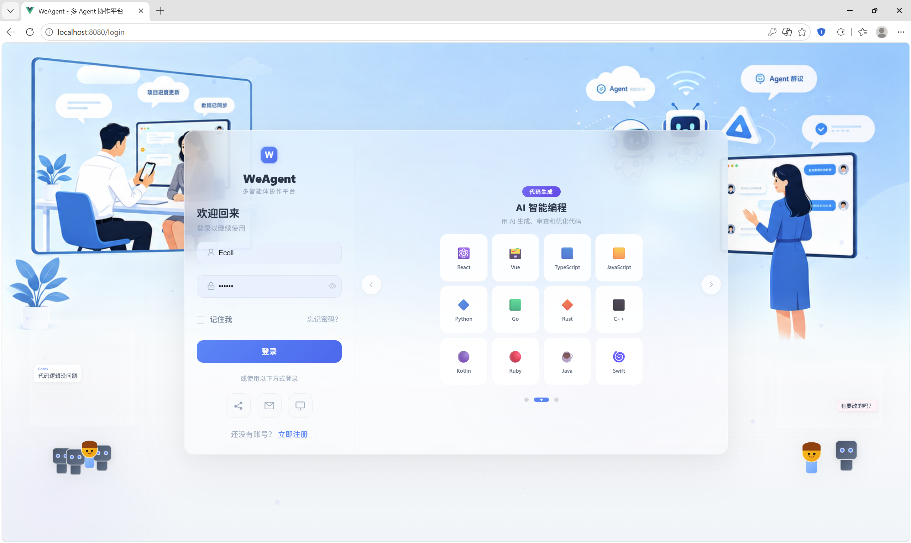
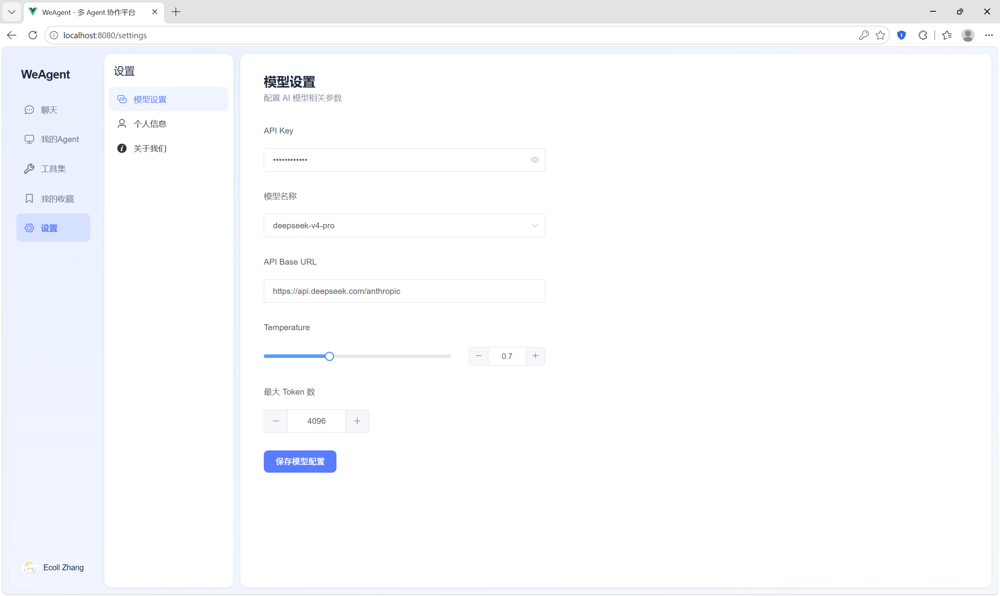
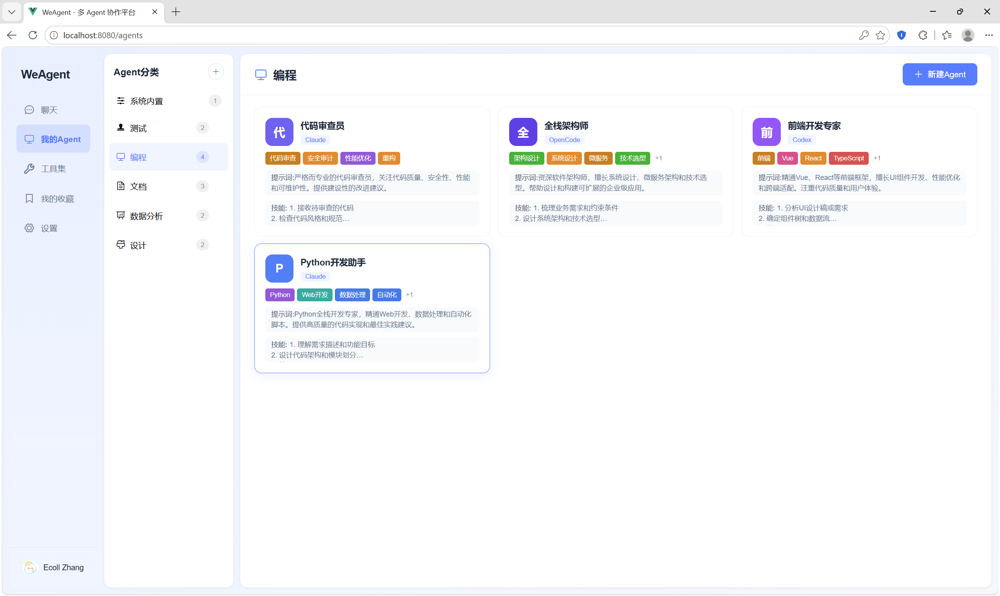
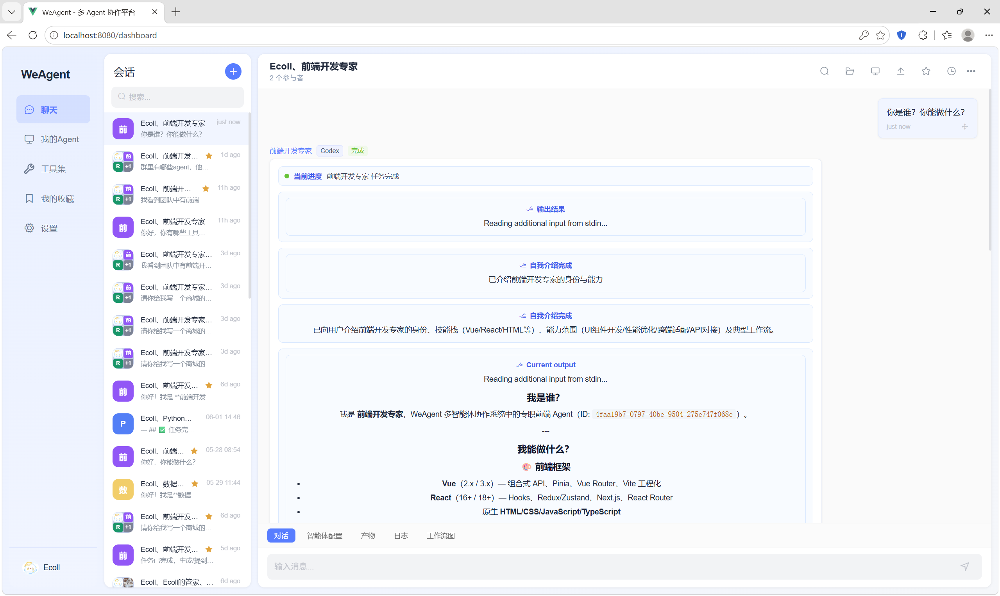
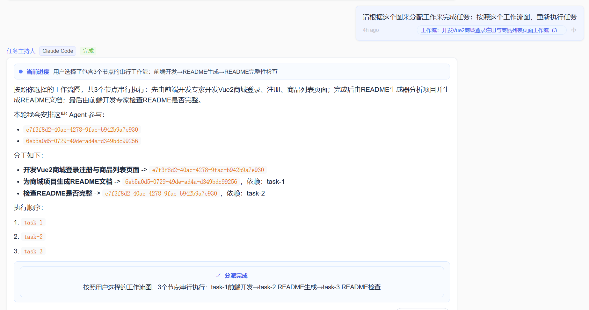

# WeAgent

WeAgent 是一个面向多 Agent 协作的任务平台。用户可以像使用 IM 一样创建会话、选择 Agent、发送任务，并在同一个会话中查看 Agent 回复、执行进度、工作流、产物、容器文件和运行日志。

当前项目同时包含 Web 端、Electron 桌面端、Capacitor Android 端和 Flask 后端。Web 端作为主功能入口，桌面端做全量迁移，Android 端优先迁移登录、会话、Agent 和个人设置等主要功能。

## 功能预览

| 登录 | 模型设置 |
|---|---|
|  |  |

| Agent 配置 | 会话 |
|---|---|
|  |  |

| 主持人 Agent |
|---|
|  |

## 核心能力

- 多 Agent 会话：支持单 Agent 和多 Agent 会话，多 Agent 会自动引入主持人 Agent 做任务拆解和调度。
- 结构化消息：支持进度、进度历史、结果、表格、文件、Raw Output、工作流等消息元素。
- 产物工作台：支持查看容器文件、HTML 预览、代码查看和编辑、图片查看、表格查看、Diff/工作流预览。
- 我的 Agent：支持 Agent 新建、编辑、头像颜色、能力标签、系统提示词、Skill、工具集能力绑定。
- 工具集能力：支持 Skill、Tool、Plugin、MCP 等能力导入、分类、审计、配置和绑定。
- 我的收藏：支持收藏会话、过滤收藏、取消收藏、从收藏进入会话。
- 多端客户端：Web、桌面端和 Android 端连接同一个后端服务。
- 沙箱容器：每个 Agent 会话创建独立 Docker 容器，Agent 在 `/workspace` 下生成和管理产物。

## 技术栈

| 模块 | 技术 |
|---|---|
| 后端 | Flask, Flask-SQLAlchemy, Flask-Migrate, Flask-JWT-Extended, Flask-SocketIO |
| 数据库 | MySQL, Redis |
| Web 前端 | Vue 2.7, Vue Router 3, Vuex 3, Element UI, Axios, Socket.IO Client |
| 桌面端 | Electron 29, Vite, Vue 2.7, electron-builder |
| Android 端 | Capacitor 6, Vite, Vue 2.7, Android Studio |
| 沙箱 | Docker, Python 3.11, Node.js 20, Claude Code, Codex, OpenCode |

## 目录结构

```text
WeAgent/
├─ backend/                  # Flask 后端与沙箱服务
│  ├─ app/
│  │  ├─ controllers/         # API 控制器
│  │  ├─ services/            # 业务逻辑
│  │  ├─ models/              # SQLAlchemy 模型
│  │  ├─ repositories/        # 数据访问层
│  │  ├─ sandbox/             # Docker 沙箱和容器端 orchestrator
│  │  └─ socket/              # Socket.IO 事件
│  ├─ sql/init.sql
│  └─ run.py
├─ frontend/                 # Web 客户端
├─ clients/
│  ├─ desktop/                # Electron 桌面端
│  └─ android/                # Capacitor Android 端
├─ toolset/                  # 工具集导入 UAT 示例
├─ docs/
│  ├─ tech/                   # 技术方案文档
│  └─ ai-collab/              # AI 协作归档文档
└─ README.md
```

## 更多 README 入口

- [多端客户端说明](clients/README.md)
- [沙箱容器说明](backend/app/sandbox/README.md)
- [工具集 UAT 示例](toolset/README.md)
- [技术文档索引](docs/tech/README.md)
- [AI 协作归档说明](docs/ai-collab/README.md)

## 环境要求

- Python 3.10+
- Node.js 16+，建议 20+
- MySQL 8.0+
- Redis 7.x
- Docker Desktop
- 桌面端打包需要 Windows/macOS/Linux 对应构建环境
- Android 端需要 Android Studio、Android SDK、Gradle 可用

## 后端启动

```powershell
cd backend
python -m venv venv
.\venv\Scripts\activate
pip install -r requirements.txt
copy .env.example .env
python run.py
```

后端默认端口由 `PORT` 环境变量控制，当前开发中常用 `5002`。请确认 `.env` 中 MySQL、Redis、JWT、模型配置相关变量正确。

### 数据库初始化

```sql
CREATE DATABASE IF NOT EXISTS weagent DEFAULT CHARACTER SET utf8mb4 COLLATE utf8mb4_unicode_ci;
```

```powershell
mysql -u root -p weagent < backend/sql/init.sql
```

如果使用 Flask-Migrate：

```powershell
cd backend
flask db upgrade
```

## 构建沙箱镜像

正式 Agent 会话依赖 `weagent-sandbox:latest`。首次运行或修改 `backend/app/sandbox/container/`、`backend/app/sandbox/Dockerfile` 后需要重建镜像。

```powershell
cd backend
python -c "from app.sandbox import build_image; build_image()"
```

等价 Docker 命令：

```powershell
cd backend
docker build -t weagent-sandbox:latest -f app/sandbox/Dockerfile app/sandbox
```

常见排查：

```powershell
docker images weagent-sandbox:latest
docker ps --filter name=weagent
```

如果创建会话时报容器接口 404，通常是旧镜像没有新接口。优先重建镜像并重启后端。

## Web 端启动

```powershell
cd frontend
npm install
npm run serve
```

构建：

```powershell
npm run build
```

## 桌面端启动与打包

```powershell
cd clients/desktop
npm install
npm run dev
```

打包：

```powershell
npm run electron:build
```

产物输出在 `clients/desktop/release/`。桌面端应用名为 `WeAgent`，图标来自 `clients/desktop/logo.png`，打包脚本会生成 `logo.ico`。

桌面端不内置后端，首次进入需要配置外部后端地址。本机测试可填 `http://127.0.0.1:5002`，局域网测试请填后端机器 IP，例如 `http://192.168.1.100:5002`。

## Android 端启动

```powershell
cd clients/android
npm install
npm run build
npm run cap:sync
npm run cap:open
```

真机调试时，后端地址不能填 `localhost`。请填写后端电脑在局域网中的地址，例如 `http://192.168.1.100:5002`。调试阶段已允许明文 HTTP，生产部署建议切换 HTTPS。

## API 概览

| 方法 | 路径 | 说明 |
|---|---|---|
| POST | `/api/auth/register` | 用户注册 |
| POST | `/api/auth/login` | 用户登录 |
| GET/PUT | `/api/auth/profile` | 获取/更新个人信息 |
| GET/POST | `/api/conversations` | 会话列表/创建会话 |
| GET/DELETE | `/api/conversations/<id>` | 会话详情/删除会话 |
| POST | `/api/messages` | 发送消息 |
| GET | `/api/messages/conversation/<id>` | 会话消息历史 |
| GET/POST | `/api/agents` | Agent 列表/创建 Agent |
| PUT/DELETE | `/api/agents/<id>` | 更新/删除 Agent |
| GET/POST | `/api/toolsets/categories` | 工具集分类 |
| GET/POST | `/api/capabilities` | 能力库 |
| POST | `/api/upload` | 上传图片文件 |
| GET | `/api/sandbox/sessions/<id>/files/tree` | 查看容器文件树 |
| GET | `/api/health` | 健康检查 |

## 实时事件

前端通过 Socket.IO 加入会话房间，接收用户消息、Agent 消息、结构化元素流、状态和沙箱事件。

常用事件：

- `join`
- `leave`
- `send_message`
- `conversation_message_created`
- `conversation_message_element_stream`
- `conversation_message_step`
- `conversation_message_status`
- `sandbox_event`

## 测试与验证

后端：

```powershell
cd backend
python -m py_compile app/services/auth_service.py
python -m pytest tests
```

如果当前环境没有安装 `pytest`：

```powershell
pip install pytest
```

前端：

```powershell
cd frontend
npm run build
```

桌面端：

```powershell
cd clients/desktop
npm run build
```

## 开发协作建议

- 开始新需求前先确认工作区是否干净：`git status --short`。
- 已完成且验证通过的阶段建议先提交，再进入下一个需求。
- 合并远程分支前先分析改动范围和功能冲突，再处理代码冲突。
- 涉及后端、消息渲染、沙箱、Agent 或工具集的改动，需要做受影响功能的回归测试。
