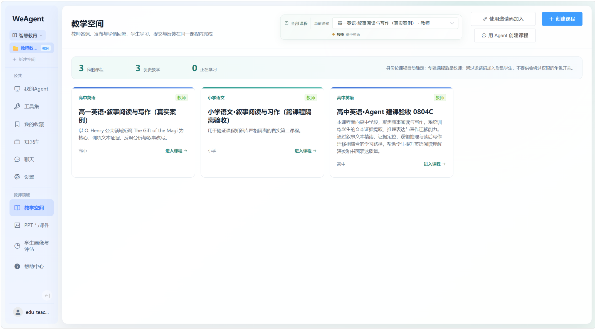
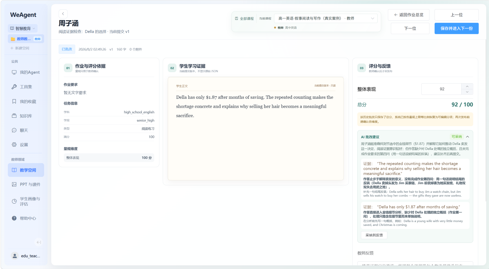
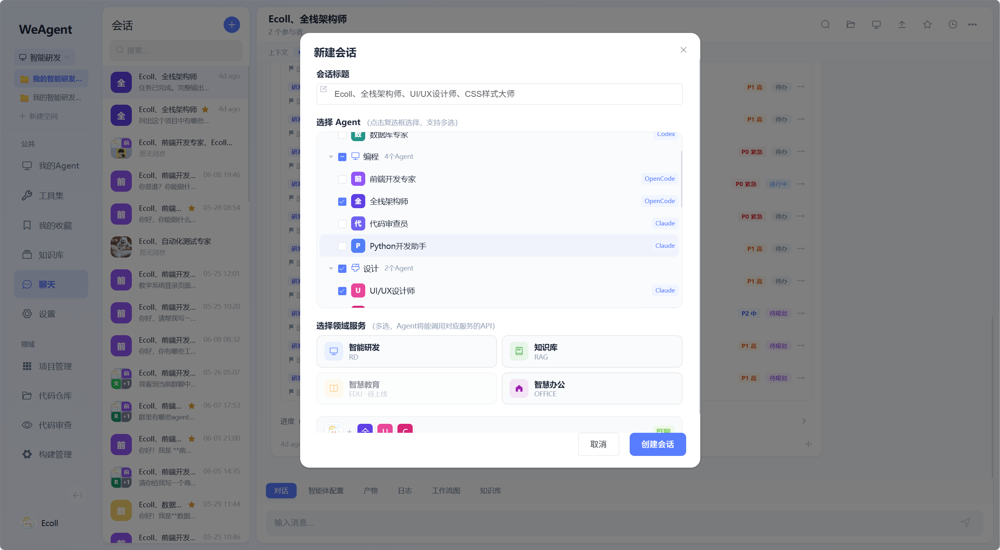
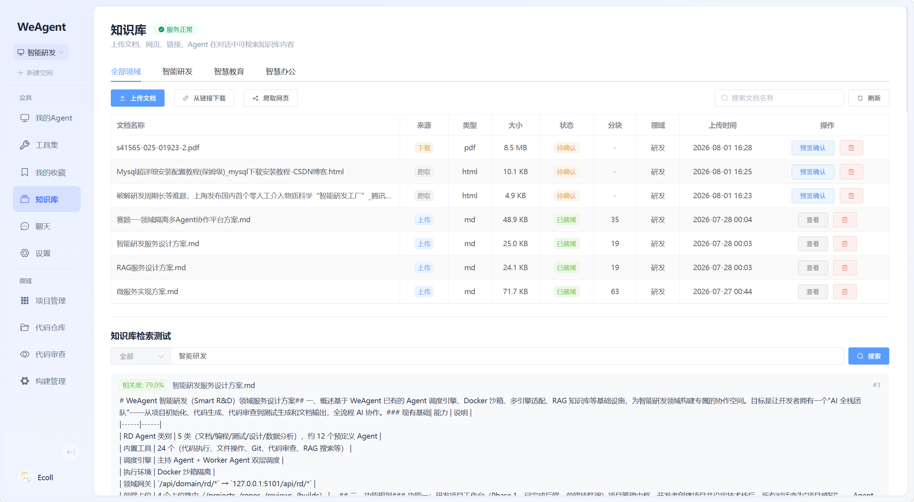

# WeAgent

WeAgent 是一站式智能协作平台，将 AI Agent 能力深度融入真实工作场景，覆盖智能研发、智慧教育、协同办公三大领域。平台以"工作空间 + 领域隔离"架构为核心，每个空间可独立配置多个协作 Agent，实现上下文感知的智能对话与任务执行。

## 平台预览

<!-- TODO: 替换为实际截图 -->

| 智能研发 - 项目管理 | 智能研发 - 代码审查 |
|---|---|
|  |  |

| 智慧教育 - 课程空间 | 智慧教育 - 作业批改 |
|---|---|
|  |  |

| 协同办公 - 会议管理 | 协同办公 - 公文审批 |
|---|---|
|  |  |

| 多 Agent 协作 | 知识库检索 |
|---|---|
|  |  |

## 核心能力

### 领域架构
- **工作空间 + 领域隔离**：每个领域独立配置 Agent、工具集、灰度开关，切换空间自动刷新上下文。
- **灰度控制**：按领域按功能灵活开启/关闭特性，支持公共配置跨领域复用。
- **领域服务总线**：统一 `/spec` 和 `/health` 规范，Agent 通过 `call_service_api` 工具跨领域调用。

### 智能研发
- 项目管理、需求追踪、迭代规划、缺陷管理全生命周期支持。
- 甘特图可视化、项目成员协作、活动日志追溯。
- 代码仓库对接（GitHub OAuth），文件树浏览与代码高亮查看。
- AI 代码审查（安全/规范/逻辑/性能四维度），支持脚本审查与 LLM 审查双模式。
- CI/CD 构建管理，对接 GitHub Actions 触发与状态同步。
- Agent 自动感知项目上下文，推送需求/缺陷/迭代等结构化卡片通知。

### 智慧教育
- 教师端：自定义课程体系搭建、课件编辑与导出、作业批改工作流。
- 学生端：引导式对话学习、AI 一对一辅导、知识点薄弱项诊断。
- 班级花名册管理与课程成员邀请，角色感知导航（教师/学生差异化视图）。
- 版本化教学循环，课件与作业按版本独立发布与回溯。
- Agent 辅助生成可编辑课件、演示文稿、学情报告。

### 协同办公
- 会议管理：创建/参会确认/纪要自动生成，行动项拆解与进度跟踪。
- 公文审批：直属领导并行审批 + 部门经理逐级审批，双栏布局清晰呈现流转状态。
- 任务派发：会议行动项转任务卡片，责任人指派与状态闭环。
- 组织协同：组织架构管理，跨团队任务分配，团队成员关系维护。
- Agent 自动生成会议纪要、跟踪任务闭环、辅助审批流转。

### Agent 与沙箱
- 多 Agent 会话，主持人 Agent 自动拆解任务与调度成员。
- 支持 @ 指定 Agent 执行特定任务。
- Docker 沙箱隔离，每个会话独立容器环境。
- 适配 Claude Code / Codex / OpenCode 多种执行引擎。
- 自定义工作流图可视化多 Agent 协作路径。

### RAG 知识库
- 文档解析、向量化存储与语义检索。
- 对话内精准知识召回，Agent 回答基于您的私有数据。
- 支持按知识库域名与文档 ID 过滤检索范围。

### 多端支持
- Web 端（Vue 2.7 + Element UI）。
- Electron 桌面端（Windows/macOS/Linux）。
- Capacitor Android 端。

### 结构化消息
- 支持 Markdown、表格、代码、图片、文件、HTML 预览。
- 进度条、工作流图、产物卡片、领域卡片（需求/缺陷/迭代/会议/审批）。
- 收藏、搜索、对话历史定位。

## 技术栈

| 模块 | 技术 |
|---|---|
| 后端 | Flask, Flask-SQLAlchemy, Flask-Migrate, Flask-JWT-Extended, Flask-SocketIO |
| 数据库 | MySQL, Redis |
| Web 前端 | Vue 2.7, Vue Router 3, Vuex 3, Element UI, Axios, Socket.IO Client |
| 桌面端 | Electron 29, Vite, Vue 2.7, electron-builder |
| Android 端 | Capacitor 6, Vite, Vue 2.7, Android Studio |
| 沙箱 | Docker, Python 3.11, Node.js 20, Claude Code, Codex, OpenCode |
| RAG | Flask, sentence-transformers, faiss-cpu, markitdown |

## 目录结构

```text
WeAgent/
├─ backend/
│  ├─ app/                       # 主后端：认证、会话、Agent、消息、沙箱
│  │  ├─ controllers/            # API 控制器
│  │  ├─ services/               # 业务逻辑
│  │  ├─ models/                 # SQLAlchemy 模型
│  │  ├─ repositories/           # 数据访问层
│  │  ├─ sandbox/                # Docker 沙箱和容器端 orchestrator
│  │  └─ socket/                 # Socket.IO 事件
│  ├─ services/
│  │  ├─ rd/                     # 智能研发领域服务
│  │  ├─ edu/                    # 智慧教育领域服务
│  │  ├─ office/                 # 协同办公领域服务
│  │  └─ rag/                    # RAG 知识库服务
│  ├─ sql/init.sql               # 数据库初始化脚本
│  ├─ requirements.txt
│  └─ run.py
├─ frontend/                     # Web 客户端
│  └─ src/
│     ├─ views/
│     │  ├─ rd/                  # 研发页面
│     │  ├─ education/           # 教育页面
│     │  └─ *.vue                # 办公页面 (Office*.vue)
│     ├─ components/             # 共享组件
│     ├─ store/                  # Vuex 状态管理
│     └─ api/                    # API 调用层
├─ clients/
│  ├─ desktop/                   # Electron 桌面端
│  └─ android/                   # Capacitor Android 端
├─ docs/
│  ├─ tech/                      # 技术方案文档
│  └─ ai-collab/                 # AI 协作归档文档
├─ AI协作文档/                    # AI 协作规则、资产和沉淀材料
├─ 开发迭代&版本线.md             # 版本演进历史
└─ README.md
```

## 领域服务 README

- [智能研发 (RD)](backend/services/rd/README.md)
- [智慧教育 (Education)](backend/services/edu/README.md)
- [协同办公 (Office)](backend/services/office/README.md)
- [RAG 知识库](backend/services/rag/README.md)

## 更多文档入口

- [多端客户端说明](clients/README.md)
- [沙箱容器说明](backend/app/sandbox/README.md)
- [技术文档索引](docs/tech/README.md)
- [AI 协作归档说明](docs/ai-collab/README.md)
- [AI 仓库规则](AI协作文档/1-AI仓库规则/ai-entry-overview.md)
- [AI 协作友好资产](AI协作文档/2-AI协作友好/)
- [开发迭代 & 版本线](开发迭代&版本线.md)

## 环境要求

- Python 3.10+
- Node.js 16+，建议 20+
- MySQL 8.0+
- Redis 7.x
- Docker Desktop
- 桌面端打包需要 Windows/macOS/Linux 对应构建环境
- Android 端需要 Android Studio、Android SDK、Gradle 可用

## 快速开始

### 1. 后端启动

```powershell
cd backend
python -m venv venv
.\venv\Scripts\activate
pip install -r requirements.txt
copy .env.example .env
# 编辑 .env 配置 MySQL、Redis、JWT、模型等参数
python run.py
```

后端默认端口由 `PORT` 环境变量控制，当前开发中常用 `5002`。领域服务（RD/Education/Office/RAG）作为独立 Flask 应用，由主后端通过代理路由转发。

### 2. 数据库初始化

```sql
CREATE DATABASE IF NOT EXISTS weagent DEFAULT CHARACTER SET utf8mb4 COLLATE utf8mb4_unicode_ci;
```

```powershell
mysql -u root -p weagent < backend/sql/init.sql
```

如果使用 Flask-Migrate：

```powershell
cd backend
flask db upgrade
```

各领域服务有独立的数据库初始化脚本：
- RD: `backend/services/rd/` — 首次启动自动建表
- Office: `backend/services/office/sql/init.sql`
- RAG: `backend/services/rag/` — 首次启动自动建表

### 3. 构建沙箱镜像

正式 Agent 会话依赖 `weagent-sandbox:latest`：

```powershell
cd backend
docker build -t weagent-sandbox:latest -f app/sandbox/Dockerfile app/sandbox
```

常见排查：

```powershell
docker images weagent-sandbox:latest
docker ps --filter name=weagent
```

如果创建会话时报容器接口 404，通常是旧镜像没有新接口，优先重建镜像并重启后端。

### 4. Web 端启动

```powershell
cd frontend
npm install
npm run serve
```

构建：

```powershell
npm run build
```

### 5. 桌面端启动与打包

```powershell
cd clients/desktop
npm install
npm run dev
```

打包：

```powershell
npm run electron:build
```

产物输出在 `clients/desktop/release/`。应用名为 `WeAgent`。桌面端不内置后端，首次进入需配置后端地址。

### 6. Android 端启动

```powershell
cd clients/android
npm install
npm run build
npm run cap:sync
npm run cap:open
```

真机调试时请填写后端电脑在局域网中的地址，例如 `http://192.168.1.100:5002`。

## API 概览

### 主后端

| 方法 | 路径 | 说明 |
|---|---|---|
| POST | `/api/auth/register` | 用户注册 |
| POST | `/api/auth/login` | 用户登录 |
| GET/PUT | `/api/auth/profile` | 获取/更新个人信息 |
| GET/POST | `/api/conversations` | 会话列表/创建会话 |
| GET/DELETE | `/api/conversations/<id>` | 会话详情/删除会话 |
| POST | `/api/messages` | 发送消息 |
| GET | `/api/messages/conversation/<id>` | 会话消息历史 |
| GET/POST | `/api/agents` | Agent 列表/创建 Agent |
| PUT/DELETE | `/api/agents/<id>` | 更新/删除 Agent |
| GET/POST | `/api/capabilities` | 能力库 |
| POST | `/api/upload` | 上传文件 |
| GET | `/api/health` | 健康检查 |

### 智能研发 (RD)

| 方法 | 路径 | 说明 |
|---|---|---|
| GET/POST | `/api/rd/projects` | 项目列表/创建项目 |
| GET/PUT/DELETE | `/api/rd/projects/<id>` | 项目详情/更新/删除 |
| GET/POST | `/api/rd/projects/<id>/files` | 项目文件列表/添加文件 |
| GET/POST | `/api/rd/projects/<id>/iterations` | 迭代列表/创建迭代 |
| GET/POST | `/api/rd/projects/<id>/requirements` | 需求列表/创建需求 |
| GET/POST | `/api/rd/projects/<id>/bugs` | 缺陷列表/创建缺陷 |
| GET/POST | `/api/rd/projects/<id>/reviews` | 审查列表/提交审查 |
| GET/POST | `/api/rd/projects/<id>/builds` | 构建列表/触发构建 |
| GET/POST | `/api/rd/projects/<id>/members` | 成员列表/添加成员 |
| GET | `/api/rd/projects/<id>/gantt` | 甘特图数据 |
| GET/POST | `/api/rd/repos` | 仓库列表/关联仓库 |

### 智慧教育 (Education)

| 方法 | 路径 | 说明 |
|---|---|---|
| GET/POST | `/api/edu/courses` | 课程列表/创建课程 |
| PUT/DELETE | `/api/edu/courses/<id>` | 更新/删除课程 |
| GET/POST | `/api/edu/assignments` | 作业列表/创建作业 |
| GET/POST | `/api/edu/submissions` | 提交列表/提交作业 |
| GET/POST | `/api/edu/knowledge` | 知识库内容管理 |
| GET | `/api/edu/insights` | 学情数据分析 |

### 协同办公 (Office)

| 方法 | 路径 | 说明 |
|---|---|---|
| GET/POST | `/api/office/meetings` | 会议列表/创建会议 |
| GET/POST | `/api/office/documents` | 公文列表/创建公文 |
| POST | `/api/office/approvals` | 提交审批 |
| GET/POST | `/api/office/action-items` | 行动项管理 |
| GET/POST | `/api/office/organizations` | 组织架构管理 |

### RAG 知识库

| 方法 | 路径 | 说明 |
|---|---|---|
| GET/POST | `/api/rag/documents` | 文档列表/上传文档 |
| DELETE | `/api/rag/documents/<id>` | 删除文档 |
| POST | `/api/rag/search` | 知识库检索 |
| GET | `/api/rag/status` | 服务状态 |

## 实时事件

前端通过 Socket.IO 加入会话房间，接收用户消息、Agent 消息、结构化元素流、状态和沙箱事件。

常用事件：

- `join` / `leave`
- `send_message`
- `conversation_message_created`
- `conversation_message_element_stream`
- `conversation_message_step`
- `conversation_message_status`
- `sandbox_event`

## 测试与验证

后端：

```powershell
cd backend
python -m py_compile app/services/auth_service.py
python -m pytest tests
```

前端：

```powershell
cd frontend
npm run build
```

桌面端：

```powershell
cd clients/desktop
npm run build
```

## 开发协作建议

- 开始新需求前先确认工作区是否干净：`git status --short`。
- 已完成且验证通过的阶段建议先提交，再进入下一个需求。
- 合并远程分支前先分析改动范围和功能冲突，再处理代码冲突。
- 涉及后端、消息渲染、沙箱、Agent 或工具集的改动，需要做受影响功能的回归测试。
- 领域服务各自独立，修改某个领域服务不影响其他领域的运行。
