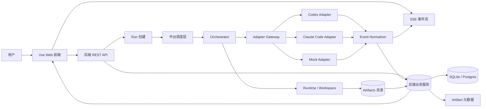

# 总体架构方案

本文档说明 AgentHub 的总体架构。系统采用“前端 Vue + 后端 Python + 中台调度”的三层结构：前端负责 IM 体验，后端负责业务 API 和数据存储，中台负责任务调度、Agent 接入、事件归一化、向前端推送和向后端写回。

## 1. 架构目标

AgentHub 的架构需要同时满足四件事：

1. 用户体验像 IM，而不是普通表单。
2. 多个 Agent 可以通过统一接口被调度。
3. Agent 的流式输出可以实时展示。
4. 代码、网页、文件等产物可以被保存、预览和交付。

## 2. 三层职责

| 层级 | 职责 | 典型模块 |
|---|---|---|
| 前端 Vue | 聊天 UI、会话列表、Agent 联系人、产物卡片、实时事件消费 | A 前端 Web 层 |
| 后端 Python | REST API、会话、消息、Agent 配置、产物元数据、数据库 | B 后端 API、C 数据协议、G 产物服务 |
| 中台调度 | Orchestrator、Adapter Gateway、Runtime、SSE 推送、事件写回 | D 编排、E Adapter、F Runtime |

## 3. 架构图



## 4. 核心数据流

### 4.1 用户发送消息

```text
Vue ChatWindow
 -> POST /api/conversations/{conversationId}/messages
 -> 后端写入 user message
 -> 后端创建 run
 -> 返回 runId 和 eventStreamUrl
```

### 4.2 中台调度 Agent

```text
中台读取 run
 -> Orchestrator 分析 @Agent 和用户目标
 -> 生成 OrchestratorPlan
 -> Adapter Gateway 调用 Codex / Claude Code / Mock
 -> Runtime 为 Agent 提供 workspace
```

### 4.3 流式消息返回

```text
Agent raw output
 -> Adapter 解析
 -> Event Normalizer 归一化为 AgentEvent
 -> SSE 推送给 Vue
 -> 后端落库 agent_events / messages
```

### 4.4 产物生成

```text
Agent 写入 workspace 或返回文件信息
 -> Artifact Service 扫描或接收产物
 -> 写入 artifacts 表
 -> 生成 artifact.created 事件
 -> 前端显示 ArtifactCard
```

## 5. 技术选型总览

| 方向 | 方案 | 说明 |
|---|---|---|
| 前端 | Vue 3 + Vite + TypeScript | 快速构建 IM 界面和模块化组件 |
| UI | Naive UI | 管理台、表单、弹窗、布局成熟 |
| 状态 | Pinia | conversation、message、agent、artifact 分 store 管理 |
| 后端 | FastAPI | 适合 REST、SSE、Python AI 生态 |
| 中台 | Python services | 与后端共享语言，方便接入 SDK 和 subprocess |
| 实时 | SSE | MVP 只需要服务端向前端持续推送 |
| 编排 | 手写状态机 | 简单、可控、可解释 |
| Agent | Codex + Claude Code + Mock | 满足双 Agent 接入和演示兜底 |
| 存储 | SQLite -> Postgres | 开发轻，正式化路径清楚 |
| 产物 | 本地 workspace + artifacts | 低成本可复现 |

## 6. 模块关系

| 模块 | 上游 | 下游 |
|---|---|---|
| A 前端 Web | 用户、B API、SSE | B API、G Artifact |
| B 后端 API | A 前端、D 中台写回 | C 数据、D 中台、G 产物 |
| C 数据协议 | 全部模块 | 全部模块 |
| D Orchestrator | B Run、C 协议 | E Adapter、F Runtime、G Artifact |
| E Agent Adapter | D Orchestrator | 外部 Agent、C 事件协议 |
| F Runtime Sandbox | D Orchestrator、E Adapter | G Artifact |
| G Artifact | F Runtime、E Adapter | A 前端、B 后端 |
| H 交付工程化 | 全部模块 | Demo、测试、文档 |
| I AI 协作规则 | 全部模块 | Spec、rules、skills、协作记录 |

## 7. 主要风险和降级

| 风险 | 降级方案 |
|---|---|
| Codex 或 Claude Code 调用不稳定 | 使用 Mock Adapter 保证演示主链路 |
| SSE 流式事件解析复杂 | 先推送 `message.delta`、`message.completed`、`artifact.created` 三类事件 |
| Orchestrator 并行调度复杂 | MVP 使用顺序调度，文档说明可升级并行 |
| 真实部署来不及 | 使用 ZIP 导出和模拟部署状态卡片 |
| 产物预览兼容性不足 | 代码用 Monaco，网页用 iframe，文件用下载卡片 |

