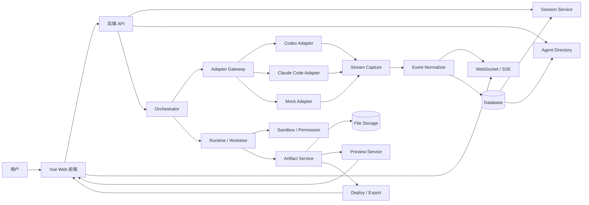

# AgentHub 技术方案文档（讨论草案 v0.2）

> 当前版本目标：先按大块梳理技术方案，再在每个大块下面继续拆具体模块。这样文档读起来不会一开始就碎成很多模块，也更符合正式技术方案文档的写法。

---

# 0. 文档编写原则

本技术方案文档不直接从“模块列表”开始，而是采用两层结构：

```text
第一层：系统大块
  先说明前端、后端、数据接口、Agent 接入、编排、产物、运行时、部署这些大方向分别做什么。

第二层：模块细节
  在每个大块内部，再拆具体模块、职责、接口、数据结构、实现方案、风险和验收标准。
```

## 0.1 决策方式

为了避免每个细节都反复讨论，本文档后续采用“默认决策制”：

```text
普通技术细节：由方案文档直接给出推荐方案。
影响较大的方向选择：给出推荐方案 + 备选方案 + 为什么不选备选。
只有会影响工期、技术路线或最终演示效果的点，才单独拿出来讨论确认。
```

换句话说，后续文档不会把所有问题都抛给团队决定，而是会直接给出一套可执行方案。

## 0.2 方案产出的四个约束

所有技术方案都必须同时满足四个条件：

| 约束 | 含义 |
|---|---|
| 可复现 | 按文档步骤和接口定义，其他人也能搭出同样的 Demo |
| 难度可控 | 不引入过重框架，不把 12 天项目做成长期平台 |
| 可演示 | 每个阶段都要有看得见的页面、接口、日志或产物 |
| 可答辩 | 每个技术选择都能解释为什么这么做、风险是什么、怎么降级 |

## 0.3 默认技术决策

除非后续发现明显风险，否则默认采用以下方案：

| 方向 | 默认方案 | 原因 |
|---|---|---|
| 前端 | Vue 3 + Vite + TypeScript | 团队已确定 Vue，开发快，组件拆分清晰 |
| UI 组件库 | Naive UI | 风格现代，Vue 适配好，表单、弹窗、布局齐全 |
| 状态管理 | Pinia | Vue 官方推荐生态，适合拆 conversation / message / agent / artifact store |
| 后端 | FastAPI + Python | 适合流式响应、AI SDK、Agent 编排和 subprocess 截取 |
| 实时推送 | SSE 优先，WebSocket 预留 | MVP 先解决 Agent 流式输出；双向控制后置 |
| Orchestrator | 手写轻量状态机为主，LangGraph 作为增强路线 | 12 天更稳，同时技术文档仍有扩展性 |
| Agent Adapter | Codex + Claude Code + Mock 兜底 | 满足双 Agent 接入，同时降低 Demo 风险 |
| 数据库 | SQLite 开发期，Postgres 作为正式方案说明 | 开发轻，答辩可解释扩展 |
| 文件存储 | 本地 workspace + artifacts 目录 | 可复现，部署简单，后续可替换对象存储 |
| 代码编辑 | Monaco Editor | Web 端代码展示和编辑成熟 |
| 部署能力 | ZIP 导出 + 模拟部署卡片，真实预览作为 P1 | 控制难度，保证可演示 |

## 0.4 后续讨论方式

后续每轮讨论不再让团队敲定所有细节，而是采用：

```text
我先产出完整方案草案
 -> 标出默认选择
 -> 标出少数高影响风险点
 -> 你只需要指出不接受的地方
 -> 我再收敛成最终版
```

这样可以保证推进速度，同时保留必要的讨论空间。

---

# 1. 项目目标与 MVP 范围

## 1.1 项目一句话目标

AgentHub 是一个 **IM 聊天式多 Agent 协作平台**。用户像使用微信 / 飞书一样，通过新建对话、选择 Agent、发送消息、群聊 @Agent 的方式，让多个 AI Agent 协作完成代码、网页、文档等产物。

## 1.2 本期 MVP 目标

考虑到有效研发时间只有 12 天，本期目标是：

> 做出一个 Web 端可运行 Demo：支持会话列表、单聊、群聊 @Agent、Orchestrator 分工、Codex + Claude Code 两个 Adapter、流式消息展示、基础产物卡片、自建 Agent 最小版、上下文连续和演示文档。

## 1.3 本期重点

本期优先保证以下主链路：

```text
用户创建会话
 -> 选择 Agent 或 @ 多个 Agent
 -> 后端接收消息
 -> Orchestrator 判断任务
 -> 调用 Codex / Claude Code Adapter
 -> Adapter 截取流式输出
 -> 后端归一化为统一事件
 -> Vue 前端实时显示消息
 -> 产物以卡片形式展示
```

## 1.4 本期不重点实现

以下内容暂时作为 P2 或设计预留：

- 桌面端完整实现
- 移动端完整实现
- 完整版本历史
- 复杂 Diff 合并
- 真实生产级容器部署
- PPT / Word / Excel 深度编辑
- 企业级权限后台
- 大规模并发调度

---

# 2. 系统大块划分

整个系统先分成 8 个大块：

| 大块编号 | 大块名称 | 主要解决什么问题 | 对应负责人倾向 |
|---|---|---|---|
| A | 前端 Web 层 | 用户怎么聊天、怎么看 Agent、怎么看产物 | 前端 / 产品 |
| B | 后端 API 与实时通信层 | 前端请求怎么进入系统，消息怎么实时推送 | 后端 |
| C | 数据与协议层 | 会话、消息、Agent、产物的数据结构怎么统一 | 后端 / 全员共识 |
| D | Orchestrator 编排层 | 群聊时怎么拆任务、分配 Agent、汇总结果 | AI 编排 |
| E | Agent Adapter 层 | 怎么接入 Codex 和 Claude Code，并截取流式输出 | AI 编排 / 后端 |
| F | Runtime 与 Sandbox 层 | Agent 在哪里运行、怎么隔离文件和命令 | 平台 / 后端 |
| G | Artifact 产物层 | 代码、网页、文件、部署状态怎么展示和管理 | 前端 + 平台 |
| H | 交付与工程化层 | 文档、日志、测试、部署、Demo 怎么保证可交付 | 全员 |

后续模块都放在这 8 个大块下面，不再一开始平铺几十个模块。

---

# 3. 总体架构



---

# 4. 技术选型总览

| 层级 | 推荐技术 | 原因 |
|---|---|---|
| 前端 | Vue 3 + Vite + TypeScript | 开发快，适合组件化 IM 界面 |
| 状态管理 | Pinia | 管理会话、消息流、Agent、Artifact 状态 |
| 路由 | Vue Router | 聊天页、Agent 管理页、产物预览页 |
| UI 组件库 | Element Plus / Naive UI / Arco Design Vue 待选 | 快速搭建管理台和 IM 界面 |
| 代码编辑器 | Monaco Editor | 代码查看、编辑、Diff 扩展 |
| 后端 | FastAPI + Python | 适合 AI 编排、SDK 接入、流式处理 |
| 实时通信 | SSE 优先，WebSocket 预留 | SSE 适合流式文本；WebSocket 适合双向控制 |
| 编排 | 手写轻量状态机 + LangGraph 备选 | 先保证 12 天交付，后续可升级 |
| Agent 接入 | Codex + Claude Code | 默认两个主流 Agent Adapter |
| 数据库 | SQLite 开发期 / Postgres 正式方案 | SQLite 快，Postgres 好解释扩展 |
| 文件存储 | 本地文件存储优先，对象存储预留 | 降低开发压力 |
| 隔离 | 会话级 workspace / git worktree | 避免多会话文件互相污染 |

---

# A. 前端 Web 层方案

## A0. 前端层目标

前端负责把 AgentHub 做成一个像 IM 一样的产品，而不是普通表单工具。

用户在前端需要完成：

- 看见会话列表
- 新建会话
- 选择 Agent 单聊
- 在群聊里 @Agent
- 实时看到 Agent 流式回复
- 看到 Agent 的运行状态
- 查看代码、网页、文件、部署状态等产物卡片
- 创建自定义 Agent

## A1. 前端页面划分

| 页面 | 路由建议 | 说明 | 优先级 |
|---|---|---|---|
| 会话主页面 | `/chat/:conversationId` | 核心聊天界面 | P0 |
| 会话列表页 | 包含在主布局左侧 | 新建、搜索、置顶、归档会话 | P0 |
| Agent 联系人页 | `/agents` | 查看内置 Agent 和自建 Agent | P0 |
| 自建 Agent 页 | `/agents/new` | 创建自定义 Agent | P0 |
| 产物预览页 | `/artifacts/:artifactId` | 展开代码、网页、文件 | P0 |
| 设置页 | `/settings` | API Key、模型、权限等 | P1 |
| Demo 页面 | `/demo` | 固定演示路径 | P1 |

## A2. 前端组件模块

### A2.1 AppShell 主布局

职责：

- 左侧会话列表
- 中间聊天区
- 右侧产物预览区，可选
- 顶部 Agent / 会话状态栏

具体产出：

```text
src/layouts/AppShell.vue
src/components/sidebar/ConversationList.vue
src/components/chat/ChatWindow.vue
src/components/artifact/ArtifactPanel.vue
```

### A2.2 ConversationList 会话列表

职责：

- 展示所有会话
- 新建会话
- 最近活跃排序
- 会话模式标识：单聊 / 群聊
- 当前会话高亮

数据依赖：

```ts
type Conversation = {
  id: string;
  title: string;
  mode: 'single' | 'group';
  agentIds: string[];
  updatedAt: string;
};
```

### A2.3 ChatWindow 聊天窗口

职责：

- 展示消息流
- 展示流式回复
- 展示 Agent 状态
- 支持用户输入
- 支持 @Agent

关键点：

前端收到 `message.delta` 时，不是新建一条消息，而是追加到当前正在生成的 Agent 消息气泡中。

### A2.4 MessageBubble 消息气泡

消息类型：

- 用户消息
- Agent 文本消息
- System 状态消息
- 工具调用状态消息
- 产物卡片消息
- 错误消息

### A2.5 AgentMentionInput 输入框

职责：

- 普通文本输入
- @Agent 选择
- 发送消息
- Ctrl / Cmd + Enter 快捷发送
- 发送后清空输入框

### A2.6 ArtifactCard 产物卡片

卡片类型：

- 代码卡片
- 网页预览卡片
- 文件附件卡片
- Diff 卡片 P1
- 部署状态卡片 P1

## A3. 前端状态管理

建议使用 Pinia 拆 4 个 store：

```text
stores/conversationStore.ts
stores/messageStore.ts
stores/agentStore.ts
stores/artifactStore.ts
```

### conversationStore

保存：

- 会话列表
- 当前会话
- 会话模式
- 会话成员 Agent

### messageStore

保存：

- 当前会话消息列表
- 正在流式生成的消息
- runId 到 messageId 的映射

### agentStore

保存：

- Agent 联系人列表
- Agent 能力标签
- Agent 在线 / 运行状态

### artifactStore

保存：

- 当前会话产物列表
- 当前展开的产物
- 产物加载状态

## A4. 前端和后端的实时通信

第一版推荐：

```text
用户发送消息：HTTP POST /api/conversations/:id/messages
Agent 流式返回：SSE GET /api/runs/:runId/events
```

未来增强：

```text
WebSocket /ws/conversations/:id
```

SSE 优点：

- 简单
- 适合服务端持续推流
- 前端实现成本低
- 非常适合 `message.delta`

WebSocket 优点：

- 支持双向通信
- 适合取消任务、审批确认、多人协作

当前建议：

> MVP 先用 SSE 跑通流式输出；需要取消任务和审批时，再补 WebSocket。

---

# B. 后端 API 与实时通信层方案

## B0. 后端层目标

后端是前端、Orchestrator、Adapter、数据存储之间的中枢。

它需要处理：

- 会话创建和查询
- 消息接收和落库
- 启动 Orchestrator run
- 调用 Agent Adapter
- 接收 Adapter 流式事件
- 将事件推送到前端
- 产物创建和查询
- 错误处理和日志记录

## B1. 后端目录建议

```text
services/api/
  app/
    main.py
    routers/
      conversations.py
      messages.py
      agents.py
      artifacts.py
      runs.py
    services/
      session_service.py
      run_service.py
      realtime_service.py
    schemas/
      conversation.py
      message.py
      agent.py
      artifact.py
      event.py
    db/
      models.py
      database.py
      migrations/
```

## B2. API 模块划分

| 模块 | 职责 | 优先级 |
|---|---|---|
| Conversation API | 会话 CRUD | P0 |
| Message API | 发送消息、查询历史 | P0 |
| Run API | 创建 Agent 执行任务，查看状态 | P0 |
| Event Stream API | SSE / WebSocket 流式事件 | P0 |
| Agent API | Agent 列表、自建 Agent | P0 |
| Artifact API | 查询和预览产物 | P0 |
| Deploy API | 部署或导出 | P1 |
| Settings API | 模型、API Key、权限 | P1 |

## B3. 核心 API 草案

### 创建会话

```http
POST /api/conversations
```

请求：

```json
{
  "title": "Todo 网页开发",
  "mode": "group",
  "agentIds": ["codex", "claude-code"]
}
```

返回：

```json
{
  "id": "conv_001",
  "title": "Todo 网页开发",
  "mode": "group",
  "agentIds": ["codex", "claude-code"]
}
```

### 发送消息

```http
POST /api/conversations/{conversationId}/messages
```

请求：

```json
{
  "content": "@codex @claude-code 帮我做一个 Todo 网页",
  "mentionedAgentIds": ["codex", "claude-code"]
}
```

返回：

```json
{
  "messageId": "msg_001",
  "runId": "run_001",
  "eventStreamUrl": "/api/runs/run_001/events"
}
```

### 监听流式事件

```http
GET /api/runs/{runId}/events
```

返回 SSE：

```text
event: message.delta
data: {"runId":"run_001","agentId":"codex","text":"正在创建项目结构..."}

event: tool.started
data: {"runId":"run_001","agentId":"codex","toolName":"write_file"}

event: artifact.created
data: {"runId":"run_001","artifact":{"id":"art_001","type":"code"}}
```

## B4. 后端运行任务流程

```text
1. 前端 POST 用户消息
2. Message API 写入用户消息
3. Run Service 创建 run
4. Orchestrator 生成执行计划
5. Adapter Gateway 调用 Codex / Claude Code
6. Stream Capture 捕获流式输出
7. Event Normalizer 转为统一事件
8. Realtime Service 推送给前端
9. Message / Artifact / Run 状态落库
```

---

# C. 数据与协议层方案

## C0. 数据层目标

数据层要解决的问题是：前端、后端、Orchestrator、Adapter、Artifact 都使用统一结构，避免每个模块自己定义一套字段。

## C1. 核心实体

| 实体 | 说明 |
|---|---|
| User | 用户 |
| Conversation | 会话 |
| Message | 消息 |
| AgentProfile | Agent 联系人 / 配置 |
| Run | 一次 Agent / Orchestrator 执行 |
| AgentEvent | 流式事件 |
| Artifact | 产物 |
| Workspace | 会话工作区 |
| Deployment | 部署或导出记录 |

## C2. 数据库表初稿

```sql
users(
  id,
  name,
  created_at
)

conversations(
  id,
  title,
  mode,
  owner_id,
  created_at,
  updated_at,
  archived_at
)

conversation_agents(
  conversation_id,
  agent_id
)

messages(
  id,
  conversation_id,
  run_id,
  sender_type,
  sender_id,
  content,
  status,
  metadata_json,
  created_at
)

agent_profiles(
  id,
  name,
  provider,
  description,
  avatar,
  capabilities_json,
  system_prompt,
  tools_json,
  permissions_json,
  enabled,
  created_at
)

runs(
  id,
  conversation_id,
  user_message_id,
  status,
  orchestrator_plan_json,
  started_at,
  completed_at,
  error
)

agent_events(
  id,
  run_id,
  agent_id,
  event_type,
  payload_json,
  created_at
)

artifacts(
  id,
  conversation_id,
  run_id,
  type,
  title,
  storage_path,
  preview_url,
  metadata_json,
  created_at
)

workspaces(
  id,
  conversation_id,
  path,
  status,
  created_at
)

deployments(
  id,
  artifact_id,
  status,
  preview_url,
  logs_json,
  created_at
)
```

## C3. 统一事件协议

```ts
type AgentEvent =
  | {
      type: 'agent.started';
      runId: string;
      agentId: string;
    }
  | {
      type: 'message.delta';
      runId: string;
      agentId: string;
      text: string;
    }
  | {
      type: 'message.completed';
      runId: string;
      agentId: string;
      finalText: string;
    }
  | {
      type: 'tool.started';
      runId: string;
      agentId: string;
      toolName: string;
      input?: unknown;
    }
  | {
      type: 'tool.completed';
      runId: string;
      agentId: string;
      toolName: string;
      output?: unknown;
    }
  | {
      type: 'artifact.created';
      runId: string;
      agentId: string;
      artifact: ArtifactRef;
    }
  | {
      type: 'agent.failed';
      runId: string;
      agentId: string;
      error: string;
    };
```

## C4. Artifact 协议

```ts
type ArtifactRef = {
  id: string;
  type: 'code' | 'web_preview' | 'file' | 'diff' | 'deployment' | 'text_document';
  title: string;
  url?: string;
  language?: string;
  metadata?: Record<string, unknown>;
};
```

---

# D. Orchestrator 编排层方案

## D0. 编排层目标

Orchestrator 是群聊模式下的主 Agent 协调器。它不直接写代码，而是负责：

- 判断用户意图
- 判断是否指定 Agent
- 拆解任务
- 选择 Agent
- 调用 Adapter
- 收集多个 Agent 的结果
- 汇总最终回复
- 处理失败和冲突

## D1. 方式一：轻量手写状态机

推荐作为 12 天 MVP 主方案。

流程：

```text
analyze_intent
 -> build_plan
 -> route_agents
 -> run_agent_tasks
 -> collect_results
 -> summarize
```

适合原因：

- 实现快
- 代码可控
- 容易 debug
- 答辩时好解释
- 不容易被框架复杂度拖住

核心结构：

```ts
type OrchestratorPlan = {
  id: string;
  userGoal: string;
  mode: 'direct_mention' | 'auto_plan';
  steps: Array<{
    id: string;
    title: string;
    assignedAgentId: string;
    input: string;
    status: 'pending' | 'running' | 'done' | 'failed';
  }>;
};
```

## D2. 方式二：LangGraph

作为增强方案或文档中的扩展路线。

图结构：

```text
IntentNode
 -> PlanNode
 -> RouterNode
 -> AgentRunNode
 -> ArtifactCollectNode
 -> SummaryNode
```

适合原因：

- 更接近正式 Agent workflow
- 适合 checkpoint / resume
- 适合 human-in-the-loop
- 技术表达更强

风险：

- 学习成本更高
- 12 天内如果不熟容易拖慢开发

## D3. 当前推荐

```text
实际开发：轻量手写状态机
技术文档：同时写明可升级 LangGraph
```

---

# E. Agent Adapter 与流式截取层方案

## E0. Adapter 层目标

Adapter 层的目标不是简单调用外部 Agent，而是把不同 Agent 的输出变成 AgentHub 自己的统一事件流。

关键要求：

```text
外部 Agent 原始输出
 -> 截取 stdout / SDK stream
 -> 解析 raw event
 -> 归一化 AgentEvent
 -> 写入数据库
 -> 推送到 Vue 前端
```

## E1. Adapter Gateway

统一接口：

```ts
interface AgentAdapter {
  startSession(input: StartSessionInput): Promise<AgentSession>;
  sendMessage(input: SendMessageInput): AsyncIterable<AgentEvent>;
  cancel(sessionId: string): Promise<void>;
  collectArtifacts(sessionId: string): Promise<ArtifactRef[]>;
  healthCheck(): Promise<AdapterHealth>;
}
```

## E2. Codex Adapter

### 推荐接入方式

通过 Codex CLI 非交互模式运行，并开启 JSONL 输出。

```bash
codex exec \
  --cd <workspace_path> \
  --json \
  --sandbox workspace-write \
  "<user_prompt>"
```

### 流式截取方式

```py
process = subprocess.Popen(
    [
        "codex",
        "exec",
        "--cd", workspace_path,
        "--json",
        "--sandbox", "workspace-write",
        prompt,
    ],
    stdout=subprocess.PIPE,
    stderr=subprocess.PIPE,
    text=True,
)

for line in process.stdout:
    try:
        raw_event = json.loads(line)
        event = normalize_codex_event(raw_event)
        yield event
    except Exception:
        yield {
            "type": "agent.raw_log",
            "agentId": "codex",
            "text": line,
        }
```

### Codex Adapter 要解决的问题

- 如何启动 Codex
- 如何指定 workspace
- 如何读取 JSONL
- 如何处理 stderr
- 如何把 raw event 转成 AgentEvent
- 如何识别工具调用
- 如何识别文件产物
- 如何处理进程退出和失败

## E3. Claude Code Adapter

### 路线 A：Claude Agent SDK

推荐作为主方案。

伪代码：

```py
async for message in query(
    prompt=prompt,
    options=ClaudeAgentOptions(
        include_partial_messages=True,
        allowed_tools=["Read", "Edit", "Bash"],
    ),
):
    if isinstance(message, StreamEvent):
        event = message.event
        if event.get("type") == "content_block_delta":
            delta = event.get("delta", {})
            if delta.get("type") == "text_delta":
                yield {
                    "type": "message.delta",
                    "agentId": "claude-code",
                    "text": delta.get("text", ""),
                }
```

### 路线 B：Claude Code CLI

作为备用方案。

```bash
claude -p \
  --output-format stream-json \
  --include-partial-messages \
  --permission-mode plan \
  "<user_prompt>"
```

## E4. Event Normalizer

职责：

- 统一 Codex raw event
- 统一 Claude raw event
- 统一 Mock raw event
- 输出 AgentHub 标准 AgentEvent

目录建议：

```text
services/adapter-gateway/
  adapters/
    codex_adapter.py
    claude_code_adapter.py
    mock_adapter.py
  stream/
    process_reader.py
    jsonl_reader.py
    sdk_stream_reader.py
    event_normalizer.py
  contracts/
    agent_event.py
    adapter.py
```

---

# F. Runtime 与 Sandbox 层方案

## F0. Runtime 层目标

Runtime 负责给每个会话准备独立工作区，让 Agent 生成和修改文件时不会互相影响。

## F1. Workspace 方案

第一版：本地目录隔离。

```text
workspace-root/
  conversations/
    conv_001/
      src/
      artifacts/
      logs/
    conv_002/
      src/
      artifacts/
      logs/
```

增强版：git worktree。

```bash
git worktree add ../worktrees/conv_001 -b conv/conv_001
```

## F2. Sandbox 权限

默认权限：

| 操作 | 默认策略 |
|---|---|
| 读当前 workspace | allow |
| 写当前 workspace | ask / allow |
| 执行 shell | ask |
| 部署 | ask |
| 读取环境变量 | deny |
| 访问系统目录 | deny |

## F3. 需要交付的内容

- workspace 创建函数
- workspace 清理函数
- 命令执行封装
- 文件读写封装
- 权限检查逻辑

---

# G. Artifact 产物层方案

## G0. Artifact 层目标

Artifact 层负责把 Agent 的输出变成用户能看、能点、能预览的产物。

## G1. 产物类型

| 类型 | 说明 | 本期是否做 |
|---|---|---|
| code | 代码文件或代码片段 | P0 |
| web_preview | 网页预览 | P0 |
| file | 文件附件 | P0 |
| diff | 代码差异 | P1 |
| deployment | 部署状态 | P1 |
| text_document | 文本文档 | P1 |

## G2. Artifact Service

职责：

- 创建 Artifact
- 存储 Artifact
- 查询 Artifact
- 生成预览 URL
- 关联 Conversation / Run / Message

## G3. 前端 Artifact Panel

展示形式：

- 聊天流内小卡片
- 点击展开右侧面板
- 代码类产物进入 Monaco
- 网页类产物进入 iframe preview
- 文件类产物支持下载

## G4. Deploy / Export

MVP 推荐：

```text
优先做 ZIP 导出 + 模拟部署状态卡片
时间够再做真实预览 URL
```

---

# H. 交付与工程化层方案

## H0. 交付层目标

确保 12 天后不是只有代码，而是有完整可提交材料。

## H1. 必交付物

- 产品设计文档
- 技术方案文档
- 可运行 Demo
- AI 协作开发记录
- 3 分钟 Demo 视频
- Demo 脚本
- 兜底录屏

## H2. 仓库目录建议

```text
agenthub/
  apps/
    web/                  # Vue 前端
  services/
    api/                  # FastAPI 后端
    adapter-gateway/      # Codex / Claude Adapter
    runtime/              # workspace / sandbox
  packages/
    protocol/             # 前后端共享协议
  docs/
    product/
    tech/
    demo/
  specs/
  skills/
  rules/
  agents/
  workspace-root/
```

## H3. 12 天阶段计划

| 阶段 | 时间 | 大目标 | 具体产出 |
|---|---|---|---|
| 阶段 1 | D1-D2 | 方案和协议定稿 | MVP 范围、架构图、API 草案、数据表、Vue 页面草图 |
| 阶段 2 | D3-D5 | IM 单聊跑通 | 会话列表、聊天页、消息落库、SSE 流式展示、Mock / 第一个 Adapter |
| 阶段 3 | D6-D8 | 双 Agent + 群聊跑通 | Codex Adapter、Claude Code Adapter、Orchestrator、@Agent、汇总回复 |
| 阶段 4 | D9-D10 | 产物卡片跑通 | 代码卡片、网页预览、文件卡片、自建 Agent、Monaco 展开 |
| 阶段 5 | D11-D12 | 打磨和交付 | 技术文档、产品文档、Demo 脚本、3 分钟视频、兜底方案 |

---

# 9. 后续自动细化计划

后续不再要求逐项人工拍板，而是按下面顺序自动补全技术方案。每一轮都会直接产出可放进文档的内容。

## 9.1 下一轮：前端 Web 层详细方案

将补全：

- Vue 页面结构
- 组件目录结构
- Pinia store 设计
- SSE 消费逻辑
- 聊天气泡如何处理流式消息
- Agent 状态如何展示
- Artifact 卡片如何进入预览面板
- 前端阶段性交付物

默认结论：

```text
Vue 3 + Vite + TypeScript + Pinia + Vue Router + Naive UI + Monaco Editor
```

## 9.2 第二轮：后端 API 与数据接口详细方案

将补全：

- REST API 列表
- SSE 事件接口
- conversation / message / run / agent / artifact schema
- 错误码
- 后端目录结构
- 数据库表字段
- 接口验收样例

默认结论：

```text
FastAPI + Pydantic schema + SQLite 开发库 + SSE event stream
```

## 9.3 第三轮：Codex / Claude Code Adapter 流式截取方案

将补全：

- Codex CLI 进程启动方式
- Codex JSONL 解析方式
- Claude Code SDK 流式读取方式
- Claude Code CLI 备用方案
- Event Normalizer 映射表
- stdout / stderr / exit code 处理
- Mock Adapter 兜底方案

默认结论：

```text
Codex 使用 codex exec --json
Claude Code 优先 SDK，备用 CLI stream-json
所有事件统一成 AgentHub AgentEvent
```

## 9.4 第四轮：Orchestrator 与 Runtime 详细方案

将补全：

- 手写状态机 Orchestrator 实现细节
- LangGraph 增强方案说明
- workspace 创建和清理
- 文件权限模型
- 会话级隔离
- 任务失败降级

默认结论：

```text
MVP 使用手写状态机 + 顺序/有限并发调度 + workspace 目录隔离
```

## 9.5 第五轮：Artifact 与 Demo 交付方案

将补全：

- 代码卡片
- 网页预览卡片
- 文件卡片
- ZIP 导出
- 模拟部署状态卡片
- Demo 脚本
- 3 分钟视频结构
- 12 天每日产出表

默认结论：

```text
优先代码 / 网页 / 文件三类产物；部署做状态卡片 + ZIP 导出
```

---

# 10. 当前版本默认方案总览

当前文档默认采用以下技术路线：

```text
Vue 3 Web 前端
 -> FastAPI 后端
 -> REST API + SSE
 -> 手写轻量 Orchestrator
 -> Adapter Gateway
 -> Codex Adapter + Claude Code Adapter + Mock Adapter
 -> Stream Capture + Event Normalizer
 -> SQLite / Postgres 数据层
 -> workspace 目录隔离
 -> Artifact Service
 -> Monaco / iframe / file card 展示
 -> ZIP 导出 + Demo 文档
```

这套方案的目标不是做得最复杂，而是做得稳定、可复现、可解释、能在 12 天内完成。

