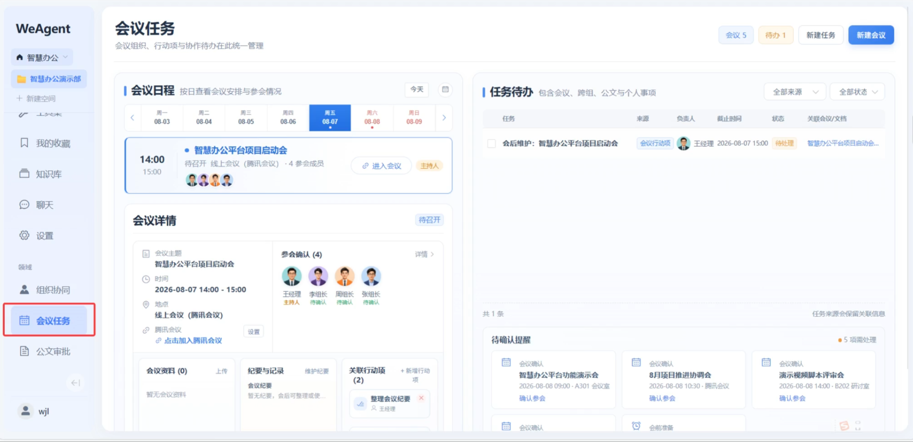
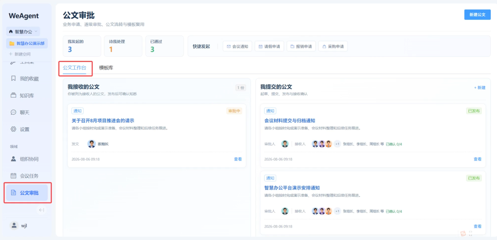

# 协同办公 (Office) 领域服务

协同办公领域为 WeAgent 平台提供企业日常办公的数字化支撑，覆盖会议管理、公文审批、任务派发与组织协同四大核心场景，Agent 自动参与纪要生成、任务跟踪与审批流转。

## 功能预览

<!-- TODO: 替换为实际截图 -->

| 会议管理 | 会议详情 |
|---|---|
|  |  |

| 公文审批 | 组织协同 |
|---|---|
|  |  |

| 消息通知 | 行动项跟踪 |
|---|---|
|  |  |

## 架构

```
frontend/src/views/                     backend/services/office/
├─ OfficeMeetingTasks.vue               ├─ app.py              # Flask 应用入口
├─ OfficeDocumentsDense.vue             ├─ config.py           # 配置
├─ OfficeOrganizationCompact.vue        ├─ extensions.py       # 数据库实例
├─ OfficeWorkspace.vue                  ├─ seed_data.py        # 种子数据
├─ OfficeNotifications.vue             ├─ models/             # 数据模型层
│                                       │  ├─ base.py          # 基础模型 (UUID PK)
│                                       │  ├─ meeting.py       # 会议模型
│                                       │  ├─ official_document.py # 公文模型
│                                       │  ├─ approval.py      # 审批模型
│                                       │  ├─ action_item.py   # 行动项模型
│                                       │  ├─ document_template.py # 公文模板
│                                       │  ├─ document_receipt.py # 公文回执
│                                       │  ├─ organization.py  # 组织架构
│                                       │  └─ schedule.py      # 日程管理
│                                       ├─ controllers/       # API 路由层
│                                       │  ├─ meeting_controller.py
│                                       │  ├─ document_controller.py
│                                       │  ├─ approval_controller.py
│                                       │  ├─ organization_controller.py
│                                       │  ├─ schedule_controller.py
│                                       │  └─ template_controller.py
│                                       └─ services/          # 业务逻辑层
│                                          ├─ meeting_service.py
│                                          ├─ document_service.py
│                                          ├─ approval_service.py
│                                          ├─ organization_service.py
│                                          ├─ schedule_service.py
│                                          └─ helpers.py
```

## 功能模块

### 会议管理 (`/api/office/meetings`)

- 会议全生命周期管理：创建、编辑、取消、归档。
- 参会人员邀请与确认，支持双入口（会前/会后）参会确认。
- 主持人角色置顶展示，会后维护面板（弹窗模式）方便快速编辑。
- 会议纪要自动生成（Agent 辅助），Markdown 格式存储与渲染。
- 会议关联行动项自动拆解，责任人指派与完成状态跟踪。
- 会议列表按状态（待开始/进行中/已结束/已取消）分类筛选。
- 页面内部滚动优化，长会议内容展示不溢出。

### 公文审批 (`/api/office/documents`)

- 公文创建、编辑、提交审批。
- 双模式审批流程：
  - **直属领导并行审批**：多位直属领导同时审批，任一通过即推进。
  - **部门经理逐级审批**：按组织层级逐级上报，每级逐一确认。
- 公文台双栏布局：左侧公文列表，右侧公文详情 + 审批操作。
- 公文模板系统：支持创建与复用常用公文模板。
- 公文回执追踪：记录每位审批人的处理状态与时间。

### 任务/行动项 (`/api/office/action-items`)

- 会议产出自动转为行动项卡片，每个行动项独立追踪。
- 责任人、截止日期、完成状态管理。
- 行动项卡片布局展示，一目了然。

### 日程管理 (`/api/office/schedules`)

- 个人日程与会议日程统一管理。
- 日程冲突检测，时间线视图展示。
- 与会议模块联动，会议创建自动同步日程。

### 组织协同 (`/api/office/organizations`)

- 组织关系与团队任务双模块。
  - **组织关系**：组织架构树形展示，部门与成员维护。
  - **团队任务**：跨部门任务分配与进度跟踪。
- 组卡片固定高度布局，适配不同团队规模。

### 消息通知 (`OfficeNotifications`)

- 办公事务通知中心，聚合会议邀请、审批请求、任务指派。
- 通知按类别筛选，已读/未读状态追踪。
- 点击通知直接跳转至对应事务详情。

## Agent 集成

- **会议纪要生成**：会议结束后 Agent 自动从会议内容提炼纪要、行动项清单。
- **审批辅助**：Agent 可对公文内容做合规检查与格式审校。
- **任务闭环跟踪**：Agent 监控行动项到期状态，自动推送提醒。
- **`call_service_api` 工具**：Agent 在沙箱中可查询会议、审批、组织架构等数据。
- **领域服务注册**：`GET /api/office/spec` 返回服务能力描述，`GET /api/office/health` 返回健康状态。

## API 路由一览

| 方法 | 路径 | 说明 |
|---|---|---|
| GET/POST | `/api/office/meetings` | 会议列表/创建会议 |
| GET/PUT/DELETE | `/api/office/meetings/<id>` | 会议详情/更新/取消 |
| POST | `/api/office/meetings/<id>/confirm` | 参会确认 |
| POST | `/api/office/meetings/<id>/minutes` | 保存/AI 生成纪要 |
| GET/POST | `/api/office/documents` | 公文列表/创建公文 |
| GET/PUT/DELETE | `/api/office/documents/<id>` | 公文详情/更新/删除 |
| POST | `/api/office/documents/<id>/submit` | 提交审批 |
| POST | `/api/office/approvals/<id>/approve` | 审批通过 |
| POST | `/api/office/approvals/<id>/reject` | 审批驳回 |
| GET/POST | `/api/office/action-items` | 行动项列表/创建 |
| PUT/DELETE | `/api/office/action-items/<id>` | 更新/删除行动项 |
| GET/POST | `/api/office/organizations` | 组织列表/创建 |
| GET/PUT/DELETE | `/api/office/organizations/<id>` | 组织详情/更新/删除 |
| GET/POST | `/api/office/organizations/<id>/members` | 成员列表/添加 |
| GET/POST | `/api/office/schedules` | 日程列表/创建 |
| GET/POST | `/api/office/templates` | 公文模板列表/创建 |
| GET | `/api/office/spec` | 服务能力描述 |
| GET | `/api/office/health` | 健康检查 |

## 数据库表

| 表名 | 说明 |
|---|---|
| `office_meetings` | 会议信息（标题、描述、时间、地点、状态） |
| `office_meeting_participants` | 参会人员（用户 ID、确认状态、角色） |
| `office_meeting_minutes` | 会议纪要（内容、生成方式） |
| `office_official_documents` | 公文（标题、内容、类型、紧急程度） |
| `office_approvals` | 审批记录（审批人、状态、意见、时间） |
| `office_action_items` | 行动项（内容、责任人、截止日期、来源会议） |
| `office_organizations` | 组织架构（名称、父级 ID、层级） |
| `office_organization_members` | 组织成员（用户 ID、角色） |
| `office_schedules` | 日程（标题、时间、地点、关联会议） |
| `office_document_templates` | 公文模板（名称、内容模板、分类） |
| `office_document_receipts` | 公文回执（阅读状态、处理状态） |

## 启动

```powershell
cd backend/services/office
pip install -r requirements.txt
python app.py
```

首次启动前需初始化数据库：

```powershell
mysql -u root -p weagent < backend/services/office/sql/init.sql
```

开发阶段通过主后端代理路由（`/api/office` → `localhost:5103`）访问。种子数据通过 `seed_data.py` 写入示例会议、公文与组织数据。
