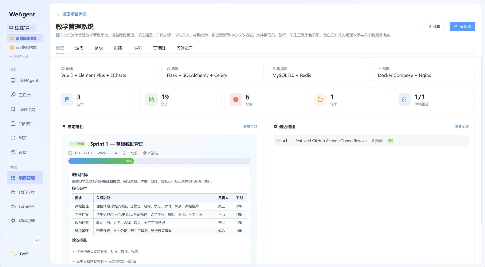
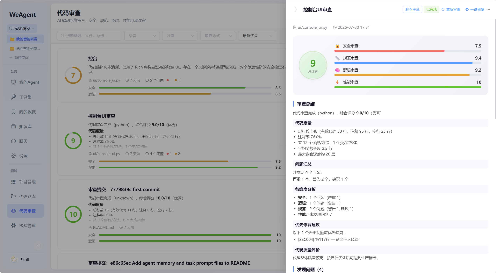

# 智能研发 (RD) 领域服务

智能研发领域为 WeAgent 平台提供完整的软件项目全生命周期管理能力，涵盖项目规划、需求追踪、迭代管理、缺陷管理、代码仓库、AI 代码审查与 CI/CD 构建。

## 功能预览

<!-- TODO: 替换为实际截图 -->

| 项目管理看板 | 需求/缺陷列表 |
|---|---|
|  |  |

| 甘特图 | 代码审查 |
|---|---|
|  |  |

| 构建管理 | 仓库管理 |
|---|---|
|  |  |

## 架构

```
frontend/src/views/rd/          backend/services/rd/
├─ RdProjects.vue               ├─ main.py              # Flask 应用入口
├─ RdProjectDetail.vue          ├─ config.py            # 配置
├─ RdRequirementDetail.vue      ├─ database.py          # 数据库实例
├─ RdBugDetail.vue              ├─ seed.py / seed_edu.py # 种子数据
├─ RdRepos.vue                  ├─ controllers/         # API 路由层
├─ RdRepoDetail.vue             │  ├─ project_controller.py
├─ RdReviews.vue                │  ├─ iteration_controller.py
├─ RdBuilds.vue                 │  ├─ requirement_controller.py
├─ RdGanttChart.vue             │  ├─ bug_controller.py
├─ GithubCallback.vue           │  ├─ repo_controller.py
└─ TreeNode.vue                 │  ├─ branch_controller.py
                                │  ├─ review_controller.py
                                │  ├─ build_controller.py
                                │  ├─ member_controller.py
                                │  ├─ comment_controller.py
                                │  └─ activity_controller.py
                                ├─ services/            # 业务逻辑层
                                │  ├─ project_service.py
                                │  ├─ iteration_service.py
                                │  ├─ requirement_service.py
                                │  ├─ bug_service.py
                                │  ├─ repo_service.py
                                │  ├─ branch_service.py
                                │  ├─ review_service.py
                                │  ├─ review_engine.py
                                │  ├─ script_review_engine.py
                                │  ├─ build_service.py
                                │  ├─ github_service.py
                                │  ├─ member_service.py
                                │  ├─ comment_service.py
                                │  └─ activity_service.py
                                ├─ models/              # 数据模型层
                                │  ├─ project.py
                                │  ├─ project_file.py
                                │  ├─ iteration.py
                                │  ├─ requirement.py
                                │  ├─ bug.py
                                │  ├─ repo.py
                                │  ├─ branch.py
                                │  ├─ review.py
                                │  ├─ build.py
                                │  ├─ comment.py
                                │  ├─ activity.py
                                │  └─ rd_model_config.py
                                └─ schemas/             # 请求/响应校验
```

## 功能模块

### 项目管理 (`/api/rd/projects`)

- 项目 CRUD，支持名称、描述、技术栈、编码规范、可见性配置。
- 项目文件管理（创建、查看、删除），文件内容存储与检索。
- 项目上下文接口，为 Agent 系统提示词注入项目信息（技术栈、文件列表、描述）。
- 项目成员管理，支持添加/移除协作成员。
- 项目卡片展示：迭代数、需求数、缺陷数、文件数、完成率进度条。

### 迭代管理 (`/api/rd/projects/<id>/iterations`)

- 迭代 CRUD，支持名称、目标（Markdown）、起止日期、状态。
- 迭代内需求与缺陷关联，活动日志记录所有变更。
- 迭代目标 Markdown 渲染展示。
- 甘特图数据聚合（迭代 + 需求的起止日期可视化）。

### 需求管理 (`/api/rd/projects/<id>/requirements`)

- 需求 CRUD，支持标题、描述、优先级、状态、规模点、处理人（开发/设计/测试）。
- 父子需求层级关系（`parent_id`），子需求独立追踪。
- 关联迭代与代码分支，支持从需求一键创建 GitHub 分支。
- 活动日志完整记录需求生命周期变更。
- 列表支持列拖动、行内编辑、列选择、列宽调整。

### 缺陷管理 (`/api/rd/projects/<id>/bugs`)

- 缺陷 CRUD，支持标题、描述、严重程度、优先级、状态、处理人。
- 关联需求与迭代，支持从缺陷一键创建修复分支。
- 评论系统，支持对需求和缺陷添加评论与回复。
- 活动日志与状态流转追踪。

### 代码仓库 (`/api/rd/repos`)

- GitHub OAuth 授权流程与仓库关联。
- 仓库文件树浏览与文件内容查看（代码高亮、Markdown 预览、图片预览）。
- 支持按项目筛选关联仓库。
- 分支管理与远程分支创建（对接 GitHub API）。

### AI 代码审查 (`/api/rd/projects/<id>/reviews`)

- 双模式审查引擎：
  - **LLM 审查**：调用大模型从安全、规范、逻辑、性能四维度分析代码。
  - **脚本审查**：基于正则与 AST 的轻量级静态扫描。
- 审查结果结构化展示：综合评分、四维分项评分、问题列表（严重程度 + 修复建议 + 代码片段）。
- 支持粘贴代码或选择仓库文件发起审查。
- 审查历史列表，按语言/状态/审查方式筛选与排序。

### CI/CD 构建 (`/api/rd/projects/<id>/builds`)

- 对接 GitHub Actions，支持触发 Workflow 与同步构建状态。
- 构建步骤分步展示（名称、状态、耗时、日志）。
- 构建历史列表，关联仓库与 GitHub Run ID。
- 产物下载支持。

### 成员管理 (`/api/rd/projects/<id>/members`)

- 项目成员添加与移除，关联平台用户。
- 成员角色（Owner/Developer/Designer/Tester/Viewer）。

## API 路由一览

| 方法 | 路径 | 说明 |
|---|---|---|
| GET/POST | `/api/rd/projects` | 项目列表/创建 |
| GET/PUT/DELETE | `/api/rd/projects/<id>` | 项目详情/更新/删除 |
| GET/POST | `/api/rd/projects/<id>/files` | 文件列表/添加 |
| GET/DELETE | `/api/rd/projects/<id>/files/<fid>` | 文件内容/删除 |
| GET | `/api/rd/projects/<id>/context` | 项目上下文 |
| GET | `/api/rd/projects/<id>/gantt` | 甘特图数据 |
| GET/POST | `/api/rd/projects/<id>/iterations` | 迭代列表/创建 |
| GET/PUT/DELETE | `/api/rd/iterations/<id>` | 迭代详情/更新/删除 |
| GET/POST | `/api/rd/projects/<id>/requirements` | 需求列表/创建 |
| GET/PUT/DELETE | `/api/rd/requirements/<id>` | 需求详情/更新/删除 |
| GET/POST | `/api/rd/projects/<id>/bugs` | 缺陷列表/创建 |
| GET/PUT/DELETE | `/api/rd/bugs/<id>` | 缺陷详情/更新/删除 |
| GET/POST | `/api/rd/projects/<id>/reviews` | 审查列表/提交审查 |
| GET/DELETE | `/api/rd/reviews/<id>` | 审查详情/删除 |
| POST | `/api/rd/reviews/<id>/retry` | 重新审查 |
| POST | `/api/rd/reviews/<id>/auto-fix` | 一键修复 |
| PATCH | `/api/rd/reviews/<id>/issues/<iid>` | 更新 Issue 状态 |
| GET/POST | `/api/rd/projects/<id>/builds` | 构建列表/触发构建 |
| GET | `/api/rd/builds/<id>` | 构建详情 |
| GET/POST | `/api/rd/repos` | 仓库列表/关联仓库 |
| GET/DELETE | `/api/rd/repos/<id>` | 仓库详情/解除关联 |
| GET | `/api/rd/repos/<id>/tree` | 仓库文件树 |
| GET | `/api/rd/repos/<id>/file` | 仓库文件内容 |
| POST | `/api/rd/repos/<id>/branches` | 创建分支 |
| GET | `/api/rd/projects/<id>/branches` | 项目分支列表 |
| GET/POST | `/api/rd/projects/<id>/members` | 成员列表/添加 |
| DELETE | `/api/rd/projects/<id>/members/<uid>` | 移除成员 |
| GET/POST | `/api/rd/iterations/<id>/comments` | 评论列表/添加 |
| GET/POST | `/api/rd/requirements/<id>/comments` | 评论列表/添加 |
| GET/POST | `/api/rd/bugs/<id>/comments` | 评论列表/添加 |
| GET | `/api/rd/projects/<id>/activities` | 活动日志 |

## Agent 集成

RD 服务通过以下方式与 Agent 集成：

- **项目上下文注入**：`GET /api/rd/projects/<id>/context` 返回项目技术栈、文件列表、描述等信息，注入到 Agent 系统提示词。
- **`call_service_api` 工具**：Agent 在沙箱中可调用 RD API 查询需求、创建缺陷、获取迭代状态等。
- **结构化卡片推送**：通过 Socket.IO `sandbox_event` 推送 `requirement_card`、`bug_card`、`iteration_card`、`project_card` 四种消息卡片。
- **领域服务注册**：`GET /api/rd/spec` 返回服务能力描述，`GET /api/rd/health` 返回健康状态。

## 启动

```powershell
cd backend/services/rd
pip install -r requirements.txt
python main.py
```

开发阶段通过主后端代理路由（`/api/rd` → `localhost:5101`）访问。首次启动自动建表，种子数据通过 `seed.py` 写入示例项目与教学管理系统数据。
