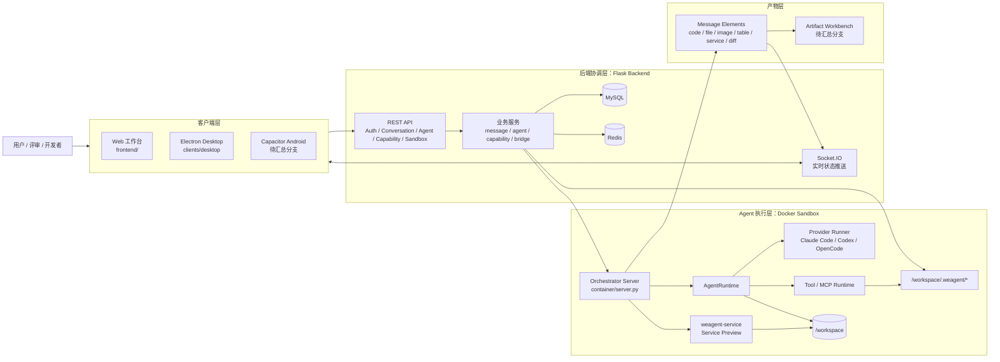
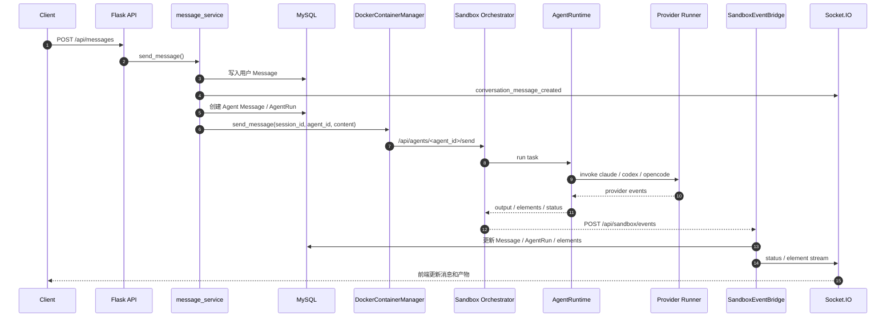
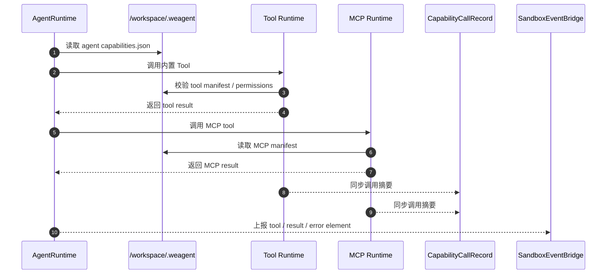
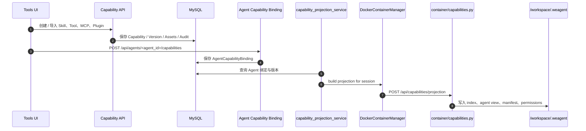
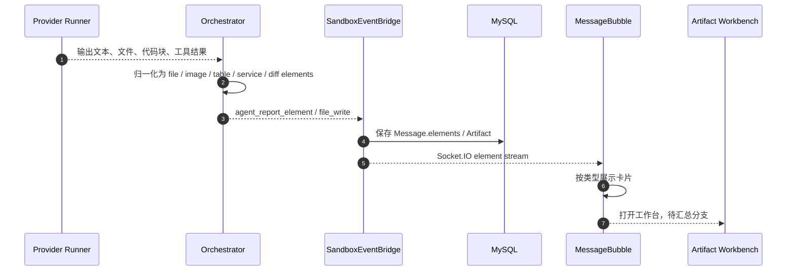
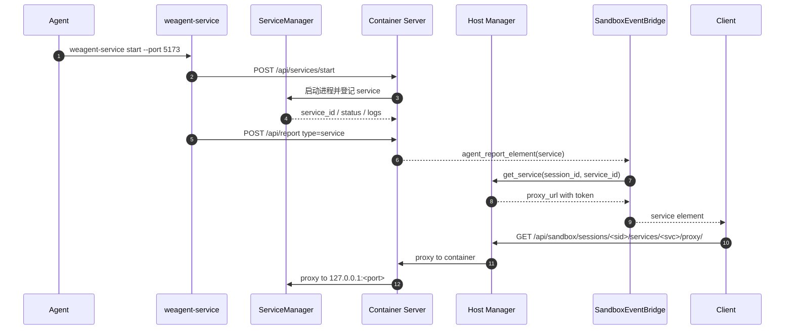
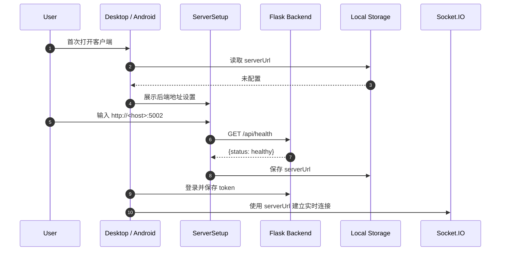

# WeAgent 技术文档

更新日期：2026-06-09

## 1. 结论：WeAgent 技术上是什么

WeAgent 是一个以 Flask 后端为协调中心、以 Docker Sandbox 为执行边界、以 Agent / Capability / Artifact 为核心抽象的多端 AI 协作系统。用户通过 Web、Electron Desktop 或待汇总的 Android 客户端发起任务；后端创建会话、调度 Agent、管理能力投影；Sandbox 容器内运行 AgentRuntime、Provider Runner、Tool / MCP runtime 和 `weagent-service`，再通过 Socket.IO 把执行进度、产物和服务预览链接实时推送回客户端。

当前文档的重点是说明真实技术结构、模块边界、关键链路、开发者运行方式和已知限制。文档不把旧方案或未合并能力伪装成当前本地分支事实；Android、收藏、完整 Artifact Workbench 和文件迁移等能力会保留“待汇总分支”标注。

## 2. 读者、范围与事实源

本文第一读者是比赛评审，第二读者是开发维护者，第三读者是希望理解系统可信度的高级用户。

本文包含：

- WeAgent 的真实技术栈、运行依赖和源码依据。
- Client、Backend、Sandbox、Provider、Toolset、Artifact、Service Preview 的分层关系。
- 关键模块的实现范围、上下游关系和代码证据。
- 用户消息、工具调用、能力投影、产物生成、服务预览、多端连接的时序图。
- 开发者启动、构建、验证、故障定位和已知风险。

本文不包含：

- 完整 API 手册。这里只保留关键接口与数据模型摘要。
- 完整数据库 ER 图。最终提交前如需要，可在本文件内追加。
- 真实截图、GIF 或比赛演示视频。该材料仍待人工补充。

事实源优先级：

1. 当前代码、配置、运行脚本、数据模型、路由、测试和 lockfile。
2. 已确认的远端事实分支和提交记录。
3. `.planning/`、`docs/report/`、README 和历史验证记录。
4. 旧 `docs/tech/`，仅作为结构参考，不作为事实最高来源。

联合事实源如下：

| 分支 | 最后提交 | 文档使用方式 |
|---|---:|---|
| `origin/combine/toolset_v1.1.0` | `14d7d4b` / 2026-06-06 23:17 | 当前本地分支，作为 Backend、Sandbox、Toolset、Capability、Desktop、Provider runtime、Service Preview 的主要依据。 |
| `origin/feature/user_manual_and_product_introduction_v1.1.1` | `403bb1a` / 2026-06-07 19:25 | 作为 Android、多端、收藏、产品介绍和使用手册 UI 的来源分支。 |
| `origin/combine/artifact_editing_system(base_v1.08)` | `0c0838f` / 2026-06-07 10:13 | 作为 Artifact Workbench、文件编辑、diff、文件迁移的来源分支。 |

待确认：

- 最终交付前需要重新执行 `git fetch origin --prune`，确认三条事实分支是否已经汇总到单一交付分支。
- 本轮文档重构没有重新运行完整 smoke，验证状态见“开发者验证路径”。

## 3. 一张图看懂 WeAgent

下图用于建立第一层心智模型：用户只面对客户端；后端负责协调和持久化；每个会话对应一个 Sandbox；Sandbox 内部完成 Agent 执行、工具调用、产物生成和服务预览。



读图方式：左侧是用户入口，中间是后端协调和状态持久化，右侧是按会话隔离的执行容器。`/workspace/.weagent/*` 是能力投影边界，`weagent-service` 是可运行服务预览边界，`Message Elements` 是产物展示边界。

## 4. 技术分层总览

| 层级 | 主要职责 | 技术与路径 | 当前状态 |
|---|---|---|---|
| 客户端层 | 提供聊天、Agent 管理、工具集、设置、多端连接 UI。 | Web：`frontend/`；Desktop：`clients/desktop/`；Android：`clients/android/` | Web / Desktop 当前分支可用；Android 待汇总分支。 |
| 后端协调层 | 提供 REST API、Socket.IO、认证、会话、消息、Agent、Capability、Sandbox host manager。 | `backend/run.py`、`backend/app/__init__.py`、`backend/app/controllers/`、`backend/app/services/` | 当前分支可用。 |
| Agent 执行层 | 为会话创建容器，在容器中执行 Agent、Provider、Tool / MCP。 | `backend/app/sandbox/host/`、`backend/app/sandbox/container/` | 当前分支可用。 |
| 能力层 | 管理 Skill / Tool / MCP / Plugin，绑定到 Agent 并投影到 Sandbox。 | `backend/app/models/capability.py`、`capability_controller.py`、`capability_projection_service.py` | 当前分支可用。 |
| 产物层 | 把 Agent 输出转换为消息元素、Artifact、服务卡片和待汇总的工作台编辑能力。 | `artifact_controller.py`、`message_element_builder.py`、`sandbox_event_bridge.py`、`ArtifactWorkbench` | 基础产物当前可用；完整 Workbench 待汇总分支。 |
| 基础设施层 | 提供数据库、缓存、容器、Provider CLI 和服务代理。 | MySQL、Redis、Docker、Claude Code / Codex / OpenCode | 当前分支可用，最终 smoke 待执行。 |

真实技术栈如下：

| 层级 | 技术 | 证据 |
|---|---|---|
| Web 前端 | Vue 2.7、Vue Router 3、Vuex 3、Element UI、Axios、Socket.IO client | `frontend/package.json`、`frontend/vue.config.js` |
| Desktop 客户端 | Electron 29、Vite 5、Vue 2.7、Element UI、electron-builder | `clients/desktop/package.json` |
| Android 客户端 | Capacitor 6、Vite 5、Vue 2.7 | 来源 `feature/user_manual_and_product_introduction_v1.1.1`，当前本地分支未包含 `clients/android/package.json` |
| 后端 | Flask 2.3、Flask-SQLAlchemy、Flask-Migrate、Flask-JWT-Extended、Flask-SocketIO | `backend/requirements.txt` |
| 数据库 | MySQL 8.0；测试配置使用内存数据库连接 | `backend/config.py`、`backend/sql/init.sql` |
| 缓存 / 辅助服务 | Redis 服务，建议 Redis 7.x；Python client 为 `redis==5.0.1` | `backend/config.py`、`backend/requirements.txt` |
| Sandbox runtime | Docker、Python 3.11、Node.js、Claude Code、Codex、OpenCode | `backend/app/sandbox/Dockerfile`、`backend/app/sandbox/container/providers/` |
| 实时通信 | Socket.IO + 后端内存队列；部分消息接口提供 stream / poll 访问 | `backend/app/__init__.py`、`backend/app/socket/events.py`、`message_service.py` |

文档漂移边界：旧 `docs/tech` 中的 Vue 3、FastAPI、SQLite / Postgres、独立中台服务、host volume 持久化等表述不代表当前实现。当前实现以 Flask、Vue 2、MySQL、Redis、Electron、Docker Sandbox 为准。

## 5. 系统架构

### 5.1 客户端层：Web、Desktop、Android

客户端层负责用户交互，不负责直接执行 Agent。Web 和 Desktop 连接同一个 Flask 后端；Desktop 和 Android 使用用户配置的 `serverUrl` 连接外部后端，而不是内置后端。

实现范围：

- 包含：登录、会话、Agent 管理、Settings、Tools / Capability、消息元素展示、服务卡片展示。
- 不包含：Agent provider 执行、Docker 管理、模型调用。
- 上游：用户操作。
- 下游：后端 REST API、Socket.IO。

核心实现：

- `frontend/src/`
- `clients/desktop/src/`
- `clients/android/src/`，待汇总分支
- `frontend/package.json`
- `clients/desktop/package.json`

### 5.2 后端协调层：Flask API、Socket.IO、业务服务

后端协调层负责把用户操作转成可持久化、可调度、可推送的系统事件。它不在宿主机直接调用 Provider CLI，真实 Agent 执行路径进入 Sandbox。

实现范围：

- 包含：API、认证、模型配置、会话、消息、Agent、Capability、Artifact、Sandbox host manager、Socket.IO。
- 不包含：容器内 provider 命令执行和本地服务运行。
- 上游：客户端请求和 Socket.IO 事件。
- 下游：MySQL、Redis、Docker Engine、Sandbox Orchestrator Server。

核心实现：

- `backend/run.py`
- `backend/app/__init__.py`
- `backend/app/controllers/`
- `backend/app/services/`
- `backend/app/socket/events.py`

### 5.3 Agent 执行层：Conversation、AgentRun、Sandbox

Agent 执行层把会话中的用户消息变成一个或多个 Agent 的运行记录，并通过 Sandbox 容器隔离执行环境。

实现范围：

- 包含：`Conversation`、`Message`、`AgentRun`、Sandbox session、provider 事件、执行状态回写。
- 不包含：用户界面和完整能力编辑 UI。
- 上游：`message_service.send_message()`。
- 下游：`DockerContainerManager`、容器内 `AgentRuntime`、`SandboxEventBridge`。

核心实现：

- `backend/app/models/conversation.py`
- `backend/app/models/message.py`
- `backend/app/models/agent_run.py`
- `backend/app/services/message_service.py`
- `backend/app/sandbox/host/manager.py`
- `backend/app/sandbox/container/agent.py`

### 5.4 能力层：Capability、Toolset、Skill、MCP、Plugin

能力层负责把可复用能力从“数据库定义”转成“Agent 在 Sandbox 内可读、可审计、可调用的运行时文件”。核心边界是 `/workspace/.weagent/*`。

实现范围：

- 包含：Capability 数据模型、版本、资产、导入预览、导入确认、Agent 绑定、调用审计、安全审计、Sandbox projection。
- 不包含：第三方插件的真实安装器执行能力，Plugin v1 以 manifest 记录为主。
- 上游：Tools / Capability UI、Capability API、Agent 配置。
- 下游：`/workspace/.weagent/*`、Tool runtime、MCP runtime、Provider Runner。

核心实现：

- `backend/app/models/capability.py`
- `backend/app/controllers/capability_controller.py`
- `backend/app/services/capability_projection_service.py`
- `backend/app/sandbox/container/capabilities.py`
- `backend/app/sandbox/container/mcp_runtime.py`

### 5.5 产物层：Artifact、Workbench、文件迁移、服务预览

产物层负责把 Agent 输出转成用户能查看、复用和继续编辑的结构化结果。当前本地分支已有基础 Artifact、消息元素和服务卡片；完整 Artifact Workbench、文件编辑、diff、文件迁移来自待汇总分支。

实现范围：

- 包含：`Artifact` 模型、消息元素、代码 / 表格 / 图片 / 文件 / service / diff 类型、服务类产物预览。
- 不包含：待汇总分支中的完整文件工作台在当前本地分支的合并状态。
- 上游：Provider 输出、Tool / MCP 调用、`weagent-report`、`weagent-service`。
- 下游：MessageBubble、Artifact 组件、待汇总 Workbench。

核心实现：

- `backend/app/models/artifact.py`
- `backend/app/controllers/artifact_controller.py`
- `backend/app/services/message_element_builder.py`
- `backend/app/services/sandbox_event_bridge.py`
- `frontend/src/api/artifact.js`
- `frontend/src/components/ArtifactWorkbench/`，待汇总分支

### 5.6 基础设施层：MySQL、Redis、Docker、Provider CLI

基础设施层提供状态持久化、缓存和隔离运行环境。Docker 是 Agent 执行边界；Provider CLI 是模型执行入口。

实现范围：

- 包含：MySQL、Redis、Docker Desktop、`weagent-sandbox:latest`、Claude Code / Codex / OpenCode。
- 不包含：第三方模型服务本身。
- 上游：Backend、Sandbox。
- 下游：数据库连接、Redis client、Docker API、Provider CLI。

核心实现：

- `backend/config.py`
- `backend/requirements.txt`
- `backend/app/sandbox/Dockerfile`
- `backend/app/sandbox/container/providers/`

## 6. 核心模块

### 6.1 客户端与多端连接

结论：客户端与多端连接模块负责把同一个 WeAgent 后端投射到 Web、Desktop 和待汇总 Android 客户端。

实现范围：

- 包含：Web 工作台、Electron Desktop、待汇总 Android、`serverUrl` 配置、REST API client、Socket.IO client。
- 不包含：本地启动后端或本地执行 Agent。
- 上游：用户输入、后端健康检查。
- 下游：`/api/*`、Socket.IO。

为什么这样设计：Desktop 和 Android 不内置后端，可以连接同一个部署实例，避免多端各自维护执行环境。代价是首次启动需要配置后端地址，移动端不能使用手机自身的 `localhost` 访问电脑后端。

核心实现：

- `frontend/src/router/`
- `clients/desktop/src/router/index.js`
- `clients/desktop/src/views/ServerSetup.vue`
- `clients/android/src/router/index.js`，待汇总分支

#### Web 工作台

Web 工作台当前基于 Vue 2.7 和 Vue CLI，主要承载 Dashboard、Agent 管理、Settings、Tools / Capability、Sandbox 入口。Web 使用 history router，开发服务通常运行在 `http://localhost:8080`。

#### Electron Desktop

Desktop 基于 Electron 29、Vite 5 和 Vue 2.7。它通过 `ServerSetup` 保存后端地址，再通过相同 API 和 Socket.IO 接入 WeAgent。

#### Capacitor Android

Android 来自 `feature/user_manual_and_product_introduction_v1.1.1`。当前本地分支没有 `clients/android/package.json`，因此本文继续标注为待汇总分支。

#### Server URL 配置与多端连接边界

Desktop / Android 的后端地址需要填写真实可访问地址。真机访问电脑后端时，应使用局域网 IP，例如 `http://192.168.1.100:5002`。

### 6.2 后端协调系统

结论：后端协调系统负责认证、数据持久化、业务 API、实时推送和 Sandbox host 管理，是 WeAgent 的控制面。

实现范围：

- 包含：Flask app factory、Blueprint 注册、Socket.IO 初始化、自动建表、seed、业务服务。
- 不包含：容器内 Orchestrator 的 provider 命令执行。
- 上游：Client REST / Socket.IO 请求。
- 下游：MySQL、Redis、Docker host manager、Sandbox API。

为什么这样设计：Flask + Flask-SocketIO 可以在一个后端内同时承载常规 API 和实时消息，降低比赛项目的集成复杂度。长期维护时需要关注线程模型、后台任务和横向扩展方式。

核心实现：

- `backend/run.py`
- `backend/app/__init__.py`
- `backend/app/controllers/`
- `backend/app/services/`
- `backend/app/socket/events.py`

#### Flask 应用入口

`backend/run.py` 调用 `create_app()`，并通过 `socketio.run()` 默认监听 `5002` 端口。`backend/app/__init__.py` 初始化 SQLAlchemy、Migrate、JWT、CORS、Socket.IO 和 Redis client。

#### API Blueprint

主要 Blueprint 包括：

- `/api/auth`
- `/api/conversations`
- `/api/messages`
- `/api/agents`
- `/api/artifacts`
- `/api/tools`
- `/api/toolsets`
- `/api/upload`
- `/api/settings`
- `/api/capabilities`
- `/api/agents/<agent_id>/capabilities`
- `/api/sandbox`

#### Socket.IO 实时通道

Socket.IO 事件入口位于 `backend/app/socket/events.py`。后端通过 `conversation_message_created`、`conversation_message_status`、`conversation_message_element_stream` 等事件向会话 room 推送状态。

#### 业务服务层

业务服务层集中在 `backend/app/services/`。其中 `message_service.py` 是用户消息进入 Agent 执行链路的主路径；`orchestrator_service.py` 当前是兼容 facade，不替代 `message_service` 的 Sandbox dispatch。

#### 数据模型层

SQLAlchemy 模型集中在 `backend/app/models/`。应用启动时会执行 `db.create_all()`，并 seed 默认 Agent、Tool、Toolset Category 和内置 Tool Capability。

### 6.3 会话与消息系统

结论：会话与消息系统负责记录用户、Agent、执行轮次和结构化产物之间的关系。

实现范围：

- 包含：`Conversation`、`ConversationParticipant`、`Message`、`AgentRun`、消息状态、结构化元素、运行状态回写。
- 不包含：Provider CLI 的具体执行。
- 上游：用户消息、Socket.IO `send_message`、REST `POST /api/messages`。
- 下游：Sandbox manager、`SandboxEventBridge`、Socket.IO 推送。

为什么这样设计：会话、消息和运行记录拆开后，系统可以同时支持单 Agent、多 Agent、执行状态追踪、消息元素增量推送和历史复查。

核心实现：

- `backend/app/models/conversation.py`
- `backend/app/models/message.py`
- `backend/app/models/agent_run.py`
- `backend/app/services/message_service.py`
- `backend/app/services/agent_run_service.py`
- `backend/app/services/sandbox_event_bridge.py`

#### Conversation

`Conversation` 保存标题、会话类型、owner、sandbox session / container / port / status、last active 等信息。收藏字段 `is_favorite` 不在当前本地分支，来自待汇总分支。

#### ConversationParticipant

`ConversationParticipant` 通过 `conversation_id + participant_type + participant_id` 唯一约束记录用户或 Agent 参与者。

#### Message

`Message` 保存用户或 Agent 的内容、类型、`artifact_id`、`elements`、`round_id`、`run_id`、`status`、`raw_output` 和 `meta`。`elements` 是结构化产物展示的关键字段。

#### AgentRun

`AgentRun` 保存一个 Agent 在一个会话轮次中的执行状态，包括 `pending`、`running`、`done`、`error`、`stopped`。

#### SandboxEventBridge

`SandboxEventBridge` 接收容器事件，回写消息状态、构造 message elements，并补充 service 产物的 `proxy_url`。

### 6.4 Agent 执行系统

结论：Agent 执行系统负责把用户任务转换为容器内 provider 调用，并把执行状态、输出和产物回传到会话。

实现范围：

- 包含：Agent 配置、AgentRuntime、Provider Runner、provider 事件、错误处理、执行状态回传。
- 不包含：模型服务本身；模型调用由 Claude Code、Codex、OpenCode 等 Provider CLI 完成。
- 上游：Conversation、Message、Agent 配置、用户模型配置。
- 下游：Docker Sandbox、Provider CLI、Socket.IO 事件推送。

为什么这样设计：用统一的 `AgentRuntime` 包住不同 Provider Runner，可以避免后端直接耦合各 CLI 的命令格式、输出格式和错误处理。

核心实现：

- `backend/app/models/agent.py`
- `backend/app/services/agent_service.py`
- `backend/app/sandbox/container/agent.py`
- `backend/app/sandbox/container/orchestrator.py`
- `backend/app/sandbox/container/providers/`

#### Agent 配置模型

`Agent` 保存 `name`、`avatar_url`、`avatar_color`、`capability_tags`、`agent_type`、`adapter_name`、`config`、`system_prompt`、`skill`、`class_id`、`tool_ids` 和 `is_public`。API 响应会遮蔽 `config.api_key`。

#### Agent Runtime

`AgentRuntime` 位于 `backend/app/sandbox/container/agent.py`，在容器内为 Agent 准备 workspace、提示词、provider runner 和执行上下文。

#### Adapter / Provider 关系

`adapter_name` 决定 Agent 使用哪个 provider。容器内 `orchestrator.py` 会校验 adapter 是否存在，并使用 `ProviderRunnerFactory` 创建对应 runner。

#### Provider Runner：Claude Code、Codex、OpenCode

`ProviderRunnerFactory` 注册 `claude`、`claude_code`、`codex`、`opencode`。各 runner 负责自身 CLI 命令、配置目录、环境变量、输出清理、resume 状态和错误识别。

#### 执行状态与事件回传

Provider 事件包括 `provider_started`、`provider_output_delta`、`provider_error_delta`、`provider_output`、`provider_error`、`provider_stopped`。这些事件经 Orchestrator、Host manager、`SandboxEventBridge` 进入数据库和 Socket.IO。

### 6.5 Docker Sandbox 系统

结论：Docker Sandbox 系统为每个会话提供隔离 workspace、端口映射、工具运行时和服务预览环境。

实现范围：

- 包含：一会话一容器、Orchestrator Server、workspace、service manager、文件访问 API、容器恢复、端口映射。
- 不包含：host volume mount；当前文件留在容器内。
- 上游：Backend `DockerContainerManager`。
- 下游：容器内 Flask server、AgentRuntime、ServiceManager、Tool / MCP runtime。

为什么这样设计：一会话一容器让 Agent 执行、文件、服务端口和状态边界清晰；代价是资源占用高于共享容器。当前无 host volume mount 可以降低宿主机文件暴露风险，但需要通过文件 API、Artifact 或待汇总文件迁移能力取回文件。

核心实现：

- `backend/app/sandbox/host/manager.py`
- `backend/app/sandbox/host/client.py`
- `backend/app/sandbox/container/server.py`
- `backend/app/sandbox/container/orchestrator.py`
- `backend/app/sandbox/Dockerfile`

#### 一会话一容器

`DockerContainerManager.create_session()` 为会话启动 `weagent-sandbox:latest`。容器通过 label 记录 `weagent.session_id` 和 Agent 配置，用于后端重启后的 session recovery。

#### Orchestrator Server

容器内 `container/server.py` 提供 `/api/health`、`/api/agents/*`、`/api/files/*`、`/api/tools/*`、`/api/mcp/*`、`/api/services/*` 等接口。

#### Workspace

Agent 在 `/workspace` 下工作。`/workspace/.weagent/*` 保存能力投影，`/workspace/.session/*` 保存 session 运行状态。

#### Service Manager

`ServiceManager` 管理容器内长运行服务，保存服务元信息、stdout、stderr 和状态，并支持 start / stop / restart / logs。

#### 文件访问边界

当前 host manager 明确无 host volume mount。文件访问通过容器 API 读取 raw file、tree、download，完整文件迁移能力来自 artifact editing 分支。

#### 容器恢复与端口映射

容器启动时映射 Orchestrator 端口 `8080` 和常见开发服务端口 `3000`、`5173`、`8000`、`8081`、`9000` 到随机 host port。后端可通过 label 恢复 session 和端口信息。

### 6.6 Capability / Toolset 系统

结论：Capability / Toolset 系统把 Skill、Tool、MCP、Plugin 统一成可版本化、可绑定、可投影、可审计的能力。

实现范围：

- 包含：Capability、CapabilityVersion、Asset、AgentCapabilityBinding、CallRecord、ImportJob、SecurityAudit、SkillRevisionDraft、Toolset Category。
- 不包含：把所有第三方 plugin 作为可执行插件安装到宿主机；当前 plugin 侧重 manifest 和记录。
- 上游：Tools UI、Capability API、Agent 管理。
- 下游：Sandbox `/workspace/.weagent/*`、Tool runtime、MCP runtime、Provider runner。

为什么这样设计：Agent 不应直接看到全局所有工具。能力必须先被定义、版本化、绑定到 Agent，再投影到当前 session 的 sandbox，使权限边界和调用记录可审计。

核心实现：

- `backend/app/models/capability.py`
- `backend/app/controllers/capability_controller.py`
- `backend/app/services/capability_service.py`
- `backend/app/services/capability_projection_service.py`
- `backend/app/services/capability_security_audit_service.py`
- `backend/app/sandbox/container/capabilities.py`

#### Capability 数据模型

Capability 类型包括 `skill`、`tool`、`mcp`、`plugin`。版本、资产、导入、审计和绑定都在 `capability.py` 中建模。

#### Toolset 管理

Toolset Category 用于组织能力分类。内置工具定义来自 `backend/app/services/builtin_tool_definitions.py`，启动时通过 capability seed 写入。

#### Agent Capability Binding

Agent 绑定能力的 API 是 `/api/agents/<agent_id>/capabilities`，不在 `/api/capabilities` 下。绑定记录保存版本策略、授权权限和授权快照。

#### Capability Projection

`build_capability_projection()` 根据 session 和 Agent 绑定构建投影，容器内 `write_projection()` 写入 `/workspace/.weagent/*`。

#### Skill / Tool / MCP / Plugin 投影

投影会生成 capabilities index、agent view、skill index、tool index、permissions、Skill 文件、MCP / Plugin / Tool manifest。

#### 调用记录与安全审计

`CapabilityCallRecord` 记录真实 Tool / MCP 调用，`CapabilitySecurityAudit` 记录导入或草稿的风险检查结果。

### 6.7 Artifact 与 Workbench 系统

结论：Artifact 与 Workbench 系统负责把 Agent 生成的内容沉淀为可查看、可预览、可继续编辑的产物。

实现范围：

- 包含：Artifact 数据模型、消息元素适配、基础产物展示、service 卡片、待汇总 Workbench。
- 不包含：当前本地分支中的完整文件编辑和迁移闭环；这些来自待汇总分支。
- 上游：Provider 输出、`weagent-report`、ServiceManager、Sandbox events。
- 下游：前端 MessageBubble、Artifact API、待汇总 ArtifactWorkbench。

为什么这样设计：Agent 输出不是只展示为纯文本，而是拆成结构化 message elements。这样代码、表格、图片、文件、服务预览和 diff 可以被前端以不同组件承载。

核心实现：

- `backend/app/models/artifact.py`
- `backend/app/controllers/artifact_controller.py`
- `backend/app/services/message_element_builder.py`
- `backend/app/services/sandbox_event_bridge.py`
- `frontend/src/api/artifact.js`
- `frontend/src/components/ArtifactWorkbench/`，待汇总分支

#### Artifact 数据模型

`Artifact` 支持 `code`、`webpage`、`document`、`ppt`、`diff`，并保存 `title`、`content`、`language`、`preview_url`、`deploy_url` 和 `version`。

#### 消息元素适配

`Message.elements` 承载结构化内容。当前消息元素包括 progress、result、error、file、image、table、summary、service、diff 等。

#### 多种产物类型

前端 MessageBubble 会把 `code`、`table`、`image`、`file`、`service` 等类型拆成不同卡片展示，避免所有输出都堆在纯文本里。

#### Artifact Workbench

`ArtifactWorkbench`、`CodeEditor`、`HtmlPageEditor`、`DiffViewCard`、`ImageCropper` 来自 artifact editing 分支，最终交付前需要确认是否已合并。

#### 文件编辑、diff 与文件迁移

`FileMigrationDialog` 和 `WorkspaceDiffService` 来自待汇总分支。它们用于把容器内文件变更迁移回项目工作区，当前文档不把它写成当前本地分支已统一合并。

#### 服务类产物预览

service 元素由 `weagent-service` 和 `SandboxEventBridge` 共同生成，前端显示服务状态、端口、类型、`service_id` 和预览链接。

### 6.8 WeAgent Service 与服务预览

结论：WeAgent Service 把 Agent 在 Sandbox 内启动的开发服务变成前端可点击的预览链接。

实现范围：

- 包含：`weagent-service` 命令、服务启动与注册、容器内代理、host 代理、preview token、日志和停止 / 重启。
- 不包含：对任意宿主机端口的开放代理；代理绑定当前 session 和 service。
- 上游：AgentRuntime、用户任务、容器内服务命令。
- 下游：ServiceManager、Sandbox API、Service element、前端 service 卡片。

为什么这样设计：Agent 生成 Web 页面或本地服务后，用户需要在浏览器中预览。`weagent-service` 让服务启动、状态登记、端口代理和消息上报走统一路径，而不是让 Agent 输出一段无法访问的本地地址。

核心实现：

- `backend/app/sandbox/bin/weagent-service`
- `backend/app/sandbox/container/service_manager.py`
- `backend/app/sandbox/container/server.py`
- `backend/app/sandbox/host/manager.py`
- `backend/app/sandbox/api/routes.py`
- `docs/report/sandbox-service-proxy-design.md`

#### `weagent-service`

`weagent-service start` 在容器内调用 `/api/services/start`，启动后台服务，并通过 `/api/report` 上报 `type=service` 产物。

#### 服务启动与注册

`ServiceManager` 生成 `service_id`，记录 `name`、`cwd`、`command`、`port`、`type`、`status` 和日志路径。

#### 端口代理

Host API 路径为 `/api/sandbox/sessions/<session_id>/services/<service_id>/proxy/<path>`。Host 代理到容器 Orchestrator，容器再代理到 `127.0.0.1:<service.port>`。

#### 预览链接生成

Host manager 会为 service 生成带 token 的 `proxy_url`。`SandboxEventBridge` 入库和推送前会补全 service element 中的 `proxy_url` / `url`。

#### 日志与排障

服务日志位于容器内 `/workspace/.session/services/<service_id>/`。后端提供 logs、stop、restart、token 等接口。

### 6.9 实时推送与事件系统

结论：实时推送与事件系统把 provider 输出、sandbox 事件和服务产物转成客户端可见的会话状态。

实现范围：

- 包含：Provider 输出流、Sandbox events、Backend 事件桥接、Socket.IO 推送、前端状态更新。
- 不包含：外部模型服务的内部 token 流。
- 上游：Provider Runner、Tool / MCP、ServiceManager、Orchestrator。
- 下游：`Message`、`AgentRun`、Socket.IO room、前端 MessageBubble。

为什么这样设计：用户需要看到 Agent 正在执行、产生了什么产物、服务是否可打开。把事件拆成状态、输出、元素三类，有利于前端渐进更新和后端持久化。

核心实现：

- `backend/app/sandbox/container/events.py`
- `backend/app/services/sandbox_event_bridge.py`
- `backend/app/services/message_service.py`
- `backend/app/socket/events.py`
- `frontend/src/components/MessageBubble.vue`
- `clients/desktop/src/components/MessageBubble.vue`

#### Provider 输出流

Provider Runner 生成 `provider_output_delta`、`provider_error_delta`、`provider_output`、`provider_error` 等事件。

#### Sandbox 事件

容器通过 `/api/events` 把执行事件上报给 host backend，host backend 再由 `SandboxEventBridge` 处理。

#### Backend 事件桥接

`SandboxEventBridge` 负责把 sandbox events 转成数据库记录和 Socket.IO payload。

#### Socket.IO 推送

前端通过 room 接收 `conversation_message_created`、`conversation_message_status`、`conversation_run_plan`、`conversation_message_element_stream`。

#### 前端状态更新

前端根据消息状态、元素类型和 service 状态更新聊天气泡、产物卡片和服务卡片。

## 7. 关键数据流

### 7.1 用户发送消息到 Agent 响应

下图说明用户消息如何进入后端、触发 Sandbox 执行，并通过 Socket.IO 回到客户端。



读图方式：`message_service` 是 host 侧入口，`AgentRuntime` 和 `Provider Runner` 在 Sandbox 内执行，`SandboxEventBridge` 负责把容器事件重新接回数据库和前端。

### 7.2 Agent 调用工具 / MCP

下图说明 Agent 如何通过能力投影找到可用 Tool / MCP，并记录调用结果。



读图方式：Agent 不直接使用全局能力，必须经过当前 session 的 `.weagent` 投影和权限视图。

### 7.3 Capability 投影到 Sandbox

下图说明用户在 Tools 页面创建或导入能力后，能力如何进入 Sandbox。



读图方式：绑定动作发生在 host backend，最终运行时文件写入 Sandbox 的 `/workspace/.weagent/*`。

### 7.4 Artifact 生成、展示与编辑

下图说明 Provider 输出如何被转换为消息元素和 Artifact。



读图方式：当前本地分支已有基础消息元素和 Artifact API；完整 Workbench 编辑、diff 和文件迁移仍需确认最终合并状态。

### 7.5 服务启动、代理与预览链接

下图说明 `weagent-service` 如何把容器内服务转成前端可打开的链接。



读图方式：用户看到的是 host backend 的代理 URL，不是容器内 `localhost`。

### 7.6 多端客户端连接后端

下图说明 Desktop / Android 首次启动时如何建立后端连接。



读图方式：移动端访问电脑后端时不能填写手机自身的 `localhost`，需要填写电脑局域网 IP 或公网地址。

## 8. 开发者部署与运行

### 8.1 环境要求

- Python 3.10+
- Node.js 18+
- MySQL 8.0+
- Redis 服务，建议 Redis 7.x
- Docker Desktop

### 8.2 后端启动

以下命令用于创建 Python 虚拟环境、安装依赖并启动后端。

```powershell
cd backend
python -m venv venv
.\venv\Scripts\Activate.ps1
pip install -r requirements.txt
Copy-Item .env.example .env
python run.py
```

预期结果：后端默认监听 `5002` 端口。启动前需要把 `backend/.env` 中的 MySQL、Redis 和密钥配置改成可用值。

最小 `.env` 示例用于说明必填配置形状。

```env
FLASK_ENV=development
MYSQL_HOST=localhost
MYSQL_PORT=3306
MYSQL_USER=root
MYSQL_PASSWORD=your_password_here
MYSQL_DB=weagent
REDIS_HOST=localhost
REDIS_PORT=6379
REDIS_DB=0
REDIS_PASSWORD=
JWT_SECRET_KEY=change-this-to-a-random-secret-key
SECRET_KEY=change-this-to-another-random-key
```

注意事项：不要把示例密钥用于真实部署。

### 8.3 Web 前端启动

以下命令用于启动 Web 工作台开发服务。

```powershell
cd frontend
npm install
npm run serve
```

预期结果：Vue CLI 开发服务启动，通常可通过 `http://localhost:8080` 访问。

### 8.4 Desktop 启动与构建

以下命令用于启动 Electron Desktop 开发环境。

```powershell
cd clients/desktop
npm install
npm run dev
```

预期结果：Vite dev server 启动后 Electron 窗口打开。首次使用需要配置后端 `serverUrl`。

以下命令用于构建 Desktop 安装包。

```powershell
npm run electron:build
```

预期结果：构建产物输出到 `clients/desktop/release/`。由于 Desktop 使用 Vite 5，建议使用 Node.js 18+。

### 8.5 Android 启动与构建

Android 来自待汇总分支。以下命令是该分支中的预期构建路径，最终交付前需要在合并分支上重新确认。

```powershell
cd clients/android
npm install
npm run build
npx cap add android
npx cap sync android
npx cap open android
```

注意事项：当前本地分支未包含 `clients/android/package.json`，因此 Android 构建状态为待确认。

### 8.6 Sandbox 镜像构建

以下命令用于构建 Agent 执行容器镜像。

```powershell
cd backend
docker build -t weagent-sandbox:latest -f app/sandbox/Dockerfile app/sandbox
```

预期结果：本地出现 `weagent-sandbox:latest` 镜像。Docker Desktop 必须处于运行状态。

### 8.7 Provider 配置

Provider 配置从 Settings API 保存到 `UserModelConfig`，再由 `settings_service.get_container_env_vars()` 投影到容器环境变量。

当前会投影的关键环境变量包括：

- `ANTHROPIC_API_KEY`
- `ANTHROPIC_BASE_URL`
- `ANTHROPIC_MODEL`
- `CODEX_API_KEY`
- `CODEX_BASE_URL`
- `CODEX_MODEL`
- `CODEX_USE_RELAY`
- `CLAUDE_CODE_DISABLE_NONESSENTIAL_TRAFFIC`

注意事项：`temperature` 和 `max_tokens` 是已保存字段，但当前不要写成已经投影给 provider runner 的环境变量。

### 8.8 常见开发调试命令

以下命令用于开发者快速确认系统状态。

```powershell
Invoke-RestMethod http://localhost:5002/api/health
```

预期结果：返回 `status` 为 `healthy` 的响应。

以下命令用于查看 WeAgent 管理的容器。

```powershell
docker ps --filter label=weagent.managed=true
```

预期结果：当存在运行中的会话时，可以看到对应 Sandbox 容器。

以下命令用于检查 sandbox 镜像。

```powershell
docker image ls weagent-sandbox
```

预期结果：能看到 `weagent-sandbox` 镜像和 tag。

## 9. 关键接口与数据模型

### 9.1 关键数据模型

| 模型 | 作用 | 证据 |
|---|---|---|
| `User` | 用户账号。 | `backend/app/models/user.py` |
| `UserModelConfig` | 用户模型配置。 | `backend/app/models/user_model_config.py` |
| `Agent` | Agent 定义和 provider adapter 配置。 | `backend/app/models/agent.py` |
| `Conversation` | 会话和 Sandbox 状态。 | `backend/app/models/conversation.py` |
| `ConversationParticipant` | 用户或 Agent 参与者。 | `backend/app/models/conversation.py` |
| `Message` | 用户或 Agent 消息、状态、元素和 Artifact 关系。 | `backend/app/models/message.py` |
| `AgentRun` | 单个 Agent 在一轮会话中的执行状态。 | `backend/app/models/agent_run.py` |
| `Artifact` | 代码、网页、文档、PPT、diff 等产物。 | `backend/app/models/artifact.py` |
| `Capability` | Skill / Tool / MCP / Plugin 统一能力。 | `backend/app/models/capability.py` |
| `CapabilityVersion` | 能力的不可变版本。 | `backend/app/models/capability.py` |
| `AgentCapabilityBinding` | Agent 和能力的绑定关系。 | `backend/app/models/capability.py` |
| `CapabilityCallRecord` | Tool / MCP 调用审计。 | `backend/app/models/capability.py` |

### 9.2 关键 API

| API | 路径摘要 | 说明 |
|---|---|---|
| Health | `GET /api/health` | 后端健康检查。 |
| Auth | `/api/auth/*` | 注册、登录、profile、refresh。 |
| Settings | `GET/POST /api/settings/model-config` | 用户模型配置。 |
| Conversations | `GET/POST /api/conversations`、`GET/DELETE /api/conversations/<id>` | 会话、参与者、附件和停止 Agent。收藏路由来自待汇总分支。 |
| Messages | `POST /api/messages`、`GET /api/messages/conversation/<id>`、pin、poll、stream | 消息创建、列表、固定、轮询和流式读取。 |
| Agents | `GET/POST /api/agents`、`GET/PUT/DELETE /api/agents/<id>`、categories | Agent 和分类管理。 |
| Agent Capability | `POST/GET /api/agents/<agent_id>/capabilities` | Agent 能力绑定、升级、更新和删除。 |
| Artifacts | `/api/artifacts/*` | Artifact 创建、查询、更新。 |
| Tools | `/api/tools/*` | 旧 Tool 管理。 |
| Toolsets | `/api/toolsets/*` | Toolset 分类。 |
| Capabilities | `/api/capabilities/*` | Capability、导入、审计、draft、provider config、call records。 |
| Sandbox | `/api/sandbox/*` | sandbox image、sessions、agents、files、tools、mcp、services、proxy、events。 |
| Upload | `/api/upload/*` | 文件上传。 |

### 9.3 最小 API 示例

以下示例用于说明登录响应的基本形状。

```http
POST /api/auth/login
Content-Type: application/json

{
  "username": "demo_user",
  "password": "demo_password"
}
```

预期结果：成功响应的 `data` 包含 `user`、`access_token` 和 `refresh_token`。

以下示例用于说明发送消息的最小请求。

```http
POST /api/messages
Authorization: Bearer <access_token>
Content-Type: application/json

{
  "conversation_id": "<conversation_id>",
  "content": "请生成一个产品 FAQ 草稿。",
  "message_type": "text",
  "target_agent_ids": ["<agent_id>"]
}
```

预期结果：后端写入用户消息，创建 Agent 执行任务，并通过 Socket.IO 推送后续状态。

以下示例用于说明绑定 Capability 到 Agent。

```http
POST /api/agents/<agent_id>/capabilities
Authorization: Bearer <access_token>
Content-Type: application/json

{
  "capability_version_id": "<capability_version_id>",
  "granted_permissions": [],
  "version_policy": "pinned",
  "enabled": true
}
```

预期结果：后端保存 `AgentCapabilityBinding`，后续创建或恢复 session 时可投影到 Sandbox。

## 10. 开发者验证路径

本轮文档重构没有重新运行完整后端、前端、桌面端或 Docker smoke。下表记录可执行验证入口和当前边界。

| 验证项 | 命令 / 入口 | 当前说明 |
|---|---|---|
| 后端 pytest | `cd backend; python -m pytest -q` | 测试目录为 `backend/tests/`，覆盖 capability、sandbox、provider、service proxy、model config 等方向。 |
| 前端 contract tests | `cd frontend; Get-ChildItem -Path tests -Filter *.test.js \| ForEach-Object { node $_.FullName }` | `frontend/package.json` 当前没有 `test` script，不应写成 `npm test`。 |
| Web build | `cd frontend; npm run build` | Vue CLI build。 |
| Desktop build | `cd clients/desktop; npm run build; npm run electron:build` | Vite build + electron-builder。 |
| Android build | `cd clients/android; npm run build; npx cap sync android` | 来自待汇总分支，当前本地分支待确认。 |
| Sandbox image | `cd backend; docker build -t weagent-sandbox:latest -f app/sandbox/Dockerfile app/sandbox` | 依赖 Docker Desktop。 |
| Sandbox smoke | `/api/health`、`.weagent/*` projection、Agent 创建、provider runtime、service proxy | 历史验证记录存在，最终交付前应重新执行。 |

历史验证记录来自 `.planning/STATE.md` 和 `.planning/phases/*/*VERIFY.md`。最终提交前仍应在当前合并分支上重新验证。

## 11. 已知限制、风险与待确认项

| 项目 | 状态 | 说明 |
|---|---|---|
| Android 客户端 | 待汇总分支 | 当前本地分支未包含 `clients/android/package.json`。 |
| 收藏会话 | 待汇总分支 | `is_favorite` 和 `/<conversation_id>/favorite` 来自 `feature/user_manual_and_product_introduction_v1.1.1`。 |
| Artifact Workbench / 文件迁移 | 待汇总分支 | `ArtifactWorkbench`、`FileMigrationDialog`、`WorkspaceDiffService` 来自 artifact editing 分支。 |
| 完整 smoke | 待确认 | 本轮文档重构没有重新运行完整 smoke。 |
| Docker 不可用 | 风险 | Agent 执行依赖 Docker Desktop 和 `weagent-sandbox:latest`。 |
| Provider 不可用 | 风险 | API Key、Base URL、模型名、CLI 安装或网络异常会导致 Agent 无输出或报错。 |
| 无 host volume mount | 已采用限制 | 文件保留在容器内，需要通过文件 API、Artifact 或文件迁移取回。 |
| 旧文档漂移 | 风险 | 旧 `docs/tech` 中的 Vue 3、FastAPI、SQLite / Postgres 等表述不得直接复用。 |

## 12. 常见故障定位

| 症状 | 可能原因 | 检查方式 | 处理方式 |
|---|---|---|---|
| 后端无法启动 | MySQL / Redis / `.env` 配置错误 | 查看 `python run.py` 输出，检查数据库和 Redis 服务 | 修正环境变量，确认服务运行后重启后端。 |
| `/api/health` 不通 | 后端未启动或端口不对 | 访问 `http://localhost:5002/api/health` | 检查 `PORT`、终端日志和防火墙。 |
| Agent 会话无法执行 | Docker 未启动或镜像不存在 | `docker ps`、`docker image ls weagent-sandbox` | 启动 Docker Desktop，构建 `weagent-sandbox:latest`。 |
| Provider 无输出 | API Key、Base URL、模型名、CLI 认证或网络错误 | 查看 Raw Output、provider error、后端日志 | 修正 Settings，检查 CLI 登录和网络。 |
| Socket.IO 没有进度 | 客户端未 join room、后端事件未注册、网络断开 | 查看浏览器 Network / WebSocket 和后端日志 | 重新进入会话，检查 `app/socket/events.py` 是否加载。 |
| 服务预览打不开 | 容器服务未启动、端口映射或 token 失效 | 查看 service artifact、service logs、sandbox service API | 重新启动服务或刷新 preview token。 |
| Desktop 连不上后端 | `serverUrl` 错误或后端不可达 | 在 Desktop ServerSetup 中测试 `/api/health` | 填写正确后端地址。 |
| Android 连不上后端 | 使用了手机自身 `localhost` | 真机访问后端 health 地址 | 使用电脑局域网 IP 或公网 HTTPS。 |
| 收藏入口不可见 | 当前分支未合并 Favorites | 检查是否存在 `Favorites.vue` 和 `is_favorite` | 合并对应分支后再演示。 |
| Artifact Workbench 不完整 | 当前分支未合并 artifact editing | 检查 `ArtifactWorkbench`、`FileMigrationDialog` 路径 | 合并 artifact 分支后再演示完整工作台。 |

## 13. 关键术语速查

| 术语 | 解释 |
|---|---|
| Agent（智能体） | WeAgent 中承担某类任务的 AI 工作角色，技术上对应 Agent 配置、会话参与者和 Sandbox runtime。 |
| Provider（执行提供方） | Claude Code、Codex、OpenCode 等实际执行模型调用或 CLI 调用的外部执行器。 |
| Provider Runner（执行适配器） | 容器内封装不同 Provider CLI 的 runner，统一命令、事件和错误处理。 |
| Sandbox（沙箱） | 每个会话对应的 Docker 容器，用于隔离 workspace、工具、服务端口和 Agent 执行状态。 |
| Capability（能力） | Skill、Tool、MCP、Plugin 的统一抽象，可版本化、绑定到 Agent 并投影到 Sandbox。 |
| Toolset（工具集） | 对能力进行分类和管理的产品层组织方式。 |
| Projection（能力投影） | 把 Agent 绑定的能力写入 `/workspace/.weagent/*` 的运行时过程。 |
| Artifact（产物） | Agent 生成的代码、网页、文档、PPT、diff 或服务卡片等结构化结果。 |
| Artifact Workbench（产物工作台） | 待汇总分支中的产物查看、编辑、diff 和文件迁移界面。 |
| `weagent-service` | 容器内命令，用于启动长运行服务并自动上报 service 产物。 |
| Service Preview（服务预览） | 通过后端代理访问 Sandbox 内本地服务的能力，入口是带 token 的 `proxy_url`。 |
| Socket.IO | 后端向客户端实时推送消息状态、执行计划和产物元素的通道。 |
