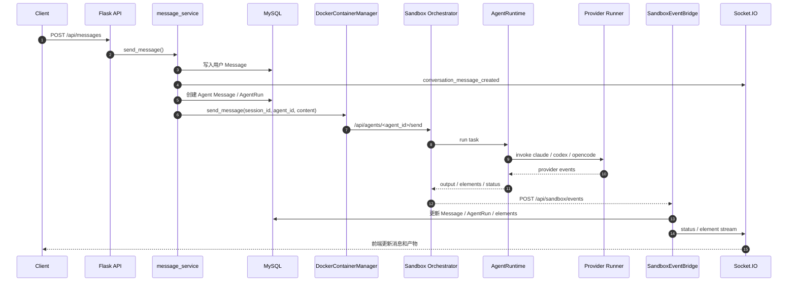
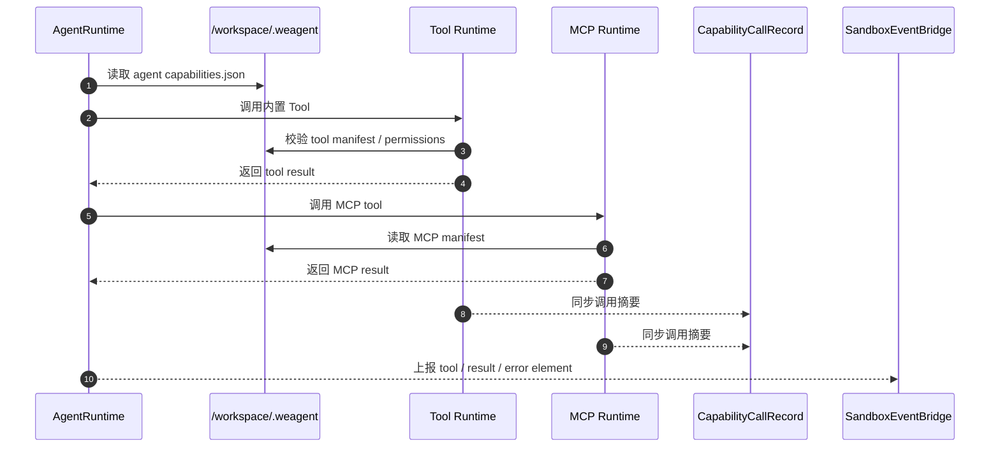
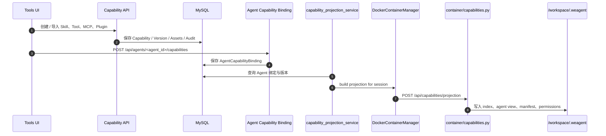
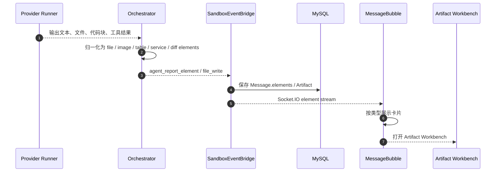
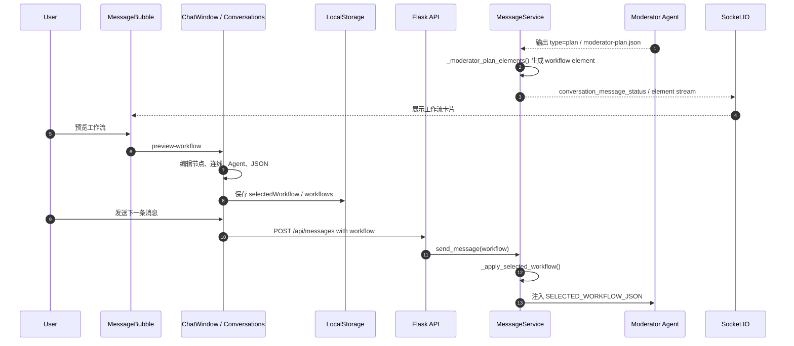
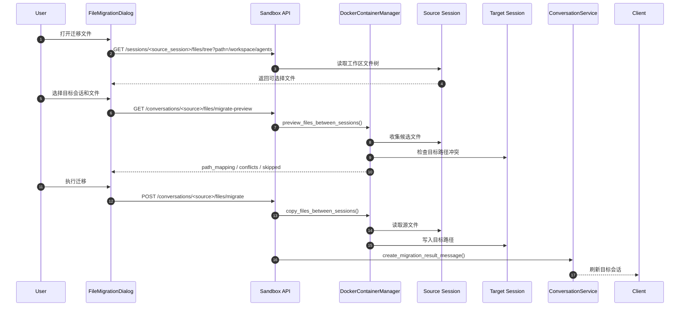
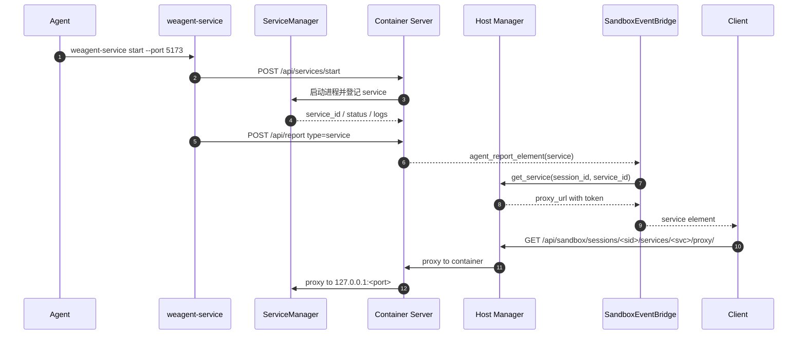
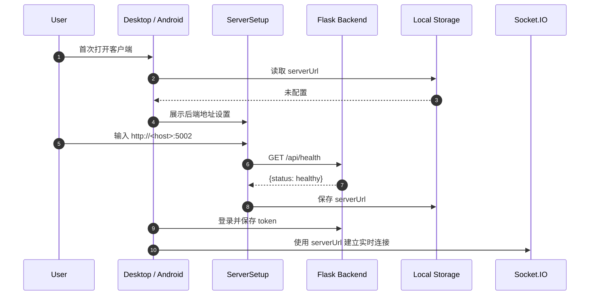

# WeAgent 技术文档

更新日期：2026-06-09

## 1. WeAgent 技术上是什么

WeAgent 是一个以 Flask 后端为协调中心、以 Docker Sandbox 为执行边界、以 Agent / Capability / Artifact 为核心抽象的多端 AI 协作系统。用户通过 Web、Electron Desktop 或 Capacitor Android 客户端发起任务；后端创建会话、调度 Agent、管理能力投影；Sandbox 容器内运行 AgentRuntime、Provider Runner、Tool / MCP runtime 和 `weagent-service`，再通过 Socket.IO 把执行进度、产物和服务预览链接实时推送回客户端。

当前文档的重点是说明真实技术结构、模块边界、关键链路、开发者运行方式和已知限制。文档按模块使用已确认事实源：Toolset / Capability 以 `origin/combine/toolset_v1.1.0` 为依据；其余客户端、后端、Sandbox、Agent 配置、工作流图、Artifact / Workbench、文件迁移、服务预览和实时事件以 `origin/feature/user_manual_and_product_introduction_v1.1.1` 为依据。不能从代码或分支确认的内容不写入本文正文。

## 2. 读者、范围与事实源

本文第一读者是比赛评审，第二读者是开发维护者，第三读者是希望理解系统可信度的高级用户。

本文包含：

- WeAgent 的真实技术栈、运行依赖和源码依据。
- Client、Backend、Sandbox、Provider、Toolset、Artifact、Service Preview 的分层关系。
- 关键模块的实现范围、上下游关系和相关代码。
- 用户消息、工具调用、能力投影、产物生成、工作流图、文件迁移、服务预览、多端连接的时序图。
- 开发者启动、构建、验证、故障定位和已知风险。

本文不包含：

- 完整 API 手册。这里只保留关键接口与数据模型摘要。
- 完整数据库 ER 图。最终提交前如需要，可在本文件内追加。
- 真实截图、GIF 或比赛演示视频。该材料仍待人工补充。

事实源优先级：

1. 当前代码、配置、运行脚本、数据模型、路由、测试和 lockfile。
2. 已确认的远端事实分支和提交记录。
3. `.planning/`、`docs/report/`、README 和历史验证记录。
4. README、报告和历史文档，仅作为补充背景，不能覆盖源码事实。

联合事实源如下：

| 分支 | 最后提交 | 文档使用方式 |
|---|---:|---|
| `origin/combine/toolset_v1.1.0` | `14d7d4b` / 2026-06-06 23:17 | 只作为 Toolset / Capability 的依据，包括能力导入、审查、Provider 配置、Agent 绑定、`.weagent` 投影和调用记录。 |
| `origin/feature/user_manual_and_product_introduction_v1.1.1` | `b22f7a8` / 2026-06-09 11:52 | 作为 Toolset 以外模块的根本依据，包括客户端、多端、Agent 管理、会话级 Agent 配置、工作流图、会话收藏、Artifact / Workbench、文件迁移、服务预览、实时事件和设置页文档入口。 |
| `origin/combine/artifact_editing_system(base_v1.08)` | `0c0838f` / 2026-06-07 10:13 | 用于追溯 Artifact editing 的实现背景；本文正文以已确认代码路径描述当前实现。 |

事实边界：

- 本文只记录已确认源码事实，不把最终交付分支的合并状态写成已完成。
- 本轮没有重新运行完整 smoke，因此第 10 章只给出开发者验证路径，不声明完整验证已经通过。

## 3. 一张图看懂 WeAgent

下图用于建立第一层心智模型：用户只面对客户端；后端负责协调和持久化；每个会话对应一个 Sandbox；Sandbox 内部完成 Agent 执行、工具调用、产物生成和服务预览。


读图方式：用户入口在 `Clients`，状态协调在 `Flask Backend`，真实执行在 `Docker Sandbox`。`Capabilities` 表示 Toolset / Capability 的导入、审查、绑定和投影边界；`Artifacts` 表示消息元素、Workbench、Diff、文件和服务预览等产物边界。第 7 章会用时序图展开可审计的数据流。

## 4. 技术分层总览

| 层级 | 主要职责 | 技术与路径 | 主要代码 |
|---|---|---|---|
| 客户端层 | 提供聊天、会话工具条、Agent 管理、会话级 Agent 配置、工作流图、会话收藏、工具集、设置、多端连接 UI。 | Web：`frontend/`；Desktop：`clients/desktop/`；Android：`clients/android/` | `frontend/src/`、`clients/desktop/src/`、`clients/android/src/` |
| 后端协调层 | 提供 REST API、Socket.IO、认证、会话、消息、Agent、Artifact、Sandbox host manager。 | `backend/run.py`、`backend/app/__init__.py`、`backend/app/controllers/`、`backend/app/services/` | `backend/app/controllers/`、`backend/app/services/` |
| Agent 执行层 | 为会话创建容器，在容器中执行 Agent、Provider、Tool / MCP。 | `backend/app/sandbox/host/`、`backend/app/sandbox/container/` | `backend/app/sandbox/host/manager.py`、`backend/app/sandbox/container/agent.py` |
| 能力层 | 管理 Skill / Tool / MCP / Plugin，绑定到 Agent 并投影到 Sandbox。 | `backend/app/models/capability.py`、`capability_controller.py`、`capability_projection_service.py` | `backend/app/controllers/capability_controller.py`、`backend/app/services/capability_projection_service.py` |
| 产物层 | 把 Agent 输出转换为消息元素、Artifact、工作流卡片、服务卡片、Workbench、Diff 和文件迁移能力。 | `artifact_controller.py`、`message_element_builder.py`、`sandbox_event_bridge.py`、`ArtifactWorkbench` | `backend/app/services/sandbox_event_bridge.py`、`frontend/src/components/ArtifactWorkbench/` |
| 基础设施层 | 提供数据库、缓存、容器、Provider CLI 和服务代理。 | MySQL、Redis、Docker、Claude Code / Codex / OpenCode | 代码、配置和 Dockerfile |

真实技术栈如下：

| 层级 | 技术 | 相关代码 |
|---|---|---|
| Web 前端 | Vue 2.7、Vue Router 3、Vuex 3、Element UI、Axios、Socket.IO client | `frontend/package.json`、`frontend/vue.config.js` |
| Desktop 客户端 | Electron 29、Vite 5、Vue 2.7、Element UI、electron-builder | `clients/desktop/package.json` |
| Android 客户端 | Capacitor 6、Vite 5、Vue 2.7 | `clients/android/package.json` |
| 后端 | Flask 2.3、Flask-SQLAlchemy、Flask-Migrate、Flask-JWT-Extended、Flask-SocketIO | `backend/requirements.txt` |
| 数据库 | MySQL 8.0；测试配置使用内存数据库连接 | `backend/config.py`、`backend/sql/init.sql` |
| 缓存 / 辅助服务 | Redis 服务，建议 Redis 7.x；Python client 为 `redis==5.0.1` | `backend/config.py`、`backend/requirements.txt` |
| Sandbox runtime | Docker、Python 3.11、Node.js、Claude Code、Codex、OpenCode | `backend/app/sandbox/Dockerfile`、`backend/app/sandbox/container/providers/` |
| 实时通信 | Socket.IO + 后端内存队列；部分消息接口提供 stream / poll 访问 | `backend/app/__init__.py`、`backend/app/socket/events.py`、`message_service.py` |

当前技术栈以 Flask 后端、Vue 2 Web 工作台、Electron Desktop、Capacitor Android、MySQL、Redis 和 Docker Sandbox 为主体。Agent 执行发生在 Sandbox 容器内，后端通过 Socket.IO、REST API 和 Sandbox host manager 连接客户端、数据库、容器与产物系统。

## 5. 系统架构

### 5.1 客户端层：Web、Desktop、Android

客户端层负责用户交互，不负责直接执行 Agent。Web 和 Desktop 连接同一个 Flask 后端；Desktop 和 Android 使用用户配置的 `serverUrl` 连接外部后端，而不是内置后端。

实现范围：

- 包含：登录、会话、会话工具条、Agent 管理、会话级 Agent 配置、工作流图、Settings、Tools / Capability、消息元素展示、服务卡片展示。
- 不包含：Agent provider 执行、Docker 管理、模型调用。
- 上游：用户操作。
- 下游：后端 REST API、Socket.IO。

核心实现：

- `frontend/src/`
- `clients/desktop/src/`
- `clients/android/src/`
- `frontend/package.json`
- `clients/desktop/package.json`

Agent 管理页面的源码事实是分类、卡片、拖拽移动、创建 / 编辑和系统 Agent 只读查看；全局收藏检索属于 Favorites 页面，会话内搜索属于 ChatWindow / Conversations 的消息面板，不属于 Agent 管理页面。

| 页面能力 | 实现边界 | 相关代码 |
|---|---|---|
| Agent 分类与卡片 | 分类加载、Agent 卡片展示、点击进入编辑 | `frontend/src/views/AgentManager.vue` |
| Agent 拖拽移动 | `handleDragStart` 把 Agent 拖到目标分类 | `frontend/src/views/AgentManager.vue` |
| Agent 创建 / 编辑 | `handleSaveAgent` 调用创建或更新接口 | `frontend/src/views/AgentManager.vue` |
| 系统 Agent 只读查看 | `moderator` 或 `read_only` Agent 不允许保存修改 | `frontend/src/views/AgentManager.vue` |
| 全局会话收藏检索 | Favorites 页面按标题、参与者、最近消息和类型过滤 | `frontend/src/views/Favorites.vue`，`clients/desktop/src/views/Favorites.vue` |
| 会话内消息搜索 / 历史 | ChatWindow / Conversations 按当前会话消息构建搜索结果和用户问题历史 | `frontend/src/components/ChatWindow/index.vue`，`clients/desktop/src/views/Conversations.vue` |
| 会话级 Agent 配置 | 只在当前会话保存角色名、提示词、Skill 和启用状态 | `frontend/src/components/ChatWindow/index.vue`，`clients/desktop/src/views/Conversations.vue` |
| 工作流图 | 会话内选择、编辑、复制、删除、保存并作为本轮默认工作流 | `frontend/src/components/ChatWindow/index.vue`，`clients/desktop/src/views/Conversations.vue` |

多端能力差异：

| 客户端 | 当前定位 | 已确认能力 | 相关代码 |
|---|---|---|---|
| Web | 主功能基准 | Dashboard、会话、Agent 管理、Tools / Capability、Favorites、Settings、Artifact Workbench、文件迁移、服务面板、工作流图、Socket.IO 实时更新 | `frontend/src/router/index.js`、`frontend/src/views/`、`frontend/src/components/ChatWindow/index.vue` |
| Desktop | 接近 Web 的桌面迁移版本 | 独立 `ServerSetup`、会话、Agent、Favorites、Tools、Settings、工作目录、上传、会话内搜索、历史、会话级 Agent 配置、产物、日志、工作流图 | `clients/desktop/src/router/index.js`、`clients/desktop/src/views/Conversations.vue`、`clients/README.md` |
| Android | 移动端主流程版本 | `ServerSetup`、登录 / 注册、会话、Agent、Settings、移动端 Agent 编辑、基础产物展示和后端地址守卫 | `clients/android/src/router/index.js`、`clients/android/src/views/Conversations.vue`、`clients/android/src/views/Agents.vue` |

Android 不写成 Web / Desktop 的全量等价端。`clients/README.md` 明确 Desktop 尽量保持 Web 功能完整，Android 主要迁移登录、会话、Agent 和设置等主流程。

### 5.2 后端协调层：Flask API、Socket.IO、业务服务

后端协调层负责把用户操作转成可持久化、可调度、可推送的系统事件。它不在宿主机直接调用 Provider CLI，真实 Agent 执行路径进入 Sandbox。

实现范围：

- 包含：API、认证、模型配置、会话、消息、Agent、Capability、Artifact、Sandbox host manager、Socket.IO。
- 不包含：容器内 provider 命令执行和本地服务运行。
- 上游：客户端请求和 Socket.IO 事件。
- 下游：MySQL、Redis、Docker Engine、Sandbox Orchestrator Server。

核心实现：

- `backend/run.py`
- `backend/app/__init__.py`
- `backend/app/controllers/`
- `backend/app/services/`
- `backend/app/socket/events.py`

### 5.3 Agent 执行层：Conversation、AgentRun、Sandbox

Agent 执行层把会话中的用户消息变成一个或多个 Agent 的运行记录，并通过 Sandbox 容器隔离执行环境。

实现范围：

- 包含：`Conversation`、`Message`、`AgentRun`、Sandbox session、provider 事件、执行状态回写。
- 不包含：用户界面和完整能力编辑 UI。
- 上游：`message_service.send_message()`。
- 下游：`DockerContainerManager`、容器内 `AgentRuntime`、`SandboxEventBridge`。

核心实现：

- `backend/app/models/conversation.py`
- `backend/app/models/message.py`
- `backend/app/models/agent_run.py`
- `backend/app/services/message_service.py`
- `backend/app/sandbox/host/manager.py`
- `backend/app/sandbox/container/agent.py`

### 5.4 能力层：Capability、Toolset、Skill、MCP、Plugin

能力层负责把可复用能力从“数据库定义”转成“Agent 在 Sandbox 内可读、可审计、可调用的运行时文件”。核心边界是 `/workspace/.weagent/*`。

实现范围：

- 包含：Capability 数据模型、版本、资产、导入预览、导入确认、Agent 绑定、调用审计、安全审计、Sandbox projection。
- 不包含：第三方插件的真实安装器执行能力，Plugin v1 以 manifest 记录为主。
- 上游：Tools / Capability UI、Capability API、Agent 配置。
- 下游：`/workspace/.weagent/*`、Tool runtime、MCP runtime、Provider Runner。

核心实现：

- `backend/app/models/capability.py`
- `backend/app/controllers/capability_controller.py`
- `backend/app/services/capability_projection_service.py`
- `backend/app/sandbox/container/capabilities.py`
- `backend/app/sandbox/container/mcp_runtime.py`

### 5.5 产物层：Artifact、Workbench、文件迁移、服务预览

产物层负责把 Agent 输出转成用户能查看、复用和继续编辑的结构化结果。该层包括基础 Artifact、消息元素、工作流卡片、服务卡片、Artifact Workbench、文件编辑、diff 和文件迁移。

实现范围：

- 包含：`Artifact` 模型、消息元素、代码 / 表格 / 图片 / 文件 / workflow / service / diff 类型、Artifact Workbench、文件编辑、diff、文件迁移、服务类产物预览。
- 不包含：没有消息元素或 workspace 来源的外部资产管理。
- 上游：Provider 输出、Tool / MCP 调用、`weagent-report`、`weagent-service`。
- 下游：MessageBubble、Artifact 组件、ArtifactWorkbench、DiffViewCard、FileMigrationDialog。

核心实现：

- `backend/app/models/artifact.py`
- `backend/app/controllers/artifact_controller.py`
- `backend/app/services/message_element_builder.py`
- `backend/app/services/sandbox_event_bridge.py`
- `frontend/src/api/artifact.js`
- `frontend/src/components/ArtifactWorkbench/`

### 5.6 基础设施层：MySQL、Redis、Docker、Provider CLI

基础设施层提供状态持久化、缓存和隔离运行环境。Docker 是 Agent 执行边界；Provider CLI 是模型执行入口。

实现范围：

- 包含：MySQL、Redis、Docker Desktop、`weagent-sandbox:latest`、Claude Code / Codex / OpenCode。
- 不包含：第三方模型服务本身。
- 上游：Backend、Sandbox。
- 下游：数据库连接、Redis client、Docker API、Provider CLI。

核心实现：

- `backend/config.py`
- `backend/requirements.txt`
- `backend/app/sandbox/Dockerfile`
- `backend/app/sandbox/container/providers/`

## 6. 核心模块

### 6.1 客户端与多端连接

客户端与多端连接模块把同一个 WeAgent 后端投射到 Web、Desktop 和 Android 客户端，并根据端侧定位保留不同的交互密度。

实现范围：

- 包含：Web 工作台、Electron Desktop、Capacitor Android、`serverUrl` 配置、REST API client、Socket.IO client、端侧会话工具和设置入口。
- 不包含：本地启动后端或本地执行 Agent。
- 上游：用户输入、后端健康检查。
- 下游：`/api/*`、Socket.IO。

为什么这样设计：Desktop 和 Android 不内置后端，可以连接同一个部署实例，避免多端各自维护执行环境。代价是首次启动需要配置后端地址，移动端不能使用手机自身的 `localhost` 访问电脑后端。

核心实现：

- `frontend/src/router/`
- `clients/desktop/src/router/index.js`
- `clients/desktop/src/views/ServerSetup.vue`
- `clients/android/src/router/index.js`

#### Web 工作台

Web 工作台当前基于 Vue 2.7 和 Vue CLI，主要承载 Dashboard、Agent 管理、Settings、Tools / Capability、Favorites、Sandbox 入口。Web 使用 history router，开发服务通常运行在 `http://localhost:8080`。

Web 的会话区域以 `Dashboard.vue` + `ChatWindow/index.vue` 为主。会话头部提供搜索、工作目录、收藏、历史和迁移文件入口；底部标签提供对话、智能体配置、产物、日志和工作流图。它是功能最完整的前端基准。

#### Electron Desktop

Desktop 基于 Electron 29、Vite 5 和 Vue 2.7。它通过 `ServerSetup` 保存后端地址，再通过相同 API 和 Socket.IO 接入 WeAgent。

Desktop 的 `Conversations.vue` 复刻了 Web 会话主链路，并把桌面端常用入口做成高密度工具条：全局会话搜索、消息搜索、工作目录、上传、收藏、历史、会话级 Agent 配置、产物、日志和工作流图。桌面路由还包含 `Favorites`、`Tools` 和 `Settings`，适合日常使用和打包分发。

#### Capacitor Android

Android 的核心入口包括 `clients/android/package.json`、`clients/android/src/router/index.js` 和 `clients/android/src/views/ServerSetup.vue`。

Android 使用 hash router，并在路由守卫中检查 `serverUrl` 和 access token。当前路由覆盖 `/server`、`/login`、`/register`、`/conversations`、`/agents` 和 `/settings`。移动端 `Agents.vue` 已支持 Agent 名称、模型适配器、头像颜色、系统提示词、Skill、能力标签和 Tool 选择；`Conversations.vue` 支持会话主流程和基础产物展示。

Android 的设计边界是移动端主流程，不写成完整桌面替代。服务日志、工作流编辑、文件迁移等高密度工作台能力以 Web / Desktop 为准。

#### Server URL 配置与多端连接边界

Desktop / Android 的后端地址需要填写真实可访问地址。真机访问电脑后端时，应使用局域网 IP，例如 `http://192.168.1.100:5002`。

多端连接的核心规则如下：

| 规则 | 说明 | 相关代码 |
|---|---|---|
| 客户端不内置后端 | Desktop / Android 都连接外部 Flask 后端 | `clients/README.md` |
| 首次访问先配置地址 | 未配置 `serverUrl` 时进入 ServerSetup | `clients/desktop/src/router/index.js`，`clients/android/src/router/index.js` |
| Android 真机不能用电脑的 `localhost` | 真机上的 `localhost` 指向手机自身 | `clients/README.md` |
| 实时连接复用后端地址 | REST API 和 Socket.IO 都基于已保存的 `serverUrl` | `clients/desktop/src/services/session.js`，`clients/android/src/services/session.js` |

#### Settings 与内置文档入口

Settings 页面包含模型设置、个人信息和关于我们。模型设置通过 `/api/settings/model-config` 保存 `api_key`、`model`、`custom_model`、`base_url`、`temperature` 和 `max_tokens`；关于我们包含使用手册、产品介绍和迭代历程。

`b22f7a8` 的更新点集中在 `frontend/src/views/Settings.vue`：使用手册包含快速开始、场景使用、多轮对话、Agent 配置、产物与文件、FAQ；产品介绍包含产品流程、亮点和页面图；迭代历程按版本说明从 v1.0.0 到 v1.1.1 的能力演进。它们是前端内置说明材料，不改变后端执行链路。

### 6.2 后端协调系统

后端协调系统承担认证、数据持久化、业务 API、实时推送和 Sandbox host 管理，是 WeAgent 的控制面。

实现范围：

- 包含：Flask app factory、Blueprint 注册、Socket.IO 初始化、自动建表、seed、业务服务。
- 不包含：容器内 Orchestrator 的 provider 命令执行。
- 上游：Client REST / Socket.IO 请求。
- 下游：MySQL、Redis、Docker host manager、Sandbox API。

为什么这样设计：Flask + Flask-SocketIO 可以在一个后端内同时承载常规 API 和实时消息，降低比赛项目的集成复杂度。长期维护时需要关注线程模型、后台任务和横向扩展方式。

核心实现：

- `backend/run.py`
- `backend/app/__init__.py`
- `backend/app/controllers/`
- `backend/app/services/`
- `backend/app/socket/events.py`

#### Flask 应用入口

`backend/run.py` 调用 `create_app()`，并通过 `socketio.run()` 默认监听 `5002` 端口。`backend/app/__init__.py` 初始化 SQLAlchemy、Migrate、JWT、CORS、Socket.IO 和 Redis client。

#### API Blueprint

API Blueprint 按业务域拆分。读者应先看每个域负责什么，再看具体路径。

| API 域 | 一眼看懂负责什么 | 主要入口 | 相关代码 |
|---|---|---|---|
| 认证与用户 | 注册、登录、刷新 token、读取和修改个人信息 | `/api/auth/*` | `backend/app/controllers/auth_controller.py` |
| 会话 | 创建会话、读取详情、收藏、删除、管理参与者、停止 Agent、管理附件 | `/api/conversations/*` | `backend/app/controllers/conversation_controller.py` |
| 消息 | 发送消息、读取会话消息、固定消息、poll / SSE 读取 | `/api/messages/*` | `backend/app/controllers/message_controller.py`，`backend/app/services/message_service.py` |
| Agent | 管理全局 Agent、分类、只读系统 Agent 和编辑表单数据 | `/api/agents/*` | `backend/app/controllers/agent_controller.py` |
| Agent 能力绑定 | 把 Capability 绑定到某个 Agent，并管理版本策略、权限和启用状态 | `/api/agents/<agent_id>/capabilities/*` | `backend/app/controllers/capability_controller.py` |
| Capability / Toolset | 导入、审查、版本化、分类、Provider 配置和调用记录 | `/api/capabilities/*`、`/api/toolsets/*` | `backend/app/controllers/capability_controller.py`，`backend/app/controllers/toolset_controller.py` |
| 旧 Tool | 保留旧 Tool 的创建、读取、更新、删除接口 | `/api/tools/*` | `backend/app/controllers/tool_controller.py` |
| Artifact | 创建、读取、按消息查询和更新结构化产物 | `/api/artifacts/*` | `backend/app/controllers/artifact_controller.py` |
| Sandbox | 管理 sandbox image、session、Agent、文件、MCP、service、proxy 和事件上报 | `/api/sandbox/*` | `backend/app/sandbox/api/routes.py` |
| 文件上传 | 上传头像、附件或工作区相关文件 | `/api/upload/*` | `backend/app/controllers/upload_controller.py` |
| 设置 | 保存模型配置，并生成 Provider 运行环境变量 | `/api/settings/model-config` | `backend/app/controllers/settings_controller.py`，`backend/app/services/settings_service.py` |

#### 模型配置 API

模型配置入口是 `/api/settings/model-config`。`GET` 返回当前用户模型配置并遮蔽 API Key；`POST` 保存模型、Base URL、温度和最大 token 等字段。`settings_service.py` 会把配置转换为 Provider 运行需要的环境变量，例如 `ANTHROPIC_API_KEY`、`ANTHROPIC_BASE_URL`、`ANTHROPIC_MODEL`、`CODEX_API_KEY`、`CODEX_BASE_URL` 和 `CODEX_MODEL`。

#### Socket.IO 实时通道

Socket.IO 事件入口位于 `backend/app/socket/events.py`。后端通过 `conversation_message_created`、`conversation_message_status`、`conversation_message_element_stream` 等事件向会话 room 推送状态。

#### 业务服务层

业务服务层集中在 `backend/app/services/`。其中 `message_service.py` 是用户消息进入 Agent 执行链路的主路径；`orchestrator_service.py` 当前是兼容 facade，不替代 `message_service` 的 Sandbox dispatch。

#### 数据模型层

SQLAlchemy 模型集中在 `backend/app/models/`。应用启动时会执行 `db.create_all()`，并 seed 默认 Agent、Tool、Toolset Category 和内置 Tool Capability。

### 6.3 会话与消息系统

会话与消息系统把用户、Agent、执行轮次和结构化产物连接成一条可追踪的任务链路。

实现范围：

- 包含：`Conversation`、`ConversationParticipant`、`Message`、`AgentRun`、消息状态、结构化元素、收藏、附件、会话内搜索 / 历史、运行状态回写。
- 不包含：Provider CLI 的具体执行。
- 上游：用户消息、Socket.IO `send_message`、REST `POST /api/messages`。
- 下游：Sandbox manager、`SandboxEventBridge`、Socket.IO 推送。

为什么这样设计：会话、消息和运行记录拆开后，系统可以同时支持单 Agent、多 Agent、执行状态追踪、消息元素增量推送和历史复查。

核心实现：

- `backend/app/models/conversation.py`
- `backend/app/models/message.py`
- `backend/app/models/agent_run.py`
- `backend/app/services/message_service.py`
- `backend/app/services/agent_run_service.py`
- `backend/app/services/sandbox_event_bridge.py`

#### 会话实体与参与者关系

会话实体负责定义“谁在同一个任务空间里协作”，并把这个任务空间绑定到一个 Sandbox session。`Conversation` 保存标题、会话类型、owner、收藏状态、Sandbox session / container / port / status、last active 等信息；`ConversationParticipant` 保存用户或 Agent 参与者，并通过 `conversation_id + participant_type + participant_id` 唯一约束避免同一参与者重复加入。

会话创建时，`ConversationService.create_conversation()` 会写入 owner、参与 Agent 和必要的主持 Agent。只要会话包含 Agent，服务层会调用 `_create_agent_sandbox()` 创建 Sandbox session，并把 `sandbox_session_id`、`sandbox_container_id`、`sandbox_host_port` 和 `sandbox_status` 回写到会话记录。这个设计让会话列表、详情页、消息发送和 Sandbox 调度使用同一个会话对象，而不是在前端临时拼接运行状态。

会话相关 API 不只负责创建和查询，还覆盖协作空间的生命周期管理：

| 能力 | 技术作用 | 关键代码 |
|---|---|---|
| 创建 / 查询会话 | 创建 `Conversation` 和参与者，返回参与者展示信息与最近消息 | `conversation_controller.py`，`conversation_service.py`，`conversation_repo.py` |
| 收藏会话 | 更新 `Conversation.is_favorite`，支撑会话列表、详情页和 Favorites 页的收藏状态 | `conversation_controller.py`，`conversation_service.py`，`frontend/src/views/Favorites.vue` |
| 增删参与者 | 修改 `ConversationParticipant`，用于调整会话内用户或 Agent 成员 | `conversation_controller.py`，`conversation_repo.py` |
| 删除会话 | 删除会话前销毁关联 Sandbox session，并清理 `AgentRun` | `ConversationService.delete_conversation()` |
| 停止 Agent | 调用 Sandbox manager 停止指定 Agent，并通过事件桥接回写停止状态 | `ConversationService.stop_agent()`，`SandboxEventBridge.mark_agent_stopped()` |
| 附件管理 | 把用户上传文件写入目标 Agent 的 `userInput` 目录 | `ConversationService.list_attachments()`，`upload_attachment()`，`delete_attachment()` |

附件当前绑定到 Agent 工作目录。服务层会根据 Agent 名称计算 `/workspace/agents/<workspace_name>/userInput`，并通过 Sandbox manager 读取文件树、上传文件或删除文件。该实现让用户上传的输入文件进入 Agent 可访问的容器工作区，而不是只停留在 Web 表单里。

#### 消息、运行轮次与事件回写

消息系统负责记录“用户说了什么、哪个 Agent 在处理、处理到了什么状态、生成了哪些结构化结果”。`Message` 保存用户或 Agent 的内容、类型、`artifact_id`、`elements`、`round_id`、`run_id`、`status`、`raw_output` 和 `meta`；`AgentRun` 保存一个 Agent 在一个会话轮次中的执行状态，包括 `pending`、`running`、`done`、`error`、`stopped`。

`round_id` 表示一次用户任务触发的执行轮次，`run_id` 把 Agent 回复消息和对应的 `AgentRun` 连接起来。单 Agent 会话通常产生一个 Agent run；多 Agent 会话会先由主持 Agent 生成 plan，再为多个 worker 创建 run。这样前端看到的是一轮对话，后端可以追踪多个 Agent 的并行或串行执行状态。

`Message.elements` 是消息系统承接产物系统的关键字段。它把 provider 输出、文件引用、表格、workflow、service、diff 等内容组织成前端可渲染的结构化数组。`raw_output` 保留 provider 原始输出，`meta.events` 保留压缩后的执行事件，便于前端继续展示步骤、状态和调试信息。

`SandboxEventBridge` 是容器事件回到会话系统的入口。它接收 provider chunk、工具事件、report、service、workflow、停止和错误事件，然后完成四件事：

- 更新 `Message.status`、`Message.content`、`Message.raw_output` 和 `Message.elements`。
- 更新对应 `AgentRun.status`、`started_at`、`finished_at`、`error` 和 `last_seq`。
- 为 service 类消息元素补充 `proxy_url`，让前端服务卡片可以打开预览。
- 通过 `conversation_message_status`、`conversation_message_element_stream`、`conversation_message_step` 等 Socket.IO 事件推送给客户端。

这个链路把“容器里发生的执行事件”转成“会话里可观察、可恢复、可复用的消息状态”。如果没有 `Message + AgentRun + SandboxEventBridge` 这一组协作，用户只能看到一次性文本输出，前端也很难稳定展示进度、结构化产物、服务预览和停止状态。

#### 会话工具条与侧栏

Web 的 `ChatWindow/index.vue` 和 Desktop 的 `Conversations.vue` 把会话内操作收束到工具条和侧栏：

| 能力 | 技术行为 | 相关代码 |
|---|---|---|
| 会话收藏 | 调用收藏接口，更新 `Conversation.is_favorite` | `conversation_controller.py`，`frontend/src/views/Dashboard.vue`，`clients/desktop/src/views/Conversations.vue` |
| 消息搜索 | 在当前会话消息中收集文本并生成匹配结果 | `frontend/src/components/ChatWindow/index.vue`，`clients/desktop/src/views/Conversations.vue` |
| 对话历史 | 从当前消息列表筛选用户消息，作为历史问题入口 | `frontend/src/components/ChatWindow/index.vue`，`clients/desktop/src/views/Conversations.vue` |
| 工作目录 | 打开 Sandbox 文件树、raw file、download 或 workbench 入口 | `frontend/src/views/Dashboard.vue`，`backend/app/sandbox/api/routes.py` |
| 附件上传 | 上传文件并绑定当前会话 | `conversation_controller.py`，`frontend/src/views/Dashboard.vue`，`clients/desktop/src/views/Conversations.vue` |
| Agent stop | 停止某个会话内 Agent 的当前执行 | `conversation_controller.py`，`backend/app/sandbox/host/manager.py` |

这些能力不改变 Agent 执行模型，但会影响用户观察、恢复和复用会话的方式。

#### 消息发送、定向与调度上下文

会话消息不是单纯的 `content` 字符串。Web / Desktop 在发送前会构造一个包含目标 Agent、会话级 Agent 配置和工作流图的 payload：

| 输入来源 | Payload 字段 | 后端处理 | 相关代码 |
|---|---|---|---|
| 用户输入框 | `content` | 写入用户 `Message`，并作为 Agent 调用的基础任务文本 | `frontend/src/components/ChatWindow/index.vue`，`backend/app/services/message_service.py` |
| `@Agent` 或显式选择 | `target_agent_ids`、`mentions` | 解析为目标 Agent；如果目标 Agent 被会话级配置禁用，则拒绝分配 | `MessageService._parse_mentioned_agent_ids()`，`_target_participants_from_ids()`，`_disabled_session_agent_ids()` |
| 会话级 Agent 配置 | `agent_configs` | 生成 `SESSION_AGENT_CONFIG_CONTEXT`，只影响当前会话调度 | `MessageService._apply_session_agent_configs()` |
| 选中的工作流图 | `workflow` | 生成 `SELECTED_WORKFLOW_JSON`，提示主持 Agent 按图分配任务 | `MessageService._apply_selected_workflow()` |

后端分发逻辑按会话参与者决定执行路径：

| 场景 | 执行方式 | 相关代码 |
|---|---|---|
| 单 Agent 会话 | 直接调用单个 Agent 的 sandbox runtime | `MessageService._dispatch_single_agent_round()` |
| 多 Agent 会话，指定目标 | 只把任务发给显式目标 Agent | `MessageService._resolve_direct_target_participants()` |
| 多 Agent 会话，未指定目标 | 先由主持 Agent 生成 plan，再按 `parallel_groups` 调度 worker | `MessageService._dispatch_multi_agent_round()`，`_execute_worker_plan()` |

这个设计让“用户自然聊天”和“技术调度参数”共存：用户看到的是一条消息，系统内部保存的是消息、参与者、运行轮次、Agent 配置覆盖和工作流上下文。

#### 工作流图与会话调度上下文

工作流图属于会话系统的一部分。它以 `workflow` message element 展示，但真正作用是把主持 Agent 的任务分配计划变成下一轮可复用的调度约束。

工作流图有两条来源：

| 来源 | 生成方式 | 相关代码 |
|---|---|---|
| 主持 Agent 的 plan | `MessageService._moderator_plan_elements()` 在 `type=plan` 时生成 `workflow` 元素，并保留 `moderator-plan.json` 代码元素 | `backend/app/services/message_service.py` |
| Sandbox 文件 | `SandboxEventBridge._workflow_element_from_file()` 识别 `moderator-plan.json`，读取文件后生成 `workflow` 元素 | `backend/app/services/sandbox_event_bridge.py` |

工作流图的数据结构包含 `id`、`name`、`summary`、`nodes`、`edges`、`parallel_groups` 和 `source`。节点记录 `agent_id`、`title`、`instruction`、坐标和依赖关系，边记录 `from` / `to`。

Web 和 Desktop 的会话 UI 支持：

- 从消息卡片直接预览工作流。
- 在工作流面板中新增节点、连接节点、删除节点、编辑节点标题 / 指令 / Agent。
- 在图形视图和 JSON 视图之间切换。
- 复制工作流 JSON、复制工作流副本、删除本地工作流。
- 保存并使用当前工作流，或仅在本轮选择该图。

用户发送消息时，客户端会把 `activeWorkflowPayload()` 放入 `workflow` 字段。后端 `MessageService._apply_selected_workflow()` 会把 `SELECTED_WORKFLOW_JSON` 加入用户消息上下文，并提示主持 Agent 优先按该工作流图进行任务分配。

### 6.4 Agent 执行系统

Agent 执行系统把用户任务转换为容器内 provider 调用，并把执行状态、输出和产物回传到会话。


实现范围：

- 包含：Agent 配置、AgentRuntime、Provider Runner、provider 事件、错误处理、执行状态回传。
- 不包含：模型服务本身；模型调用由 Claude Code、Codex、OpenCode 等 Provider CLI 完成。
- 上游：Conversation、Message、Agent 配置、用户模型配置。
- 下游：Docker Sandbox、Provider CLI、Socket.IO 事件推送。

为什么这样设计：用统一的 `AgentRuntime` 包住不同 Provider Runner，可以避免后端直接耦合各 CLI 的命令格式、输出格式和错误处理。

执行链路一眼看懂：

| 阶段 | 发生什么 | 相关代码 |
|---|---|---|
| 创建会话 | `ConversationService` 根据参与者创建会话，自动补充主持 Agent，并为 Agent 会话创建 Sandbox session | `conversation_service.py`，`_with_auto_moderator()`，`_create_agent_sandbox()` |
| 组装 Agent 配置 | 从 `Agent` 模型、参与者信息和用户模型配置生成容器需要的 agents config | `conversation_service.py`，`settings_service.py` |
| 建立执行边界 | Host manager 创建或恢复会话容器，并把 Agent 配置和能力投影写入容器 | `backend/app/sandbox/host/manager.py` |
| 接收用户消息 | `MessageService` 写入用户消息，解析目标 Agent、会话级配置和工作流图 | `message_service.py` |
| 选择执行路径 | 单 Agent 直接执行；多 Agent 先由主持 Agent 计划，再调度 worker Agent | `_dispatch_single_agent_round()`，`_dispatch_multi_agent_round()` |
| 容器内执行 | `Orchestrator` 创建 `AgentRuntime`，`ProviderRunnerFactory` 选择 Claude / Codex / OpenCode runner | `container/orchestrator.py`，`container/agent.py`，`container/providers/` |
| 回传结果 | Provider 输出和 sandbox events 经 `SandboxEventBridge` 写入消息状态、元素和 Socket.IO | `sandbox_event_bridge.py`，`message_service.py` |

核心实现：

- `backend/app/models/agent.py`
- `backend/app/services/agent_service.py`
- `backend/app/sandbox/container/agent.py`
- `backend/app/sandbox/container/orchestrator.py`
- `backend/app/sandbox/container/providers/`

#### Agent 配置模型

`Agent` 保存 `name`、`avatar_url`、`avatar_color`、`capability_tags`、`agent_type`、`adapter_name`、`config`、`system_prompt`、`skill`、`class_id`、`tool_ids` 和 `is_public`。API 响应会遮蔽 `config.api_key`。

全局 Agent 管理由 `AgentManager.vue` 和 `AgentEditForm/index.vue` 承载：

| 配置项 | 作用范围 | 相关代码 |
|---|---|---|
| 名称与头像 | 决定 Agent 在卡片、会话参与者和消息中的展示 | `frontend/src/components/AgentEditForm/index.vue` |
| `adapter_name` | 决定容器内使用哪个 Provider Runner | `AgentEditForm/index.vue`，`backend/app/sandbox/container/orchestrator.py` |
| `system_prompt` | 写入 Agent 的全局角色与行为边界 | `AgentEditForm/index.vue`，`backend/app/models/agent.py` |
| `capability_tags` | 用于前端卡片标签和能力分类感知 | `AgentManager.vue`，`AgentEditForm/index.vue` |
| Capability 绑定 | 绑定 Skill / Tool / MCP / Plugin，并配置授权权限和启用状态 | `AgentEditForm/index.vue`，`capability_controller.py` |
| Legacy `skill` / `tool_ids` | 保留旧 Skill 文本和旧 Tool IDs 的兼容视图 | `AgentEditForm/index.vue` |

系统内置 `moderator` 或 `read_only` Agent 在 UI 中以只读形式展示，不允许通过普通编辑表单保存修改。

#### 会话级 Agent 配置

会话级 Agent 配置只影响当前会话的调度上下文，不更新全局 Agent。

实现范围：

- 包含：当前会话内 Agent 的角色名、系统提示词、Skill / 工作方式、启用状态和适配器名称快照。
- 不包含：修改 `Agent` 表中的全局配置，也不改变其他会话的 Agent 行为。
- 上游：Web / Desktop 会话侧栏的“智能体配置”。
- 下游：`POST /api/messages` 的 `agent_configs` payload 和 `MessageService._apply_session_agent_configs()`。

Web 端使用 `weagent.web.sessionAgentConfigs.<conversation_id>` 保存本地配置，Desktop 端使用 `weagent.desktop.sessionAgentConfigs.<conversation_id>`。发送消息时，客户端把配置组装到 `agent_configs`，后端把它追加到用户消息上下文中：

| 字段 | 技术含义 | 处理位置 |
|---|---|---|
| `role` | 当前会话内的 Agent 角色名 | `ChatWindow.sessionAgentConfigPayload()`，`MessageService._apply_session_agent_configs()` |
| `system_prompt` | 当前会话内覆盖提示词 | `ChatWindow` / `Conversations`，`message_service.py` |
| `skill` | 当前会话内工作方式说明 | `ChatWindow` / `Conversations`，`message_service.py` |
| `enabled` | 多 Agent 会话中是否允许分配任务；单 Agent 会话锁定为启用 | `isSessionAgentEnabled()`，`_disabled_session_agent_ids()` |
| `adapter_name` | 会话配置中的适配器名称快照 | `sessionAgentConfigPayload()` |

`MessageService._apply_session_agent_configs()` 会生成 `SESSION_AGENT_CONFIG_CONTEXT` 和 `SESSION_AGENT_CONFIG_JSON`，并明确写入“以下配置只对当前会话调度生效，不代表全局 Agent 配置变更”。这就是全局 Agent 管理和会话级临时调整之间的技术边界。

#### Agent Runtime

`AgentRuntime` 位于 `backend/app/sandbox/container/agent.py`，在容器内为 Agent 准备 workspace、提示词、provider runner 和执行上下文。

`AgentRuntime` 的职责是封装每个 Agent 的运行目录、Provider 进程、输出采集和错误归一化。它不直接决定“这个任务应该由谁做”；任务分配发生在 host backend 的 `MessageService` 和容器内 `Orchestrator` 之间。

#### Adapter / Provider 关系

`adapter_name` 决定 Agent 使用哪个 provider。容器内 `orchestrator.py` 会校验 adapter 是否存在，并使用 `ProviderRunnerFactory` 创建对应 runner。

Provider 选择的边界如下：

| 字段 / 配置 | 作用 | 相关代码 |
|---|---|---|
| `Agent.adapter_name` | 全局 Agent 默认 Provider | `backend/app/models/agent.py`，`AgentEditForm/index.vue` |
| 会话级 `adapter_name` | 当前会话内随配置 payload 传入的适配器名称快照 | `sessionAgentConfigPayload()` |
| `ProviderRunnerFactory` | 把 `claude`、`codex`、`opencode` 等名称映射为 runner | `backend/app/sandbox/container/providers/__init__.py` |
| `settings_service` | 把模型配置转换为 Provider CLI 需要的环境变量 | `backend/app/services/settings_service.py` |

#### Provider Runner：Claude Code、Codex、OpenCode

`ProviderRunnerFactory` 注册 `claude`、`claude_code`、`codex`、`opencode`。各 runner 负责自身 CLI 命令、配置目录、环境变量、输出清理、resume 状态和错误识别。

#### 执行状态与事件回传

Provider 事件包括 `provider_started`、`provider_output_delta`、`provider_error_delta`、`provider_output`、`provider_error`、`provider_stopped`。这些事件经 Orchestrator、Host manager、`SandboxEventBridge` 进入数据库和 Socket.IO。

### 6.5 Docker Sandbox 系统

Docker Sandbox 系统是 WeAgent 的执行边界。后端负责创建和管理容器，容器负责运行 Agent、读写工作区文件、调用工具 / MCP，并把服务和事件回传给后端。

实现范围：

- 包含：一会话一容器、Host manager、Container API、Orchestrator、workspace、文件 API、Tool / MCP runtime、ServiceManager、容器恢复和端口映射。
- 不包含：模型服务本身；Provider CLI 在容器内被 runner 调用。
- 上游：`ConversationService`、`MessageService`、`DockerContainerManager`。
- 下游：容器内 `AgentRuntime`、Provider Runner、Tool / MCP runtime、ServiceManager、Sandbox events。

为什么这样设计：一会话一容器让会话文件、Agent 运行状态、服务端口、工具运行时和事件日志共享同一个清晰边界。用户看到的是一个会话；系统内部对应一个可恢复、可查询、可停止、可迁移文件的容器会话。

核心实现：

- `backend/app/sandbox/host/manager.py`
- `backend/app/sandbox/host/client.py`
- `backend/app/sandbox/container/server.py`
- `backend/app/sandbox/container/orchestrator.py`
- `backend/app/sandbox/Dockerfile`

#### 一会话一容器

`DockerContainerManager.create_session()` 为会话启动 `weagent-sandbox:latest`。容器通过 label 记录 `weagent.session_id`，并保存 Agent 配置、端口和 session 状态，用于后端恢复已有容器。

会话容器的主要职责如下：

| 职责 | 作用 | 相关代码 |
|---|---|---|
| 隔离工作区 | 每个会话拥有独立 `/workspace`，Agent 文件和运行状态不混在宿主机项目中 | `backend/app/sandbox/container/server.py` |
| 保存会话状态 | `/workspace/.session/*` 记录 Agent 配置、历史、事件、服务日志等运行信息 | `backend/app/sandbox/container/session.py` |
| 注入能力投影 | `/workspace/.weagent/*` 保存本会话 Agent 可用的 Skill、Tool、MCP、Plugin 视图 | `backend/app/sandbox/container/capabilities.py` |
| 暴露容器 API | Host backend 通过容器 API 管理 Agent、文件、工具、MCP 和服务 | `backend/app/sandbox/host/client.py` |
| 上报事件 | 容器把 Provider 输出、文件、服务和工作流事件回传给后端 | `backend/app/sandbox/api/routes.py`，`sandbox_event_bridge.py` |

#### Orchestrator Server

容器内 `container/server.py` 是 Host backend 和容器执行环境之间的控制面。它不是面向用户的公开 API，而是给后端调用的内部管理服务。

Container API 的分组和作用如下：

| 接口组 | 解决的问题 | 相关代码 |
|---|---|---|
| `/api/health` | 检查容器内控制面是否启动，供 host manager 判断 session 是否可用 | `backend/app/sandbox/container/server.py` |
| `/api/agents/*` | 创建、删除、重启、停止 Agent，读取 Agent 历史、进度和事件 | `container/server.py`，`container/orchestrator.py` |
| `/api/files/*` | 读取文件树、raw file、下载、写入文件，为 Workbench、附件和迁移提供底层能力 | `container/server.py`，`backend/app/sandbox/api/routes.py` |
| `/api/tools/*` | 管理容器内工具注册和旧 Tool 调用入口 | `container/server.py`，`container/tools/` |
| `/api/mcp/*` | 启动 MCP server、列出工具、调用 MCP tool、停止 MCP runtime | `container/server.py`，`container/mcp_runtime.py` |
| `/api/services/*` | 启动、停止、重启、代理和读取容器内长运行服务日志 | `container/server.py`，`container/service_manager.py` |
| `/api/report` / `/api/events` | 接收 Agent 主动上报的产物和执行事件，再由 host backend 写入消息与 Socket.IO | `weagent-report`、`weagent-service`、`sandbox_event_bridge.py` |

这组接口的作用是把“容器内正在发生什么”转换为后端可以管理的结构化状态：Agent 生命周期、文件、工具、MCP、服务、产物和事件。

#### Workspace

Agent 在 `/workspace` 下工作。核心目录分工如下：

| 路径 | 内容 | 作用 |
|---|---|---|
| `/workspace/agents/` | Agent 工作区文件 | 存放 Agent 创建、修改、读取的项目文件。 |
| `/workspace/.weagent/` | 能力投影 | 保存 session-local 的 Capability、Skill、Tool、MCP、Plugin 视图。 |
| `/workspace/.session/` | 会话运行状态 | 保存 Agent 配置、对话历史、事件、进度和服务日志。 |

Workbench、文件下载、文件迁移和 Agent 后续任务都围绕这些目录工作。

#### Service Manager

`ServiceManager` 管理容器内长运行服务。它负责启动进程、记录 `service_id`、保存 stdout / stderr、维护状态，并提供 start / stop / restart / logs 能力。Service 预览链路在 `6.9 WeAgent Service 与服务预览` 中展开。

#### 文件访问边界

文件访问通过 Sandbox API 完成。前端不直接读取容器文件系统，后端通过 host manager 调用容器 API，再把文件树、raw file、download、write 和 migration 结果返回给前端。

文件相关能力分为四类：

| 能力 | 作用 | 相关代码 |
|---|---|---|
| 文件树 | 展示 `/workspace/agents` 下的目录和文件 | `GET /api/sandbox/sessions/<session_id>/files/tree` |
| 文件读取 / 下载 | 打开 raw file、下载文件或导出 zip | `routes.py` 的 `files/raw`、`files/download`、`files/export-zip` |
| 文件写入 | Workbench 保存编辑结果，并触发 diff 相关逻辑 | `PUT /api/sandbox/sessions/<session_id>/files/write` |
| 文件迁移 | 从源会话预览路径映射并复制到目标会话 | `migrate-preview`、`migrate`、`DockerContainerManager.copy_files_between_sessions()` |

#### 容器恢复与端口映射

容器启动时映射 Orchestrator 端口 `8080`，并为常见开发服务端口 `3000`、`5173`、`8000`、`8081`、`9000` 分配 host port。后端通过容器 label 和端口映射恢复 session 信息。

端口映射分为两类：

| 端口类型 | 用途 |
|---|---|
| Orchestrator 端口 | Host backend 调用容器内控制面，管理 Agent、文件、工具、MCP 和服务。 |
| 开发服务端口 | Agent 启动 Web 服务后，由 `weagent-service` 和 host proxy 生成可访问预览链接。 |

### 6.6 Capability / Toolset 系统

Capability / Toolset 系统把 Skill、Tool、MCP、Plugin 统一成可版本化、可绑定、可投影、可审计的能力。


实现范围：

- 包含：Capability、CapabilityVersion、Asset、AgentCapabilityBinding、CallRecord、ImportJob、SecurityAudit、SkillRevisionDraft、Toolset Category。
- 不包含：把所有第三方 plugin 作为可执行插件安装到宿主机；当前 plugin 侧重 manifest 和记录。
- 上游：Tools UI、Capability API、Agent 管理。
- 下游：Sandbox `/workspace/.weagent/*`、Tool runtime、MCP runtime、Provider runner。

为什么这样设计：Agent 不应直接看到全局所有工具。能力必须先被定义、版本化、绑定到 Agent，再投影到当前 session 的 sandbox，使权限边界和调用记录可审计。

核心实现：

- `backend/app/models/capability.py`
- `backend/app/controllers/capability_controller.py`
- `backend/app/services/capability_service.py`
- `backend/app/services/capability_projection_service.py`
- `backend/app/services/capability_security_audit_service.py`
- `backend/app/sandbox/container/capabilities.py`

#### Capability 数据模型

Capability 类型包括 `skill`、`tool`、`mcp`、`plugin`。版本、资产、导入、审计和绑定都在 `capability.py` 中建模。

#### Toolset 管理

Toolset Category 用于组织能力分类。内置工具定义来自 `backend/app/services/builtin_tool_definitions.py`，启动时通过 capability seed 写入。

Tools UI 支持从 `Markdown`、`zip bundle`、`npx` 和 `MCP manifest` 导入能力。导入流程不是直接写库，而是先调用 `/api/capabilities/import/preview` 生成预览和安全审查，再调用 `/api/capabilities/import/confirm` 完成确认导入。

`npx` 导入会经过命令白名单解析和产物审查。高风险导入必须传入 `override_confirmed` 和 `override_reason`，否则 `capability_import_confirm_service.py` 会拒绝导入。

#### Agent Capability Binding

Agent 绑定能力的 API 是 `/api/agents/<agent_id>/capabilities`，不在 `/api/capabilities` 下。绑定记录保存版本策略、授权权限和授权快照。

#### Capability Projection

`build_capability_projection()` 根据 session 和 Agent 绑定构建投影，容器内 `write_projection()` 写入 `/workspace/.weagent/*`。

投影写入后，Agent 在容器内读取的是 session-local 的 `.weagent` 视图，而不是全局能力库。这一设计把“能力是否存在”和“某个 Agent 在本轮会话是否可用”分开，便于权限审查和调用追踪。

#### Skill / Tool / MCP / Plugin 投影

投影会生成 capabilities index、agent view、skill index、tool index、permissions、Skill 文件、MCP / Plugin / Tool manifest。

#### 调用记录与安全审计

`CapabilityCallRecord` 记录真实 Tool / MCP 调用，`CapabilitySecurityAudit` 记录导入或草稿的风险检查结果。

安全审计字段包括 `risk_level`、`inferred_permissions`、`risk_items`、`override_reason`。Tools 页面提供“安全审计”标签页；Provider 配置入口提供保存、测试、启用、停用和删除配置的操作，对应 `/provider-configs`、`/test`、`/enable`、`/disable` 等接口。

### 6.7 Artifact 与消息元素系统

Artifact 与消息元素系统把 Agent 输出从纯文本拆成结构化内容，让前端能按代码、文件、图片、表格、服务、Diff、工作流等类型展示。


读图方式：这张图横跨 `6.7 Artifact 与消息元素系统` 和 `6.8 Workbench 与文件闭环系统`。本节先说明产物如何被识别和展示，下一节说明产物如何继续编辑、比较和迁移。

实现范围：

- 包含：Artifact 数据模型、`Message.elements`、消息元素适配、基础产物展示、workflow 卡片、service 卡片、diff 卡片和 MessageBubble 分组展示。
- 不包含：Workbench 内编辑、文件迁移和 diff 回写闭环；这些在 `6.8 Workbench 与文件闭环系统` 中说明。
- 上游：Provider 输出、`weagent-report`、ServiceManager、Sandbox events。
- 下游：前端 MessageBubble、Artifact API、工作流预览事件、Service 卡片、Diff 卡片。

为什么这样设计：Agent 输出不是只展示为纯文本，而是拆成结构化 message elements。这样代码、表格、图片、文件、服务预览、diff 和工作流可以被前端以不同卡片承载，同时仍然保留在同一条会话消息里。

核心实现：

- `backend/app/models/artifact.py`
- `backend/app/controllers/artifact_controller.py`
- `backend/app/services/message_element_builder.py`
- `backend/app/services/sandbox_event_bridge.py`
- `frontend/src/api/artifact.js`
- `frontend/src/components/MessageBubble/index.vue`
- `frontend/src/components/ChatWindow/index.vue`

一眼看懂这套系统：

| 用户看到 | 系统实际处理 | 相关代码 |
|---|---|---|
| 消息里出现代码卡片 | `Message.elements` 中的 `code` 被 `MessageBubble` 分组展示 | `frontend/src/components/MessageBubble/index.vue` |
| 消息里出现文件 / 图片卡片 | `file`、`image` 元素保留路径、文件名、大小和预览信息 | `sandbox_event_bridge.py`，`MessageBubble/index.vue` |
| 消息里出现表格 | `table` 元素保留列和行，前端按表格展示 | `message_element_builder.py`，`MessageBubble/index.vue` |
| 消息里出现服务卡片 | `service` 元素携带 `service_id`、端口、状态和 `proxy_url` | `sandbox_event_bridge.py`，`backend/app/sandbox/container/service_manager.py` |
| 消息里出现 Diff 卡片 | `diff` 元素携带变更前后内容或摘要 | `workspace_diff_service.py`，`DiffViewCard/index.vue` |
| 消息里出现工作流卡片 | `workflow` 元素展示节点和连线，并触发会话工作流预览 | `message_service.py`，`ChatWindow/index.vue` |

#### Artifact 数据模型

`Artifact` 支持 `code`、`webpage`、`document`、`ppt`、`diff`，并保存 `title`、`content`、`language`、`preview_url`、`deploy_url` 和 `version`。

#### 消息元素适配

`Message.elements` 承载结构化内容。当前消息元素包括 progress、result、error、file、image、table、summary、service、diff、workflow 等。

#### 多种产物类型

前端 MessageBubble 会把 `code`、`table`、`image`、`file`、`service`、`workflow` 等类型拆成不同卡片展示，避免所有输出都堆在纯文本里。

工作流图的调度语义在 `6.3 会话与消息系统` 中说明；本节只说明它作为 `workflow` 消息元素的展示边界。

### 6.8 Workbench 与文件闭环系统

Workbench 与文件闭环系统把消息里的结构化产物变成可查看、可编辑、可比较、可迁移的工作区文件。

实现范围：

- 包含：Artifact Workbench、代码编辑、HTML 页面编辑、图片裁剪、Diff 展示 / 撤销、文件写入、文件树读取、文件迁移。
- 不包含：创建会话、调度 Agent 或决定工作流执行顺序。
- 上游：Artifact、Message elements、Sandbox 文件 API、WorkspaceDiffService。
- 下游：用户编辑操作、`/api/sandbox/*/files/write`、迁移结果消息、后续 Agent 任务。

为什么这样设计：消息卡片适合快速查看结果，Workbench 适合继续加工结果。二者拆开后，读者可以把“产物是什么”和“产物如何继续编辑 / 迁移”分开理解。

核心实现：

- `frontend/src/components/ArtifactWorkbench/index.vue`
- `frontend/src/components/ArtifactWorkbench/CodeEditor.vue`
- `frontend/src/components/ArtifactWorkbench/HtmlPageEditor.vue`
- `frontend/src/components/ArtifactWorkbench/ImageCropper.vue`
- `frontend/src/components/DiffViewCard/index.vue`
- `frontend/src/components/FileMigrationDialog/index.vue`
- `backend/app/services/workspace_diff_service.py`
- `backend/app/sandbox/api/routes.py`

一眼看懂这套系统：

| 用户操作 | 系统实际处理 | 相关代码 |
|---|---|---|
| 打开代码、网页、表格或图片产物 | `ArtifactWorkbench` 根据类型选择编辑 / 预览组件 | `ArtifactWorkbench/index.vue` |
| 编辑代码文件 | `CodeEditor` 修改内容，再通过 Sandbox 文件 API 写回 | `CodeEditor.vue`，`backend/app/sandbox/api/routes.py` |
| 编辑 HTML 页面 | `HtmlPageEditor` 保留页面文本并支持写回 | `HtmlPageEditor.vue` |
| 裁剪图片 | `ImageCropper` 处理图片类产物 | `ImageCropper.vue` |
| 查看文件变更 | `WorkspaceDiffService` 生成 diff，前端用 `DiffViewCard` 展示 | `workspace_diff_service.py`，`DiffViewCard/index.vue` |
| 撤销代码变更 | 前端读取 diff 的 `before` 内容，再调用 `writeFile()` 写回 | `MessageBubble/index.vue`，`frontend/src/api/sandbox.js` |
| 迁移文件到其他会话 | `FileMigrationDialog` 先 preview 路径映射，再调用 migrate API | `FileMigrationDialog/index.vue`，`backend/app/sandbox/api/routes.py` |

#### Artifact Workbench

`ArtifactWorkbench` 集成 `CodeEditor`、`HtmlPageEditor`、`DiffViewCard` 和 `ImageCropper`。它让产物不只停留在聊天文本中，而是进入可查看、可编辑、可比较的工作台。

#### 文件编辑、diff 与文件迁移

`FileMigrationDialog` 用于文件迁移入口；`WorkspaceDiffService` 用于文件写入后的 diff 捕获。它们共同支持“看到文件变化、比较差异、继续处理产物”的闭环。

文件迁移的实现路径如下：

| 阶段 | 技术行为 | 相关代码 |
|---|---|---|
| 选择目标会话 | 前端从会话列表中过滤源会话，用户选择目标会话 | `frontend/src/components/FileMigrationDialog/index.vue` |
| 选择文件 | 默认读取源 session 的 `/workspace/agents` 文件树，只展示可迁移工作区文件 | `FileMigrationDialog`，`backend/app/sandbox/api/routes.py` |
| 预览映射 | `GET /api/sandbox/conversations/<source_conversation_id>/files/migrate-preview` 生成候选文件、路径映射、冲突和跳过项 | `backend/app/sandbox/api/routes.py` |
| 执行迁移 | `POST /api/sandbox/conversations/<source_conversation_id>/files/migrate` 复制文件，并在目标会话创建迁移结果消息 | `backend/app/sandbox/api/routes.py`，`conversation_service.create_migration_result_message()` |
| 路径保护 | 后端把根目录限制在 `/workspace/agents`，并排除 `.session`、`.git`、`node_modules`、`__pycache__` 等运行时目录 | `backend/app/sandbox/host/manager.py`，`backend/tests/test_migration_static.py` |

迁移只复制文件，不复制旧聊天记录和旧 artifact 卡片。这个边界在 `FileMigrationDialog` 的预览说明中直接展示。

#### 与 Artifact 的边界

Artifact / Message elements 负责表达“有什么产物”；Workbench 负责表达“这个产物如何继续被查看、编辑、比较、迁移”。服务类产物的预览链路属于 `6.9 WeAgent Service 与服务预览`。

### 6.9 WeAgent Service 与服务预览

WeAgent Service 把 Agent 在 Sandbox 内启动的开发服务变成前端可点击的预览链接。


实现范围：

- 包含：`weagent-service` 命令、服务启动与注册、容器内代理、host 代理、preview token、日志和停止 / 重启。
- 不包含：对任意宿主机端口的开放代理；代理绑定当前 session 和 service。
- 上游：AgentRuntime、用户任务、容器内服务命令。
- 下游：ServiceManager、Sandbox API、Service element、前端 service 卡片。

为什么这样设计：Agent 生成 Web 页面或本地服务后，用户需要在浏览器中预览。`weagent-service` 让服务启动、状态登记、端口代理和消息上报走统一路径，而不是让 Agent 输出一段无法访问的本地地址。

服务预览链路一眼看懂：

| 阶段 | 发生什么 | 相关代码 |
|---|---|---|
| Agent 启动服务 | Agent 在容器内调用 `weagent-service start`，传入端口、命令、工作目录和名称 | `backend/app/sandbox/bin/weagent-service` |
| 容器内登记服务 | Container server 调用 `ServiceManager` 启动进程，记录 `service_id`、端口、命令、cwd、状态和日志路径 | `container/server.py`，`container/service_manager.py` |
| 上报服务产物 | `weagent-service` 通过 `/api/report` 上报 `type=service`，使会话消息出现服务卡片 | `weagent-service`，`sandbox_event_bridge.py` |
| 补全预览链接 | Host manager 为 service 生成带 token 的 `proxy_url`，事件桥接写回 message element | `backend/app/sandbox/host/manager.py`，`sandbox_event_bridge.py` |
| 用户打开预览 | 浏览器访问 host backend 的 proxy 路径，host 再转发到容器服务端口 | `backend/app/sandbox/api/routes.py` |
| 查看日志 / 控制服务 | 前端调用 services API 获取列表、日志、stop、restart、token | `frontend/src/views/Dashboard.vue`，`frontend/src/api/sandbox.js` |

核心实现：

- `backend/app/sandbox/bin/weagent-service`
- `backend/app/sandbox/container/service_manager.py`
- `backend/app/sandbox/container/server.py`
- `backend/app/sandbox/host/manager.py`
- `backend/app/sandbox/api/routes.py`
- `docs/report/sandbox-service-proxy-design.md`

服务面板已确认能力：

| 能力 | 说明 | 相关代码 |
|---|---|---|
| 服务列表 | `listServices(this.currentSessionId)` 加载服务 | `frontend/src/views/Dashboard.vue` |
| 启动服务 | `startService` 提交 `agent_id`、`command`、`cwd`、`port` | `frontend/src/views/Dashboard.vue` |
| 打开 / 复制链接 | `serviceUrl(svc)` 读取代理 URL | `frontend/src/views/Dashboard.vue` |
| 查看日志 | `getServiceLogs` 展示 `stdout_tail` 和 `stderr_tail` | `frontend/src/views/Dashboard.vue` |
| 重启 / 停止 | 调用 `restartService` 和 `stopService` | `frontend/src/views/Dashboard.vue` |

#### `weagent-service`

`weagent-service start` 在容器内调用 `/api/services/start`，启动后台服务，并通过 `/api/report` 上报 `type=service` 产物。

它的作用不是把端口直接暴露给用户，而是把“启动进程、登记服务、回报消息元素”合并成一个 Agent 可调用的命令。这样前端收到的是结构化 service element，而不是一段不一定可访问的 `localhost` 文本。

#### 服务启动与注册

`ServiceManager` 生成 `service_id`，记录 `name`、`cwd`、`command`、`port`、`type`、`status` 和日志路径。

服务进程在容器内运行，stdout / stderr 会写入服务日志。前端的服务面板读取的是后端整理后的日志尾部，而不是直接访问容器文件系统。

#### 端口代理

Host API 路径为 `/api/sandbox/sessions/<session_id>/services/<service_id>/proxy/<path>`。Host 代理到容器 Orchestrator，容器再代理到 `127.0.0.1:<service.port>`。

代理层会处理 preview token、HTML / CSS / JavaScript 根路径重写，并通过 `simple_websocket` 支持 WebSocket 请求。

代理链路分成两段：host backend 负责校验 session / service / token 并找到容器；container server 负责把请求转给容器内真实服务。这个拆分避免把容器端口直接暴露为公共入口。

#### 预览链接生成

Host manager 会为 service 生成带 token 的 `proxy_url`。`SandboxEventBridge` 入库和推送前会补全 service element 中的 `proxy_url` / `url`。

service card 上展示的链接应优先使用 `proxy_url`。如果只展示容器内端口或 `127.0.0.1:<port>`，用户在宿主浏览器中通常无法直接访问。

#### 日志与排障

服务日志位于容器内 `/workspace/.session/services/<service_id>/`。后端提供 logs、stop、restart、token 等接口。

排障顺序建议是：先看前端 service card 的状态和 `service_id`，再看 `/services/<service_id>/logs` 的 stdout / stderr，最后检查 proxy token 和端口代理路径。

### 6.10 实时推送与事件系统

实时推送与事件系统把 provider 输出、sandbox 事件和服务产物转成客户端可见的会话状态。

实现范围：

- 包含：Provider 输出流、Sandbox events、Backend 事件桥接、Socket.IO 推送、前端状态更新。
- 不包含：外部模型服务的内部 token 流。
- 上游：Provider Runner、Tool / MCP、ServiceManager、Orchestrator。
- 下游：`Message`、`AgentRun`、Socket.IO room、前端 MessageBubble。

为什么这样设计：用户需要看到 Agent 正在执行、产生了什么产物、服务是否可打开。把事件拆成状态、输出、元素三类，有利于前端渐进更新和后端持久化。

核心实现：

- `backend/app/sandbox/container/events.py`
- `backend/app/services/sandbox_event_bridge.py`
- `backend/app/services/message_service.py`
- `backend/app/controllers/message_controller.py`
- `backend/app/socket/events.py`
- `frontend/src/components/MessageBubble/index.vue`
- `clients/desktop/src/components/MessageBubble.vue`

#### Provider 输出流

Provider Runner 生成 `provider_output_delta`、`provider_error_delta`、`provider_output`、`provider_error` 等事件。

#### Sandbox 事件

容器通过 `/api/events` 把执行事件上报给 host backend，host backend 再由 `SandboxEventBridge` 处理。

#### Backend 事件桥接

`SandboxEventBridge` 负责把 sandbox events 转成数据库记录和 Socket.IO payload。

#### Socket.IO 推送

前端通过 room 接收 `conversation_message_created`、`conversation_message_status`、`conversation_run_plan`、`conversation_message_element_stream`。

实时事件分为连接事件、消息状态事件、结构化元素事件和降级流式接口：

| 类型 | 事件 / 接口 | 作用 | 相关代码 |
|---|---|---|---|
| 连接事件 | `connect`、`join`、`leave`、`send_message`、`agent_typing` | 客户端进入会话 room、发送消息和同步输入状态 | `backend/app/socket/events.py` |
| 消息创建 | `conversation_message_created` | 用户消息、Agent 消息或迁移结果消息创建后推送给会话 room | `message_service.py`，`conversation_service.py` |
| 执行状态 | `conversation_message_status`、`conversation_message_step` | 推送 `streaming`、`done`、`error`、step 等状态变化 | `message_service.py`，`sandbox_event_bridge.py` |
| 计划事件 | `conversation_run_plan` | 多 Agent 主持人计划生成后实时推送 | `message_service.py` |
| 元素增量 | `conversation_message_element_stream` | 文件、service、diff、workflow 等结构化产物追加时推送 | `sandbox_event_bridge.py` |
| 降级接口 | `GET /api/messages/stream/<conversation_id>`、`GET /api/messages/poll/<conversation_id>` | 为非 Socket.IO 场景提供 SSE / poll 读取路径 | `backend/app/controllers/message_controller.py` |

#### 前端状态更新

前端根据消息状态、元素类型和 service 状态更新聊天气泡、产物卡片和服务卡片。

## 7. 关键数据流

### 7.1 用户发送消息到 Agent 响应

下图说明用户消息如何进入后端、触发 Sandbox 执行，并通过 Socket.IO 回到客户端。



读图方式：`message_service` 是 host 侧入口，`AgentRuntime` 和 `Provider Runner` 在 Sandbox 内执行，`SandboxEventBridge` 负责把容器事件重新接回数据库和前端。

### 7.2 Agent 调用工具 / MCP

下图说明 Agent 如何通过能力投影找到可用 Tool / MCP，并记录调用结果。



读图方式：Agent 不直接使用全局能力，必须经过当前 session 的 `.weagent` 投影和权限视图。

### 7.3 Capability 投影到 Sandbox

下图说明用户在 Tools 页面创建或导入能力后，能力如何进入 Sandbox。



读图方式：绑定动作发生在 host backend，最终运行时文件写入 Sandbox 的 `/workspace/.weagent/*`。

### 7.4 Artifact 生成、展示与编辑

下图说明 Provider 输出如何被转换为消息元素和 Artifact。



读图方式：消息元素先进入 `MessageBubble`，再按类型进入 `ArtifactWorkbench`、`DiffViewCard` 或文件迁移入口。

### 7.5 工作流图生成、编辑与本轮使用

下图说明主持 Agent 的计划如何变成 `workflow` 消息元素，以及用户如何把它作为下一轮调度约束。



读图方式：工作流图不是单独的后端模型；它先作为消息元素进入前端，再由会话 UI 保存和复用。发送消息时，选中的工作流通过 `workflow` payload 回到后端，成为本轮主持 Agent 的调度上下文。

### 7.6 会话文件迁移

下图说明用户如何把一个会话 Sandbox 中的工作区文件迁移到另一个会话。



读图方式：迁移分为 preview 和 migrate 两步。preview 只计算候选文件、路径映射、冲突和跳过项；migrate 才复制文件，并在目标会话写入迁移结果消息。

### 7.7 服务启动、代理与预览链接

下图说明 `weagent-service` 如何把容器内服务转成前端可打开的链接。



读图方式：用户看到的是 host backend 的代理 URL，不是容器内 `localhost`。

### 7.8 多端客户端连接后端

下图说明 Desktop / Android 首次启动时如何建立后端连接。



读图方式：移动端访问电脑后端时不能填写手机自身的 `localhost`，需要填写电脑局域网 IP 或公网地址。

## 8. 开发者部署与运行

### 8.1 环境要求

- Python 3.10+
- Node.js 18+
- MySQL 8.0+
- Redis 服务，建议 Redis 7.x
- Docker Desktop

### 8.2 后端启动

以下命令用于创建 Python 虚拟环境、安装依赖并启动后端。

```powershell
cd backend
python -m venv venv
.\venv\Scripts\Activate.ps1
pip install -r requirements.txt
Copy-Item .env.example .env
python run.py
```

预期结果：后端默认监听 `5002` 端口。启动前需要把 `backend/.env` 中的 MySQL、Redis 和密钥配置改成可用值。

最小 `.env` 示例用于说明必填配置形状。

```env
FLASK_ENV=development
MYSQL_HOST=localhost
MYSQL_PORT=3306
MYSQL_USER=root
MYSQL_PASSWORD=your_password_here
MYSQL_DB=weagent
REDIS_HOST=localhost
REDIS_PORT=6379
REDIS_DB=0
REDIS_PASSWORD=
JWT_SECRET_KEY=change-this-to-a-random-secret-key
SECRET_KEY=change-this-to-another-random-key
```

注意事项：不要把示例密钥用于真实部署。

### 8.3 Web 前端启动

以下命令用于启动 Web 工作台开发服务。

```powershell
cd frontend
npm install
npm run serve
```

预期结果：Vue CLI 开发服务启动，通常可通过 `http://localhost:8080` 访问。

### 8.4 Desktop 启动与构建

以下命令用于启动 Electron Desktop 开发环境。

```powershell
cd clients/desktop
npm install
npm run dev
```

预期结果：Vite dev server 启动后 Electron 窗口打开。首次使用需要配置后端 `serverUrl`。

以下命令用于构建 Desktop 安装包。

```powershell
npm run electron:build
```

预期结果：构建产物输出到 `clients/desktop/release/`。由于 Desktop 使用 Vite 5，建议使用 Node.js 18+。

### 8.5 Android 启动与构建

以下命令用于构建 Android 客户端并同步 Capacitor 工程。

```powershell
cd clients/android
npm install
npm run build
npx cap add android
npx cap sync android
npx cap open android
```

注意事项：移动端连接电脑后端时不能使用手机自身的 `localhost`，应使用局域网 IP 或公网后端地址。

### 8.6 Sandbox 镜像构建

以下命令用于构建 Agent 执行容器镜像。

```powershell
cd backend
docker build -t weagent-sandbox:latest -f app/sandbox/Dockerfile app/sandbox
```

预期结果：本地出现 `weagent-sandbox:latest` 镜像。Docker Desktop 必须处于运行状态。

### 8.7 Provider 配置

Provider 配置从 Settings API 保存到 `UserModelConfig`，再由 `settings_service.get_container_env_vars()` 投影到容器环境变量。

当前会投影的关键环境变量包括：

- `ANTHROPIC_API_KEY`
- `ANTHROPIC_BASE_URL`
- `ANTHROPIC_MODEL`
- `CODEX_API_KEY`
- `CODEX_BASE_URL`
- `CODEX_MODEL`
- `CODEX_USE_RELAY`
- `CLAUDE_CODE_DISABLE_NONESSENTIAL_TRAFFIC`

注意事项：`temperature` 和 `max_tokens` 是已保存字段，但当前不要写成已经投影给 provider runner 的环境变量。

### 8.8 常见开发调试命令

以下命令用于开发者快速确认系统状态。

```powershell
Invoke-RestMethod http://localhost:5002/api/health
```

预期结果：返回 `status` 为 `healthy` 的响应。

以下命令用于查看 WeAgent 管理的容器。

```powershell
docker ps --filter label=weagent.managed=true
```

预期结果：当存在运行中的会话时，可以看到对应 Sandbox 容器。

以下命令用于检查 sandbox 镜像。

```powershell
docker image ls weagent-sandbox
```

预期结果：能看到 `weagent-sandbox` 镜像和 tag。

## 9. 关键接口与数据模型

### 9.1 关键数据模型

| 模型 | 作用 | 相关代码 |
|---|---|---|
| `User` | 用户账号。 | `backend/app/models/user.py` |
| `UserModelConfig` | 用户模型配置。 | `backend/app/models/user_model_config.py` |
| `Agent` | Agent 定义和 provider adapter 配置。 | `backend/app/models/agent.py` |
| `Conversation` | 会话和 Sandbox 状态。 | `backend/app/models/conversation.py` |
| `ConversationParticipant` | 用户或 Agent 参与者。 | `backend/app/models/conversation.py` |
| `Message` | 用户或 Agent 消息、状态、元素和 Artifact 关系。 | `backend/app/models/message.py` |
| `AgentRun` | 单个 Agent 在一轮会话中的执行状态。 | `backend/app/models/agent_run.py` |
| `Artifact` | 代码、网页、文档、PPT、diff 等产物。 | `backend/app/models/artifact.py` |
| `Capability` | Skill / Tool / MCP / Plugin 统一能力。 | `backend/app/models/capability.py` |
| `CapabilityVersion` | 能力的不可变版本。 | `backend/app/models/capability.py` |
| `AgentCapabilityBinding` | Agent 和能力的绑定关系。 | `backend/app/models/capability.py` |
| `CapabilityCallRecord` | Tool / MCP 调用审计。 | `backend/app/models/capability.py` |

### 9.2 关键 API

| API | 路径摘要 | 说明 |
|---|---|---|
| Health | `GET /api/health` | 后端健康检查。 |
| Auth | `/api/auth/*` | 注册、登录、profile、refresh。 |
| Settings | `GET/POST /api/settings/model-config` | 用户模型配置。 |
| Conversations | `GET/POST /api/conversations`、`GET/DELETE /api/conversations/<id>` | 会话、参与者、附件、停止 Agent 和会话收藏。 |
| Messages | `POST /api/messages`、`GET /api/messages/conversation/<id>`、pin、poll、stream | 消息创建、列表、固定、轮询和流式读取。 |
| Agents | `GET/POST /api/agents`、`GET/PUT/DELETE /api/agents/<id>`、categories | Agent 和分类管理。 |
| Agent Capability | `POST/GET /api/agents/<agent_id>/capabilities` | Agent 能力绑定、升级、更新和删除。 |
| Artifacts | `/api/artifacts/*` | Artifact 创建、查询、更新。 |
| Tools | `/api/tools/*` | 旧 Tool 管理。 |
| Toolsets | `/api/toolsets/*` | Toolset 分类。 |
| Capabilities | `/api/capabilities/*` | Capability、导入、审计、draft、provider config、call records。 |
| Sandbox | `/api/sandbox/*` | sandbox image、sessions、agents、files、tools、mcp、services、proxy、events。 |
| Upload | `/api/upload/*` | 文件上传。 |

### 9.3 最小 API 示例

以下示例用于说明登录响应的基本形状。

```http
POST /api/auth/login
Content-Type: application/json

{
  "username": "demo_user",
  "password": "demo_password"
}
```

预期结果：成功响应的 `data` 包含 `user`、`access_token` 和 `refresh_token`。

以下示例用于说明发送消息的最小请求。

```http
POST /api/messages
Authorization: Bearer <access_token>
Content-Type: application/json

{
  "conversation_id": "<conversation_id>",
  "content": "请生成一个产品 FAQ 草稿。",
  "message_type": "text",
  "target_agent_ids": ["<agent_id>"]
}
```

预期结果：后端写入用户消息，创建 Agent 执行任务，并通过 Socket.IO 推送后续状态。

以下示例用于说明绑定 Capability 到 Agent。

```http
POST /api/agents/<agent_id>/capabilities
Authorization: Bearer <access_token>
Content-Type: application/json

{
  "capability_version_id": "<capability_version_id>",
  "granted_permissions": [],
  "version_policy": "pinned",
  "enabled": true
}
```

预期结果：后端保存 `AgentCapabilityBinding`，后续创建或恢复 session 时可投影到 Sandbox。

## 10. 开发者验证路径

本轮文档重构没有重新运行完整后端、前端、桌面端或 Docker smoke。下表记录可执行验证入口和当前边界。

| 验证项 | 命令 / 入口 | 当前说明 |
|---|---|---|
| 后端 pytest | `cd backend; python -m pytest -q` | 测试目录为 `backend/tests/`，覆盖 capability、sandbox、provider、service proxy、model config、文件迁移等方向。 |
| 前端 contract tests | `cd frontend; Get-ChildItem -Path tests -Filter *.test.js \| ForEach-Object { node $_.FullName }` | `frontend/package.json` 当前没有 `test` script，不应写成 `npm test`。 |
| Web build | `cd frontend; npm run build` | Vue CLI build。 |
| Desktop build | `cd clients/desktop; npm run build; npm run electron:build` | Vite build + electron-builder。 |
| Android build | `cd clients/android; npm run build; npx cap sync android` | 验证 Capacitor Android 构建路径。 |
| Sandbox image | `cd backend; docker build -t weagent-sandbox:latest -f app/sandbox/Dockerfile app/sandbox` | 依赖 Docker Desktop。 |
| Sandbox smoke | `/api/health`、`.weagent/*` projection、Agent 创建、provider runtime、service proxy | 历史验证记录存在，最终交付前应重新执行。 |
| 工作流图手动验证 | 多 Agent 会话中触发主持 Agent plan，检查消息中 `workflow` 卡片、预览、编辑、保存并使用 | 需要 Web / Desktop 会话 UI 和 Socket.IO 正常。 |
| 文件迁移手动验证 | 源会话生成文件后打开“迁移文件”，执行 preview，再迁移到目标会话 | 应检查路径映射、冲突、跳过项和目标会话迁移结果消息。 |

历史验证记录来自 `.planning/STATE.md` 和 `.planning/phases/*/*VERIFY.md`。最终提交前仍应在当前合并分支上重新验证。

## 11. 已知限制、风险与验证边界

| 项目 | 状态 | 说明 |
|---|---|---|
| Android 客户端 | 多端连接风险 | 真机不能使用手机自身的 `localhost` 访问电脑后端，需要局域网 IP 或公网地址。 |
| Android 功能覆盖 | 端侧差异 | Android 当前按移动端主流程实现，不写成 Web / Desktop 的完整替代端。 |
| 会话收藏 | 状态一致性风险 | Favorites 页面依赖 `is_favorite` 和收藏接口，维护时需要同步会话列表、详情和收藏页状态。 |
| 会话级 Agent 配置 | 跨端同步风险 | Web / Desktop 的会话级配置保存在本地 `localStorage`，发送消息时才进入 `agent_configs`；它不更新全局 Agent，也不保证跨设备同步。 |
| 工作流图 | 跨端同步风险 | 工作流图作为消息元素可预览，用户保存的工作流选择和本地副本保存在当前客户端 `localStorage`。 |
| Artifact Workbench / 文件迁移 | 产物闭环风险 | `ArtifactWorkbench`、`FileMigrationDialog`、`WorkspaceDiffService` 需要与消息元素和文件 API 保持一致。 |
| 完整 smoke | 验证风险 | 本轮文档重构没有重新运行完整 smoke，因此本文不声明完整验证通过。 |
| Docker 不可用 | 风险 | Agent 执行依赖 Docker Desktop 和 `weagent-sandbox:latest`。 |
| Provider 不可用 | 风险 | API Key、Base URL、模型名、CLI 安装或网络异常会导致 Agent 无输出或报错。 |
| 容器文件访问边界 | 已采用限制 | 文件保留在容器内，需要通过文件 API、Artifact 或文件迁移取回。 |

## 12. 常见故障定位

| 症状 | 可能原因 | 检查方式 | 处理方式 |
|---|---|---|---|
| 后端无法启动 | MySQL / Redis / `.env` 配置错误 | 查看 `python run.py` 输出，检查数据库和 Redis 服务 | 修正环境变量，确认服务运行后重启后端。 |
| `/api/health` 不通 | 后端未启动或端口不对 | 访问 `http://localhost:5002/api/health` | 检查 `PORT`、终端日志和防火墙。 |
| Agent 会话无法执行 | Docker 未启动或镜像不存在 | `docker ps`、`docker image ls weagent-sandbox` | 启动 Docker Desktop，构建 `weagent-sandbox:latest`。 |
| Provider 无输出 | API Key、Base URL、模型名、CLI 认证或网络错误 | 查看 Raw Output、provider error、后端日志 | 修正 Settings，检查 CLI 登录和网络。 |
| Socket.IO 没有进度 | 客户端未 join room、后端事件未注册、网络断开 | 查看浏览器 Network / WebSocket 和后端日志 | 重新进入会话，检查 `app/socket/events.py` 是否加载。 |
| 服务预览打不开 | 容器服务未启动、端口映射或 token 失效 | 查看 service artifact、service logs、sandbox service API | 重新启动服务或刷新 preview token。 |
| Desktop 连不上后端 | `serverUrl` 错误或后端不可达 | 在 Desktop ServerSetup 中测试 `/api/health` | 填写正确后端地址。 |
| Android 连不上后端 | 使用了手机自身 `localhost` | 真机访问后端 health 地址 | 使用电脑局域网 IP 或公网 HTTPS。 |
| 收藏入口不可见 | Favorites 路由、`is_favorite` 字段或状态同步异常 | 检查是否存在 `Favorites.vue` 和收藏接口 | 先确认会话列表、详情和收藏页是否使用同一状态。 |
| Artifact Workbench 不完整 | 消息元素、Workbench、Diff 或文件迁移链路缺失 | 检查 `ArtifactWorkbench`、`DiffViewCard`、`FileMigrationDialog` 路径 | 先确认消息元素类型和 artifact 数据是否完整。 |

## 13. 关键术语速查

| 术语 | 解释 |
|---|---|
| Agent（智能体） | WeAgent 中承担某类任务的 AI 工作角色，技术上对应 Agent 配置、会话参与者和 Sandbox runtime。 |
| Provider（执行提供方） | Claude Code、Codex、OpenCode 等实际执行模型调用或 CLI 调用的外部执行器。 |
| Provider Runner（执行适配器） | 容器内封装不同 Provider CLI 的 runner，统一命令、事件和错误处理。 |
| Sandbox（沙箱） | 每个会话对应的 Docker 容器，用于隔离 workspace、工具、服务端口和 Agent 执行状态。 |
| Capability（能力） | Skill、Tool、MCP、Plugin 的统一抽象，可版本化、绑定到 Agent 并投影到 Sandbox。 |
| Toolset（工具集） | 对能力进行分类和管理的产品层组织方式。 |
| Projection（能力投影） | 把 Agent 绑定的能力写入 `/workspace/.weagent/*` 的运行时过程。 |
| Artifact（产物） | Agent 生成的代码、网页、文档、PPT、diff 或服务卡片等结构化结果。 |
| Artifact Workbench（产物工作台） | 产物查看、编辑、diff 和文件迁移界面。 |
| Workflow Element（工作流消息元素） | 用 `nodes`、`edges`、`parallel_groups` 表达主持 Agent 任务分配计划的结构化消息元素。 |
| Session Agent Config（会话级 Agent 配置） | 只在当前会话内生效的 Agent 角色、提示词、Skill 和启用状态配置，不修改全局 Agent。 |
| `weagent-service` | 容器内命令，用于启动长运行服务并自动上报 service 产物。 |
| Service Preview（服务预览） | 通过后端代理访问 Sandbox 内本地服务的能力，入口是带 token 的 `proxy_url`。 |
| Socket.IO | 后端向客户端实时推送消息状态、执行计划和产物元素的通道。 |
