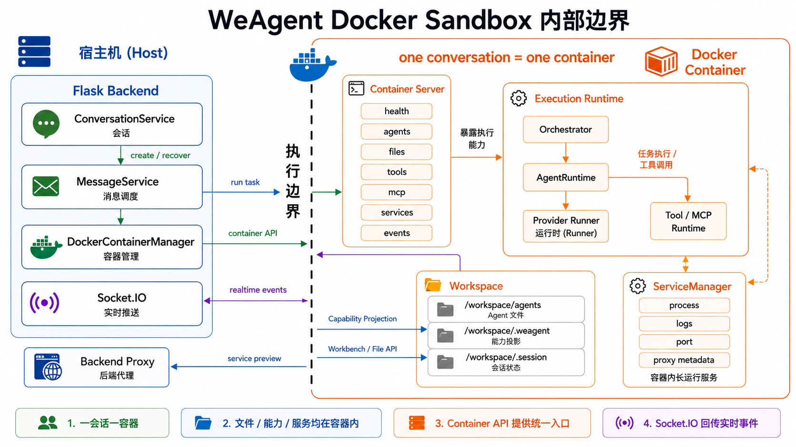
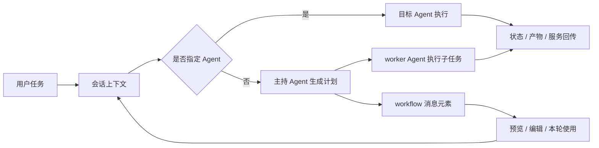
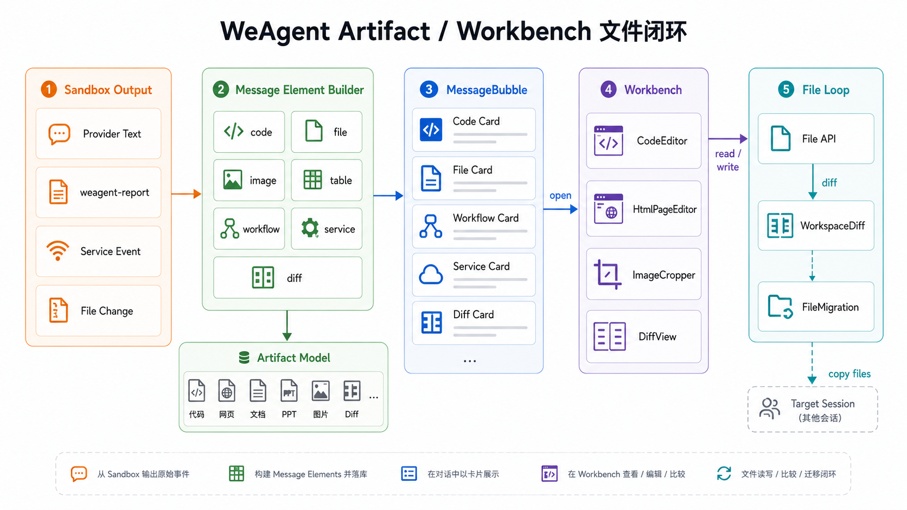
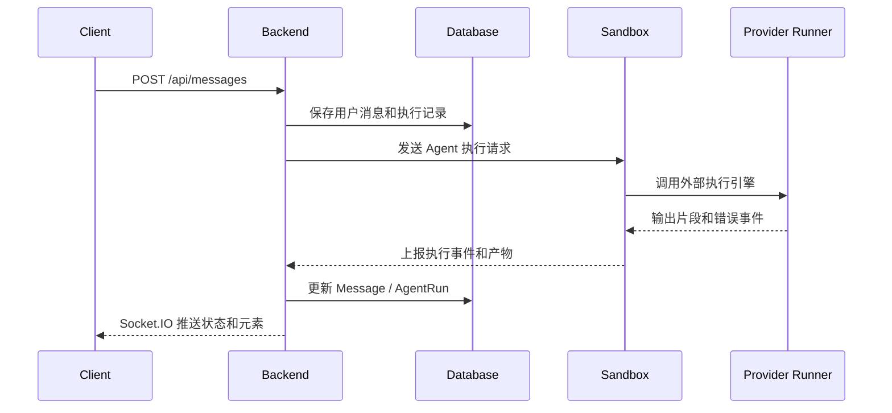
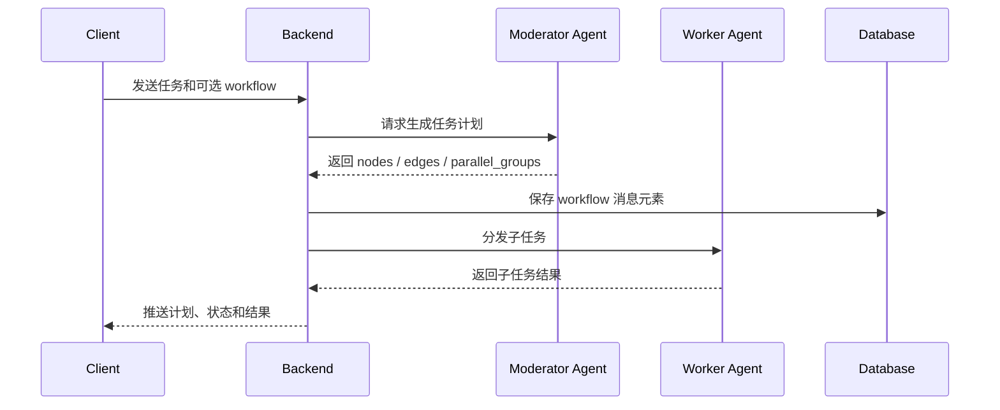
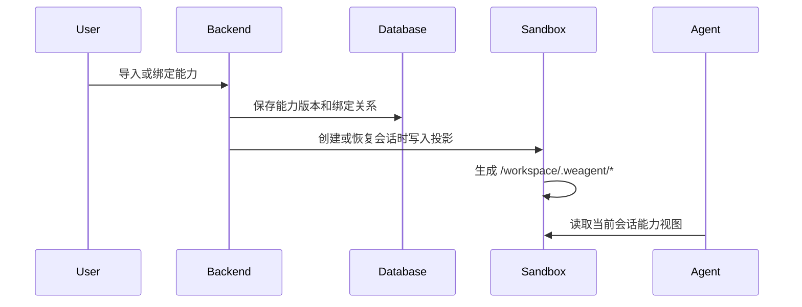
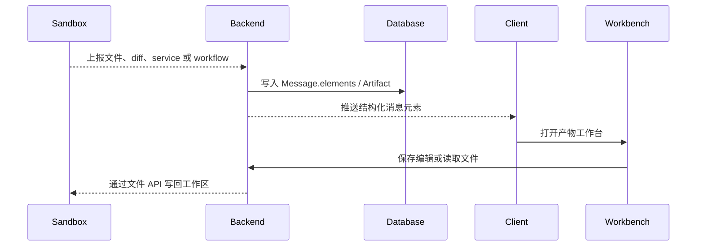
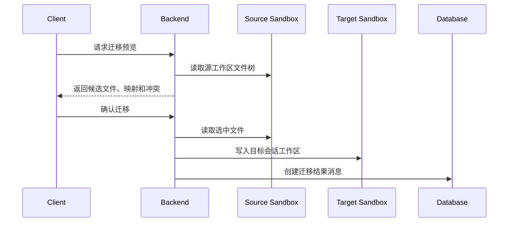
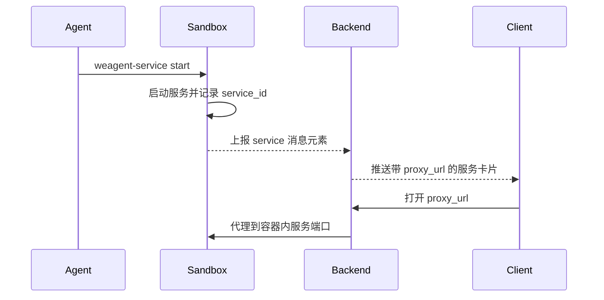
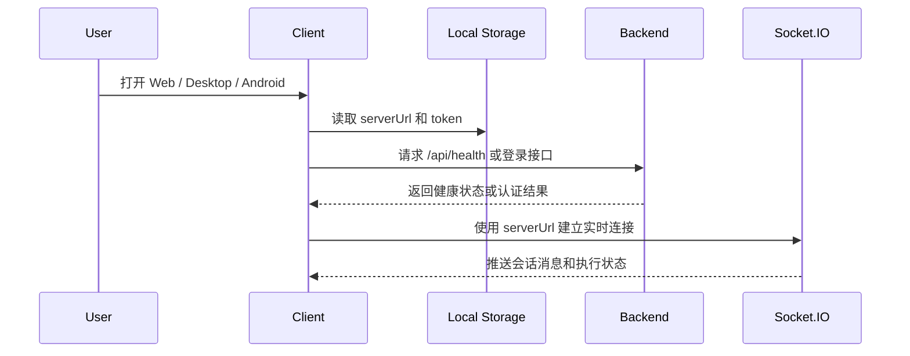

# WeAgent 技术文档 v2.2

更新日期：2026-06-10

## 1. 项目与文档范围

本章说明 WeAgent 是什么、项目包含哪些能力，以及本文档说明和不说明的内容。读者可以先通过这一章建立整体判断，再进入后面的技术栈、架构、模块和实现机制。

### 1.1 WeAgent 是什么

WeAgent 是面向 AI 协作任务的多端 Agent 工作台。它把自然语言任务、多个可配置智能体（Agent）、工具能力、运行产物和服务预览放在同一个会话空间中，让用户可以像聊天一样发起任务，同时看到任务如何被拆解、执行，并沉淀为文件、页面、工作流或可预览服务。

从技术实现看，WeAgent 以 Flask 后端为协调中心，以 Docker Sandbox 作为沙盒隔离边界，以 Agent、能力（Capability）和产物（Artifact）为核心抽象。用户通过 Web、桌面端或 Android 客户端发起任务；后端创建会话、调度 Agent、管理能力投影；容器内运行 Agent、工具协议、外部执行引擎和服务管理逻辑，再把执行进度、结构化产物和服务链接实时推送回客户端。

### 1.2 项目包含哪些能力

WeAgent 当前包含以下核心能力：

- 多端客户端：Web 是主功能基准，桌面端接近 Web，Android 承载移动端主流程。
- 会话式任务执行：用户通过消息发起任务，系统记录参与者、执行轮次、运行状态和结构化输出。
- 可配置 Agent：支持全局 Agent 管理，也支持只影响当前会话的 Agent 临时配置。
- 多 Agent 协作：主持 Agent 可以生成任务计划，再把子任务分配给其他 Agent 执行。
- 工具能力管理：Skill、Tool、MCP、Plugin 统一为能力，经过导入、审查、绑定和投影后进入运行环境。
- 产物沉淀：代码、文件、图片、表格、差异、工作流和服务预览都可以作为消息元素或产物进入会话。
- 沙盒隔离：Agent 任务在 Docker 容器内运行，后端负责容器管理、文件代理和实时事件回写。

### 1.3 本文说明哪些内容

本文说明 WeAgent 的真实技术栈、系统架构、核心模块、关键实现机制、关键数据流、开发者部署运行方式、验证路径、关键接口、数据模型、已知限制、常见故障和术语定义。

本文面向比赛评审、开发维护者和希望理解系统可信度的高级用户。产品介绍、用户操作手册和演示材料不在本文展开。

### 1.4 本文不说明哪些内容

本文不作为完整 API 手册，不逐字段列出数据库 ER 图，不覆盖所有 UI 交互细节，也不承诺代码中尚未确认的路线图功能。

本文会保留必要的代码路径，帮助读者定位实现位置；但不会把正文写成证据清单。需要审计实现时，应以代码、配置、测试和运行脚本为最终事实来源。

### 1.5 事实边界

正文以当前代码、配置、运行脚本、模型、路由、测试和已确认实现为准。不确定的信息标注为 `待确认`，不写成已完成能力。

v2.2 调整的是阅读顺序、图文组织、术语翻译和表达方式，不改变代码与已确认实现所定义的技术边界。

## 2. 相关技术栈

本章提供技术地图，帮助读者快速理解系统由哪些技术组成。这里不展开复杂机制，具体行为放到第 4 章和第 5 章说明。

### 2.1 客户端技术

客户端负责用户交互、会话展示、配置管理、产物查看和实时状态更新。

| 范围 | 关键技术 | 作用 |
| --- | --- | --- |
| Web | Vue 2.7、Vue Router、Vuex、Element UI、Axios、Socket.IO Client | 主功能基准，承载完整工作台能力。 |
| 桌面端 | Electron 29、Vite 5、Vue 2.7、Element UI、electron-builder | 提供桌面应用外壳和打包能力，连接外部后端。 |
| Android | Capacitor 6、Vite 5、Vue 2.7 | 通过移动端 WebView 承载登录、会话、Agent 和设置等主流程。 |

Web、桌面端和 Android 都通过 REST API 与后端交互，并通过 Socket.IO 接收实时消息。桌面端和 Android 需要配置 `serverUrl`，不会在本地内置后端。

### 2.2 服务端技术

服务端是 WeAgent 的控制面。它负责认证、会话、消息、Agent、产物、能力、容器代理和实时推送。

| 范围 | 关键技术 | 作用 |
| --- | --- | --- |
| HTTP API | Flask | 提供认证、会话、消息、Agent、产物、能力和沙盒代理接口。 |
| 实时通信 | Flask-SocketIO | 向客户端推送消息状态、执行步骤、产物元素和服务状态。 |
| 数据访问 | SQLAlchemy、PyMySQL | 管理数据模型，并连接 MySQL。 |
| 身份认证 | Flask-JWT-Extended | 处理登录态、访问令牌和受保护接口。 |
| 数据库迁移 | Flask-Migrate | 支持数据库结构演进。 |
| 业务组织 | controllers、services、models | 把路由、业务服务和数据模型分层组织。 |

关键入口包括 `backend/run.py`、`backend/app/__init__.py`、`backend/app/controllers/`、`backend/app/services/` 和 `backend/app/socket/events.py`。

### 2.3 沙盒与 Agent 运行技术

Agent 任务不直接在后端进程内运行，而是在 Docker Sandbox（基于 Docker 的沙盒隔离环境）中运行。这里的“沙盒”强调运行边界：文件、工具、服务端口和运行状态被限制在会话对应的容器内。

| 范围 | 关键技术 | 作用 |
| --- | --- | --- |
| 沙盒隔离 | Docker Sandbox | 为每个正式 Agent 会话提供容器边界，隔离文件、工具、服务端口和执行状态。 |
| 容器调度 | Orchestrator | 在容器内组织单 Agent 或多 Agent 的任务执行。 |
| Agent 运行 | AgentRuntime | 为单个 Agent 准备工作目录、提示词、运行器和输出采集。 |
| 外部执行引擎 | Provider Runner | 调用 Claude Code、Codex 或 OpenCode，并统一输出和错误格式。 |
| 产物上报 | `weagent-report` | 在容器内上报结构化进度和产物。 |
| 服务预览 | `weagent-service` | 在容器内启动服务、登记服务状态，并上报服务预览信息。 |

关键路径包括 `backend/app/sandbox/Dockerfile`、`backend/app/sandbox/host/`、`backend/app/sandbox/container/` 和 `backend/app/sandbox/container/providers/`。

### 2.4 数据与基础设施

WeAgent 的基础设施负责保存状态、支持实时运行和提供隔离环境。

| 范围 | 关键技术 | 作用 |
| --- | --- | --- |
| 持久化数据 | MySQL 8.0 | 保存用户、模型配置、Agent、会话、消息、产物和能力数据。 |
| 辅助服务 | Redis | 作为后端辅助基础设施。 |
| 容器运行 | Docker Desktop | 构建和运行 `weagent-sandbox:latest` 容器镜像。 |
| 前端构建 | Node.js / npm | 构建 Web、桌面端和 Android 客户端。 |
| 移动端构建 | Android Studio / Gradle | 构建和调试 Android 客户端。 |

## 3. 系统架构

本章说明 WeAgent 各层如何连接。客户端只负责交互，后端负责状态和调度，Docker Sandbox 负责沙盒隔离和任务运行，外部执行引擎负责完成具体 AI 任务。

### 3.1 总体架构

WeAgent 采用“多端客户端 + 后端服务 + 沙盒运行环境 + 外部执行引擎”的分层架构。


这张图适合先从左到右读：用户只面对 Web、桌面端和 Android；后端负责认证、会话、消息、Agent 和容器管理；容器内负责真实执行、工具调用和服务启动；右侧的消息元素、产物工作台、服务预览和实时事件是执行结果回到用户界面的方式。图底部的 MySQL、Redis、Docker Engine 和 Provider CLI 是系统运行依赖，不是用户直接操作的对象。

### 3.2 客户端层

客户端层负责登录、会话、消息、Agent 管理、工具能力、产物查看、服务卡片、工作流图和设置入口。客户端不直接管理 Docker，也不直接调用模型服务。

Web 是主功能基准，包含 Dashboard、会话、Agent 管理、Tools、Favorites、Settings、Artifact Workbench、文件迁移、服务面板和工作流图。桌面端通过 Electron 提供接近 Web 的桌面体验。Android 通过 Capacitor 承载移动端主流程，不写成 Web 和桌面端的完整替代。

多端能力的差异需要直接说明，避免读者误以为三个客户端完全等价。

| 客户端 | 当前定位 | 已确认能力 |
| --- | --- | --- |
| Web | 主功能基准 | Dashboard、会话、Agent 管理、Tools / Capability、Favorites、Settings、Artifact Workbench、文件迁移、服务面板、工作流图、Socket.IO 实时更新。 |
| Desktop | 接近 Web 的桌面迁移版本 | 独立 `ServerSetup`、会话、Agent、Favorites、Tools、Settings、工作目录、上传、会话内搜索、历史、会话级 Agent 配置、产物、日志和工作流图。 |
| Android | 移动端主流程版本 | `ServerSetup`、登录 / 注册、会话、Agent、Settings、移动端 Agent 编辑、基础产物展示和后端地址守卫。 |

Android 不写成 Web / Desktop 的全量等价端。服务日志、工作流编辑、文件迁移等高密度工作台能力以 Web / Desktop 为准。

### 3.3 服务端层

服务端层是控制面，负责把用户操作转成可持久化、可调度、可推送的系统事件。

服务端主要处理：

- 用户认证和模型配置。
- 会话、参与者、消息和执行记录。
- Agent 管理和会话级配置上下文。
- 产物和消息元素。
- 能力导入、审查、绑定和投影。
- Sandbox session 创建、恢复、停止和代理。
- Socket.IO 实时状态推送。

服务端不直接在宿主机执行 Agent 任务。真实执行进入容器后，由容器内运行时和外部执行引擎完成。

### 3.4 沙盒隔离层

沙盒隔离层指 Docker Sandbox 承担的运行边界。一个正式 Agent 会话会绑定一个 sandbox session，容器内保存工作区、Agent 运行状态、能力投影、事件日志和服务日志。这一层不仅负责运行任务，更重要的是把文件、工具、服务端口和会话状态限制在清晰的容器边界内。

容器内主要包含：

- 容器 API：向后端提供健康检查、Agent、文件、工具、MCP、服务和事件接口。
- AgentRuntime：为单个 Agent 准备工作目录、提示词、运行器和输出采集。
- 工具运行时：执行 Tool 和 MCP 能力。
- 服务管理器：启动、停止、重启容器内长运行服务，并提供日志。
- 工作区：保存 Agent 生成、修改和读取的文件。

### 3.5 外部能力适配层

外部能力适配层负责把不同执行引擎、工具协议和服务输出统一成平台可理解的事件。

Claude Code、Codex 和 OpenCode 的命令、认证方式和输出格式不同。WeAgent 通过 Provider Runner 屏蔽这些差异，让上层看到统一的执行事件、输出内容、错误状态和产物上报。

同样，Skill、Tool、MCP 和 Plugin 会先被统一成能力，再按 Agent 绑定关系投影到容器内。这样 Agent 看到的是当前会话允许使用的能力，而不是全局工具库。

## 4. 核心模块

本章说明系统有哪些主要组成部分。这里使用表格是为了让读者快速看清“谁负责什么、边界在哪里、读代码时先看哪里”。表格不是接口清单，而是模块地图：读者先通过一句话理解模块职责，再进入第 5 章看它们如何协作。

### 4.1 客户端模块

客户端模块负责把会话、配置、产物和实时状态组织成用户可操作的界面。它面对的是人：用户在这里创建任务、选择 Agent、查看进度、编辑产物、打开服务预览。客户端不直接运行 Agent，也不直接访问容器文件系统；它通过后端 API 和实时事件把复杂执行过程呈现出来。

| 模块 | 一句话说明 | 主要实现 |
| --- | --- | --- |
| 登录与连接配置 | 负责用户进入系统，并确定客户端连接哪个后端地址。 | `frontend/src/`、`clients/desktop/src/views/ServerSetup.vue`、`clients/android/src/views/ServerSetup.vue` |
| 会话列表与详情 | 负责展示历史会话、收藏状态、当前会话和参与者。 | `frontend/src/views/Dashboard.vue`、`clients/desktop/src/views/Conversations.vue` |
| 消息输入与展示 | 负责发送任务、展示用户消息、执行状态和结构化输出。 | `frontend/src/components/ChatWindow/index.vue`、`frontend/src/components/MessageBubble/index.vue` |
| Agent 管理 | 负责全局 Agent 配置和当前会话内的临时调整。 | `frontend/src/views/AgentManager.vue`、`frontend/src/components/AgentEditForm/index.vue` |
| 工具能力管理 | 负责查看、导入、绑定和审查工具能力。 | `frontend/src/views/Tools.vue`、`backend/app/controllers/capability_controller.py` |
| 产物与工作台 | 负责展示和编辑 Agent 生成的文件、网页、代码、图片和差异。 | `frontend/src/components/ArtifactWorkbench/` |
| 工作流展示 | 负责把多 Agent 任务计划展示为可预览、可编辑、可复用的图。 | `frontend/src/components/ChatWindow/index.vue`、`clients/desktop/src/views/Conversations.vue` |
| 收藏、搜索与历史 | 负责会话收藏、会话检索、消息搜索和历史问题入口。 | `frontend/src/views/Favorites.vue`、`clients/desktop/src/views/Favorites.vue` |
| 设置与说明入口 | 负责模型配置、个人信息和内置说明内容。 | `frontend/src/views/Settings.vue` |

Agent 管理页面本身负责分类、卡片、拖拽移动、创建、编辑和只读系统 Agent 查看。全局收藏检索属于 Favorites 页面，会话内搜索属于 ChatWindow 或 Conversations 的消息面板。

### 4.2 服务端模块

服务端模块是 WeAgent 的控制面。它一边承接客户端请求，一边管理数据库状态、容器会话和实时事件；它本身不直接执行模型任务，而是把任务路由到容器，并把容器返回的事件整理成前端能理解的消息状态和产物元素。

| 模块 | 一句话说明 | 主要实现 |
| --- | --- | --- |
| 认证与用户 | 负责用户身份、登录状态和访问控制。 | `backend/app/controllers/auth_controller.py` |
| 模型配置 | 负责保存用户可用的模型提供方和运行参数。 | `backend/app/controllers/settings_controller.py`、`backend/app/services/settings_service.py` |
| 会话与参与者 | 负责保存会话、用户和 Agent 之间的参与关系。 | `backend/app/models/conversation.py`、`backend/app/services/conversation_service.py` |
| 消息与执行轮次 | 负责记录用户消息、Agent 消息和执行状态。 | `backend/app/models/message.py`、`backend/app/models/agent_run.py` |
| Agent 管理 | 负责保存全局 Agent 配置并提供会话调度上下文。 | `backend/app/models/agent.py`、`backend/app/controllers/agent_controller.py` |
| 产物与消息元素 | 负责把执行结果沉淀成可展示、可编辑的结构化产物。 | `backend/app/models/artifact.py`、`backend/app/services/message_element_builder.py` |
| 工具能力投影 | 负责把能力配置转成容器内可读取的文件和运行信息。 | `backend/app/services/capability_projection_service.py` |
| 容器管理与代理 | 负责创建、恢复、停止容器并代理容器内接口。 | `backend/app/sandbox/host/manager.py`、`backend/app/sandbox/api/routes.py` |
| 实时事件推送 | 负责把容器事件转换成前端能消费的消息更新。 | `backend/app/services/sandbox_event_bridge.py`、`backend/app/socket/events.py` |

### 4.3 沙盒运行模块

沙盒运行模块负责把“用户在会话里发起的任务”变成“容器内可安全运行的工作”。它提供三层边界：宿主侧只负责创建和代理容器；容器接口负责暴露 Agent、文件、工具、服务和事件入口；容器内部运行时负责真正调用外部执行引擎、访问工具协议、写入工作区并上报结果。这样设计后，后端可以管理执行过程，但不会把 Agent 产生的文件、服务端口和工具运行状态混到宿主机项目目录里。

| 模块 | 一句话说明 | 主要实现 |
| --- | --- | --- |
| 宿主侧管理 | 负责创建、恢复、停止和查询容器。 | `backend/app/sandbox/host/manager.py` |
| 容器接口 | 负责向后端提供任务、文件、工具、服务和事件接口。 | `backend/app/sandbox/container/server.py` |
| 任务调度器 | 负责在容器内组织一次会话任务的执行过程。 | `backend/app/sandbox/container/orchestrator.py` |
| Agent 运行上下文 | 负责单个 Agent 的工作目录、配置、输入和输出。 | `backend/app/sandbox/container/agent.py` |
| 执行引擎运行器 | 负责调用 Claude Code、Codex、OpenCode 并统一输出。 | `backend/app/sandbox/container/providers/` |
| 工具协议运行时 | 负责在容器内执行工具和 MCP 能力。 | `backend/app/sandbox/container/mcp_runtime.py` |
| 服务管理 | 负责启动、停止、查询容器内服务并收集日志。 | `backend/app/sandbox/container/service_manager.py` |
| 工作区 | 负责保存文件、能力投影和会话状态。 | `/workspace/agents`、`/workspace/.weagent`、`/workspace/.session` |

### 4.4 数据模块

数据模块负责把一次 AI 协作任务拆成可恢复的系统状态。用户、模型配置、Agent、会话、参与者、消息、运行记录、产物和能力不是孤立表；它们共同回答四个问题：谁发起了任务，哪些 Agent 参与，执行到了什么状态，产物和工具调用如何追踪。

| 模型 | 一句话说明 |
| --- | --- |
| User | 保存用户身份和基础信息。 |
| UserModelConfig | 保存用户可用的模型提供方、密钥和默认模型。 |
| Agent | 保存全局 Agent 配置。 |
| Conversation | 保存会话、容器会话、端口、状态和最后活跃时间。 |
| ConversationParticipant | 保存用户或 Agent 与会话之间的参与关系。 |
| Message | 保存用户消息、Agent 消息、结构化元素和执行元数据。 |
| AgentRun | 保存一次 Agent 执行的状态。 |
| Artifact | 保存代码、网页、文档、差异等产物。 |
| Capability | 统一保存 Skill、Tool、MCP 和 Plugin 能力。 |
| CapabilityVersion | 保存能力的不可变版本。 |
| AgentCapabilityBinding | 保存 Agent 与能力之间的绑定关系。 |
| CapabilityCallRecord | 保存能力调用记录，用于审查和追踪。 |

## 5. 核心技术实现

本章说明 WeAgent 最重要的工程机制。标题尽量使用读者能直接理解的表达，专有名称放在正文中解释。

### 5.1 消息通信与实时推送

WeAgent 使用 REST API 处理确定性操作，使用 Socket.IO 推送会话中的实时状态。这样用户发送消息后，不需要等待一次 HTTP 响应结束，前端可以持续收到执行进度、输出片段、产物元素和服务状态。

REST API 主要负责登录、会话、消息、配置、文件、产物、能力和容器代理。Socket.IO 主要负责进入会话 room、发送消息、推送消息创建、推送执行状态、推送步骤事件和推送结构化元素。

关键事件包括：

| 类型 | 事件或接口 | 作用 |
| --- | --- | --- |
| 连接事件 | `connect`、`join`、`leave` | 客户端进入或离开会话 room。 |
| 消息创建 | `conversation_message_created` | 用户消息、Agent 消息或迁移结果消息创建后推送。 |
| 执行状态 | `conversation_message_status`、`conversation_message_step` | 推送 `streaming`、`done`、`error` 和步骤状态。 |
| 计划事件 | `conversation_run_plan` | 多 Agent 主持人计划生成后推送。 |
| 元素增量 | `conversation_message_element_stream` | 文件、服务、差异、工作流等结构化产物追加时推送。 |
| 降级读取 | `GET /api/messages/stream/<conversation_id>`、`GET /api/messages/poll/<conversation_id>` | 为非 Socket.IO 场景提供 SSE 或轮询读取路径。 |

相关实现集中在 `backend/app/socket/events.py`、`backend/app/services/message_service.py`、`backend/app/services/sandbox_event_bridge.py` 和前端消息组件。

### 5.2 沙盒运行机制

Docker Sandbox 是 WeAgent 的沙盒运行边界。后端负责创建和管理容器，容器负责运行 Agent、读写工作区文件、调用工具协议、启动服务，并把事件回传给后端。



读这张图时可以把虚线当作沙盒边界：左侧 Flask Backend 在宿主机上管理会话、消息、容器和实时推送；右侧 Docker Container 内部运行 Container Server、Agent 运行时、工作区和服务管理器。所有文件、能力投影和服务状态都落在容器内，后端通过容器 API 访问它们，前端不直接进入容器文件系统。

一个正式 Agent 会话会绑定一个 sandbox session。容器通过 label 记录 `weagent.session_id`，后端可以通过 label 和端口映射恢复已有 session。容器启动后会暴露内部控制接口，供后端管理 Agent、文件、工具、MCP、服务和事件。

容器内工作区主要分为三类：

| 路径 | 内容 | 作用 |
| --- | --- | --- |
| `/workspace/agents/` | Agent 工作区文件 | 存放 Agent 创建、修改和读取的项目文件。 |
| `/workspace/.weagent/` | 能力投影 | 保存当前会话可用的 Skill、Tool、MCP 和 Plugin 视图。 |
| `/workspace/.session/` | 会话运行状态 | 保存 Agent 配置、对话历史、事件、进度和服务日志。 |

文件访问通过 Sandbox API 完成。前端不直接读取容器文件系统，后端通过宿主侧管理器调用容器接口，再把文件树、raw file、download、write 和 migration 结果返回给前端。

容器接口不是面向用户的公开 API，而是后端管理沙盒运行环境的内部控制面。它把容器内正在发生的任务执行、文件变化、工具调用和服务状态转换为后端可以管理的结构化状态。

| 接口组 | 解决的问题 |
| --- | --- |
| `/api/health` | 检查容器内控制面是否启动，供后端判断 session 是否可用。 |
| `/api/agents/*` | 创建、删除、重启、停止 Agent，读取 Agent 历史、进度和事件。 |
| `/api/files/*` | 读取文件树、raw file、下载、写入文件，为工作台、附件和迁移提供底层能力。 |
| `/api/tools/*` | 管理容器内工具注册和旧 Tool 调用入口。 |
| `/api/mcp/*` | 启动 MCP server、列出工具、调用 MCP tool、停止 MCP runtime。 |
| `/api/services/*` | 启动、停止、重启、代理和读取容器内长运行服务日志。 |
| `/api/report` / `/api/events` | 接收 Agent 主动上报的产物和执行事件，再由后端写入消息并推送给客户端。 |

容器端口分为两类：控制面端口用于后端管理 Agent、文件、工具、MCP 和服务；开发服务端口用于 Agent 启动 Web 服务后生成预览链接。

### 5.3 外部执行引擎适配

外部执行引擎适配机制负责把 Claude Code、Codex 和 OpenCode 统一成同一种运行协议。Agent 配置中保存适配类型，容器内根据配置选择对应运行器，再把 API Key、Base URL、模型名和工作目录注入沙盒运行环境。

运行器的职责不是决定任务由谁执行，而是封装具体 CLI 的命令格式、环境变量、输出解析、错误识别和停止行为。任务分配发生在后端消息服务和容器内调度器之间。

关键边界如下：

| 配置或组件 | 作用 |
| --- | --- |
| `Agent.adapter_name` | 全局 Agent 默认执行引擎。 |
| 会话级 `adapter_name` | 当前会话内的适配器名称快照，只随本轮 payload 生效。 |
| `ProviderRunnerFactory` | 把 `claude`、`claude_code`、`codex`、`opencode` 映射为具体运行器。 |
| `settings_service` | 把模型配置转换为容器运行需要的环境变量。 |

Provider 事件包括 `provider_started`、`provider_output_delta`、`provider_error_delta`、`provider_output`、`provider_error` 和 `provider_stopped`。这些事件进入后端后，会被写入消息、运行记录和实时推送。

### 5.4 Agent 执行、事件与产物上报

Agent 执行不是简单返回一段文本，而是一组可持久化、可追踪、可展示的结构化事件。


这张图展示了 Agent 执行的主链路：用户消息、`@Agent`、会话级配置和工作流选择先进入消息服务；消息服务决定是单 Agent 直接执行，还是多 Agent 先进入主持 Agent；容器内每个 AgentRuntime 再通过 Provider Runner 调用外部执行引擎。右侧的状态、文本、产物、服务和工作流计划会通过实时事件回到会话界面。

一次典型执行包括以下阶段：

1. 客户端发送用户消息。
2. 后端写入用户 `Message`。
3. 后端根据会话参与者、目标 Agent、会话级配置和工作流上下文选择执行路径。
4. 后端创建 Agent 占位消息和 `AgentRun`。
5. 容器内 AgentRuntime 调用对应外部执行引擎。
6. 容器通过事件、`weagent-report` 或 `weagent-service` 上报输出、文件、服务和工作流。
7. `SandboxEventBridge` 更新消息、运行记录、产物元素和 Socket.IO 事件。
8. 前端收到进度、Raw Output、产物卡片、服务入口和错误提示。

`Message` 保存用户或 Agent 的内容、状态、结构化元素、`artifact_id`、`round_id`、`run_id`、`raw_output` 和 `meta`。`AgentRun` 保存一个 Agent 在一轮会话中的执行状态，包括 `pending`、`running`、`done`、`error` 和 `stopped`。

`round_id` 表示一次用户任务触发的执行轮次，`run_id` 把 Agent 回复消息和对应的 `AgentRun` 连接起来。这个设计让前端看到的是一轮会话，后端可以追踪多个 Agent 的执行状态。

从实现链路看，Agent 执行可以按以下阶段理解：

| 阶段 | 发生什么 |
| --- | --- |
| 创建会话 | 后端根据参与者创建会话，自动补充主持 Agent，并为 Agent 会话创建 sandbox session。 |
| 组装 Agent 配置 | 后端从全局 Agent、参与者信息和用户模型配置生成容器需要的 Agent 配置。 |
| 建立沙盒边界 | 宿主侧管理器创建或恢复会话容器，并把 Agent 配置和能力投影写入容器。 |
| 接收用户消息 | 消息服务写入用户消息，解析目标 Agent、会话级配置和工作流图。 |
| 选择执行路径 | 单 Agent 直接执行；多 Agent 先由主持 Agent 计划，再调度 worker Agent。 |
| 容器内执行 | 容器内调度器创建 Agent 运行上下文，并选择 Claude Code、Codex 或 OpenCode 运行器。 |
| 回传结果 | Provider 输出和 sandbox events 经事件桥接写入消息状态、元素和 Socket.IO。 |

`SandboxEventBridge` 是容器事件回到会话系统的入口。它接收 provider chunk、工具事件、report、service、workflow、停止和错误事件，然后更新 `Message`、`AgentRun`、`Artifact`，并通过 Socket.IO 推送给会话中的客户端。这个组件让“容器里发生的执行事件”变成“会话里可观察、可恢复、可复用的消息状态”。

### 5.5 多 Agent 协作与流程展示

多 Agent 协作的核心是主持 Agent 的任务拆解和执行调度，而不是多个 Agent 同时输出聊天内容。用户可以直接指定目标 Agent；如果没有指定，系统会让主持 Agent 先生成计划，再把子任务分配给 worker Agent。



读图方式：左侧是用户输入和会话上下文，中间是调度决策，右侧是执行结果和工作流复用。`workflow` 不是全局 Agent 配置，而是本轮会话中的调度上下文；用户可以预览、编辑、复制并选择它作为下一轮任务的计划约束。

工作流图有两条来源：主持 Agent 生成的 plan，以及容器文件中的 `moderator-plan.json`。后端会把这些内容转换成 `workflow` 消息元素。前端支持从消息卡片预览工作流，也支持在工作流面板中新建节点、连接节点、删除节点、编辑节点标题 / 指令 / Agent，并在图形视图和 JSON 视图之间切换。

用户保存并使用当前工作流后，客户端会把它作为下一轮消息的 `workflow` payload 发送。后端把它转换为 `SELECTED_WORKFLOW_JSON`，提示主持 Agent 优先按照该工作流进行任务分配。

### 5.6 工具能力管理

工具能力管理把 Skill、Tool、MCP 和 Plugin 统一成可版本化、可绑定、可投影、可审查的能力。


这张图展示了能力从产品管理到运行时读取的路径：用户在 Tools UI 中导入、预览、审查并绑定能力；后端能力 API 保存版本、资产、绑定和调用记录；会话创建或恢复时，能力被投影到容器内的 `.weagent` 目录；AgentRuntime 读取当前会话可用能力，再调用 Tool 或 MCP。底部 MySQL 区域表示能力元数据和审计记录会被持久化。

能力不是创建后就对所有 Agent 可用。它需要先进入能力库，再被绑定到具体 Agent，最后在创建或恢复会话时投影到 `/workspace/.weagent/*`。容器内 Agent 读取的是当前 session 的能力视图，而不是全局能力库。

导入流程包含预览和确认两步。Tools UI 支持从 Markdown、zip bundle、npx 和 MCP manifest 导入能力。导入时先调用预览接口生成候选能力和安全审查结果，再调用确认接口写入能力库。高风险导入需要显式确认和原因说明。

能力系统的主要对象包括：

| 对象 | 作用 |
| --- | --- |
| Capability | 保存 Skill、Tool、MCP、Plugin 的统一定义。 |
| CapabilityVersion | 保存能力的不可变版本。 |
| AgentCapabilityBinding | 保存 Agent 与能力版本之间的绑定关系。 |
| CapabilityCallRecord | 保存 Tool 或 MCP 的真实调用记录。 |
| CapabilitySecurityAudit | 保存导入或草稿阶段的风险审查结果。 |

这个设计把“平台知道哪些能力”和“当前 Agent 在当前会话能用哪些能力”分开，便于权限控制、调用追踪和安全审查。

投影写入后，容器内会生成 capabilities index、agent view、skill index、tool index、permissions、Skill 文件、MCP manifest、Plugin manifest 和 Tool manifest。Agent 在执行时读取这些 session-local 文件，因此同一个能力可以在不同 Agent、不同会话里有不同的可用边界。

Tools 页面还提供安全审计和 Provider 配置相关入口。安全审计关注 `risk_level`、`inferred_permissions`、`risk_items`、`override_reason` 等字段；Provider 配置支持保存、测试、启用、停用和删除，用于让能力调用和外部服务连接保持可追踪。

### 5.7 多类型产物预览与编辑

WeAgent 把 Agent 输出拆成结构化消息元素，而不是把所有内容都塞进纯文本。这样代码、文件、图片、表格、服务、差异和工作流可以分别用合适的卡片展示。



这张图把产物链路拆成五步：容器先产生 provider 文本、上报事件、服务事件或文件变化；后端把它们构造成消息元素和 Artifact；前端用消息卡片展示；用户需要继续处理时进入 Workbench；文件编辑、diff 和文件迁移再通过文件 API 回到容器工作区。

`Message.elements` 承载结构化内容，当前包括 progress、result、error、file、image、table、summary、service、diff、workflow 等类型。`Artifact` 保存可复用产物，支持 code、webpage、document、ppt 和 diff 等类型。

产物系统分为两层：

- 消息元素负责表达“这条消息里有什么结果”。
- 工作台负责表达“这个结果如何继续查看、编辑、比较或迁移”。

Artifact Workbench 集成代码编辑、HTML 页面编辑、图片裁剪和差异展示。文件迁移通过 `FileMigrationDialog` 进入，分为 preview 和 migrate 两步：preview 只计算候选文件、路径映射、冲突和跳过项；migrate 才复制文件，并在目标会话写入迁移结果消息。

文件迁移只复制工作区文件，不复制旧聊天记录和旧 artifact 卡片。这个边界有助于避免把历史会话状态错误地混入新会话。

用户在前端看到的产物类型与系统内部处理关系如下：

| 用户看到 | 系统实际处理 |
| --- | --- |
| 代码卡片 | `Message.elements` 中的 `code` 被消息组件分组展示，并可进入工作台继续编辑。 |
| 文件 / 图片卡片 | `file`、`image` 元素保留路径、文件名、大小和预览信息。 |
| 表格 | `table` 元素保留列和行，前端按表格展示。 |
| 服务卡片 | `service` 元素携带 `service_id`、端口、状态和 `proxy_url`。 |
| Diff 卡片 | `diff` 元素携带变更前后内容或摘要，可进入差异查看和撤销链路。 |
| 工作流卡片 | `workflow` 元素展示节点和连线，并触发会话工作流预览。 |

文件迁移的实现路径也保留两步边界：用户先选择目标会话和文件，后端通过 `migrate-preview` 计算候选文件、路径映射、冲突和跳过项；用户确认后再调用 `migrate` 复制文件，并在目标会话创建迁移结果消息。

### 5.8 服务预览链路

服务预览链路把容器内启动的开发服务变成用户可打开的链接。


这张图强调两个边界：服务只在 Docker Sandbox 内运行，用户不要直接访问容器端口；后端生成 `proxy_url` 并控制访问边界，前端只展示预览、日志、重启和停止等操作入口。这样 Agent 可以启动本地开发服务，用户仍然通过统一的后端代理访问。

Agent 在容器内调用 `weagent-service start`，传入端口、命令、工作目录和服务名称。容器内服务管理器启动进程，记录 `service_id`、端口、命令、cwd、状态和日志路径。随后 `weagent-service` 通过报告接口上报 `type=service` 产物，使会话消息出现服务卡片。

用户看到的链接不是容器内 `localhost`，而是后端生成的带 token 的 `proxy_url`。访问时，host backend 先校验 session、service 和 token，再转发到容器内服务端口。这个拆分避免直接暴露容器端口。

服务面板支持服务列表、启动服务、打开链接、复制链接、查看日志、重启和停止。服务日志来自容器内 `/workspace/.session/services/<service_id>/`，前端读取的是后端整理后的日志尾部。

服务预览链路可以拆成六个阶段：

| 阶段 | 发生什么 |
| --- | --- |
| Agent 启动服务 | Agent 在容器内调用 `weagent-service start`，传入端口、命令、工作目录和名称。 |
| 容器内登记服务 | Container server 调用服务管理器启动进程，记录 `service_id`、端口、命令、cwd、状态和日志路径。 |
| 上报服务产物 | `weagent-service` 通过 `/api/report` 上报 `type=service`，使会话消息出现服务卡片。 |
| 补全预览链接 | 后端为 service 生成带 token 的 `proxy_url`，事件桥接写回消息元素。 |
| 用户打开预览 | 浏览器访问后端代理路径，后端再转发到容器服务端口。 |
| 查看日志和控制服务 | 前端调用 services API 获取列表、日志、stop、restart 和 token。 |

代理路径形如 `/api/sandbox/sessions/<session_id>/services/<service_id>/proxy/<path>`。Host backend 负责校验 session、service 和 token，container server 负责把请求转给容器内真实服务。这个拆分避免把容器服务端口直接暴露给用户。

### 5.9 会话级 Agent 配置合并

会话级 Agent 配置用于临时调整当前会话中的 Agent 行为，不修改全局 Agent。

Web 端使用 `weagent.web.sessionAgentConfigs.<conversation_id>` 保存本地配置，桌面端使用 `weagent.desktop.sessionAgentConfigs.<conversation_id>`。发送消息时，客户端把配置组装到 `agent_configs` payload，后端把它追加到用户消息上下文。

可覆盖字段包括：

| 字段 | 作用 |
| --- | --- |
| `role` | 当前会话内的 Agent 角色名。 |
| `system_prompt` | 当前会话内覆盖提示词。 |
| `skill` | 当前会话内工作方式说明。 |
| `enabled` | 多 Agent 会话中是否允许分配任务。 |
| `adapter_name` | 会话配置中的执行引擎名称快照。 |

后端会明确把这些内容写成“只对当前会话调度生效”的上下文，不回写全局 Agent 配置。这就是全局 Agent 管理和会话级临时调整之间的技术边界。

### 5.10 安全边界与错误处理

WeAgent 的安全边界主要来自容器隔离、能力绑定、文件代理和错误状态回写。

容器隔离让 Agent 的文件、工具、服务和运行状态集中在 sandbox session 内。前端不直接访问容器文件系统，也不直接访问容器服务端口；文件和服务都通过后端代理。

能力系统通过导入审查、版本绑定、授权权限和调用记录控制工具使用范围。Agent 只能读取当前 session 投影出的能力视图。

错误处理会进入消息和运行记录，而不是只出现在后端日志中。Provider 错误、容器错误、服务代理错误和停止事件都需要更新 `Message`、`AgentRun` 和前端状态，保证用户能看到失败原因和恢复入口。

## 6. 关键数据流

本章用多张时序图说明系统如何运行。时序图的数量按关键链路决定，不强行限制；限制的是每张图的参与者数量。每张图的参与者应少于 8 个，避免把客户端、后端、数据库、容器、执行引擎、工具、产物和服务全部塞进同一张图。每张图后都配有读图说明，帮助读者理解关键状态在哪里变化。

### 6.1 用户消息到 Agent 响应

这条链路说明一条用户消息如何进入后端、触发容器执行，并通过实时事件回到客户端。它是 WeAgent 最基本的任务执行路径。



读图说明：

- 后端先保存用户消息和执行记录，再把任务交给容器，这样失败时仍然能追踪任务状态。
- Provider Runner 的输出不会直接返回给前端，而是先回到 Sandbox，再由后端写入 `Message` 和 `AgentRun`。
- 前端收到的进度来自 Socket.IO，因此可以看到执行中状态、输出片段、产物元素和错误提示。

### 6.2 多 Agent 协作与工作流

这条链路说明主持 Agent 如何生成计划，并把子任务分配给其他 Agent。它对应用户没有指定单一 Agent、需要平台自动拆解复杂任务的场景。



读图说明：

- 主持 Agent 负责生成任务计划，worker Agent 负责执行子任务。
- `workflow` 消息元素保存的是本轮计划，不是全局配置。
- 用户可以在前端预览、编辑、复制并选择工作流，让下一轮任务按该计划继续执行。

### 6.3 能力投影到沙盒

这条链路说明能力如何从配置进入容器。核心原则是 Agent 不直接访问全局能力库，而是读取当前会话的能力投影视图。



读图说明：

- 用户导入或绑定能力后，后端先保存版本、资产、绑定和审计信息。
- 创建或恢复会话时，后端把当前 Agent 可用能力写入容器内 `/workspace/.weagent/*`。
- Agent 运行时读取的是 session-local 能力视图，因此可以限制不同 Agent、不同会话的能力边界。

### 6.4 产物生成、展示与编辑

这条链路说明 Agent 输出如何变成消息元素，并进入工作台继续编辑。它解释“为什么输出不是只有一段文本”。



读图说明：

- Sandbox 上报的是文件、diff、service、workflow 等结构化事件。
- 后端把事件转换为 `Message.elements` 和 `Artifact`，前端再按类型展示为不同卡片。
- 工作台不绕过后端直接写容器文件，而是通过文件 API 读写工作区。

### 6.5 文件迁移

这条链路说明用户如何把一个会话中的工作区文件迁移到另一个会话。它只迁移工作区文件，不迁移旧聊天记录和旧产物卡片。



读图说明：

- preview 阶段只读取文件树并计算候选文件、路径映射、冲突和跳过项。
- migrate 阶段才复制文件到目标会话的工作区。
- 迁移完成后，后端会在目标会话创建迁移结果消息，让用户知道哪些文件已进入新会话。

### 6.6 服务启动、代理与预览

这条链路说明容器内服务如何变成用户可打开的预览链接。它强调用户访问的是后端代理 URL，不是容器内原始端口。



读图说明：

- Agent 通过 `weagent-service start` 启动容器内服务，并登记 `service_id`、端口和日志。
- 后端为服务生成带 token 的 `proxy_url`，前端用服务卡片展示预览、日志、重启和停止入口。
- 代理层负责 session、service 和 token 校验，避免把容器端口直接暴露给用户。

### 6.7 多端连接后端

这条链路说明 Web、桌面端和 Android 如何连接同一个后端。它主要用于解释桌面端和移动端为什么需要 `serverUrl`。



读图说明：

- Web 通常连接当前开发或部署后端；桌面端和 Android 会先读取本地保存的 `serverUrl`。
- 真机 Android 访问电脑后端时不能填写手机自身的 `localhost`，应使用电脑局域网 IP 或公网地址。
- REST API 和 Socket.IO 都应基于同一个后端地址，否则会出现页面能登录但收不到实时进度的情况。

## 7. 开发者部署、运行与验证

本章由源文档的部署运行和验证路径合并而来。目标是让开发者知道如何启动、构建和验证，而不是把运行步骤和验证步骤分散到两处。

### 7.1 环境要求

开发环境需要准备：

- Python 3.10+
- Node.js 18+
- MySQL 8.0+
- Redis，建议 Redis 7.x
- Docker Desktop
- Android Studio / Gradle，只有构建 Android 时需要

### 7.2 后端启动

以下命令用于创建 Python 虚拟环境、安装依赖并启动后端。

```powershell
cd backend
python -m venv venv
.\venv\Scripts\Activate.ps1
pip install -r requirements.txt
Copy-Item .env.example .env
python run.py
```

预期结果：后端默认监听 `5002` 端口。启动前需要把 `backend/.env` 中的 MySQL、Redis 和密钥配置改成可用值。

最小 `.env` 示例用于说明必填配置形状。

```env
FLASK_ENV=development
MYSQL_HOST=localhost
MYSQL_PORT=3306
MYSQL_USER=root
MYSQL_PASSWORD=your_password_here
MYSQL_DB=weagent
REDIS_HOST=localhost
REDIS_PORT=6379
REDIS_DB=0
REDIS_PASSWORD=
JWT_SECRET_KEY=change-this-to-a-random-secret-key
SECRET_KEY=change-this-to-another-random-key
```

注意事项：不要把示例密钥用于真实部署。

### 7.3 Web 前端启动

以下命令用于启动 Web 工作台开发服务。

```powershell
cd frontend
npm install
npm run serve
```

预期结果：Vue CLI 开发服务启动，通常可通过 `http://localhost:8080` 访问。

### 7.4 桌面端启动与构建

以下命令用于启动 Electron Desktop 开发环境。

```powershell
cd clients/desktop
npm install
npm run dev
```

预期结果：Vite dev server 启动后 Electron 窗口打开。首次使用需要配置后端 `serverUrl`。

以下命令用于构建桌面端安装包。

```powershell
npm run electron:build
```

预期结果：构建产物输出到 `clients/desktop/release/`。由于桌面端使用 Vite 5，建议使用 Node.js 18+。

### 7.5 Android 启动与构建

以下命令用于构建 Android 客户端并同步 Capacitor 工程。

```powershell
cd clients/android
npm install
npm run build
npx cap add android
npx cap sync android
npx cap open android
```

预期结果：Android Studio 打开 Android 工程。移动端连接电脑后端时不能使用手机自身的 `localhost`，应使用局域网 IP 或公网后端地址。

### 7.6 容器镜像构建

以下命令用于构建 Agent 执行容器镜像。

```powershell
cd backend
docker build -t weagent-sandbox:latest -f app/sandbox/Dockerfile app/sandbox
```

预期结果：本地出现 `weagent-sandbox:latest` 镜像。Docker Desktop 必须处于运行状态。

### 7.7 外部执行引擎配置

外部执行引擎配置从 Settings API 保存到 `UserModelConfig`，再由 `settings_service.get_container_env_vars()` 投影到容器环境变量。

当前会投影的关键环境变量包括：

- `ANTHROPIC_API_KEY`
- `ANTHROPIC_BASE_URL`
- `ANTHROPIC_MODEL`
- `CODEX_API_KEY`
- `CODEX_BASE_URL`
- `CODEX_MODEL`
- `CODEX_USE_RELAY`
- `CLAUDE_CODE_DISABLE_NONESSENTIAL_TRAFFIC`

注意事项：`temperature` 和 `max_tokens` 是已保存字段，但当前不要写成已经投影给 provider runner 的环境变量。

### 7.8 常见开发调试命令

以下命令用于确认后端健康状态。

```powershell
Invoke-RestMethod http://localhost:5002/api/health
```

预期结果：返回 `status` 为 `healthy` 的响应。

以下命令用于查看 WeAgent 管理的容器。

```powershell
docker ps --filter label=weagent.managed=true
```

预期结果：当存在运行中的会话时，可以看到对应 Sandbox 容器。

以下命令用于检查 sandbox 镜像。

```powershell
docker image ls weagent-sandbox
```

预期结果：能看到 `weagent-sandbox` 镜像和 tag。

### 7.9 验证路径

本轮 v2.2 文档重组没有重新运行完整 smoke，完整验证状态为 `待确认`。下表不是测试报告，而是开发者交付前应执行的验证入口：先确认后端和前端能构建，再验证桌面端、Android、Sandbox 镜像和关键人工链路。这样读者能区分“文档已经整理完成”和“系统 smoke 已经重新跑完”。

| 验证项 | 命令或入口 | 说明 |
| --- | --- | --- |
| 后端测试 | `cd backend; python -m pytest -q` | 覆盖 capability、sandbox、provider、service proxy、model config、文件迁移等方向。 |
| 前端 contract tests | 逐个运行 `frontend/tests/*.test.js` | `frontend/package.json` 当前没有 `test` script，不应写成 `npm test`。 |
| Web 构建 | `cd frontend; npm run build` | 验证 Vue CLI build。 |
| 桌面端构建 | `cd clients/desktop; npm run build; npm run electron:build` | 验证 Vite build 和 electron-builder。 |
| Android 构建 | `cd clients/android; npm run build; npx cap sync android` | 验证 Capacitor Android 构建路径。 |
| Sandbox 镜像 | `cd backend; docker build -t weagent-sandbox:latest -f app/sandbox/Dockerfile app/sandbox` | 依赖 Docker Desktop。 |
| 工作流图手动验证 | 多 Agent 会话中触发主持 Agent plan | 检查 `workflow` 卡片、预览、编辑、保存并使用。 |
| 文件迁移手动验证 | 源会话生成文件后执行 preview 和 migrate | 检查路径映射、冲突、跳过项和目标会话迁移结果消息。 |

以下命令用于运行前端 contract tests。

```powershell
cd frontend
Get-ChildItem -Path tests -Filter *.test.js | ForEach-Object { node $_.FullName }
```

预期结果：每个测试文件由 Node.js 执行完成。当前不应把该验证写成 `npm test`。

## 8. 关键接口与数据模型

本章只做摘要，不作为完整接口手册。接口按业务能力分组，模型只解释关键关系。

### 8.1 关键接口

这些接口共同支撑登录、会话、Agent 执行、产物展示、能力管理和容器代理。表格按业务域组织，而不是按代码目录或 URL 字母顺序组织；读者可以先根据“我要理解哪类能力”找到接口域，再回到对应 controller 或 service 查看字段级细节。

| 接口域 | 负责什么 | 路径摘要 |
| --- | --- | --- |
| 健康检查 | 判断后端是否可用。 | `GET /api/health` |
| 认证 | 注册、登录、读取 profile 和刷新 token。 | `/api/auth/*` |
| 设置 | 保存模型配置，并生成外部执行引擎运行环境变量。 | `GET/POST /api/settings/model-config` |
| 会话 | 创建、查询、删除、收藏、参与者、附件和停止 Agent。 | `/api/conversations/*` |
| 消息 | 创建消息、读取会话消息、固定消息、轮询和流式读取。 | `/api/messages/*` |
| Agent | 管理全局 Agent、分类、只读系统 Agent 和编辑表单数据。 | `/api/agents/*` |
| Agent 能力绑定 | 把能力绑定到 Agent，并管理版本策略、权限和启用状态。 | `/api/agents/<agent_id>/capabilities/*` |
| 产物 | 创建、查询、按消息读取和更新结构化产物。 | `/api/artifacts/*` |
| 旧工具 | 保留旧 Tool 的创建、读取、更新、删除接口。 | `/api/tools/*` |
| 工具集 | 组织能力分类。 | `/api/toolsets/*` |
| 能力 | 导入、审查、版本化、绑定、provider 配置和调用记录。 | `/api/capabilities/*` |
| 容器 | 管理 image、session、Agent、文件、MCP、service、proxy 和事件。 | `/api/sandbox/*` |
| 上传 | 上传头像、附件或工作区相关文件。 | `/api/upload/*` |

### 8.2 关键数据模型

关键模型关系可以概括为：用户拥有模型配置和会话；会话包含参与者、消息和容器状态；消息连接 Agent 执行记录和产物元素；能力通过绑定关系进入 Agent，再投影到容器。下面的表只列出理解链路必须知道的模型，不展开所有字段，避免把技术文档变成数据库字典。

| 模型 | 作用 | 主要代码 |
| --- | --- | --- |
| `User` | 用户账号。 | `backend/app/models/user.py` |
| `UserModelConfig` | 用户模型配置。 | `backend/app/models/user_model_config.py` |
| `Agent` | Agent 定义和外部执行引擎配置。 | `backend/app/models/agent.py` |
| `Conversation` | 会话和 Sandbox 状态。 | `backend/app/models/conversation.py` |
| `ConversationParticipant` | 用户或 Agent 参与者。 | `backend/app/models/conversation.py` |
| `Message` | 用户或 Agent 消息、状态、元素和产物关系。 | `backend/app/models/message.py` |
| `AgentRun` | 单个 Agent 在一轮会话中的执行状态。 | `backend/app/models/agent_run.py` |
| `Artifact` | 代码、网页、文档、差异等产物。 | `backend/app/models/artifact.py` |
| `Capability` | Skill、Tool、MCP、Plugin 的统一能力。 | `backend/app/models/capability.py` |
| `CapabilityVersion` | 能力的不可变版本。 | `backend/app/models/capability.py` |
| `AgentCapabilityBinding` | Agent 和能力的绑定关系。 | `backend/app/models/capability.py` |
| `CapabilityCallRecord` | Tool 或 MCP 调用审计。 | `backend/app/models/capability.py` |

### 8.3 最小接口示例

以下示例用于说明登录响应的基本形状。

```http
POST /api/auth/login
Content-Type: application/json

{
  "username": "demo_user",
  "password": "demo_password"
}
```

预期结果：成功响应的 `data` 包含 `user`、`access_token` 和 `refresh_token`。

以下示例用于说明发送消息的最小请求。

```http
POST /api/messages
Authorization: Bearer <access_token>
Content-Type: application/json

{
  "conversation_id": "<conversation_id>",
  "content": "请生成一个产品 FAQ 草稿。",
  "message_type": "text",
  "target_agent_ids": ["<agent_id>"]
}
```

预期结果：后端写入用户消息，创建 Agent 执行任务，并通过 Socket.IO 推送后续状态。

## 9. 已知限制、风险与验证边界

本章保留严谨性，说明当前文档和系统能力的边界。这里列出的内容不是产品缺陷清单，而是开发、演示和部署时需要提前知道的约束：哪些能力有端侧差异，哪些能力依赖本地环境，哪些内容还需要重新跑 smoke 才能声明通过。

| 项目 | 状态 | 说明 |
| --- | --- | --- |
| 完整 smoke | 待确认 | 本轮 v2.2 文档重组没有重新运行完整后端、前端、桌面端或 Docker smoke。 |
| Android 客户端 | 端侧差异 | Android 当前按移动端主流程实现，不写成 Web 或桌面端的完整替代端。 |
| Android 网络 | 多端连接风险 | 真机不能使用手机自身的 `localhost` 访问电脑后端，需要局域网 IP 或公网地址。 |
| 会话收藏 | 状态一致性风险 | Favorites 页面依赖 `is_favorite` 和收藏接口，维护时需要同步会话列表、详情和收藏页状态。 |
| 会话级 Agent 配置 | 跨端同步风险 | Web 和桌面端的会话级配置保存在本地 `localStorage`，发送消息时才进入 `agent_configs`。 |
| 工作流图 | 跨端同步风险 | 工作流图作为消息元素可预览，本地保存的工作流选择不等同于全局配置。 |
| 产物工作台和文件迁移 | 产物闭环风险 | 工作台、差异卡片、文件迁移和文件 API 需要保持一致。 |
| Docker 不可用 | 执行风险 | Agent 执行依赖 Docker Desktop 和 `weagent-sandbox:latest`。 |
| 外部执行引擎不可用 | 执行风险 | API Key、Base URL、模型名、CLI 安装或网络异常会导致 Agent 无输出或报错。 |
| 容器文件访问 | 已采用限制 | 文件保留在容器内，需要通过文件 API、产物或文件迁移取回。 |

## 10. 常见故障定位

本章按症状定位常见问题。排查时不要先猜是哪一层坏了，而是按“后端是否健康、容器是否运行、外部执行引擎是否可用、实时连接是否收到事件、前端是否正确展示”这条顺序缩小范围。表格中的处理方式是第一轮定位建议，不替代完整日志分析。

| 症状 | 可能原因 | 检查方式 | 处理方式 |
| --- | --- | --- | --- |
| 后端无法启动 | MySQL、Redis 或 `.env` 配置错误。 | 查看 `python run.py` 输出，检查数据库和 Redis 服务。 | 修正环境变量，确认服务运行后重启后端。 |
| `/api/health` 不通 | 后端未启动或端口不对。 | 访问 `http://localhost:5002/api/health`。 | 检查 `PORT`、终端日志和防火墙。 |
| Agent 会话无法执行 | Docker 未启动或镜像不存在。 | 运行 `docker ps` 和 `docker image ls weagent-sandbox`。 | 启动 Docker Desktop，构建 `weagent-sandbox:latest`。 |
| 外部执行引擎无输出 | API Key、Base URL、模型名、CLI 认证或网络错误。 | 查看 Raw Output、provider error 和后端日志。 | 修正 Settings，检查 CLI 登录和网络。 |
| Socket.IO 没有进度 | 客户端未加入会话 room、后端事件未注册或网络断开。 | 查看浏览器 Network / WebSocket 和后端日志。 | 重新进入会话，检查 `backend/app/socket/events.py` 是否加载。 |
| 服务预览打不开 | 容器服务未启动、端口代理异常或 token 失效。 | 查看 service card、service logs 和 sandbox service API。 | 重新启动服务或刷新 preview token。 |
| 桌面端连不上后端 | `serverUrl` 错误或后端不可达。 | 在桌面端 ServerSetup 中测试 `/api/health`。 | 填写正确后端地址。 |
| Android 连不上后端 | 使用了手机自身 `localhost`。 | 真机访问后端 health 地址。 | 使用电脑局域网 IP 或公网 HTTPS。 |
| 收藏入口不可见 | Favorites 路由、`is_favorite` 字段或状态同步异常。 | 检查 Favorites 页面和收藏接口。 | 先确认会话列表、详情和收藏页是否使用同一状态。 |
| 产物工作台不完整 | 消息元素、工作台、差异或文件迁移链路缺失。 | 检查工作台组件、差异卡片和文件迁移入口。 | 先确认消息元素类型和 artifact 数据是否完整。 |

## 11. 关键术语速查

本章解释文档中频繁出现的术语，帮助读者在阅读时快速对齐概念。

| 术语 | 解释 |
| --- | --- |
| Agent（智能体） | WeAgent 中承担某类任务的 AI 工作角色，技术上对应 Agent 配置、会话参与者和容器内运行上下文。 |
| Provider（执行提供方） | Claude Code、Codex、OpenCode 等实际执行模型调用或 CLI 调用的外部执行器。 |
| Provider Runner（执行引擎运行器） | 容器内封装不同外部执行引擎的运行器，统一命令、事件和错误处理。 |
| Docker Sandbox（沙盒隔离环境） | 每个会话对应的 Docker 容器，用于隔离工作区、工具、服务端口和 Agent 执行状态。 |
| Capability（能力） | Skill、Tool、MCP、Plugin 的统一抽象，可版本化、绑定到 Agent 并投影到容器。 |
| Toolset（工具集） | 对能力进行分类和管理的产品层组织方式。 |
| 能力投影 | 把 Agent 绑定的能力写入 `/workspace/.weagent/*` 的运行时过程。 |
| Artifact（产物） | Agent 生成的代码、网页、文档、差异或服务卡片等结构化结果。 |
| Workbench（工作台） | 产物查看、编辑、差异比较和文件迁移界面。 |
| Workflow（工作流） | 用节点、连线和并行分组表达主持 Agent 任务分配计划的结构化消息元素。 |
| 会话级 Agent 配置 | 只影响当前会话的 Agent 临时配置，不修改全局 Agent。 |
| `weagent-service` | 容器内命令，用于启动长运行服务并自动上报 service 产物。 |
| Service Preview（服务预览） | 后端把容器内服务代理成用户可打开链接的能力。 |
| Socket.IO | 前后端实时通信机制，用于推送消息状态、执行步骤和结构化产物。 |
