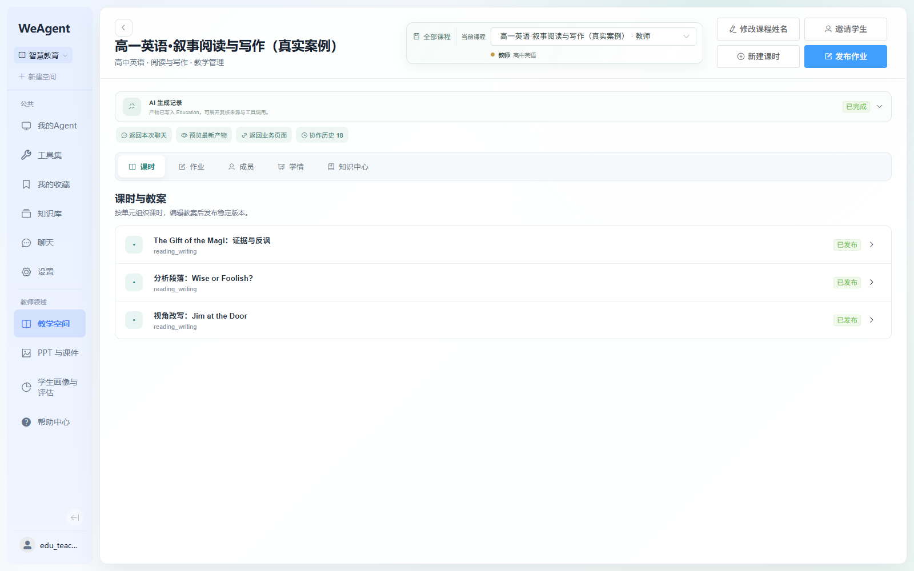
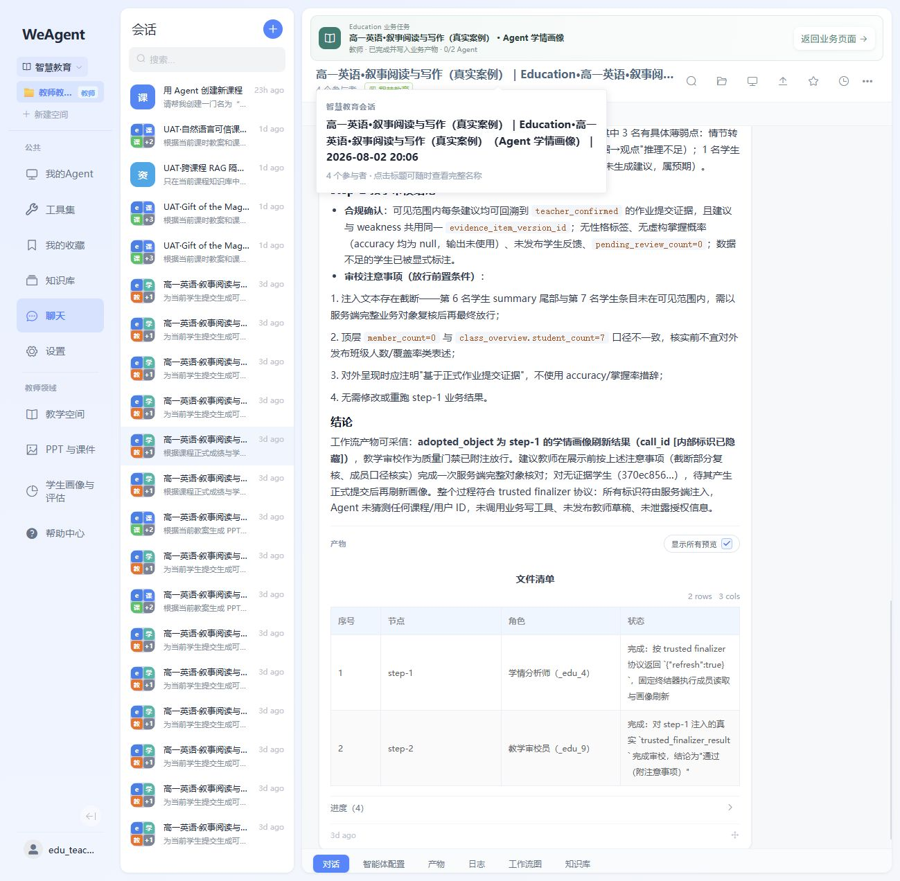
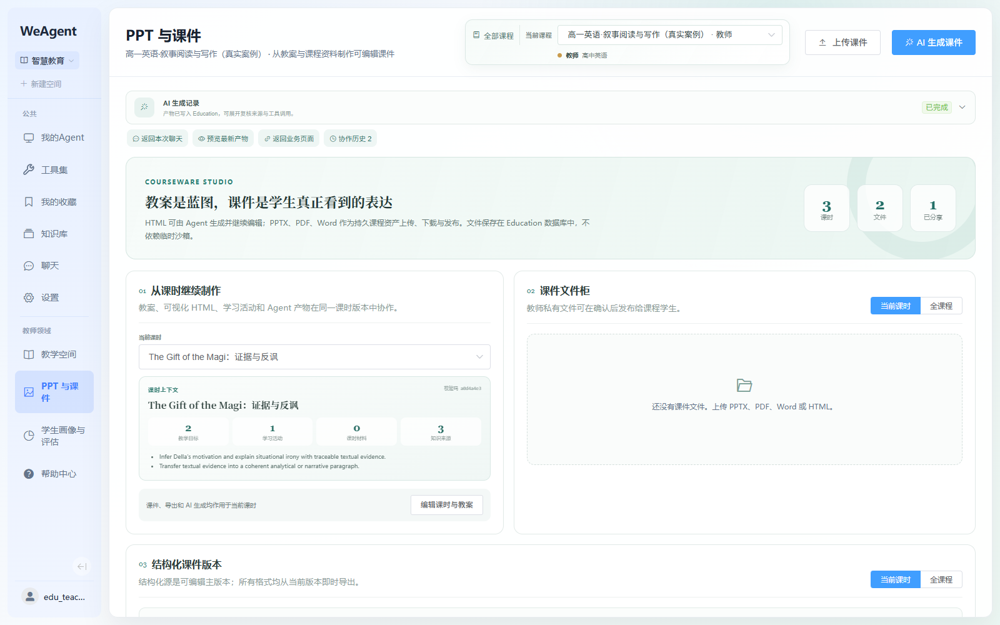
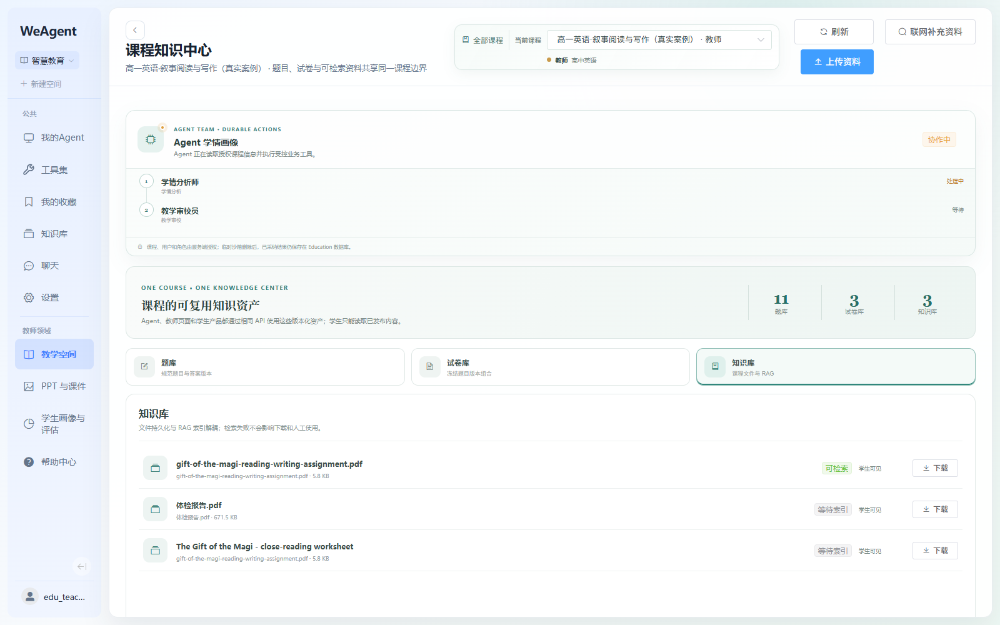
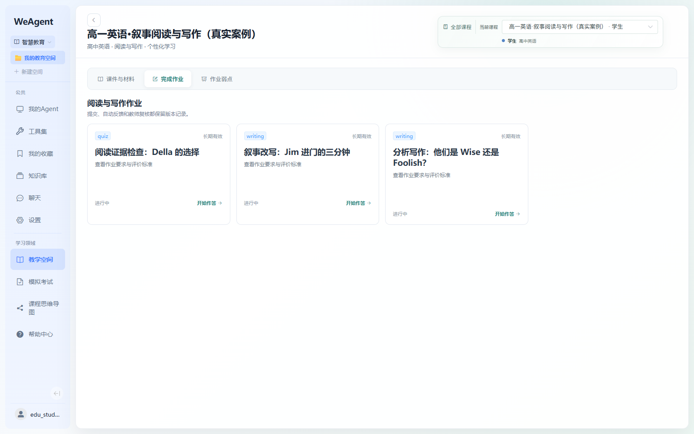
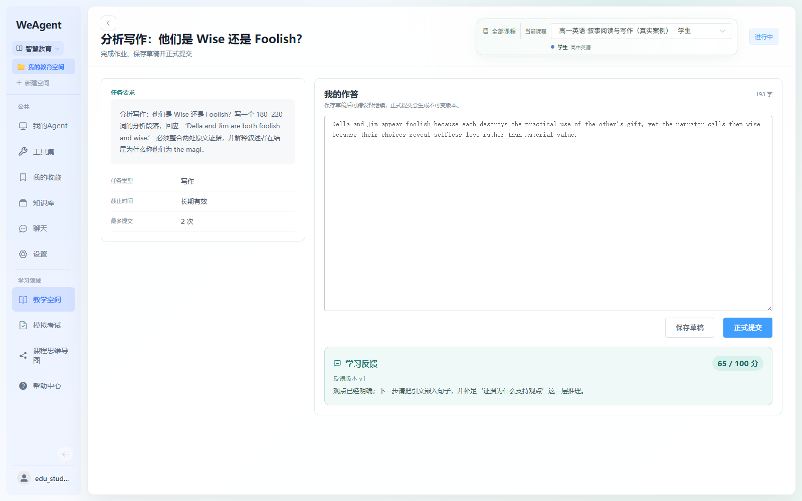
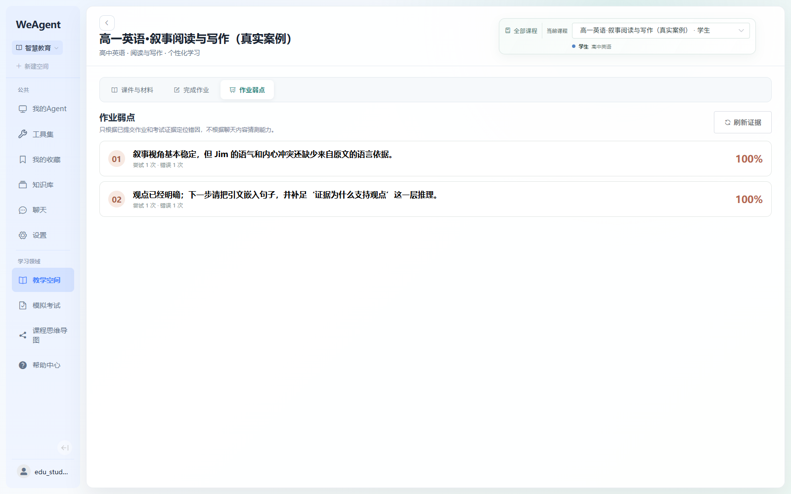
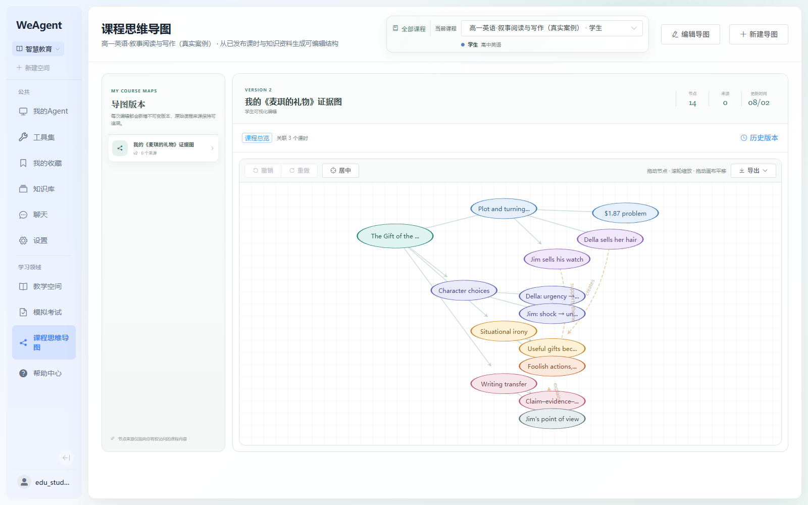
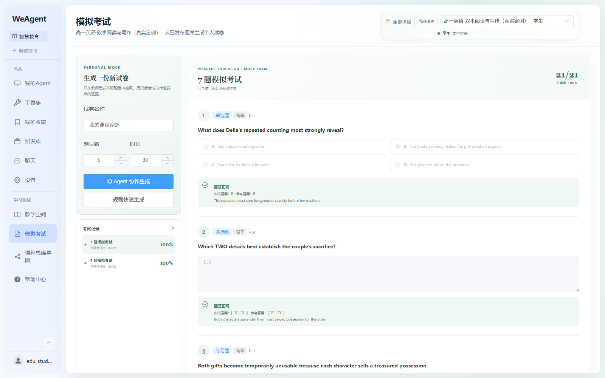
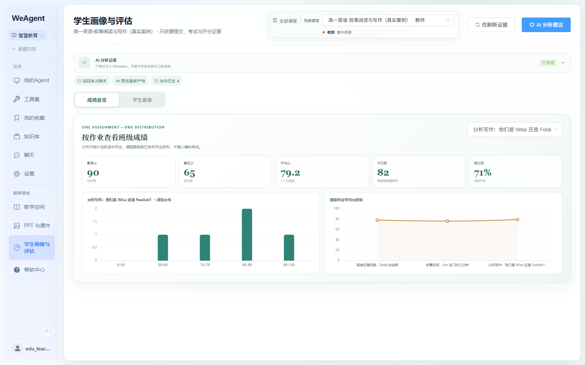

# WeAgent Education 50 秒比赛展示与验收手册

> 适用对象：比赛评委、产品展示观众、现场验收人员  
> 建议成片：`00:50`，16:9，1920×1080，25/30 fps  
> 核心叙事：教师备课与发布 → 学生学习与作答 → Agent 批改与诊断 → 学情证据回流教师

## 1. 一句话定位

WeAgent Education 不是把大模型接到一个聊天框里，而是让不同角色的 Agent 在真实课程、课时、材料、作业和学生数据上协作，并把结果写回可编辑、可发布、可追溯的教学业务对象。

## 2. 演示账号与固定案例

| 视角 | 用户名 | 密码获取方式 | 固定课程 |
|---|---|---|---|
| 教师 | `edu_teacher_phase4_0802_authentic` | 本机忽略文件 `.runtime/education-uat-credentials.md` | 高一英语·叙事阅读与写作（真实案例） |
| 学生 | `edu_student_1_phase4_0802_authentic` | 本机忽略文件 `.runtime/education-uat-credentials.md` | 高一英语·叙事阅读与写作（真实案例） |

安全说明：密码只保存在 `.runtime/`，不写入 Git 文档、字幕或录屏画面。两名用户均为本机 UAT 账号，教师与学生权限由课程成员关系自动确定，不在前端手工切换角色。

固定演示课时：`The Gift of the Magi：证据与反讽`。固定材料围绕文本证据、情境反讽、CER 推理与读写迁移，避免临时生成内容显得空泛。

## 3. 50 秒成片的逻辑线

```text
教师课程空间
  → 多 Agent 读取课时、教案与课程知识库
  → 生成并写回课件/题目/作业
  → 学生下载材料、完成作业和模拟练习
  → AI 建议与弱点证据形成
  → 教师查看班级成绩与学生画像
```

这条线只回答评委最关心的三个问题：

1. Agent 是否真正连接业务，而不只是输出聊天文本？
2. 教师和学生是否共享同一条可追溯的教学数据链？
3. 结果是否可以预览、编辑、发布和继续使用？

## 4. 50 秒逐镜头对应表

本表采用一条硬规则：**配音与屏幕字幕逐字一致**。每句话只能描述同期画面中直接可见的事实；不能由画面证明的功能，不写进该镜头。

| 时间码 | 时长 | 配音与字幕（逐字一致） | 同期画面中必须可见 |
|---|---:|---|---|
| 00:00–00:04 | 4s | 教师从真实课程出发，管理三个已发布课时。 | 教师身份、真实课程名、三个课时及“已发布”状态 |
| 00:04–00:09 | 5s | 学情分析师与教学审校员协作，结果直接写回课程。 | 两个 Agent 角色、完成结果、产物表格和“返回业务页面” |
| 00:09–00:14 | 5s | 课件按课时组织，生成记录、文件和版本集中管理。 | 当前课时、AI 记录“已完成”、3 课时、2 文件、结构化版本区域 |
| 00:14–00:19 | 5s | 同一课程汇集题库、试卷库和知识库，真实 PDF 可以检索。 | 11 题库、3 试卷库、3 知识库、真实 PDF 和“可检索” |
| 00:19–00:23 | 4s | 学生进入同一课程，接收三项阅读与写作任务。 | 学生身份、同一课程、三张作业卡 |
| 00:23–00:29 | 6s | 学生提交真实英文作答，并收到百分制成绩和学习反馈。 | 英文作答、193 字、65/100 分、学习反馈 |
| 00:29–00:34 | 5s | 系统依据提交和批改证据，形成两项可追溯的作业弱点。 | 两项弱点、尝试次数、错误次数、100% 证据比例 |
| 00:34–00:39 | 5s | 课程知识被整理成十四个节点，并可编辑、回溯和导出。 | 14 节点、版本 2、编辑导图、历史版本、导出 |
| 00:39–00:44 | 5s | 模拟考试包含七道多题型练习，并保留考试记录。 | 7 题、单选/多选/练习题标签、两条考试记录 |
| 00:44–00:50 | 6s | 最终，成绩分布和课程趋势回流教师，完成教、学、评闭环。 | 最高 90、最低 65、平均 79.2、中位数 82、提交率 71% 和两张图表 |

时间核算：教师端 `19s`，学生端 `25s`，教师端数据回流 `6s`，总计 `50s`。

## 5. 配音录制稿

录音时按下面十行分别录制；每行同时作为对应镜头的字幕，不再另外改写字幕。

1. 教师从真实课程出发，管理三个已发布课时。
2. 学情分析师与教学审校员协作，结果直接写回课程。
3. 课件按课时组织，生成记录、文件和版本集中管理。
4. 同一课程汇集题库、试卷库和知识库，真实 PDF 可以检索。
5. 学生进入同一课程，接收三项阅读与写作任务。
6. 学生提交真实英文作答，并收到百分制成绩和学习反馈。
7. 系统依据提交和批改证据，形成两项可追溯的作业弱点。
8. 课程知识被整理成十四个节点，并可编辑、回溯和导出。
9. 模拟考试包含七道多题型练习，并保留考试记录。
10. 最终，成绩分布和课程趋势回流教师，完成教、学、评闭环。

录音建议：语速约 4.5–5 字/秒；一行录成一个独立音频片段，片段长度严格对齐表中时长。不要在成片中临时添加第二套宣传文案。

## 6. 与配音逐段对应的真实画面

### 6.1 `00:00–00:04` 教师课程与三个课时

**配音与字幕：教师从真实课程出发，管理三个已发布课时。**



画面动作：从课程标题缓慢下移到三个课时，不点击弹窗。结束前让三个“已发布”状态同时留在画面中。

### 6.2 `00:04–00:09` 两个 Agent 完成学情协作

**配音与字幕：学情分析师与教学审校员协作，结果直接写回课程。**



画面动作：关闭标题悬浮卡；先让“学情分析师、教学审校员”两行可见，再向下移动到产物表格；右上“返回业务页面”始终保留。

### 6.3 `00:09–00:14` 按课时组织的课件工作台

**配音与字幕：课件按课时组织，生成记录、文件和版本集中管理。**



画面动作：保持 AI 记录“已完成”、当前课时和 `3 课时 / 2 文件 / 1 已分享` 可见，随后轻微下滚，使“结构化课件版本”标题进入画面。本镜头不讲逐页预览或导出，因为当前截图没有直接展示这些按钮。

### 6.4 `00:14–00:19` 课程知识中心与真实 PDF

**配音与字幕：同一课程汇集题库、试卷库和知识库，真实 PDF 可以检索。**



画面动作：鼠标依次经过题库、试卷库、知识库三个入口，最后停在 `gift-of-the-magi-reading-writing-assignment.pdf` 的“可检索”标签。

### 6.5 `00:19–00:23` 学生接收三项任务

**配音与字幕：学生进入同一课程，接收三项阅读与写作任务。**



画面动作：先停留右上角“学生”身份，再水平扫过阅读证据检查、叙事改写、分析写作三张卡；不要在本镜头声称教师发布或邀请学生。

### 6.6 `00:23–00:29` 英文作答、成绩与反馈

**配音与字幕：学生提交真实英文作答，并收到百分制成绩和学习反馈。**



画面动作：从 193 字英文作答缓慢下移到 `65 / 100 分` 和“学习反馈”；在反馈区域至少停留 1.5 秒。

### 6.7 `00:29–00:34` 两项证据化作业弱点

**配音与字幕：系统依据提交和批改证据，形成两项可追溯的作业弱点。**



画面动作：鼠标从第一项移到第二项，让“尝试 1 次、错误 1 次”和右侧 100% 同时可见。

### 6.8 `00:34–00:39` 十四节点课程思维导图

**配音与字幕：课程知识被整理成十四个节点，并可编辑、回溯和导出。**



画面动作：先停留右上角“节点 14”和“版本 2”，再依次指向“编辑导图、历史版本、导出”；无需真的进入编辑状态。

### 6.9 `00:39–00:44` 七题模拟考试

**配音与字幕：模拟考试包含七道多题型练习，并保留考试记录。**



画面动作：让“7 题模拟考试”、单选题、多选题和左侧两条考试记录同时可见；缓慢下滚半屏，让第三种题型露出后切镜头。

### 6.10 `00:44–00:50` 成绩与趋势回流教师

**配音与字幕：最终，成绩分布和课程趋势回流教师，完成教、学、评闭环。**



画面动作：不滚动。依次强调最高 90、最低 65、平均 79.2、中位数 82、提交率 71%，最后在成绩分布与课程趋势两张图表上定格。

## 7. 录屏前 3 分钟检查清单

1. 确认 `5002 / 5102 / 5104 / 8080` 四个端口可访问。
2. 教师和学生分别用两个浏览器 Profile 登录，避免现场退出再登录。
3. 教师预加载：课程总览、PPT 与课件、课程知识中心、学生画像与评估、对应 Agent 聊天。
4. 学生预加载：课程作业、具体作答、模拟考试、课程思维导图。
5. 将所有页面定位到要展示的滚动位置；关闭开发者工具、系统通知和无关标签页。
6. 确认最新 AI 记录为“已完成”；失败历史可以保留在协作历史中，但不要在主镜头展开。
7. 预览一次 PPTX/HTML，利用页面缓存避免现场第一次编译等待。
8. 不在 50 秒成片中直播等待大模型。使用当日真实完成记录，并在画面或讲解中称为“本次真实运行结果”。

## 8. 拍摄与剪辑执行表

| 镜头 | 时间码 | 页面 | 录制动作 | 必须与配音同时出现的证据 |
|---|---|---|---|---|
| A | 00:00–00:04 | 教师课程总览 | 标题移向三个课时 | 教师、真实课程、三个“已发布” |
| B | 00:04–00:09 | Agent 聊天 | 两个 Agent 移向产物表格 | 学情分析师、教学审校员、返回业务页面 |
| C | 00:09–00:14 | PPT 与课件 | 当前课时移向结构化版本 | AI 已完成、课时、文件、版本 |
| D | 00:14–00:19 | 课程知识中心 | 三个库移向真实 PDF | 11/3/3 统计、PDF、“可检索” |
| E | 00:19–00:23 | 学生完成作业 | 学生身份移向三张卡 | 同一课程、学生、三项任务 |
| F | 00:23–00:29 | 学生作答详情 | 英文作答移向学习反馈 | 193 字、65/100、反馈 |
| G | 00:29–00:34 | 学生作业弱点 | 第一项移向第二项 | 两项弱点、尝试/错误次数、100% |
| H | 00:34–00:39 | 课程思维导图 | 节点统计移向编辑与导出 | 14 节点、v2、历史、导出 |
| I | 00:39–00:44 | 模拟考试 | 题型轻微下滚 | 7 题、三种题型、两条记录 |
| J | 00:44–00:50 | 教师学生画像与评估 | 五项数字移向两张图表后定格 | 90、65、79.2、82、71% 和趋势 |

剪辑参数：鼠标移动可加速到 `1.1×`；每次点击后至少保留 `8–12` 帧确认反馈；普通切换不使用花哨动画；数字和真实英文材料至少停留 `1s` 以便评委看清。

## 9. 完整验收路线

### 9.1 教师端（建议 8–12 分钟）

1. 登录教师账号，进入智慧教育。
2. 打开固定课程，确认课程角色为“教师”，存在三个已发布课时。
3. 进入任一课时，编辑教案字段并保存新版本，确认版本号和具体时间可见。
4. 从业务页发起“根据当前教案生成 PPT”，确认用户聊天只显示自然需求，系统约束不伪装成用户消息。
5. 在聊天中确认多 Agent 进度、每个 Agent 输出、产物卡；从聊天返回业务页，再从业务页返回本次聊天。
6. 在 PPT 与课件中打开最新产物，检查逐页预览、HTML 预览、PPTX/HTML/PDF 导出与第二次加载缓存。
7. 进入知识中心：展开阅读材料和题组；按课时切换题库；编辑题目；勾选题目组卷；预览试卷。
8. 上传真实 PDF，确认变为可检索；让资料 Agent 检索其中的明确事实，答案必须能对应原文片段。
9. 发布一份百分制作业，确认不出现系统自造的强制评分子项；上传 PDF/图片作业时确认 OCR 或原文件发布路径明确。
10. 打开学生提交：切换学生、查看原文与材料、展开/收起 AI 建议、给出唯一教师反馈并保存。
11. 学生画像与评估按作业切换成绩分布；确认最高分、最低分、平均分、趋势与学生卡片数据一致。

通过标准：教师可完成“备课—课件—材料—作业—批改—学情”全链路；所有 Agent 结果都有业务对象、来源和返回路径，不依赖沙箱文件路径作为最终结果。

### 9.2 学生端（建议 5–8 分钟）

1. 登录学生账号，进入同一课程，确认角色自动显示“学生”，看不到教师 Agent 与教师写操作。
2. 在课件与材料中下载教师发布内容。
3. 在完成作业中打开任务，保存草稿，再正式提交；长内容应在合适高度内滚动。
4. 教师完成批改后刷新，确认百分制成绩、教师反馈和弱点证据可见。
5. 打开模拟考试，确认存在多题型；生成动作只使用学生 Agent 和允许的课程题库。
6. 打开课程思维导图：选择课时、双击编辑、拖动节点、改颜色、撤销/重做、居中、查看历史版本并导出。

通过标准：学生只能访问自己加入的课程和自己的提交；教师草稿、参考答案、其他学生数据及教师工具均不可见。

### 9.3 Agent、权限与持久化（建议 5 分钟）

1. 新建 EDU 会话并选择课程，角色应由课程成员关系决定，不出现手工“教师/学生”切换器。
2. 教师只能看到教师侧 Agent，学生只能看到学生侧 Agent；越权请求返回 403。
3. Agent 可调用受控 Education 工具创建或更新课程对象；例如批量邀请学生必须先展示名单并要求显式确认。
4. 会话、业务对象和关联关系存数据库；Docker 沙箱只承载临时工作区，删除或重建容器后业务记录仍可回溯。
5. 课程 A 的 RAG 不能检索课程 B 的私有材料；历史卡片再次打开时重新校验成员权限。
6. 灰度只在 Education 域和授权用户生效，不改变研发领域的历史会话、服务卡片与工具集合。

## 10. 50 秒安全备选剪辑

如果现场网络或模型响应不稳定，不直播点击“AI 生成”。改用当天已经真实完成的运行记录：

1. 先在录屏前完成运行并确认写回业务对象。
2. 镜头从业务页“AI 生成记录 · 已完成”进入聊天。
3. 字幕写“本次真实运行结果”，不要写“实时生成中”。
4. 保留运行时间、Agent 进度和产物卡作为真实性证据。
5. 任何失败记录留在协作历史，不删除、不伪造时间；主线只展示最新一次成功覆盖运行。

## 11. 最终交付判定

- [ ] 成片精确为 50 秒（允许平台编码误差 ±0.2 秒）。
- [ ] 前 8 秒说清“谁在用、做什么”，前 20 秒出现 Agent 与业务产物。
- [ ] 教师、学生两个角色都出现，学生镜头不少于 15 秒。
- [ ] 至少展示一个可编辑/可导出的课件产物、一个真实课程材料、一个真实英文回答。
- [ ] 至少展示一次业务页 ↔ Agent 聊天的双向关联。
- [ ] 至少展示一次成绩或学习证据回流教师。
- [ ] 不出现 UUID、JWT、系统提示词、工具授权、密码、终端、报错堆栈。
- [ ] 不把历史成功记录冒充现场实时生成，不删除失败审计记录。
- [ ] 字幕每屏不超过两行，字号不低于 42 px，关键数字和动词使用品牌强调色。
- [ ] 结尾 3 秒同时出现产品名与闭环价值：“多 Agent 协作，让教、学、评真正连起来”。
