# WeAgent 技术文档 v2.4

更新日期：2026-08-06

v2.4 迭代内容：

- 以《WeAgent 技术文档.zip》中的 Markdown 和 15 张本地附件为图文基线，移除会过期的内部图片链接。
- 补全创建会话、单/多 Agent、Sandbox Event、产物恢复、文件、HTML、工作流和能力投影数据流图。
- 新增 Education 领域扩展章节，记录已完成的教师—学生闭环、可信 Agent 工具、课程级 RAG、业务卡片、灰度隔离和真实 UAT 边界。
- 记录近期会话绑定与 `edu.student_insight.refresh` 一致性修复，明确完成状态必须来自可审计业务写入。

## 1. 项目与文档范围

本章定义 WeAgent 的项目定位、能力边界和本文档的说明范围。技术文档面向技术评审和后续维护者，重点回答三个问题：系统解决什么问题，当前工程已经包含哪些核心能力，后续阅读架构、模块、接口和故障排查时应以哪些事实边界为准。

### 1.1 WeAgent 是什么

WeAgent 是面向 AI 协作任务的多端 Agent 工作台。用户可以在会话中发起自然语言任务，选择单个 Agent 独立完成任务，也可以让多个 Agent 在主持 Agent 的调度下协作执行。系统会把任务过程中的进度、原始输出、工作流、文件、代码、图片、表格、HTML 页面、diff 和服务预览沉淀为可查看、可编辑、可恢复的结构化结果。

从技术实现看，WeAgent 以 Flask 后端作为控制面，以 Docker Sandbox 作为隔离执行环境，以 Agent、Provider Adapter、Capability、Message Element 和 Artifact Workbench 作为核心抽象。Provider Adapter 已实现 Claude Code、Codex、OpenCode 的接入，使不同底层 AI Coding 引擎可以通过统一的 Agent 执行链路运行。Web、Desktop 和 Android 客户端通过统一后端协议访问会话、消息、产物和服务；后端负责认证、会话状态、Agent 调度、Socket.IO 推送、沙箱代理和数据持久化；容器内负责 Agent 运行、Provider CLI 调用、能力投影、文件系统、MCP Runtime、服务管理和结构化事件上报。

### 1.2 当前项目能力范围

当前工程包含以下已经纳入技术文档范围的能力。这里描述的是平台级能力，不展开具体 UI 使用步骤。

|能力域|范围说明|
|---|---|
|多端客户端|Web 是主功能基准；Desktop 进行全量迁移并通过 `serverUrl` 连接外部后端；Android 承载移动端主要流程。|
|单 Agent 执行|用户可以选择单个 Agent 执行任务，后端创建消息、AgentRun 和 sandbox 执行上下文。|
|多 Agent 协作|主持 Agent 生成任务计划，worker Agent 执行子任务，workflow 元素用于展示和复用调度计划。|
|Agent 配置|支持全局 Agent 管理，也支持会话级 Agent 配置覆盖；会话级配置不回写全局 Agent。|
|Provider Adapter|支持 Claude Code、Codex、OpenCode 等底层执行引擎，通过 Provider Runner 屏蔽 CLI 差异。|
|能力 / 工具系统|Skill、Tool、MCP、Plugin 统一为 Capability，经导入、审查、绑定、投影后进入容器运行时。|
|沙箱执行|Agent 任务在 Docker Sandbox 中执行，工作区文件、服务端口、工具调用和运行状态与宿主隔离。|
|多类型产物|支持文本、代码、文件、图片、表格、HTML、diff、workflow、service 等消息元素和工作台预览编辑。|
|服务预览|容器内服务通过后端 Service Proxy 暴露给客户端，前端不直接访问容器端口。|
|刷新恢复与故障定位|消息元素、Raw Output、AgentRun、文件 API 和服务 API 共同支持刷新恢复和问题定位。|
|领域扩展|通过 domain、灰度、Agent 服务视角和独立领域服务接入 RD、Education 与 Office；Education 已完成 Web 端教师—学生真实闭环。|

### 1.3 本文档说明范围

本文档说明 WeAgent 的技术栈、系统架构、核心模块、核心技术实现、关键数据流、开发部署方式、关键接口、数据模型、运行风险、故障定位和术语定义。文档中的路径、接口和模型说明以当前仓库中的代码、配置、运行脚本、路由和数据模型为依据。

本文档不替代用户使用手册、产品介绍、演示材料或完整 API 参考。用户如何完成具体任务、产品价值如何对外介绍、演示视频如何组织，应在使用说明书和产品文档中展开；本文只解释系统如何实现、如何运行、如何验证和如何排查。

### 1.4 本文档不覆盖的内容

本文档不逐字段展开完整数据库 ER 图，不覆盖所有 UI 交互细节，不列出每个前端组件的样式规则，也不承诺代码中尚未实现或尚未验证的路线图功能。对于只在设计讨论中出现、但没有代码、配置、路由、模型或测试支撑的内容，本文不作为已实现能力描述。

对于接口和数据模型，本文只列出理解主链路必须知道的字段和路由。需要字段级契约时，应以 controller、schema、service、model 和前端 API 调用为准。

### 1.5 事实边界

本文以当前仓库中的源码、配置、模型、路由、运行脚本、测试文件和已确认实现为事实来源。文档中的架构图、时序图和表格用于解释系统边界和数据流，不替代源码审查、运行日志和测试结果。

凡是没有重新执行完整 smoke 或目标环境验证的内容，会以“待确认”或“需环境验证”标记。该标记表示文档记录了工程入口或风险边界，但不表示该能力已经在当前机器、目标部署环境或演示环境中通过验证。

### 1.6 核心术语速览

首次阅读时，应先对齐以下核心术语。第 11 章提供完整术语表，本节只用于建立最小上下文。

|术语|最小理解|
|---|---|
|Agent|会话中承担任务的 AI 工作角色。|
|Moderator|多 Agent 会话中的主持 Agent，负责计划、分配和汇总。|
|Worker|执行主持 Agent 分配的具体子任务的 Agent。|
|Provider Adapter|Agent 选择底层执行引擎的适配机制。|
|Provider Runner|容器内封装 Claude Code、Codex、OpenCode 等 CLI 的运行器。|
|Docker Sandbox|隔离 Agent 执行、文件系统、工具和服务端口的容器环境。|
|Message Element|消息中的结构化展示单元，例如 progress、file、table、workflow、service。|
|Artifact|部分可复用产物记录，不等同于所有消息产物。|
|Capability Projection|把 Agent 可用能力写入容器 `/workspace/.weagent/*` 的过程。|
|Workbench|用于查看、编辑、比较和迁移产物的工作台能力。|
## 2\. 相关技术栈

本章提供技术地图，帮助读者快速理解系统由哪些技术组成。这里不展开复杂机制，具体行为放到第 4 章和第 5 章说明。

### 2\.1 客户端技术

客户端负责用户交互、会话展示、配置管理、产物查看和实时状态更新。

|范围|关键技术|作用|
|---|---|---|
|Web|Vue 2\.7、Vue Router、Vuex、Element UI、Axios、Socket\.IO Client|主功能基准，承载完整工作台能力。|
|桌面端|Electron 29、Vite 5、Vue 2\.7、Element UI、electron\-builder|提供桌面应用外壳和打包能力，连接外部后端。|
|Android|Capacitor 6、Vite 5、Vue 2\.7|通过移动端 WebView 承载登录、会话、Agent 和设置等主流程。|

Web、桌面端和 Android 都通过 REST API 与后端交互，并通过 Socket\.IO 接收实时消息。桌面端和 Android 需要配置 `serverUrl`，不会在本地内置后端。

### 2\.2 服务端技术

服务端是 WeAgent 的控制面。它负责认证、会话、消息、Agent、产物、能力、容器代理和实时推送。

|范围|关键技术|作用|
|---|---|---|
|HTTP API|Flask|提供认证、会话、消息、Agent、产物、能力和沙盒代理接口。|
|实时通信|Flask\-SocketIO|向客户端推送消息状态、执行步骤、产物元素和服务状态。|
|数据访问|SQLAlchemy、PyMySQL|管理数据模型，并连接 MySQL。|
|身份认证|Flask\-JWT\-Extended|处理登录态、访问令牌和受保护接口。|
|数据库迁移|Flask\-Migrate|支持数据库结构演进。|
|业务组织|controllers、services、models|把路由、业务服务和数据模型分层组织。|
|领域服务|独立 Flask App、SQLAlchemy|Education 与 RAG 以独立进程、独立数据库和受控服务间协议接入核心控制面。|

关键入口包括 `backend/run.py`、`backend/app/__init__.py`、`backend/app/controllers/`、`backend/app/services/`、`backend/app/socket/events.py`、`backend/services/edu/` 和 `backend/services/rag/`。

### 2\.3 沙盒与 Agent 运行技术

Agent 任务不直接在后端进程内运行，而是在 Docker Sandbox（基于 Docker 的沙盒隔离环境）中运行。这里的“沙盒”强调运行边界：文件、工具、服务端口和运行状态被限制在会话对应的容器内。

沙盒相关概念可以按层级理解：

|概念|含义|
|---|---|
|Docker Sandbox|每个正式 Agent 会话对应的容器化运行环境。|
|沙盒隔离|文件、工具、服务端口和会话状态被限制在容器边界内。|
|沙盒运行|Agent、工具协议、服务进程和产物上报在容器内执行。|
|sandbox session|后端记录和管理该容器生命周期的会话对象。|
|Sandbox API|后端访问容器内 Agent、文件、工具、MCP、服务和事件的内部接口。|

|范围|关键技术|作用|
|---|---|---|
|沙盒隔离|Docker Sandbox|为每个正式 Agent 会话提供容器边界，隔离文件、工具、服务端口和执行状态。|
|容器调度|Orchestrator|在容器内组织单 Agent 或多 Agent 的任务执行。|
|Agent 运行|AgentRuntime|为单个 Agent 准备工作目录、提示词、运行器和输出采集。|
|外部执行引擎|Provider Runner|调用 Claude Code、Codex 或 OpenCode，并统一输出和错误格式。|
|产物上报|`weagent-report`|在容器内上报结构化进度和产物。|
|服务预览|`weagent-service`|在容器内启动服务、登记服务状态，并上报服务预览信息。|

关键路径包括 `backend/app/sandbox/Dockerfile`、`backend/app/sandbox/host/`、`backend/app/sandbox/container/` 和 `backend/app/sandbox/container/providers/`。

### 2\.4 数据与基础设施

WeAgent 的基础设施负责保存状态、支持实时运行和提供隔离环境。

|范围|关键技术|作用|
|---|---|---|
|持久化数据|MySQL 8\.0|Core 保存用户、Agent、会话和消息；Education 与 RAG 分别使用 `weagent_edu`、`weagent_rag` 保存领域对象和检索元数据。|
|辅助服务|Redis|作为后端辅助基础设施。|
|容器运行|Docker Desktop|构建和运行 `weagent-sandbox:latest` 容器镜像。|
|领域文件|持久卷或对象存储|保存 Education 上传的 PDF、Word、图片等原文件；不能只存在于会话 Sandbox。|
|前端构建|Node\.js / npm|构建 Web、桌面端和 Android 客户端。|
|移动端构建|Android Studio / Gradle|构建和调试 Android 客户端。|

## 3. 系统架构

WeAgent 的系统架构围绕“任务从用户输入到 Agent 执行，再到产物回传”的完整链路设计。系统不是单一的 Web 聊天应用，而是由多端客户端、Flask 后端、宿主侧 Sandbox 代理、Docker Sandbox 容器、容器内 Orchestrator、Provider Runner 和数据存储共同组成。客户端负责交互、展示和本地配置；后端负责认证、会话状态、消息持久化、Agent 调度、Socket 推送和沙箱代理；Docker Sandbox 负责隔离执行环境、工作区文件、工具运行和服务进程；Provider Runner 负责把 Claude Code、Codex、OpenCode 等外部执行引擎统一为平台可处理的执行事件、输出内容和错误状态。

这种分层设计的核心价值在于隔离边界清晰：前端不直接访问容器和 Provider CLI，后端不直接在宿主机执行 Agent 任务，容器内执行结果也不会绕过后端进入客户端。所有任务状态、消息元素、文件访问、服务预览和工作流结果都通过后端统一管理，保证 Web、桌面端和 Android 在协议层保持一致。

### 3.1 总体架构

WeAgent 采用 **“多端客户端 + Flask 后端 + Docker Sandbox + Provider Adapter + 数据层”** 的分层架构。各层通过 REST API、Socket.IO、Sandbox Host Proxy、容器内控制接口和 Docker volume 协同工作，形成从用户任务、后端调度、容器执行到产物展示的闭环。这个结构将用户交互、业务状态、执行环境和外部执行引擎分开管理，使系统能够在保持多端统一协议的同时，把高风险的文件写入、命令执行和服务启动限制在容器边界内。

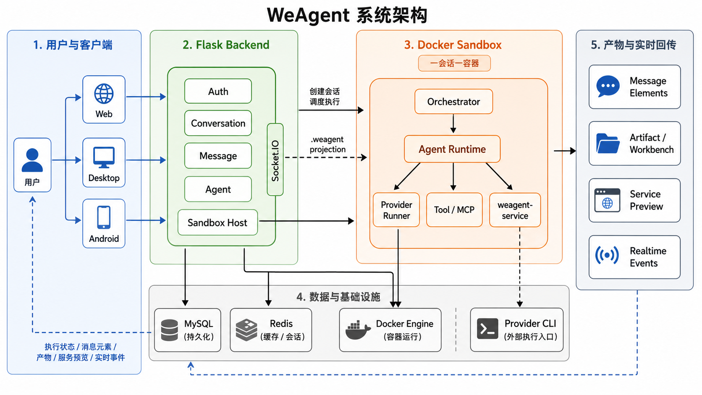

**图：WeAgent 系统架构**

系统架构由客户端、后端控制面、沙箱代理层、容器运行时、外部执行引擎和数据层构成。用户通过 Web、桌面端或 Android 发起任务；Flask 后端保存会话、消息、Agent、模型配置和执行状态；宿主侧 Sandbox 代理负责创建和访问 Docker 容器；容器内 Orchestrator 组织 Agent 运行、工具调用、服务启动和事件上报；Provider Runner 调用 Claude Code、Codex 或 OpenCode 完成具体执行。执行结果以消息状态、消息元素、Raw Output、产物卡片、服务预览或工作流图的形式回到客户端。

| 层级 | 职责 | 关键实现 | 通信方式 |
| --- | --- | --- | --- |
| Web 客户端 | 主功能基准，承载完整会话、Agent、工具、产物、工作流和设置能力。 | `frontend/` | REST API、Socket.IO |
| Desktop 客户端 | Electron 桌面应用，连接用户配置的外部后端，迁移 Web 主要工作台能力。 | `clients/desktop/` | REST API、Socket.IO、本地 `serverUrl` |
| Android 客户端 | Capacitor + WebView，承载移动端主流程。 | `clients/android/` | REST API、WebView 网络、后端地址配置 |
| Flask 后端 | 认证、会话、消息、Agent、能力、产物、Socket 推送和沙箱代理控制面。 | `backend/app/` | HTTP API、Socket.IO |
| Education Service | 课程、课时、课件、知识、作业、提交、学情、可信工具授权与审计。 | `backend/services/edu/` | HTTP API、内部 RunGrant |
| RAG Service | 文档、chunk、Embedding、课程范围检索和访问校验。 | `backend/services/rag/` | 内部 HTTP API、受控 RAG scope |
| Sandbox Host | 宿主侧 Docker session 管理和容器 API 代理。 | `backend/app/sandbox/host/`、`backend/app/sandbox/api/` | HTTP proxy、Docker API |
| Container Runtime | 容器内 Agent 调度、工具运行、文件读写、服务管理和事件上报。 | `backend/app/sandbox/container/` | Container API、workspace 文件 |
| Provider Adapter | 统一 Claude Code、Codex、OpenCode 的命令、环境、输出和错误。 | `backend/app/sandbox/container/providers/` | CLI process、stdout/stderr |
| Data Layer | 保存 Core 状态、领域业务对象、RAG 元数据、上传原文件和容器工作区状态。 | Core MySQL、`weagent_edu`、`weagent_rag`、持久卷、`/workspace` | ORM、文件存储、Docker volume |

### 3.2 多端工程边界

Web、Desktop 和 Android 使用同一套后端协议，但不是完全同构工程。技术文档只说明工程形态和通信差异，不展开各端 UI 功能细节。这样的设计可以让后端能力复用，同时允许不同客户端根据使用场景保留独立工程结构：Web 作为主功能基准，Desktop 侧重桌面应用体验，Android 侧重移动端主流程。

| 客户端 | 工程形态 | 后端连接方式 | 技术边界 |
| --- | --- | --- | --- |
| Web | Vue CLI 工程，是主功能基准。 | 通常连接当前部署或开发环境后端。 | 功能最完整，包含完整工作台、工作流、工具能力和产物闭环。 |
| Desktop | Electron + Vite + Vue 2.7，独立桌面工程。 | 首次启动通过 `ServerSetup` 配置外部后端 `serverUrl`。 | 更接近 Web，但保留桌面端独立组件和打包配置。 |
| Android | Capacitor + Vite + Vue 2.7，运行在 Android WebView。 | 通过 `serverUrl` 连接局域网或公网后端。 | 迁移主流程，受 WebView、网络权限和移动端性能约束。 |

三端功能覆盖并不完全一致。Web 是功能基准，Desktop 以桌面端全量迁移为目标，Android 侧重移动端主要任务流。下表只说明功能覆盖范围，不展开具体页面交互。

| 功能域 | Web | Desktop | Android |
| --- | --- | --- | --- |
| 登录、注册、个人设置 | 完整支持。 | 完整支持，并额外提供后端地址配置。 | 支持主流程，需处理移动端网络和头像资源访问限制。 |
| 会话列表与会话详情 | 完整支持单 Agent、多 Agent、历史、收藏和搜索等能力。 | 接近 Web，保留桌面端独立布局和菜单。 | 支持会话主流程，布局和交互按移动端简化。 |
| Agent 管理 | 支持全局 Agent、会话级 Agent 配置、能力绑定和编辑。 | 接近 Web，支持桌面端 Agent 管理和会话级配置。 | 支持 Agent 查看和主要配置入口，复杂能力配置不是当前重点。 |
| 产物预览与编辑 | 支持代码、文件、图片、表格、HTML、diff、workflow、service 等完整产物闭环。 | 接近 Web，支持桌面端工作台和文件 / 产物操作。 | 以查看和主流程展示为主，不作为完整工作台基准。 |
| 工具能力与 MCP | 支持能力导入、审查、绑定、投影和调用记录。 | 同步核心能力管理入口。 | 不作为当前移动端主功能。 |
| 工作流 | 支持工作流卡片、预览、编辑、复制和复用。 | 同步工作流预览与复用能力。 | 以消息展示和主流程为主。 |

三个客户端都不直接调用 Docker 或 Provider CLI。文件读取、HTML 预览、容器服务、日志和实时进度都必须经过后端 API 或 Socket 通道，保证跨端协议一致。

### 3.3 后端控制面

Flask 后端是 WeAgent 的控制面。它不直接在宿主机运行 Agent，而是把用户操作转换为可持久化、可调度、可推送的系统事件，再通过 Sandbox Host 把任务交给容器。后端同时承担同步 API 和异步事件桥接职责：一方面保存用户、会话、消息、Agent 和配置，另一方面把容器内产生的进度、产物、错误和服务状态转换成客户端可以消费的实时更新。

| 职责 | 说明 | 关键路径 |
| --- | --- | --- |
| API 注册 | 注册认证、会话、消息、Agent、产物、工具、能力、设置、上传和沙箱路由。 | `backend/app/__init__.py` |
| 业务控制 | 将请求转为业务动作，例如创建会话、发送消息、更新配置。 | `backend/app/controllers/`、`backend/app/services/` |
| 实时推送 | 管理 Socket.IO 连接、会话 room、消息创建和消息元素流。 | `backend/app/socket/events.py`、`backend/app/services/sandbox_event_bridge.py` |
| 沙箱代理 | 创建、恢复、停止容器，代理容器文件、服务、Agent 和事件接口。 | `backend/app/sandbox/api/routes.py`、`backend/app/sandbox/host/manager.py` |
| 状态持久化 | 保存用户、模型配置、Agent、会话、消息、执行记录和部分产物。 | `backend/app/models/` |

后端需要同时处理同步请求和异步事件。同步 API 负责创建状态和发起执行，异步 Socket 事件负责把容器中的运行进度、结构化元素、错误和服务状态持续推给客户端。

### 3.4 Docker Sandbox 运行边界

Docker Sandbox 是 Agent 执行的隔离边界。一个正式 Agent 会话会绑定一个 sandbox session，容器内保存 Agent 工作区、能力投影、事件日志、服务日志和会话运行状态。该层的关键作用是把 Agent 产生的文件、命令、工具调用和预览服务限制在 `/workspace` 内，并通过受控 API 暴露给后端，避免执行过程污染宿主机项目目录。

| 容器内区域 | 内容 | 作用 |
| --- | --- | --- |
| `/workspace/agents/<workspace_name>` | 单个 Agent 的私有工作区。 | 保存该 Agent 生成、修改和读取的任务文件。 |
| `/workspace/shared` | 多 Agent 共享目录。 | 用于跨 Agent 协作读取公共文件。 |
| `/workspace/.weagent` | 能力投影、工具、MCP、插件等运行视图。 | 让容器内 Agent 读取当前会话允许使用的能力。 |
| `/workspace/.session` | 会话级状态、进度、事件、服务和运行记录。 | 支持容器恢复、事件读取和日志查看。 |

容器内运行 `Container Server` 和 `Orchestrator`。后端访问容器时，不直接读写宿主文件，而是通过 `/api/sandbox` 代理容器内 Agent、文件、MCP、工具、服务和事件接口。

### 3.5 Provider Adapter 与能力投影

外部执行引擎并不直接暴露给前端。Claude Code、Codex 和 OpenCode 的命令格式、认证方式、resume 机制、超时和错误输出都不同，WeAgent 通过 Provider Runner 统一这些差异。Adapter 层让上层 Agent 调度逻辑不需要关心具体 CLI 的调用细节，只需要选择 `adapter_name`，容器运行时就会按统一接口准备环境、启动进程、采集输出并转换错误。

| 类型 | 作用 | 关键实现 |
| --- | --- | --- |
| Agent Adapter | 让单个 Agent 可以选择 Claude Code、Codex 或 OpenCode 作为底层执行引擎。 | `backend/app/sandbox/container/providers/` |
| Provider Health | 检测容器内 Provider CLI 是否可用。 | `backend/app/sandbox/container/provider_health.py` |
| Capability Projection | 将 Agent 绑定的 Skill、Tool、MCP、Plugin 投影到容器内 `.weagent` 目录。 | `backend/app/services/capability_projection_service.py`、`backend/app/sandbox/container/capabilities.py` |
| MCP Runtime | 在容器内启动 manifest 声明的 MCP server 并调用工具。 | `backend/app/sandbox/container/mcp_runtime.py` |

这里需要区分两个概念：Agent Adapter 解决“这个 Agent 用哪个底层执行引擎运行”；Tool Provider Config 解决“某个工具能力调用外部服务时使用什么 Provider 配置”。两者都叫 provider 相关能力，但处在不同层级。

## 4. 核心模块

WeAgent 的核心模块按照职责边界划分为客户端模块、后端业务模块、沙箱运行模块和数据模块。客户端模块负责用户交互和结果展示，后端业务模块负责请求处理、状态持久化和执行调度，沙箱运行模块负责隔离执行和事件上报，数据模块负责把会话、消息、执行记录、能力绑定和产物状态保存为可恢复、可审计的数据结构。

本章的重点不是列出所有源码文件，而是给出维护系统时最重要的模块地图。每个模块都会先说明它在整体架构中的职责，再列出关键实现文件或目录，方便技术评审和后续维护者快速定位代码入口。后续第 5 章会在这些模块基础上展开通信、沙箱、Adapter、工作流、产物工作台和能力投影等核心技术实现。

### 4.1 客户端模块

客户端模块负责把会话、配置、产物、实时事件和工作流组织成用户可操作的界面。它不直接运行 Agent，也不直接访问容器文件系统；所有容器文件、日志、服务和执行状态都通过后端协议访问。Web、Desktop 和 Android 在工程上相互独立，但都围绕同一组会话、消息、Agent、文件和 Socket 事件协议构建，这使多端可以共享后端能力，又能按端侧特性调整实现。

| 模块 | 职责 | 关键实现 |
| --- | --- | --- |
| Web 会话工作台 | 组织会话列表、当前会话、文件迁移、Artifact Workbench 和 Socket 事件。 | `frontend/src/views/Dashboard.vue` |
| Web 会话详情 | 负责消息输入、侧栏切换、会话级 Agent 配置、产物、日志和工作流弹窗。 | `frontend/src/components/ChatWindow/index.vue` |
| Web 消息渲染 | 渲染 Markdown、代码、表格、图片、文件、diff、service、workflow 等消息元素。 | `frontend/src/components/MessageBubble/index.vue` |
| Web 产物工作台 | 适配代码、HTML、图片、表格、Diff 等产物的查看和编辑。 | `frontend/src/components/ArtifactWorkbench/index.vue` |
| 具体编辑器 | 提供代码编辑、HTML 可视化编辑、图片裁剪和 Diff 展示。 | `CodeEditor`、`HtmlPageEditor`、`ImageCropper`、`DiffViewCard` |
| Agent 管理 | 管理全局 Agent、能力标签、Skill、系统提示词、工具和 Adapter。 | `frontend/src/views/AgentManager.vue`、`frontend/src/components/AgentEditForm/index.vue` |
| 工具能力管理 | 管理 capability、toolset、provider config、导入和审计。 | `frontend/src/views/Tools.vue`、`frontend/src/views/CapabilityLibrary.vue` |
| Desktop 会话工作台 | 桌面端会话、消息、产物、日志、工作流和工作台能力。 | `clients/desktop/src/views/Conversations.vue` |
| Desktop 消息渲染 | 桌面端消息元素渲染和 workflow 预览入口。 | `clients/desktop/src/components/MessageBubble.vue` |
| Android 主流程 | 移动端登录、会话、Agent、设置和基础产物展示。 | `clients/android/` |

### 4.2 后端业务模块

后端模块负责把客户端请求转成业务状态和执行任务。它是控制面，不直接运行模型任务；真正执行进入 Docker Sandbox。后端模块之间的核心关系是：Conversation 负责会话与沙箱绑定，Message 负责用户输入和 Agent 执行入口，AgentRun 负责执行状态，SandboxEventBridge 负责把容器事件更新到 Message，Capability 负责把工具能力投影到容器。

| 模块 | 职责 | 关键实现 |
| --- | --- | --- |
| Auth | 登录、注册、profile 和访问控制。 | `backend/app/controllers/auth_controller.py` |
| Settings | 用户模型配置、容器环境变量、个人资料更新。 | `backend/app/controllers/settings_controller.py`、`backend/app/services/settings_service.py` |
| Conversation | 会话、参与者、收藏、删除、沙箱绑定、附件和停止 Agent。 | `backend/app/controllers/conversation_controller.py`、`backend/app/services/conversation_service.py` |
| Message | 用户消息保存、Agent 调度、会话级配置注入、workflow 注入和消息状态更新。 | `backend/app/controllers/message_controller.py`、`backend/app/services/message_service.py` |
| Agent | 全局 Agent 配置、adapter、capability、skill、system prompt。 | `backend/app/controllers/agent_controller.py`、`backend/app/services/agent_service.py` |
| AgentRun | 记录单次 Agent 执行状态、错误、开始结束时间和事件序号。 | `backend/app/models/agent_run.py`、`backend/app/services/agent_run_service.py` |
| Message Element Bridge | 将容器事件转换为消息状态、结构化元素和 Socket 推送。 | `backend/app/services/sandbox_event_bridge.py` |
| Artifact | 保存传统独立产物记录；注意它不是所有消息产物的统一存储。 | `backend/app/models/artifact.py`、`backend/app/services/artifact_service.py` |
| Capability / Toolset | 能力导入、预览、确认、安全审计、绑定、工具集分类和投影。 | `backend/app/controllers/capability_controller.py`、`backend/app/services/capability_projection_service.py` |
| Tool Provider Config | 管理工具调用外部服务时使用的 provider 配置。 | `backend/app/models/tool_provider_config.py`、`backend/app/services/tool_provider_config_service.py` |

### 4.3 沙箱运行模块

沙箱运行模块负责把后端发来的任务变成容器内可执行工作。宿主侧只管理容器生命周期和代理接口，容器内才运行 Agent、工具、Provider CLI 和服务进程。该模块把执行面拆成 Host Manager、Container Server、Orchestrator、AgentRuntime 和 Provider Runner 几层，分别处理容器生命周期、HTTP 控制面、任务调度、单 Agent 上下文和外部 CLI 适配。

| 模块 | 职责 | 关键实现 |
| --- | --- | --- |
| Host Manager | 创建、恢复、停止容器，读写容器工作区，代理服务。 | `backend/app/sandbox/host/manager.py` |
| Host Sandbox API | 对外提供 `/api/sandbox/*`，转发到容器控制面。 | `backend/app/sandbox/api/routes.py` |
| Container Server | 容器内 HTTP 控制面，暴露 Agent、文件、工具、MCP、服务、事件接口。 | `backend/app/sandbox/container/server.py` |
| Orchestrator | 管理 AgentRuntime、上下文、工具、服务、workspace snapshot 和产物采集。 | `backend/app/sandbox/container/orchestrator.py` |
| AgentRuntime | 为单个 Agent 准备工作区、agent.md、Provider Runner、输出采集和停止逻辑。 | `backend/app/sandbox/container/agent.py` |
| Provider Runner | 调用 Claude Code、Codex、OpenCode 并统一命令、环境、输出和错误。 | `backend/app/sandbox/container/providers/` |
| ToolRegistry | 注册容器内置工具、投影工具和 provider-config 工具。 | `backend/app/sandbox/container/tools/__init__.py` |
| MCP Runtime | 启动、列出、调用、停止 manifest 声明的 MCP server。 | `backend/app/sandbox/container/mcp_runtime.py` |
| ServiceManager | 启动、停止、重启容器内长运行服务，并提供日志和 proxy base。 | `backend/app/sandbox/container/service_manager.py` |

### 4.4 数据模块

数据模块负责把一次 AI 协作任务拆成可恢复、可审计、可继续执行的状态。会话、参与者、消息、执行记录、能力绑定和产物数据共同描述一次任务的上下文、执行过程和交付结果。这里要特别区分：`Artifact` 表不是所有产物的统一存储，消息中的大量运行时产物通过 `Message.elements`、`raw_output`、sandbox event 和前端工作台共同管理。

| 模型 | 职责 | 关键点 |
| --- | --- | --- |
| User | 保存用户身份和基础信息。 | profile、头像 URL、所有权。 |
| UserModelConfig | 保存用户模型、API Key、Base URL 和默认 Provider 运行参数。 | 会投影到容器环境变量。 |
| Agent | 保存全局 Agent 配置。 | `adapter_name`、能力标签、Skill、系统提示词。 |
| Conversation | 保存会话基础状态。 | 绑定 `sandbox_session_id`、`sandbox_container_id`、`sandbox_host_port`、`sandbox_status`。 |
| ConversationParticipant | 保存用户或 Agent 与会话之间的参与关系。 | 单 Agent / 多 Agent 都依赖它。 |
| Message | 保存用户消息、Agent 消息、结构化元素和原始输出。 | `elements`、`raw_output`、`artifact_id`、`run_id`。 |
| AgentRun | 保存一次 Agent 执行状态。 | `status`、`last_seq`、`error`、执行时间。 |
| Artifact | 保存传统独立产物记录。 | 不等同于所有消息产物。 |
| Capability | 保存 Skill、Tool、MCP、Plugin 的统一能力抽象。 | 可版本化和审计。 |
| AgentCapabilityBinding | 保存 Agent 与能力之间的绑定关系。 | 决定投影给哪个 Agent。 |
| ToolProviderConfig | 保存工具调用外部 provider 时使用的配置。 | 不等同于 Agent Adapter。 |
| CapabilityCallRecord | 保存能力调用记录。 | 用于审计、追踪和统计。 |

## 5. 核心技术实现

本章从设计目标和实现路径两个层次说明 WeAgent 的核心技术。设计层面关注任务调度、执行隔离、事件回传、产物管理和多端复用等关键约束；实现层面说明客户端、Flask 后端、Docker Sandbox、Provider Runner、消息模型和工作台组件之间如何协同。该部分用于帮助技术评审和后续维护者理解核心链路的职责边界、数据归属和扩展方式。

整体设计采用“同步操作 + 异步事件 + 沙箱隔离 + 结构化产物”的组合模式。同步 API 负责创建资源、读取状态和提交操作；Socket.IO 负责持续推送 Agent 执行过程；Sandbox API 负责把容器内的执行、文件变化、服务状态和工具调用转换为后端可管理的数据；前端负责根据消息状态和结构化元素渲染会话、进度、工作流、产物卡片和工作台。

### 5.1 前后端通信与实时推送

WeAgent 采用 REST API 与 Socket.IO 并行的通信模型。REST API 处理登录、会话、消息发送、Agent 配置、能力管理、文件读写、服务代理等确定性操作；Socket.IO 处理会话执行过程中的实时状态，包括消息创建、执行状态变化、结构化元素增量、工作流计划和错误事件。这种设计避免把长时间 Agent 执行绑定在单个 HTTP 请求上，也让 Web、Desktop 和 Android 客户端可以复用同一套后端事件语义。

客户端进入会话详情后会加入对应 conversation room。用户发送消息时，后端先持久化用户消息和 Agent 占位消息，再由容器异步执行任务。执行过程中，后端事件桥接层将容器事件转换为会话事件，推送给当前会话内的客户端。客户端既可以实时追加消息元素，也可以在刷新后通过消息列表接口重新构造完整会话状态。

|通信类型|主要职责|关键实现|
|---|---|---|
|REST API|资源创建、状态读取、配置提交、文件和服务代理。|`backend/app/controllers/*`、`frontend/src/api/*`、`clients/desktop/src/api/*`|
|Socket.IO|会话 room、消息创建、状态流、元素增量、工作流计划。|`backend/app/socket/events.py`、`frontend/src/utils/socket.js`、`clients/desktop/src/utils/socket.js`|
|事件桥接|把容器事件转换为消息状态、消息元素和前端事件。|`backend/app/services/sandbox_event_bridge.py`|
|降级读取|刷新页面或连接中断后，重新读取历史消息和元素。|`backend/app/services/message_service.py`|

关键实时事件如下：

|事件|触发时机|客户端用途|
|---|---|---|
|`conversation_message_created`|用户消息、Agent 占位消息或系统结果消息创建。|把新消息插入当前会话。|
|`conversation_message_status`|AgentRun 或 Message 状态变化。|更新 `pending`、`running`、`done`、`error`、`stopped` 等状态。|
|`conversation_message_element_stream`|容器上报 progress、file、table、workflow、service、diff 等元素。|增量渲染进度、产物、服务和工作流。|
|`conversation_run_plan`|多 Agent 主持人生成任务计划。|展示或更新工作流计划。|

### 5.2 会话创建与沙箱绑定

会话创建不只是数据库中新增一条 Conversation。对于需要 Agent 执行的会话，后端还要准备沙箱运行边界，把会话参与者、Agent 配置、能力投影和工作区绑定到一个 sandbox session。这样后续消息才能在同一个容器上下文中持续执行，并保留文件、服务、日志和运行状态。


**图：WeAgent Docker Sandbox 内部边界**

创建会话时，后端根据参与者判断会话类型。单 Agent 会话直接绑定目标 Agent；多 Agent 会话会补充主持 Agent，并把 worker Agent 列入调度范围。随后宿主侧 sandbox manager 创建或恢复 Docker 容器，写入当前会话所需的 Agent 配置和能力视图。容器通过 session id 与会话关联，后端通过 session id、container id、端口映射和健康检查恢复运行状态。

|阶段|处理内容|关键实现|
|---|---|---|
|创建 Conversation|保存标题、参与者、会话类型和收藏等元数据。|`backend/app/services/conversation_service.py`|
|准备 Agent 配置|合并全局 Agent、会话参与者、适配器和能力绑定。|`backend/app/services/message_service.py`、`backend/app/services/agent_service.py`|
|创建 sandbox session|启动或恢复 Docker 容器，绑定 session id。|`backend/app/sandbox/host/manager.py`|
|写入容器配置|把 Agent 配置、能力投影和会话上下文写入容器。|`backend/app/sandbox/container/orchestrator.py`|
|健康检查与恢复|检查容器控制面是否可用，必要时重连容器。|`backend/app/sandbox/api/routes.py`、`backend/app/sandbox/container/server.py`|

容器内工作区的核心目录如下：

|路径|用途|说明|
|---|---|---|
|`/workspace/agents/`|Agent 工作区|保存 Agent 生成、修改和读取的项目文件。|
|`/workspace/.weagent/`|能力投影|保存当前会话可见的 Skill、Tool、MCP、Plugin 等能力视图。|
|`/workspace/.session/`|运行状态|保存会话历史、服务日志、事件和执行状态。|

### 5.3 Agent 执行、事件与产物上报

Agent 执行链路的设计目标是把一次任务拆成可持久化、可追踪、可恢复的状态变化。消息用于承载用户输入和 Agent 输出，AgentRun 用于记录一次具体执行，结构化元素用于描述进度、结果和产物。后端不会等待外部 Provider 一次性返回完整文本，而是先创建 Agent 占位消息和 AgentRun，再把执行委托给容器。

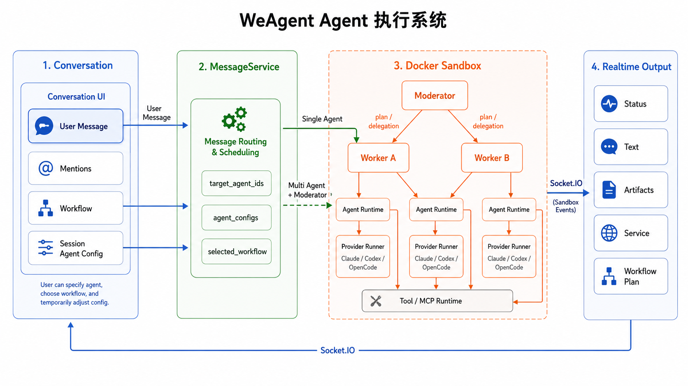

**图：WeAgent Agent 执行系统**

容器内 AgentRuntime 调用对应 Provider Runner 执行任务，并通过事件流、服务上报接口和 `weagent-report` 持续回传结果。`weagent-report` 是容器内提供给 Agent 或脚本使用的结构化上报命令行工具，用于把执行进度、文本结果、文件、表格、图片、服务、差异和错误按统一格式提交给容器控制面，再由后端事件桥接层写入消息系统。

该机制的关键点是把“执行过程”保存为可恢复状态。`Message.status` 表示用户可见消息状态，`AgentRun.status` 表示一次 Agent 执行状态，`Message.elements` 保存结构化产物，`Message.raw_output` 保存外部执行引擎的原始输出。刷新页面后，客户端不依赖内存中的流式片段，而是根据持久化消息重新渲染当前会话。

|阶段|说明|关键实现|
|---|---|---|
|写入用户消息|保存用户输入、目标 Agent、workflow 和会话级配置。|`backend/app/services/message_service.py`|
|创建 AgentRun|为每个需要执行的 Agent 创建运行记录。|`backend/app/models/agent_run.py`|
|容器内执行|AgentRuntime 选择 Provider Runner 并执行任务。|`backend/app/sandbox/container/agent.py`|
|上报执行元素|通过事件或 `weagent-report` 上报结构化产物。|`backend/app/sandbox/bin/weagent-report`、`backend/app/sandbox/container/orchestrator.py`|
|桥接并推送|更新 Message、AgentRun、元素列表和 Socket.IO 事件。|`backend/app/services/sandbox_event_bridge.py`|

`weagent-report` 支持的上报类型包括 `progress`、`result`、`summary`、`text`、`table`、`image`、`code`、`file`、`error` 和 `service`。这些类型不会全部写入独立 Artifact 表，而是优先以消息元素形式进入 `Message.elements`，由前端选择对应卡片和工作台能力进行展示。

### 5.4 多 Agent 协作与工作流调度

多 Agent 协作由主持 Agent、worker Agent 和工作流上下文共同完成。用户可以直接指定单个 Agent 执行任务，也可以在多 Agent 会话中让主持 Agent 根据用户目标、参与者能力和会话级配置生成任务计划。主持 Agent 的职责是理解任务、拆分子任务、选择 worker、组织并行或串行执行，并汇总最终结果。

工作流不是全局固定配置，而是会话轮次中的调度上下文。主持 Agent 生成的 plan、用户在工作流面板中编辑的节点图、以及消息中产生的 workflow 元素，都可以进入下一轮调度。后端接收客户端提交的 `workflow` payload 后，会将其转成容器可读取的工作流上下文，使主持 Agent 在下一轮优先按照该计划执行。

|对象|职责|持久化或传递位置|
|---|---|---|
|Moderator|生成任务计划、分配 worker、汇总结果。|会话参与者和消息上下文。|
|Worker Agent|执行被分配的具体任务。|Agent 配置、容器运行上下文。|
|Workflow Element|展示任务节点、连接关系和执行计划。|`Message.elements` 中的 `workflow`。|
|Selected Workflow|用户选择用于下一轮执行的工作流。|消息发送 payload 中的 `workflow`。|

工作流展示与文件产物需要保持类型边界。容器或主持 Agent 生成的任务计划如果表达的是调度结构，应在事件桥接阶段转换为 `workflow` 类型元素，由工作流预览窗口展示图形化计划，并保留可复制的 JSON 内容。普通文件产物仍按 `file` 类型处理，避免同一份调度数据在消息中同时以文件和工作流两种语义重复出现。

### 5.5 Adapter 适配器实现

Adapter 适配器是 WeAgent 支持多种底层 AI Coding 引擎的关键机制。平台中的 Agent 不直接绑定某一个 CLI 的调用细节，而是通过 `adapter_name` 选择 Claude Code、Codex 或 OpenCode 等 Provider Runner。Runner 负责封装不同 Provider 的命令构造、环境变量、认证文件、工作目录、输出读取、错误解析和停止行为。

这一层的价值在于隔离 Provider 差异。上层消息服务只需要表达“让某个 Agent 执行某个任务”，容器运行时根据 Agent 配置创建对应 Runner。后续新增 Provider 时，应优先实现新的 Provider Runner，而不是改动消息模型、会话模型或前端消息渲染逻辑。

|Provider 名称|Runner|主要配置|
|---|---|---|
|`claude` / `claude_code`|`ClaudeCodeRunner`|Claude Code CLI、认证信息、模型和执行参数。|
|`codex`|`CodexRunner`|`CODEX_API_KEY`、`CODEX_AUTH_JSON`、`CODEX_CONFIG_TOML`、relay 配置。|
|`opencode`|`OpenCodeRunner`|`OPENCODE_API_KEY`、`OPENCODE_BASE_URL`、`OPENCODE_MODEL`。|

关键文件路径如下：

|路径|职责|
|---|---|
|`backend/app/sandbox/container/providers/factory.py`|根据 `adapter_name` 创建 Provider Runner。|
|`backend/app/sandbox/container/providers/base.py`|定义 Runner 基类、执行超时、环境注入和错误处理公共逻辑。|
|`backend/app/sandbox/container/providers/codex.py`|Codex CLI 适配实现。|
|`backend/app/sandbox/container/providers/claude_code.py`|Claude Code CLI 适配实现。|
|`backend/app/sandbox/container/providers/opencode.py`|OpenCode CLI 适配实现。|
|`backend/app/sandbox/container/provider_health.py`|Provider 可用性检查。|

### 5.6 沙箱文件系统与服务代理

沙箱文件系统负责承载 Agent 的真实工作结果，服务代理负责把容器内启动的应用安全地暴露给用户预览。前端不直接访问 Docker 文件系统，也不直接访问容器端口；所有文件读取、写入、下载、HTML 预览、服务日志和服务代理都经过后端 API，再由后端转发到容器控制面。

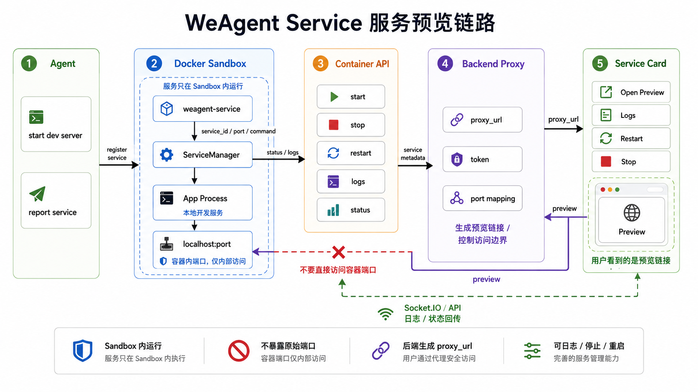

**图：WeAgent Service 服务预览链路**

文件访问链路需要处理两个特殊问题。第一，HTML 文件经常引用相对 CSS、JS、图片资源，因此后端在返回 HTML 时会注入或改写 base / workspace 路径，避免用户打开 HTML 后丢失样式。第二，文件产物可能来自消息元素而不一定存在于工作区文件树中，因此前端查看产物时需要区分“读容器文件”和“直接使用元素内联内容”。

|能力|说明|关键实现|
|---|---|---|
|文件树|列出容器工作区目录和文件。|`backend/app/sandbox/api/routes.py`|
|Raw 文件读取|读取文本、Markdown、代码、HTML、CSV 等内容。|`files/raw`、`workspace/<path>`|
|文件写入|支持工作台保存代码、HTML、图片和表格修改。|`files/write`|
|HTML 样式修正|注入 base，重写 workspace CSS / asset 引用。|`_inject_html_base`、`_rewrite_workspace_css`|
|服务代理|把容器内服务转成后端可访问的 proxy URL。|`services/*`、service proxy routes|
|服务日志|读取容器内服务运行日志。|`/workspace/.session/services/<service_id>/`|

服务预览链路以 `weagent-service` 或容器服务 API 为入口。Agent 启动服务后，容器登记 `service_id`、端口、命令、工作目录和日志路径，并上报 `service` 类型元素。后端为服务生成受控的 `proxy_url`，前端只展示这个代理链接和服务操作入口。

### 5.7 多类型产物预览与编辑适配

WeAgent 的产物系统不是单一数据库表，也不是普通附件列表。运行时产物主要来自 `Message.elements`、`Message.raw_output`、容器文件系统、服务状态和部分可复用 Artifact 记录。前端根据产物类型选择不同展示方式，并在需要编辑时进入工作台，把修改通过文件 API 写回容器。


**图：WeAgent Artifact / Workbench 文件闭环**

需要明确的是，`Artifact` 表不是所有产物的统一存储。当前 `Artifact` 模型主要服务于可复用产物记录，例如 code、webpage、document、ppt 和 diff。大量运行时产物，尤其是 progress、result、file、image、table、service、workflow、raw output 等，主要保存在消息元素、消息原始输出或容器工作区中。后续维护产物逻辑时，不能假设查询 Artifact 表就能得到会话中的全部产物。

|产物类型|主要来源|展示方式|编辑方式|
|---|---|---|---|
|代码|`Message.elements` 或工作区文件。|代码块、代码产物卡片、工作台。|CodeEditor 写回 `files/write`。|
|HTML / 页面|工作区 HTML 文件或网页类 Artifact。|页面预览、HTML 编辑器。|HtmlPageEditor 保存 HTML / CSS / asset 变更。|
|图片|`image` 元素或工作区图片文件。|图片卡片、预览弹窗。|ImageCropper / 图片编辑后写回文件。|
|表格|`table` 元素或 CSV / JSON 文件。|表格卡片、抽屉预览。|内联表格数据编辑或 CSV 写回。|
|文件|`file` 元素和容器文件树。|文件产物卡片、文件查看器。|按文件类型进入代码、Markdown、表格或图片编辑。|
|Diff|文件变化捕获或 diff Artifact。|DiffViewCard。|查看差异、复制或进入后续修正链路。|
|服务|`service` 元素。|服务卡片、代理链接、日志入口。|启动、停止、重启和查看日志。|
|工作流|`workflow` 元素。|工作流卡片和全屏预览。|图形编辑后作为下一轮 workflow payload。|

关键前端实现包括 `frontend/src/components/ArtifactWorkbench/index.vue`、`frontend/src/components/CodeEditor/index.vue`、`frontend/src/components/HtmlPageEditor/index.vue`、`frontend/src/components/ImageCropper/index.vue`、`frontend/src/components/DiffViewCard/index.vue`，桌面端在 `clients/desktop/src/components/` 下保留对应实现。Web 与 Desktop 的工作台能力应保持语义一致，但可以根据端形态调整布局。

### 5.8 会话级 Agent 配置合并

会话级 Agent 配置用于临时调整当前会话内 Agent 的角色、提示词、技能、启用状态和适配器，不回写全局 Agent。这个机制解决了同一个全局 Agent 在不同会话中需要不同工作方式的问题，例如只在当前会话中修改 skill 或临时禁用某个 worker。

客户端在发送消息时把会话级配置放入 `agent_configs` payload。后端 schema 必须显式允许该字段，并由消息服务进行规范化、过滤和合并。合并后的配置只进入当前消息执行上下文和主持 Agent 可见的团队描述，不修改 Agent 表中的全局字段。

|字段|作用|处理边界|
|---|---|---|
|`role`|当前会话内显示或调度用角色名。|只在当前会话执行上下文生效。|
|`system_prompt`|覆盖当前会话中的系统提示词。|不回写全局 Agent。|
|`skill`|覆盖当前会话中的能力说明。|主持 Agent 调度和 worker 执行时读取。|
|`enabled`|控制多 Agent 会话中是否允许分配任务。|只影响当前会话。|
|`adapter_name`|当前会话内使用的 Provider 适配器。|覆盖执行时 Runner 选择，不修改默认适配器。|

关键实现路径包括 `backend/app/schemas/message_schema.py` 中的 `agent_configs` 字段，以及 `backend/app/services/message_service.py` 中的 `_normalize_session_agent_configs`、`_apply_session_agent_configs`、`_disabled_session_agent_ids` 等逻辑。维护该链路时，需要保证请求 schema、客户端 payload 和消息服务合并逻辑同步更新，否则会出现字段被拒绝或配置未进入执行上下文的问题。

### 5.9 能力 / 工具投影与 MCP Runtime

能力 / 工具系统把 Skill、Tool、MCP 和 Plugin 管理为可导入、可审查、可版本化、可绑定和可投影的运行能力。平台侧保存能力元数据、版本、绑定关系和调用记录；会话创建或恢复时，后端把当前 Agent 可用能力投影到容器内的 `.weagent` 目录，AgentRuntime 读取的是这个会话局部能力视图。

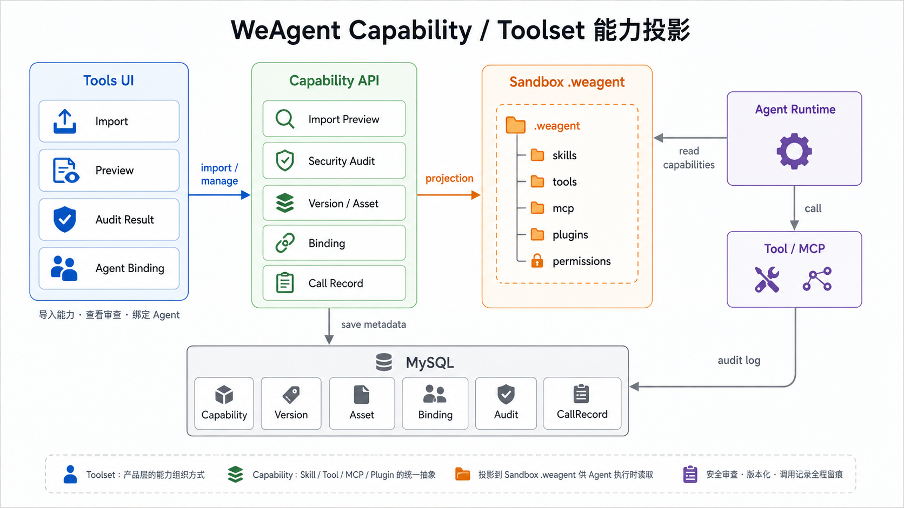

**图：WeAgent Capability / Toolset 能力投影**

MCP Runtime 负责在容器内启动 MCP server、列出工具、调用工具并停止运行时。这样 Agent 可以通过统一的能力投影发现工具，再通过 MCP Runtime 或工具调用入口执行具体能力。能力系统的重点不是简单展示“有哪些工具”，而是把工具可见性、授权边界和调用审计纳入会话运行链路。

|组件|职责|关键路径|
|---|---|---|
|Capability API|能力导入、预览、绑定、审计和调用记录。|`backend/app/controllers/capability_controller.py`|
|Projection Service|生成当前会话可见的能力视图。|`backend/app/services/capability_projection_service.py`|
|Sandbox Projection|把能力视图写入容器工作区。|`backend/app/sandbox/host/manager.py`、`backend/app/sandbox/container/capabilities.py`|
|MCP Runtime|启动、调用和停止 MCP server。|`backend/app/sandbox/container/mcp_runtime.py`|
|Tool Provider Config|保存外部工具服务配置。|`backend/app/models/tool_provider_config.py`、`backend/app/services/tool_provider_config_service.py`|

能力系统的篇幅低于 Adapter、沙箱和产物系统，但它是 Agent 可扩展能力的基础。后续新增工具时，应优先确认能力是否需要版本化、是否需要绑定到 Agent、是否需要投影到容器、是否需要调用审计，而不是直接在 Agent 执行链路中硬编码工具调用。

### 5.10 安全、隔离与错误处理

WeAgent 的安全设计目标是在允许 Agent 执行真实任务的同时，限制执行环境、文件访问、服务暴露、工具调用和凭据使用的边界。系统不把安全控制集中在单个入口，而是通过用户会话、后端 API、Docker Sandbox、能力投影、Provider Runner 和错误回写共同形成多层防护。这样即使某一层出现配置错误，后续链路仍然能够提供隔离、审计或可见的失败状态。

核心安全边界包括五类：用户与会话权限边界、后端 API 边界、Docker Sandbox 运行边界、能力 / 工具授权边界、Provider 凭据边界。前端不能直接访问容器文件系统和容器服务端口；Agent 不能越过当前 sandbox session 的工作区；工具能力必须经过导入审查、版本绑定和会话投影；Provider 凭据只在容器执行环境中按需注入，不应通过消息内容、产物元素或前端配置直接暴露。

|安全边界|设计目标|实现方式|
|---|---|---|
|用户与会话|保证用户只能访问自己有权限的会话、消息、文件和服务。|后端控制器基于登录态和会话归属校验资源访问。|
|后端 API|把客户端操作收敛到受控接口，避免前端直接进入容器控制面。|文件、服务、消息、能力和配置均通过 Flask API 转发或处理。|
|Docker Sandbox|隔离 Agent 执行环境、工作区文件、服务进程和工具运行。|每个 Agent 会话绑定 sandbox session，容器内使用 `/workspace` 作为运行边界。|
|能力 / 工具|控制 Agent 在当前会话中能看到和能调用的能力。|能力导入审查、Agent 绑定、会话投影、MCP Runtime 调用记录。|
|Provider 凭据|避免 Codex、Claude Code、OpenCode 等凭据泄漏到前端或消息内容。|Provider Runner 在容器内读取环境变量或认证文件，并将错误输出结构化回写。|

文件和服务代理是安全设计中的关键环节。文件读取、写入、下载、HTML 预览和图片访问都由后端代理到容器，不允许客户端直接拼接容器内部路径访问文件。服务预览同样不暴露容器端口，而是由后端生成受控 `proxy_url`，再按 session、service 和 token 校验后转发请求。HTML 文件返回时还需要处理 base 注入和 workspace 资源改写，避免预览页面因为相对路径访问失败而诱导用户绕过代理路径。

能力系统提供运行时工具调用的安全约束。Skill、Tool、MCP 和 Plugin 不会在创建后自动对所有 Agent 生效，而是先进入能力库，再绑定到 Agent，最后在会话创建或恢复时投影到容器内 `.weagent` 目录。MCP Runtime 的启动、调用和停止都应与当前 session 关联，调用记录应保留工具名称、参数摘要、结果状态和错误信息，便于后续审计和故障定位。

错误处理是安全体系的一部分。Provider CLI 不存在、认证失败、容器镜像缺失、sandbox API 404、文件代理失败、服务启动失败、工作流渲染异常、产物读取失败等问题，都不能只停留在后端日志里。后端需要更新 `Message.status`、`AgentRun.status`、`Message.raw_output` 或错误元素，并通过 Socket.IO 推送给客户端。用户看到明确失败状态后，才能判断是配置问题、沙箱问题、Provider 问题还是产物渲染问题。

|风险或错误|处理原则|定位入口|
|---|---|---|
|容器镜像不存在|阻止创建会话或执行，并提示构建 sandbox 镜像。|`backend/app/sandbox/host/manager.py`|
|sandbox API 404|检查宿主后端调用路径与容器端 routes 是否一致，避免代理路径和容器控制面不匹配。|`backend/app/sandbox/api/routes.py`|
|Provider 认证失败|保留 Provider stderr / raw output，提示配置 API Key、认证文件、Base URL 或模型参数。|`backend/app/sandbox/container/providers/*`|
|Provider 输出异常|将 stderr、退出码和超时状态写入 AgentRun 与 raw output，避免前端只显示“发送失败”。|`backend/app/sandbox/container/providers/base.py`|
|文件访问越界|规范化路径，限制访问当前 workspace 和允许的 session 目录。|文件代理和 `files/raw`、`files/write` 路由。|
|HTML 无样式|检查 HTML base 注入和 workspace asset 重写，确保预览仍经过后端代理。|`_inject_html_base`、`_rewrite_workspace_css`|
|服务预览失败|校验 session、service、token、容器状态和服务端口，避免直接暴露容器端口。|`services/*`、service proxy routes|
|表格产物不在目录|优先使用 `table` 元素内联列和行渲染，不强制读取文件。|消息元素渲染和产物抽屉。|
|头像或上传文件异常|避免把超长 base64 写入短字段，优先保存为上传文件 URL。|`backend/app/controllers/upload_controller.py`、用户模型。|
|实时事件丢失|刷新后必须能通过消息接口恢复 `elements` 和 `raw_output`。|`Message.elements`、`Message.raw_output`。|

安全边界不等于限制系统扩展。WeAgent 允许 Agent 启动服务、写文件、调用工具和生成可编辑产物，但这些能力必须经由 sandbox、后端代理、能力投影、Provider Runner 和消息状态回写形成闭环。后续新增 Provider、MCP 工具、文件编辑器或服务代理能力时，需要优先确认权限边界、凭据注入方式、错误回写路径和审计记录是否完整。

## 6. 关键数据流

本章从数据来源、处理模块、持久化位置和前端展示位置四个角度说明 WeAgent 的关键链路。每条数据流都强调真实系统中的状态转移：同步 API 只负责提交请求或读取状态，Agent 执行结果主要通过容器事件、消息状态和结构化元素逐步回传。这样可以避免把一次 HTTP 响应误理解为最终执行结果来源，也便于维护者定位数据丢失、刷新恢复失败、实时推送异常和产物展示不一致等问题。

数据流中的核心实体包括 `Conversation`、`Message`、`AgentRun`、`Message.elements`、`Message.raw_output`、sandbox session、容器工作区文件和能力投影文件。前端展示不是独立数据源，而是这些后端状态和容器状态的投影；页面刷新后，应能够通过持久化消息、文件 API 和服务 API 恢复主要展示状态。

### 6.1 创建会话数据流

创建会话数据流负责把用户选择的 Agent、会话类型和标题转化为后端可执行的会话上下文。设计重点是先建立会话元数据和参与者关系，再绑定 sandbox session。这样即使后续容器创建失败，也可以明确区分是会话参数错误、Agent 配置错误，还是沙箱启动问题。

流程如下：


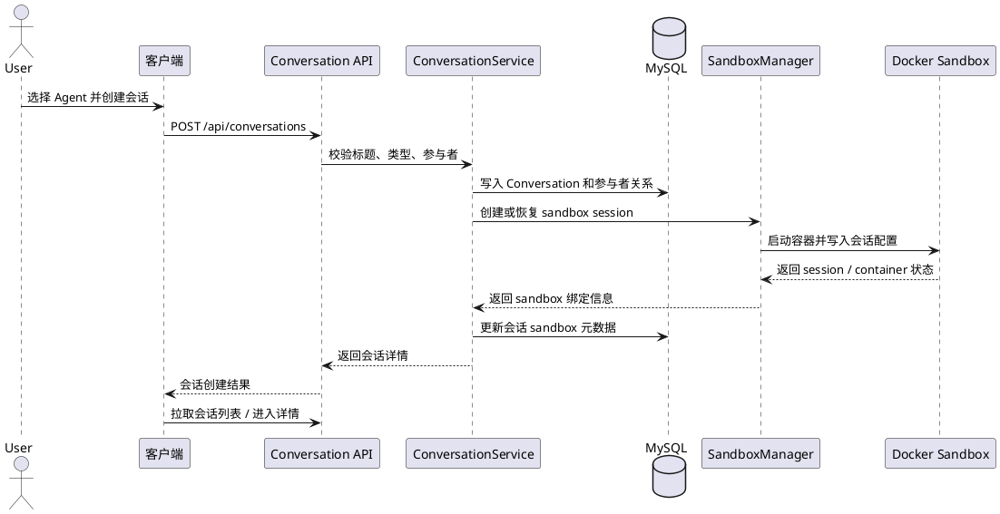

1. 客户端提交会话标题、类型和参与者 Agent。
2. `conversation_service.py` 校验参与者，创建 `Conversation` 和参与者关系。
3. 多 Agent 会话补充主持 Agent，并生成用于展示的会话名称。
4. Sandbox manager 创建或恢复 sandbox session。
5. 后端把 Agent 配置和能力投影写入容器。
6. 客户端刷新会话列表，并在进入详情页后读取消息和实时事件。

|维度|说明|
|---|---|
|数据来源|Web / Desktop / Android 的新建会话请求。|
|处理模块|`backend/app/services/conversation_service.py`、`backend/app/sandbox/host/manager.py`。|
|最终存储|`Conversation`、会话参与者关系、sandbox session 元数据、容器工作区配置。|
|前端展示|会话列表、会话标题、参与者头像、会话详情入口。|

### 6.2 单 Agent 消息执行数据流

单 Agent 消息执行链路用于处理用户明确选择一个 Agent 或会话只有一个 worker Agent 的场景。设计重点是把用户消息、Agent 占位消息、执行记录和容器运行解耦：发送消息 API 不直接返回最终答案，而是触发一个可追踪的异步执行过程。

流程如下：

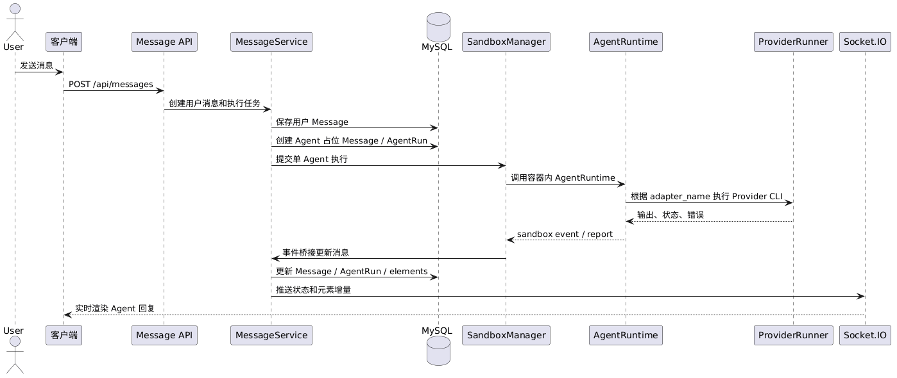

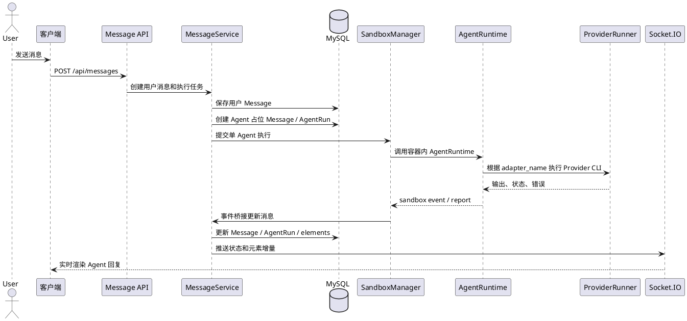

1. 客户端发送用户输入、目标 Agent、会话级配置和可选 workflow。
2. `message_service.py` 写入用户 `Message`。
3. 后端创建 Agent 回复占位消息和对应 `AgentRun`。
4. 容器内 AgentRuntime 根据 Agent 配置选择 Provider Runner。
5. Provider Runner 调用 Claude Code、Codex 或 OpenCode。
6. 输出、状态和产物通过 sandbox event 回传。
7. 前端通过 Socket.IO 更新消息状态和消息元素。

|维度|说明|
|---|---|
|数据来源|用户输入、会话参与者、目标 Agent、`agent_configs`、可选 `workflow`。|
|处理模块|`message_service.py`、`agent.py`、`providers/*`、`sandbox_event_bridge.py`。|
|最终存储|用户消息、Agent 消息、`AgentRun`、`Message.elements`、`Message.raw_output`。|
|前端展示|用户消息在右侧，Agent 消息在左侧，状态、进度、结果和产物卡片实时更新。|

### 6.3 多 Agent 协作数据流

多 Agent 协作链路在单 Agent 执行之上增加主持 Agent 的计划生成和任务分配。设计重点是让主持 Agent 负责调度决策，worker Agent 负责具体任务执行，并把同一轮用户任务下的多个 AgentRun 关联到同一个执行轮次，方便前端展示团队协作过程和最终汇总结果。

流程如下：


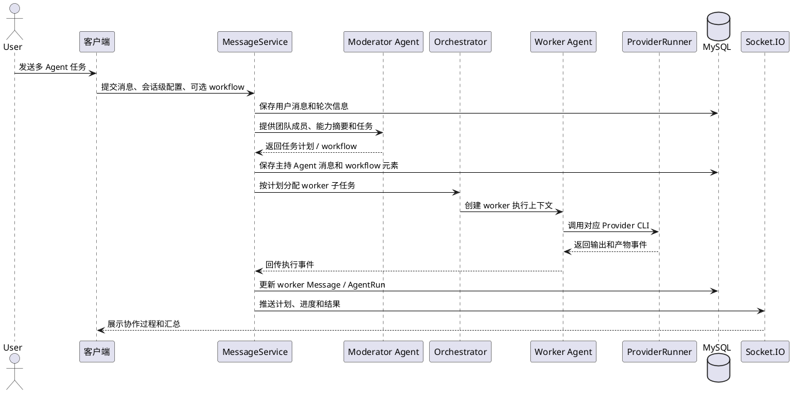

1. 用户在多 Agent 会话中发送任务。
2. `message_service.py` 读取会话参与者、禁用状态和会话级 Agent 配置。
3. 主持 Agent 获取团队成员、能力摘要和用户任务，生成执行计划。
4. 系统按计划创建 worker AgentRun，并把子任务交给对应 Agent。
5. worker Agent 在容器内调用各自 Provider Runner 执行。
6. 主持 Agent 或后端汇总执行结果，生成最终可见消息。
7. 工作流计划以 `workflow` 元素形式进入消息展示。

|维度|说明|
|---|---|
|数据来源|用户任务、会话参与者、主持 Agent、worker Agent、会话级配置。|
|处理模块|`message_service.py`、容器 Orchestrator、Provider Runner、`sandbox_event_bridge.py`。|
|最终存储|同一轮次下的多条 Agent 消息、多个 `AgentRun`、计划和结果元素。|
|前端展示|主持 Agent 计划、worker 执行状态、最终汇总、工作流预览。|

### 6.4 Sandbox Event 回传数据流

Sandbox event 是容器执行状态进入后端消息系统的核心通道。设计重点是容器只负责上报结构化事件，后端负责将事件转换成消息状态、运行状态和前端实时事件。这样可以把容器内的执行细节与前端展示协议隔离开。

流程如下：


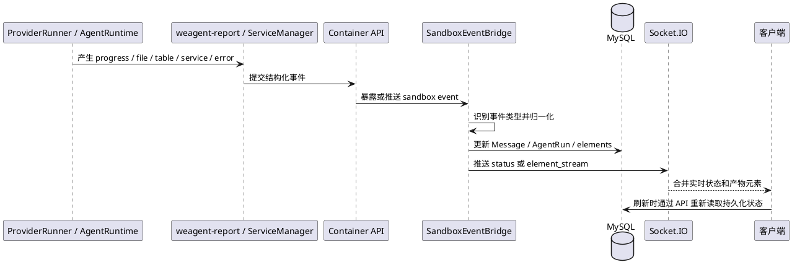

1. 容器内 Provider Runner、AgentRuntime、`weagent-report` 或服务管理器产生事件。
2. 容器控制面把事件暴露给宿主后端或主动上报。
3. `sandbox_event_bridge.py` 根据事件类型更新 `Message`、`AgentRun` 和元素列表。
4. 后端通过 Socket.IO 推送 `conversation_message_status` 或 `conversation_message_element_stream`。
5. 客户端按 message id 和 element id 合并实时更新。

|事件类型|处理结果|前端表现|
|---|---|---|
|progress / text|追加进度或文本元素。|显示当前进度、阶段历史或文本结果。|
|file / image / table / code|追加结构化产物元素。|显示产物卡片、表格、图片或代码块。|
|service|补全服务状态和代理入口。|显示服务预览、日志、停止和重启入口。|
|workflow|转换为工作流元素。|显示工作流卡片和预览入口。|
|error / stopped|更新消息和 AgentRun 状态。|显示失败、停止或可恢复提示。|

### 6.5 产物生成与刷新恢复数据流

产物数据流用于说明 Agent 输出如何从容器事件变成前端可查看、可编辑、可恢复的内容。设计重点是区分运行时消息元素、容器文件和 Artifact 表：`Artifact` 表不是所有产物的统一存储，刷新恢复主要依赖 `Message.elements`、`Message.raw_output`、文件 API 和服务 API 的组合。

流程如下：


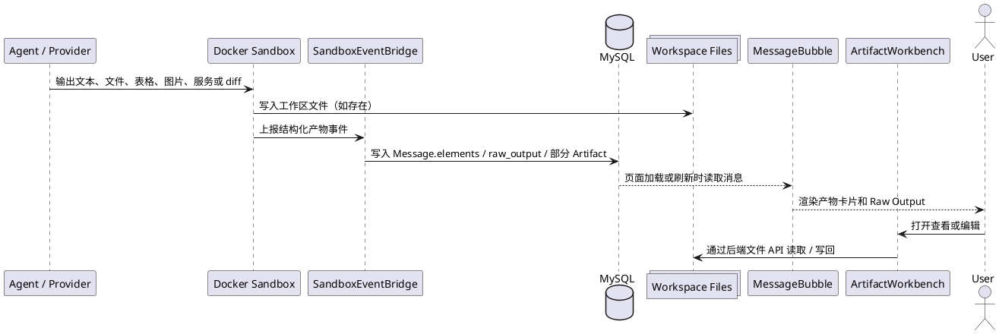

1. Agent 通过 Provider 输出、`weagent-report`、文件写入或服务启动产生结果。
2. 容器将结果转成结构化事件或工作区文件。
3. 事件桥接层把结果写入 `Message.elements`、`Message.raw_output` 或相关 Artifact 记录。
4. 前端消息组件按类型渲染代码、文件、图片、表格、服务、diff 和工作流。
5. 页面刷新后，客户端重新读取消息列表，再按元素类型补充文件内容、服务状态或预览数据。

|维度|说明|
|---|---|
|数据来源|Provider 输出、sandbox event、容器文件系统、服务状态。|
|处理模块|`sandbox_event_bridge.py`、消息元素构建逻辑、Artifact / Workbench 相关组件。|
|最终存储|`Message.elements`、`Message.raw_output`、容器工作区文件、部分 `Artifact` 记录。|
|前端展示|消息产物卡片、产物抽屉、Artifact Workbench、Raw Output、服务卡片。|

### 6.6 文件预览与写回数据流

文件预览与写回链路负责把容器工作区文件安全地暴露给前端编辑器。设计重点是前端不直接访问容器路径，所有读写都经过后端文件 API；工作台编辑后的内容也必须写回当前 sandbox session 的工作区，才能被后续 Agent 继续读取。

流程如下：


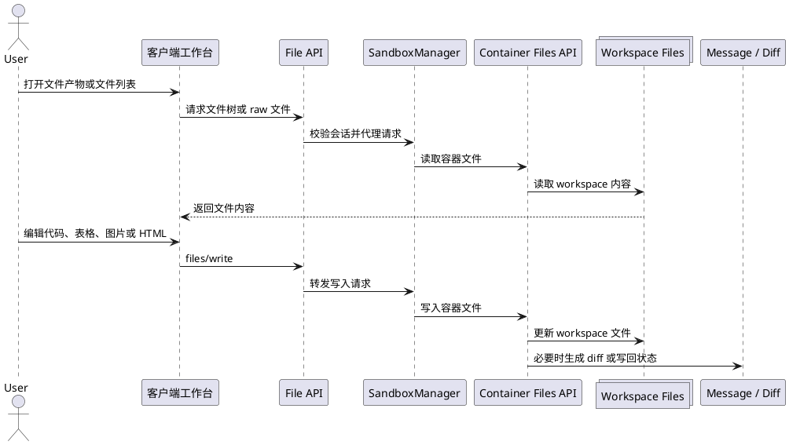

1. 用户点击文件产物、文件列表或工作台入口。
2. 前端根据元素中的路径、文件名和类型请求文件内容；如果元素内置内容可直接展示，则不强制读取文件。
3. 后端文件 API 代理到容器控制面读取 raw file 或文件树。
4. 用户在 CodeEditor、表格编辑器、图片编辑器或 HTML 编辑器中修改内容。
5. 前端通过 `files/write` 提交修改。
6. 容器写入工作区文件，必要时产生 diff 或更新产物状态。

|维度|说明|
|---|---|
|数据来源|文件产物元素、容器文件树、工作台编辑内容。|
|处理模块|Sandbox 文件 API、`ArtifactWorkbench`、`CodeEditor`、图片 / 表格 / HTML 编辑组件。|
|最终存储|容器工作区文件，必要时补充 diff 元素或消息记录。|
|前端展示|文件查看器、代码编辑器、图片编辑器、表格编辑器、diff 预览。|

### 6.7 HTML 预览数据流

HTML 预览链路是文件预览的特殊场景。设计重点是解决 Agent 生成页面后 CSS、JS、图片等相对资源无法加载的问题。系统不能要求用户手动调整路径，而应在后端代理层处理 base 注入和 workspace 资源改写，使页面预览仍然保持在受控访问路径内。

流程如下：


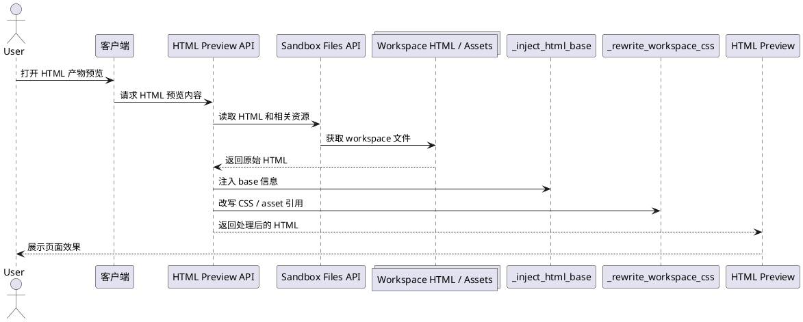

1. 用户点击 HTML 文件或网页产物的预览入口。
2. 前端请求后端 HTML 预览或 raw 文件接口。
3. 后端读取容器工作区 HTML 内容。
4. `_inject_html_base` 注入 base 信息，`_rewrite_workspace_css` 修正 workspace 资源引用。
5. 前端在预览区域或新窗口展示处理后的 HTML。
6. 用户编辑 HTML / CSS 后，通过工作台写回容器文件。

|维度|说明|
|---|---|
|数据来源|容器工作区 HTML、CSS、JS、图片等资源文件。|
|处理模块|`backend/app/sandbox/api/routes.py`、HTML base 注入和资源改写逻辑。|
|最终存储|原始文件仍保存在容器工作区，预览内容由后端按请求动态处理。|
|前端展示|HTML 预览、网页编辑器、服务预览入口。|

### 6.8 工作流预览与复用数据流

工作流数据流负责把主持 Agent 的调度计划从文本或 JSON 转换成可预览、可编辑、可复用的任务图。设计重点是将工作流作为调度语义处理，而不是简单当作普通 JSON 文件展示。用户在前端选择某个工作流后，该工作流会进入下一轮消息 payload，成为主持 Agent 调度的输入约束。

流程如下：


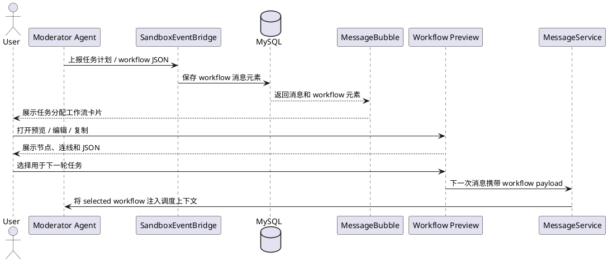

1. 主持 Agent 生成任务计划，或用户在工作流面板中编辑计划。
2. 后端事件桥接层将计划转换为 `workflow` 消息元素。
3. 前端消息卡片展示“任务分配工作流”入口。
4. 用户点击预览后打开工作流窗口，查看节点、连线和 JSON 内容。
5. 用户选择使用该工作流时，客户端在下一次发送消息时携带 `workflow` payload。
6. 后端将该 payload 转换为主持 Agent 可读取的工作流上下文。

|维度|说明|
|---|---|
|数据来源|主持 Agent plan、workflow 消息元素、用户编辑的工作流图。|
|处理模块|`message_service.py`、`sandbox_event_bridge.py`、前端 Workflow 相关组件。|
|最终存储|`Message.elements` 中的 `workflow`，以及下一轮消息 payload 中的 selected workflow。|
|前端展示|工作流卡片、全屏预览窗口、JSON 复制和复用入口。|

### 6.9 能力投影数据流

能力投影数据流用于说明 Skill、Tool、MCP 和 Plugin 如何从平台能力库进入容器运行时。设计重点是 Agent 执行时不直接读取全局能力库，而是读取当前会话、当前 Agent 可见的投影视图。这样可以支持不同 Agent、不同会话拥有不同能力边界，并为工具调用审计提供基础。

流程如下：


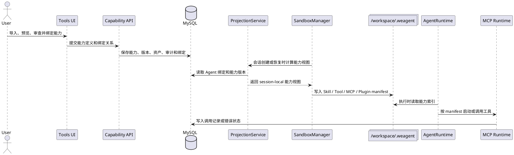

1. 用户通过工具集导入、预览、审查和确认能力。
2. 后端保存能力、版本、资产、安全审计和 Agent 绑定关系。
3. 会话创建或恢复时，Projection Service 计算当前 Agent 可用能力。
4. Sandbox manager 将能力视图写入容器 `/workspace/.weagent/*`。
5. AgentRuntime 读取 session-local 能力索引、Skill 文件、Tool manifest、MCP manifest 或 Plugin manifest。
6. MCP Runtime 根据 manifest 启动工具服务、列出工具并执行调用。
7. 调用结果和错误进入能力调用记录或消息事件。

|维度|说明|
|---|---|
|数据来源|能力导入文件、MCP manifest、Tool / Plugin 定义、Agent 绑定关系。|
|处理模块|`capability_controller.py`、`capability_projection_service.py`、Sandbox manager、`mcp_runtime.py`。|
|最终存储|能力表、能力版本、绑定关系、调用记录、容器 `.weagent` 投影文件。|
|前端展示|我的工具集、Agent 能力配置、会话执行时的工具可用范围和调用结果。|

## 7\. 开发者部署、运行与验证

本章面向开发者说明如何启动、构建和验证 WeAgent。运行步骤和验证入口放在同一章，便于开发者在本地部署后立即确认关键链路是否可用。

### 7\.1 环境要求

开发环境需要准备：

- Python 3\.10\+

- Node\.js 18\+

- MySQL 8\.0\+

- Redis，建议 Redis 7\.x

- Docker Desktop

- Android Studio / Gradle，只有构建 Android 时需要

### 7\.2 后端启动

以下命令用于创建 Python 虚拟环境、安装依赖并启动后端。

```powershell
cd backend
python -m venv venv
.\venv\Scripts\Activate.ps1
pip install -r requirements.txt
Copy-Item .env.example .env
python run.py
```

预期结果：后端默认监听 `5002` 端口。启动前需要把 `backend/.env` 中的 MySQL、Redis 和密钥配置改成可用值。

最小 `.env` 示例用于说明必填配置形状。

```env
FLASK_ENV=development
MYSQL_HOST=localhost
MYSQL_PORT=3306
MYSQL_USER=root
MYSQL_PASSWORD=your_password_here
MYSQL_DB=weagent
REDIS_HOST=localhost
REDIS_PORT=6379
REDIS_DB=0
REDIS_PASSWORD=
JWT_SECRET_KEY=change-this-to-a-random-secret-key
SECRET_KEY=change-this-to-another-random-key
```

注意事项：示例密钥只用于说明配置形状，真实部署需要替换为随机生成的安全密钥。

### 7\.3 Web 前端启动

以下命令用于启动 Web 工作台开发服务。

```powershell
cd frontend
npm install
npm run serve
```

预期结果：Vue CLI 开发服务启动，通常可通过 `http://localhost:8080` 访问。

### 7\.4 桌面端启动与构建

以下命令用于启动 Electron Desktop 开发环境。

```powershell
cd clients/desktop
npm install
npm run dev
```

预期结果：Vite dev server 启动后 Electron 窗口打开。首次使用需要配置后端 `serverUrl`。

以下命令用于构建桌面端安装包。

```powershell
npm run electron:build
```

预期结果：构建产物输出到 `clients/desktop/release/`。由于桌面端使用 Vite 5，建议使用 Node\.js 18\+。

### 7\.5 Android 启动与构建

以下命令用于构建 Android 客户端并同步 Capacitor 工程。

```powershell
cd clients/android
npm install
npm run build
npx cap add android
npx cap sync android
npx cap open android
```

预期结果：Android Studio 打开 Android 工程。移动端连接电脑后端时不能使用手机自身的 `localhost`，应使用局域网 IP 或公网后端地址。

### 7\.6 容器镜像构建

以下命令用于构建 Agent 执行容器镜像。

```powershell
cd backend
docker build -t weagent-sandbox:latest -f app/sandbox/Dockerfile app/sandbox
```

预期结果：本地出现 `weagent-sandbox:latest` 镜像。Docker Desktop 必须处于运行状态。

### 7\.7 外部执行引擎配置

外部执行引擎配置从 Settings API 保存到 `UserModelConfig`，再由 `settings_service.get_container_env_vars()` 投影到容器环境变量。

当前会投影的关键环境变量包括：

- `ANTHROPIC_API_KEY`

- `ANTHROPIC_BASE_URL`

- `ANTHROPIC_MODEL`

- `CODEX_API_KEY`

- `CODEX_BASE_URL`

- `CODEX_MODEL`

- `CODEX_USE_RELAY`

- `CLAUDE_CODE_DISABLE_NONESSENTIAL_TRAFFIC`

注意事项：`temperature` 和 `max_tokens` 是已保存字段，但当前实现中尚未确认它们已经投影给 provider runner。

### 7\.8 常见开发调试命令

以下命令用于确认后端健康状态。

```powershell
Invoke-RestMethod http://localhost:5002/api/health
```

预期结果：返回 `status` 为 `healthy` 的响应。

以下命令用于查看 WeAgent 管理的容器。

```powershell
docker ps --filter label=weagent.managed=true
```

预期结果：当存在运行中的会话时，可以看到对应 Sandbox 容器。

以下命令用于检查 sandbox 镜像。

```powershell
docker image ls weagent-sandbox
```

预期结果：能看到 `weagent-sandbox` 镜像和 tag。

### 7\.9 验证路径

完整 smoke 验证状态为 `待确认`。下表不是测试报告，而是开发者交付前应执行的验证入口：先确认后端和前端能构建，再验证桌面端、Android、Sandbox 镜像和关键人工链路。这样可以区分“系统结构已说明”和“运行验证已完成”。

|验证项|命令或入口|说明|
|---|---|---|
|后端测试|`cd backend; python -m pytest -q`|覆盖 capability、sandbox、provider、service proxy、model config、文件迁移等方向。|
|前端 contract tests|逐个运行 `frontend/tests/*.test.js`|`frontend/package.json` 当前没有 `test` script，因此验证命令不是 `npm test`。|
|Web 构建|`cd frontend; npm run build`|验证 Vue CLI build。|
|桌面端构建|`cd clients/desktop; npm run build; npm run electron:build`|验证 Vite build 和 electron\-builder。|
|Android 构建|`cd clients/android; npm run build; npx cap sync android`|验证 Capacitor Android 构建路径。|
|Sandbox 镜像|`cd backend; docker build -t weagent-sandbox:latest -f app/sandbox/Dockerfile app/sandbox`|依赖 Docker Desktop。|
|工作流图手动验证|多 Agent 会话中触发主持 Agent plan|检查 `workflow` 卡片、预览、编辑、保存并使用。|
|文件迁移手动验证|源会话生成文件后执行 preview 和 migrate|检查路径映射、冲突、跳过项和目标会话迁移结果消息。|

以下命令用于运行前端 contract tests。

```powershell
cd frontend
Get-ChildItem -Path tests -Filter *.test.js | ForEach-Object { node $_.FullName }
```

预期结果：每个测试文件由 Node\.js 执行完成。该验证路径与 `npm test` 不同。

## 8. 关键接口与数据模型

本章说明 WeAgent 对外 API 和关键数据模型的真实边界。接口部分按业务域列出主要路由，便于维护者从功能入口定位到 controller、service 和 sandbox 代理实现；数据模型部分只解释影响会话执行、产物恢复、沙箱绑定和能力投影的核心字段，不展开完整数据库字典。需要特别注意，消息产物、Artifact 记录、容器文件和工作台状态不是同一个概念，维护接口时应避免把它们混为单一数据源。

### 8.1 关键接口

WeAgent 的 HTTP 接口分为两层：宿主后端 API 和容器内部 API。客户端只直接访问宿主后端 API；容器内部 API 由宿主后端通过 sandbox manager 调用，用于管理 Agent、文件、服务、MCP 和事件。下面表格列出宿主后端的主要路由组，路径前缀来自 `backend/app/__init__.py` 中的 blueprint 注册。

|接口域|主要路由|职责|关键实现|
|---|---|---|---|
|健康检查|`GET /api/health`|检查宿主后端是否可用。|`backend/app/__init__.py`|
|上传资源|`GET /uploads/<path:filename>`|访问已上传头像、附件或静态上传文件。|`backend/app/__init__.py`|
|认证|`POST /api/auth/register`、`POST /api/auth/login`、`GET/PUT /api/auth/profile`、`POST /api/auth/refresh`|注册、登录、读取和修改用户资料、刷新 token。|`backend/app/controllers/auth_controller.py`|
|设置|`GET/POST /api/settings/model-config`|读取和保存用户模型配置，供 Provider Runner 注入环境。|`backend/app/controllers/settings_controller.py`|
|会话|`GET/POST /api/conversations`、`GET/DELETE /api/conversations/<conversation_id>`、`POST/PATCH /api/conversations/<conversation_id>/favorite`|创建、读取、删除、收藏会话。|`backend/app/controllers/conversation_controller.py`|
|会话参与者|`POST /api/conversations/<conversation_id>/participants`、`DELETE /api/conversations/<conversation_id>/participants/<participant_type>/<participant_id>`|添加或移除会话参与者。|`backend/app/controllers/conversation_controller.py`|
|会话控制与附件|`POST /api/conversations/<conversation_id>/agents/<agent_id>/stop`、`GET/POST/DELETE /api/conversations/<conversation_id>/attachments`|停止 Agent、管理会话附件。|`backend/app/controllers/conversation_controller.py`|
|消息|`POST /api/messages`、`GET /api/messages/conversation/<conversation_id>`、`POST /api/messages/<message_id>/pin`、`GET /api/messages/conversation/<conversation_id>/pinned`|发送消息、读取消息、固定消息。|`backend/app/controllers/message_controller.py`|
|消息降级读取|`GET /api/messages/poll/<conversation_id>`、`GET /api/messages/stream/<conversation_id>`|为非 Socket.IO 场景提供轮询或 SSE 读取路径。|`backend/app/controllers/message_controller.py`|
|Agent|`GET/POST /api/agents`、`GET/PUT/DELETE /api/agents/<agent_id>`、`GET/POST /api/agents/categories`、`PUT/DELETE /api/agents/categories/<category_id>`|管理全局 Agent 和分类。|`backend/app/controllers/agent_controller.py`|
|Agent 能力绑定|`POST/GET /api/agents/<agent_id>/capabilities`、`GET /api/agents/<agent_id>/capabilities/upgrades`、`PUT/DELETE /api/agents/<agent_id>/capabilities/<binding_id>`|管理 Agent 与能力版本之间的绑定。|`backend/app/controllers/capability_controller.py`|
|Artifact|`POST /api/artifacts`、`GET/PUT /api/artifacts/<artifact_id>`、`GET /api/artifacts/message/<message_id>`|创建、读取、按消息查询和更新可复用 Artifact 记录。|`backend/app/controllers/artifact_controller.py`|
|旧 Tool|`GET/POST /api/tools`、`GET/PUT/DELETE /api/tools/<tool_id>`|保留旧工具管理入口。|`backend/app/controllers/tool_controller.py`|
|Toolset|`GET/POST /api/toolsets/categories`、`PUT/DELETE /api/toolsets/categories/<category_id>`|管理工具集分类。|`backend/app/controllers/toolset_controller.py`|
|Capability|`GET /api/capabilities`、`POST /api/capabilities/import/*`、`POST /api/capabilities/import/confirm`、`GET/POST /api/capabilities/<capability_id>/versions`|能力列表、导入预览、确认导入、版本管理。|`backend/app/controllers/capability_controller.py`|
|Capability 审计与调用|`GET /api/capabilities/drafts`、`POST /api/capabilities/drafts/*`、`GET /api/capabilities/calls`、`POST /api/capabilities/calls/sync`、`GET /api/capabilities/<capability_id>/audits`|草稿、调用记录和安全审计。|`backend/app/controllers/capability_controller.py`|
|Tool Provider 配置|`GET/POST /api/capabilities/<capability_id>/provider-configs`、`PUT/DELETE /api/capabilities/<capability_id>/provider-configs/<config_id>`、`POST /api/capabilities/<capability_id>/provider-configs/<config_id>/test`、`POST /api/capabilities/<capability_id>/provider-configs/<config_id>/enable`、`POST /api/capabilities/<capability_id>/provider-configs/<config_id>/disable`|管理能力相关的外部工具 Provider 配置。|`backend/app/controllers/capability_controller.py`|
|Sandbox 镜像与 session|`GET /api/sandbox/image/status`、`POST /api/sandbox/image/build`、`GET/POST /api/sandbox/sessions`、`GET/DELETE /api/sandbox/sessions/<session_id>`|构建镜像、创建和管理 sandbox session。|`backend/app/sandbox/api/routes.py`|
|Sandbox Agent|`POST /api/sandbox/sessions/<session_id>/send`、`POST /api/sandbox/sessions/<session_id>/chain`、`GET/POST /api/sandbox/sessions/<session_id>/agents`、`DELETE /api/sandbox/sessions/<session_id>/agents/<agent_id>`、`POST /api/sandbox/sessions/<session_id>/agents/<agent_id>/stop`|向容器发送任务、链式执行、管理容器内 Agent。|`backend/app/sandbox/api/routes.py`|
|Sandbox 文件|`GET /api/sandbox/sessions/<session_id>/files/tree`、`GET /api/sandbox/sessions/<session_id>/files/raw`、`GET /api/sandbox/sessions/<session_id>/files/download`、`GET /api/sandbox/sessions/<session_id>/files/export-zip`、`GET /api/sandbox/sessions/<session_id>/workspace/<path:filepath>`、`PUT /api/sandbox/sessions/<session_id>/files/write`|读取、下载、预览和写回容器工作区文件。|`backend/app/sandbox/api/routes.py`|
|文件迁移|`GET /api/sandbox/conversations/<source_conversation_id>/files/migrate-preview`、`POST /api/sandbox/conversations/<source_conversation_id>/files/migrate`|在会话之间预览并迁移工作区文件。|`backend/app/sandbox/api/routes.py`|
|Sandbox MCP|`GET /api/sandbox/sessions/<session_id>/mcp/servers`、`POST /api/sandbox/sessions/<session_id>/mcp/<runtime_id>/start`、`GET /api/sandbox/sessions/<session_id>/mcp/<runtime_id>/tools`、`POST /api/sandbox/sessions/<session_id>/mcp/<runtime_id>/call`、`POST /api/sandbox/sessions/<session_id>/mcp/<runtime_id>/stop`|管理容器内 MCP Runtime。|`backend/app/sandbox/api/routes.py`|
|Sandbox Service|`GET /api/sandbox/sessions/<session_id>/services`、`POST /api/sandbox/sessions/<session_id>/services/start`、`GET /api/sandbox/sessions/<session_id>/services/<service_id>`、`POST /api/sandbox/sessions/<session_id>/services/<service_id>/stop`、`POST /api/sandbox/sessions/<session_id>/services/<service_id>/restart`、`GET /api/sandbox/sessions/<session_id>/services/<service_id>/logs`、`POST /api/sandbox/sessions/<session_id>/services/<service_id>/token`|管理容器内服务、日志、代理访问和 token。|`backend/app/sandbox/api/routes.py`|
|Sandbox Event|`POST /api/sandbox/events`|接收容器侧主动上报事件。|`backend/app/sandbox/api/routes.py`|
|上传|`POST /api/upload`|上传头像、附件或工作区相关文件。|`backend/app/controllers/upload_controller.py`|

容器内部 API 位于 `backend/app/sandbox/container/server.py`，路径以 `/api/...` 开头，例如 `/api/agents/create`、`/api/agents/<agent_id>/send`、`/api/files/raw`、`/api/files/download`、`/api/services/start`、`/api/mcp/<runtime_id>/call`、`/api/report`。这些接口是宿主后端和容器控制面之间的内部协议，不应被 Web、Desktop 或 Android 直接调用。

### 8.2 关键数据模型

关键数据模型围绕会话执行链路组织：用户创建会话，会话绑定 sandbox session，会话消息触发 AgentRun，容器事件写入 Message elements 和 raw output，能力绑定被投影到容器运行时。下面只列出理解系统边界必须关注的字段。

|模型|关键字段|作用与边界|代码路径|
|---|---|---|---|
|`User`|`username`、`avatar_url` 等|用户账号和个人资料。头像应保存 URL 或上传文件路径，不应把超长 base64 写入短字段。|`backend/app/models/user.py`|
|`UserModelConfig`|Provider、模型、base URL、密钥等配置|用户级模型配置，用于生成 Provider Runner 的执行环境。|`backend/app/models/user_model_config.py`|
|`Agent`|`name`、`avatar_url`、`avatar_color`、`capability_tags`、`adapter_name`、`config`、`system_prompt`、`skill`、`tool_ids`|全局 Agent 定义。`adapter_name` 表示 Agent 使用的底层执行适配器，例如 Claude Code、Codex 或 OpenCode。|`backend/app/models/agent.py`|
|`Conversation`|`title`、`type`、`owner_id`、`is_favorite`、`sandbox_session_id`、`sandbox_container_id`、`sandbox_host_port`、`sandbox_status`|会话元数据和 sandbox 绑定状态。`sandbox_*` 字段用于恢复或定位容器，不代表消息执行结果。|`backend/app/models/conversation.py`|
|`ConversationParticipant`|`participant_type`、`participant_id`、`participant_name`、`participant_avatar`、`participant_color`|保存用户和 Agent 参与者快照，用于列表头像、名称和会话参与者恢复。|`backend/app/models/conversation.py`|
|`Message`|`conversation_id`、`sender_type`、`sender_id`、`content`、`message_type`、`artifact_id`、`parent_message_id`、`elements`、`round_id`、`run_id`、`status`、`raw_output`、`meta`|消息和结构化展示的核心模型。`elements` 保存进度、文件、表格、服务、diff、workflow 等结构化元素；`raw_output` 保存底层输出。|`backend/app/models/message.py`|
|`AgentRun`|`conversation_id`、`round_id`、`message_id`、`agent_id`、`sandbox_session_id`、`status`、`error`、`last_seq`、`meta`|记录单个 Agent 在一轮任务中的执行状态。`last_seq` 用于事件序号推进和重复事件控制。|`backend/app/models/agent_run.py`|
|`Artifact`|`message_id`、`artifact_type`、`title`、`content`、`language`、`preview_url`、`deploy_url`、`version`|保存可复用产物记录，类型限定为 `code`、`webpage`、`document`、`ppt`、`diff`。它不是所有消息产物的统一存储。|`backend/app/models/artifact.py`|
|`Capability` / `CapabilityVersion`|能力类型、版本、资产、manifest、权限等|保存 Skill、Tool、MCP、Plugin 的平台级能力定义和不可变版本。|`backend/app/models/capability.py`|
|`AgentCapabilityBinding`|`agent_id`、`capability_id`、版本策略、启用状态|定义某个 Agent 可使用哪些能力版本。|`backend/app/models/capability.py`|
|`CapabilityCallRecord`|调用来源、参数摘要、结果状态、错误信息|保存 Tool 或 MCP 调用审计记录。|`backend/app/models/capability.py`|
|`ToolProviderConfig`|`user_id`、`capability_id`、`provider_type`、`config`、`secret_refs`、`status`、`last_test_status`|用户为某个能力配置的外部工具 Provider 信息。它不等同于 Agent 的 `adapter_name`。|`backend/app/models/tool_provider_config.py`|

### 8.3 关键模型边界

这些边界是维护接口和前端展示时最容易混淆的部分。后续新增功能时，应优先确认数据应进入哪个模型和字段，避免刷新丢失、重复展示或错误回写。

|边界|正确理解|错误做法|
|---|---|---|
|`Message.elements` 与 `Artifact`|`Message.elements` 是会话消息中的结构化展示核心；`Artifact` 只保存部分可复用产物记录。|把所有产物都写入或只查询 `Artifact` 表。|
|`Message.raw_output` 与结果正文|`raw_output` 保存底层 Provider 或容器输出，结果正文可以来自 `content`、`elements` 或解析后的 result。|把 raw output 当作唯一用户可读结果。|
|`AgentRun.status` 与 `Message.status`|`AgentRun` 表示执行状态，`Message` 表示用户可见消息状态，二者需要同步但不是同一对象。|只更新其中一个，导致刷新后状态不一致。|
|`AgentRun.last_seq`|记录事件序号推进，用于避免重复事件或乱序事件影响状态。|忽略事件序号，导致增量事件重复写入。|
|`Conversation.sandbox_*`|绑定容器 session、container、host port 和状态，用于恢复沙箱。|把它当作 Agent 输出或产物来源。|
|`Agent.adapter_name` 与 `ToolProviderConfig.provider_type`|前者选择 Agent 底层执行引擎；后者配置能力 / 工具使用的外部 Provider。|把工具 Provider 配置当作 Agent Adapter。|
|`agent_configs` payload 与全局 Agent|`agent_configs` 是会话级覆盖，只影响当前消息执行上下文。|把会话级修改回写到全局 Agent。|
|容器文件与文件产物元素|文件产物可以引用容器路径，也可以包含内联内容；查看时需要按元素类型判断。|所有文件产物都强制从容器目录读取。|

### 8.4 最小接口示例

以下示例只用于说明关键请求形状，不替代完整接口文档。实际字段应以 controller、schema 和前端 API 调用为准。

登录请求：

```http
POST /api/auth/login
Content-Type: application/json

{
  "username": "demo_user",
  "password": "demo_password"
}
```

成功响应的 `data` 包含 `user`、`access_token` 和 `refresh_token`，客户端后续请求通过 `Authorization: Bearer <access_token>` 携带认证信息。

发送消息请求：

```http
POST /api/messages
Authorization: Bearer <access_token>
Content-Type: application/json

{
  "conversation_id": "<conversation_id>",
  "content": "请生成一个产品 FAQ 草稿。",
  "message_type": "text",
  "target_agent_ids": ["<agent_id>"],
  "agent_configs": {
    "<agent_id>": {
      "skill": "仅在当前会话中使用的技能说明",
      "enabled": true,
      "adapter_name": "codex"
    }
  },
  "workflow": null
}
```

该请求返回并不代表 Agent 已完成执行。后端会先写入用户消息和 AgentRun，后续状态、进度和产物通过 Socket.IO 事件、消息列表接口、文件 API 和服务 API 恢复到前端。

消息进度推送示例：

```javascript
// 建立连接后加入会话 room。
socket.emit('join', { conversation_id: '<conversation_id>' })

// 新消息创建：通常包括用户消息、Agent 占位消息或系统消息。
socket.on('conversation_message_created', (payload) => {
  const message = payload.message
  // 将 message 插入当前会话消息列表。
})

// 消息状态变化：用于更新 pending / streaming / done / error / stopped。
socket.on('conversation_message_status', (payload) => {
  const { message_id, status, error } = payload
  // 根据 message_id 更新消息状态和错误提示。
})

// 结构化元素增量：用于接收进度、表格、文件、图片、服务、diff、workflow 等。
socket.on('conversation_message_element_stream', (payload) => {
  const { message_id, element } = payload
  // 将 element 合并到对应消息的 elements 中。
})
```

典型 `conversation_message_element_stream` payload：

```json
{
  "conversation_id": "<conversation_id>",
  "message_id": "<agent_message_id>",
  "element": {
    "type": "progress",
    "title": "当前进度",
    "content": "Agent 正在分析项目结构...",
    "status": "running"
  }
}
```

进度推送只代表执行过程中的增量状态。页面刷新、Socket.IO 重连或移动端进入后台后，客户端仍应通过 `GET /api/messages/conversation/<conversation_id>` 重新读取消息列表，并以 `Message.elements` 和 `Message.raw_output` 作为恢复展示的主要依据。

## 9. 运行风险、验证边界与常见故障

本章用于在部署、演示和维护阶段快速定位问题。WeAgent 的运行链路跨越客户端、Flask 后端、数据库、Redis、Docker Sandbox、Provider CLI、MCP Runtime 和文件 / 服务代理，因此故障定位应先确认基础服务是否可用，再逐步检查会话、沙箱、Provider、事件推送和前端展示。这里列出的内容是当前工程中的真实风险边界和第一轮排查路径，不替代完整日志分析。

### 9.1 验证边界

以下内容用于说明“哪些能力已经具备工程入口，但仍需要在目标环境中重新验证”。技术文档不把这些项目写成已通过测试的结论，而是作为交付、部署或演示前的检查清单。

|验证项|状态|说明|
|---|---|---|
|完整 smoke|待确认|需要在目标机器上重新验证后端、Web、Desktop、Android、Docker Sandbox 和 Provider CLI。|
|Web 主流程|需环境验证|登录、创建会话、发送消息、产物查看、工作流预览和文件写回依赖后端与沙箱。|
|Education Web 闭环|已完成固定环境 UAT|2026-08-06 已验证教师/学生角色、课件、知识库、作业、弱点、模拟考试、思维导图、学情与 Agent 双向跳转；目标部署仍需重新 smoke。|
|Desktop 主流程|需环境验证|桌面端依赖用户配置的 `serverUrl`，需要验证 REST API 和 Socket.IO 使用同一后端地址。|
|Android 主流程|端侧差异|Android 当前按移动端主流程迁移，能力范围不等同于 Web 或 Desktop。|
|Docker Sandbox|强依赖|Agent 执行依赖 Docker Desktop 和 `weagent-sandbox:latest` 镜像。|
|Provider CLI|强依赖|Claude Code、Codex、OpenCode 的 CLI、认证、Base URL、模型和网络需要分别验证。|
|多类型产物|需回归验证|表格、文件、图片、HTML、diff、workflow、service 等元素需要验证刷新恢复和工作台操作。|
|能力 / 工具|需权限验证|能力导入、绑定、投影、MCP Runtime 和调用审计需要按 Agent 和会话边界验证。|

### 9.2 故障定位表

排查顺序建议固定为：后端健康状态、数据库与 Redis、Docker 与 sandbox 镜像、会话 sandbox 绑定、Provider CLI、Socket.IO 推送、前端产物渲染。这样可以避免在前端样式或产物展示层排查底层容器或 Provider 配置问题。

|症状|常见原因|检查方式|处理方式|
|---|---|---|---|
|后端无法启动|MySQL、Redis、`.env` 或端口配置错误。|查看 `python run.py` 输出，访问 `GET /api/health`。|修正数据库、Redis、密钥和端口配置后重启后端。|
|`/api/health` 不通|后端未启动、端口不一致或防火墙拦截。|访问 `http://localhost:5002/api/health`，检查终端日志。|确认后端端口、进程和防火墙规则。|
|创建会话时报 sandbox 镜像不存在|本地没有 `weagent-sandbox:latest`。|运行 `docker image ls weagent-sandbox`。|执行 `docker build -t weagent-sandbox:latest -f app/sandbox/Dockerfile app/sandbox`。|
|宿主访问容器返回 404|宿主侧 sandbox route 与容器内部 API 路径不匹配，或容器控制面未启动。|检查 `backend/app/sandbox/api/routes.py` 和容器日志。|确认宿主代理路径、容器 `/api/...` 路由和 session 绑定状态。|
|Agent 会话无法执行|Docker 未启动、sandbox session 异常或容器健康检查失败。|运行 `docker ps --filter label=weagent.managed=true`，检查会话 `sandbox_status`。|启动 Docker Desktop，重建镜像或重新创建会话 sandbox。|
|Provider CLI 不存在|容器镜像未安装对应 CLI，或 PATH 不包含 CLI。|进入容器检查 `claude`、`codex`、`opencode` 命令。|修正 sandbox 镜像构建脚本并重新构建镜像。|
|Codex / OpenCode 认证失败|API Key、认证文件、Base URL、模型名或 relay 配置错误。|查看 Raw Output、provider stderr 和 `providers/*` 日志。|在设置页修正模型配置，确认环境变量已投影到容器。|
|外部执行引擎无输出|Provider 网络超时、认证失败、CLI 报错或任务被停止。|检查 `Message.raw_output`、`AgentRun.error` 和容器事件。|先修复 Provider 配置，再重新发送消息或重建会话。|
|Socket.IO 没有进度|客户端未加入会话 room、后端事件桥接未推送或网络断开。|查看浏览器 WebSocket、后端 Socket 日志和 `conversation_message_status`。|重新进入会话，确认 REST API 与 Socket.IO 使用同一个后端地址。|
|产物刷新后丢失|事件只存在前端内存，没有写入 `Message.elements` 或 `raw_output`。|刷新后检查消息接口返回的 `elements` 和 `raw_output`。|确保 `sandbox_event_bridge.py` 将产物持久化到消息字段。|
|workflow 被误渲染为文件|调度计划未转换成 `workflow` 消息元素，被普通 `file` 元素展示。|检查消息元素类型和 workflow 卡片数据。|在事件桥接阶段按调度语义生成 `workflow` 元素。|
|表格产物不在目录导致无法查看|表格只存在于消息元素内联数据，不存在工作区文件。|检查 `table` 元素是否包含 columns / rows。|前端应直接用元素内联数据渲染，不强制通过文件 API 读取。|
|HTML 预览没有样式|相对 CSS、JS、图片路径未通过后端代理改写。|查看 HTML 资源请求路径和 404。|检查 `_inject_html_base` 和 `_rewrite_workspace_css`，保证资源走 workspace 代理。|
|服务预览打不开|容器服务未启动、端口代理异常、token 失效或 session 不匹配。|查看 service card、service logs、service proxy API。|重新启动服务，刷新 token，确认 session、service 和端口映射。|
|Android 图片或头像不显示|HTTP / HTTPS mixed content、cleartext 配置或上传 URL 错误。|查看 Android Logcat 的 Mixed Content / Network Error。|本地调试使用允许明文配置，正式环境建议使用 HTTPS 后端。|
|Android 真机连不上后端|使用了手机自身 `localhost`，或电脑与手机不在同一网络。|在手机浏览器访问 `http://<电脑局域网IP>:5002/api/health`。|使用电脑局域网 IP 或公网地址，检查防火墙和同网段。|
|avatar base64 写入过长|把 base64 图片直接写入 `avatar_url`，超过数据库字段长度。|查看后端异常是否为 `Data too long for column 'avatar_url'`。|头像应先上传为文件，再把 URL 写入用户资料。|
|桌面端连不上后端|`serverUrl` 错误，或 REST API 和 Socket.IO 地址不一致。|在桌面端 ServerSetup 测试 `/api/health`。|填写同一个可访问后端地址，并重新进入会话。|
|文件打开 Network Error|文件路径、编码、代理 URL 或容器 session 状态异常。|检查文件元素中的 path、后端 files/raw 响应和容器文件树。|优先确认文件是否存在；若是内联产物，应从元素内容展示。|
|EDU 会话提示上下文不存在|Core conversation 已创建，但 Education Binding 尚未提交或已经失效。|检查 `edu_conversation_bindings`、课程成员关系和 runtime preflight 顺序。|先持久化 Binding 再 preflight；绑定失败时清理或停用无上下文会话。|
|Education Agent 只回复文本，没有业务产物|缺少必需的 `education_action`，或工具调用未通过授权、schema、幂等校验。|检查 `EducationAgentRun`、`EducationToolGrant` 和 `EducationToolCall`。|保持 partial；把精确错误返回指定 Agent 修复，不能把聊天文本改判为成功。|
|Education 工具成功但页面仍显示失败|grant 轮换后产品运行与工具审计关联不一致，或长事务看不到外部 finalizer 提交。|核对 `agent_run_id`、`tool_grant_id`、`conversation_id`、必需动作和 designated agent。|修复 grant 关联，结束旧读事务，并仅用同课程同会话的成功审计调用进行安全协调。|
|课程 HTML 预览返回 Missing Authorization Header|受保护 URL 被无认证 iframe 直接打开。|检查预览组件是否使用认证请求或短期签名资源。|使用 `SafeHtmlPreview`、Blob 或签名 URL，不向前端暴露内部 token。|

## 10. Education 领域扩展与可信 Agent 闭环

本章是 v2.4 新增内容，说明智慧教育如何复用 WeAgent 的会话、Agent、Sandbox、Capability 和消息元素基础设施，同时保持独立的课程业务、角色权限、RAG 范围和持久化边界。Education 不是在研发领域中增加几张页面，也不是让模型直接调用任意课程接口；它是一个独立领域服务，通过受控会话绑定、短期运行授权、可信工具写入和业务卡片接入通用聊天控制面。

关键代码入口：

- Education 服务：`backend/services/edu/`
- RAG 服务：`backend/services/rag/`
- 核心会话与运行上下文：`backend/app/services/conversation_service.py`
- 可信 Education 卡片：`backend/app/sandbox/container/education_cards.py`
- Education 前端页面：`frontend/src/views/education/`
- Education 前端组件：`frontend/src/components/education/`

### 10.1 当前实现范围与验证状态

本章区分“已有代码入口”和“已经在固定真实数据上完成 UAT”。Web 端教师/学生闭环已经验证；Desktop 和 Android 仍复用平台协议，但本轮没有把 Education 页面迁移与端侧验收写成已完成。

|能力|实现状态|事实依据|
|---|---|---|
|真实课程与成员角色|已实现并完成 Web UAT|`CourseMembership` 决定教师/学生角色；前端不提供手工角色切换器。|
|Education 会话|已实现并完成 Web UAT|课程绑定、历史恢复、业务页到聊天及聊天返回业务页均有持久化关联。|
|可信 Education Agent|已实现|9 个系统 Agent 按角色过滤，并按 Agent 计算 `edu/rag` 服务视角。|
|课程与课时|已实现并完成 Web UAT|课程、课时、教案版本、发布状态及成员关系写入 `weagent_edu`。|
|PPT 与课件|已实现并完成 Web UAT|结构化课件版本、HTML 预览、PPTX/HTML/PDF 等导出入口和逐页检查已接入业务对象。|
|课程知识中心|已实现并完成真实 PDF UAT|题库、试卷库、知识库按课程组织；真实 PDF 已完成上传、索引和课程范围检索。|
|作业与反馈|已实现并完成教师/学生 UAT|发布、草稿、正式提交、百分制反馈、弱点证据和班级学情已形成闭环。|
|模拟考试与思维导图|已实现并完成 Web UAT|多题型模拟卷、考试记录、可编辑导图、版本历史和导出已验证。|
|跨领域灰度|已实现并有自动化测试|EDU、RD、Office 卡片和服务视角按 `domain/domains` 隔离。|
|Desktop / Android Education 页面|未纳入本轮完成范围|本章不把 Web UAT 外推为三端均已完成。|

### 10.2 服务拓扑与持久化边界

Education 采用“核心控制面 + 独立领域服务 + 独立 RAG 服务 + 通用 Sandbox”的组合。默认开发端口分别为 Core `5002`、Education `5102`、RAG `5104`、Web `8080`；端口可以通过环境变量覆盖，不应硬编码到客户端业务逻辑中。

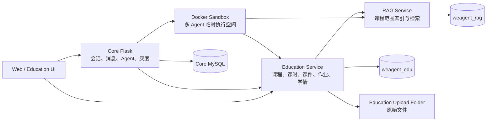

|状态或产物|权威存储|Docker 删除后的行为|
|---|---|---|
|用户、会话、消息、消息元素|Core MySQL|仍可读取；需要执行时创建或恢复 Sandbox。|
|课程、课时、教案、课件源、作业、提交、反馈、学情|`weagent_edu`|仍然存在，是 Education 业务事实来源。|
|知识文档元数据、分块和索引映射|`weagent_rag`|仍然存在；向量后端和原文件必须按部署策略备份。|
|上传的 PDF、Word、图片等原文件|`EDUCATION_UPLOAD_FOLDER`，元数据在 Education DB|不依赖会话容器，但部署时必须将上传目录做持久卷或外部对象存储。|
|Agent 私有工作区和协作中间文件|Sandbox `/workspace/agents/*`|不是业务事实来源；未写回业务对象的临时文件不能作为完成结果。|
|Education 会话与课程关系|`EducationConversationBinding`|独立于旧 Sandbox，可重新校验成员权限后恢复。|
|工具调用与授权审计|`EducationToolGrant`、`EducationToolCall`|保留谁、在哪门课、以哪个 Agent 调用了什么动作。|

因此，“一会话一容器”描述的是执行隔离，不表示课程数据存放在容器里。课程文件柜、题库、试卷、作业、提交和学情必须落入领域数据库或持久化上传目录；Sandbox 只负责生成、检验和协作。

### 10.3 EDU 会话创建、绑定与角色确定

新建 EDU 会话时，用户选择课程，可选课时，不选择教师或学生角色，也不手工勾选微服务。服务端按下面的顺序建立可信上下文：

```text
用户 JWT + course_id + 可选 lesson_id + agent_ids
    → Education 校验 CourseMembership
    → 从实时成员关系解析 teacher/student
    → 校验 lesson 属于当前课程
    → 按角色过滤可信 Education Agent
    → 计算每个 Agent 的服务视角
    → 签发短期 RunGrant
    → Core 创建 conversation
    → 持久化 EducationConversationBinding
    → Core runtime-preflight
    → 创建或恢复 Sandbox 并投影能力
```

`EducationConversationBinding` 保存 `conversation_id`、`actor_user_id`、`course_id`、可选 `lesson_id`、角色快照、材料策略、Agent 服务视角、来源业务路由和状态。`membership_role_snapshot` 只用于审计和 UI；每次可执行请求仍会重新读取实时 `CourseMembership`，避免用户退课或角色变化后继续使用旧权限。

绑定必须在 Core 的 `runtime-preflight` 之前可见。`CoreRuntimeClient.start_workflow()` 通过 `on_conversation_created` 回调先写入 Binding 和 grant 的 `conversation_id`；如果持久化失败，则删除刚创建的 Core 会话或将 Binding 标记为失败，避免产生“有聊天、无课程上下文”的 EDU 会话。

### 10.4 Education Agent 与独立服务视角

可信系统 Agent 由 `backend/services/edu/agent_policy.py` 定义。用户在 EDU 会话中看到的是服务端按课程角色过滤后的清单，不是用户自建 Agent UUID 与系统清单的前端交集。

|Agent|角色|默认服务视角|主要职责|
|---|---|---|---|
|课程设计师 `_edu_1`|教师|`edu`，按策略可用 `rag`|课程读取、课时与教案写入、课程知识检索。|
|课件制作师 `_edu_2`|教师|`edu`，按策略可用 `rag`|课件读取、结构化课件与版本写入。|
|习题生成器 `_edu_3`|教师|`edu`，按策略可用 `rag`|题库写入、按题组卷和课程知识检索。|
|学情分析师 `_edu_4`|教师|`edu`|成绩读取、学情刷新和学生画像分析。|
|学习规划师 `_edu_5`|学生|`edu`|学习证据读取和计划建议。|
|练习教练 `_edu_6`|学生|`edu`|练习、弱点分析和模拟测评。|
|笔记整理师 `_edu_7`|学生|`edu`，按策略可用 `rag`|课程知识检索和思维导图写入。|
|资料研究员 `_edu_8`|教师|`edu + rag`|课程资料读取、检索、来源整理和资料采纳。|
|教学审校员 `_edu_9`|教师|`edu`|目标—活动—评价一致性和内容审校。|

服务视角按以下交集计算：

```text
Agent manifest 声明
∩ Education 领域允许服务
∩ 当前课程角色与材料策略
∩ 本轮灰度和服务健康状态
= AgentAllowedServices
```

`conversation.services` 和 `sandbox_agent_service_views` 可以保存团队服务并集与快照，但不能反向扩大单个 Agent 的权限。`list_services` 返回当前执行 Agent 的授权服务；`call_service_api` 还会按 `session_id + agent_id + service_name` 再校验。EDU 会话不会自动获得 RD 或 Office 服务。

### 10.5 RunGrant、可信工具与业务写回

模型不能在参数中指定 `course_id`、`actor_user_id`、`role`、JWT 或 token 来扩大权限。Education 在启动运行时签发短期 `EducationToolGrant`，把用户、课程、角色、课时、允许 Agent、允许动作、会话和过期时间绑定在服务端。每次调用写入 `EducationToolCall`，记录动作、参数摘要、结果、状态和幂等键。

通用 Agent 工具分为四类：

|工具|边界|
|---|---|
|`list_services`|只列出当前 Agent 的可见服务，不返回内部 URL、密钥或其他 Agent 的服务。|
|`call_service_api`|只调用服务规范声明为可读的受控端点；Education 写接口会要求改用 `education_action`。|
|`rag_search`|由服务端注入 `domain=edu`、课程、用户、角色和文档范围，模型不能扩大。|
|`education_action`|Education 业务写入和敏感读取的唯一入口，服务端注入授权范围并执行幂等校验。|

可信写回链路如下：

```text
自然语言用户意图
→ Agent 读取课程上下文
→ Agent 生成候选内容
→ schema / 业务规则校验
→ education_action
→ ToolGateway 校验 RunGrant、Agent、动作、幂等键
→ 写入 canonical Education object
→ 记录 EducationToolCall
→ 从工具结果构建 education_card
→ 前端展示并允许返回业务页面
```

课件等大对象采用固定 finalizer。课件制作 Agent 只在私有工作区生成白名单文件 `slide_document.json` 和 `preview.html`；可信服务读取、校验结构与视觉规则后，以指定课件 Agent 身份调用 `edu.courseware.create`。模型自行声称“已保存”、只回复文件路径或生成 JavaScript 文件，都不能成为完成结果。

产品型 Agent 运行在 `REQUIRED_PRODUCT_WRITE_TOOL` 中声明必须完成的业务写动作，例如学情分析必须出现成功的 `edu.student_insight.refresh`。如果 Agent 团队结束但没有对应审计调用，运行状态只能是 `partial`，不能显示“已完成”。

### 10.6 课程级 RAG 与外部资料边界

Education 上传资料后，由领域服务完成文件校验、文本提取和 RAG 入库。RAG 服务使用独立数据库保存文档、chunk 和索引映射，Embedding Provider 默认可使用本地实现，也可通过环境配置切换。

```text
教师上传 PDF / Word / 文本
→ EducationAsset 持久化原文件与元数据
→ 文档抽取与清洗
→ Education → RAG ingestion
→ 按 course_id / visibility / owner 写入文档和 chunk
→ Agent rag_search
→ RAG access_scope 二次校验
→ 返回来源、文档、片段和定位
```

教师可读取当前课程授权的教师资料和已发布资料；学生只能读取课程已发布范围及本人允许的 private 数据。课程 A 的 RunGrant、`course_id` 或文档筛选不能用于读取课程 B 的内容。

联网补充资料遵循分离管线：`SearchProvider` 只返回候选 URL、标题和摘要；`ContentFetcher / WebPageReader` 再抓取与清洗正文；最后由 Retriever/Reranker 交给 Agent。搜索结果中的 `content` 只是摘要或描述，不能冒充网页全文或 RAG 证据。

2026-08-06 的真实 UAT 使用 `gift-of-the-magi-reading-writing-assignment.pdf` 完成上传、索引和检索，RAG 返回 3 个命中 chunk；该结果验证的是固定课程范围内的 Web 演示环境，不等同于生产规模性能测试。

### 10.7 Education 业务卡片、预览与双向跳转

`education_card` 是通用消息元素的一种领域变体。模型不能直接构造可信业务卡片；`backend/app/sandbox/container/education_cards.py` 只从成功工具 envelope 中提取 canonical reference、对象类型、标题、摘要、状态和业务元数据。

首批卡片对象包括课程、课时、教案、课件、作业、题库、试卷、知识资源、学情和思维导图。前端主要组件：

- `EducationChatContext.vue`：会话级课程、课时、角色、运行进度和返回入口。
- `EducationCard.vue`：消息级业务对象卡片。
- `ProductAgentRunPanel.vue`：业务页面中的最新运行、Agent 节点、状态和协作历史。
- `SafeHtmlPreview.vue`：通过认证请求加载 HTML，避免 iframe 直接访问受保护 URL 导致 `Missing Authorization Header`。
- `EmbeddedAgentRecord.vue`：在课程、课件、知识中心和学情页面展示最近运行并回到聊天。

双向关联依赖数据库中的 `conversation_id`、`EducationConversationBinding.source_route` 和产品运行的 canonical object，不依赖浏览器临时状态：

```text
Education 业务页面
→ 发起 Agent 运行
→ Core 聊天与 education_card
→ 预览业务产物
→ 返回业务页面
→ 协作历史
→ 找回原聊天
```

打开历史卡片或预览时，服务端重新校验当前课程成员关系和对象可见范围。删除旧 Sandbox 不会删除聊天绑定或 Education 对象；只有尚未写回的临时文件会失去业务可用性。

### 10.8 教师—学生数据闭环

Education Web 端围绕同一 `course_id` 组织教师和学生的不同视图，不把两种角色做成可切换的前端模式。

|阶段|教师侧对象与动作|学生侧对象与动作|数据回流|
|---|---|---|---|
|备课|课程、课时、教案版本、课程资料|只读取已发布材料|课时与教案成为课件、题目和作业的正式来源。|
|课件|AI 生成或上传课件，维护结构化版本和可见性|下载学生可见课件与材料|下载和使用对象保持同一课程、课时关联。|
|作业|发布百分制作业、查看提交、教师最终反馈|保存草稿、正式提交阅读与写作内容|提交版本进入教师批改和 Agent 分析。|
|评估|按作业查看最高、最低、平均、中位数、提交率、分布和趋势|查看自己的成绩、反馈和作业弱点|`edu.student_insight.refresh` 生成课程学情快照。|
|个性学习|教师维护题库、试卷库和知识库|模拟考试、弱点分析、课程思维导图|考试记录、弱点证据和导图版本继续沉淀在课程中。|

业务页发起 Agent 时，用户可见 Prompt 只保留自然需求，例如“根据当前教案生成 PPT”。课程 ID、角色、工具白名单、schema、finalizer 协议和安全边界由服务端执行上下文注入，不伪装成用户聊天内容。

### 10.9 一致性、失败与恢复

Education 链路跨 Core、领域数据库、Sandbox 和 RAG，完成状态必须以可审计业务写入为准，而不是以最后一条自然语言回复为准。

|症状|根因或判定|恢复与修复策略|
|---|---|---|
|`Education conversation context not found`|Core 在 Binding 提交前执行 runtime preflight。|会话创建后先通过回调持久化 Binding 和 grant，再执行 preflight；失败时清理无上下文会话。|
|Agent 团队结束但缺少业务产物|没有成功的必需工具调用，或调用属于错误 Agent/课程。|保持 `partial`，展示精确缺失动作；让指定 Agent 修复并重新调用。|
|工具实际成功却误报缺少 `edu.student_insight.refresh`|运行时轮换 grant 后没有回写 `agent_run_id/tool_grant_id`，且数据库事务看不到外部 finalizer 的新提交。|轮换时关联产品运行；同步前结束旧读事务；按同会话、用户、课程、动作和指定 Agent 的审计调用安全重建 adopted object。|
|HTML 预览返回 `Missing Authorization Header`|无认证 iframe 直接打开受保护接口。|使用前端认证请求、Blob/安全预览或短期签名资源，不暴露内部 token。|
|RAG 不可用|独立服务超时、索引未完成或灰度关闭。|回退到当前课程结构化资料并明确标记 fallback；不得把搜索摘要冒充全文证据。|
|Docker 被停止或重建|旧临时工作区不可用。|从 Core 消息、Education Binding、canonical object 和 RAG 元数据恢复；必要时创建新 Sandbox。|
|卡片存在但成员权限已变化|历史卡片快照不能代表当前权限。|再次打开时重新校验 CourseMembership；无权限时不返回对象标题和摘要。|

`EducationAgentRun.tool_grant_id`、`EducationToolGrant.agent_run_id` 和 `EducationToolCall.grant_id` 构成产品运行到工具审计的关联。历史兼容恢复只能接受同一 conversation、actor、course、required tool 和 designated agent 的成功调用，不能仅按标题或时间猜测。

### 10.10 测试与验收证据

截至 2026-08-06，本机固定 Web UAT 环境完成以下验证：

- 教师账号与学生账号进入同一真实高中英语课程，角色由成员关系自动确定。
- 课程包含三个课时、真实英文作业、百分制反馈、两项弱点、七题模拟考试、十四节点思维导图和班级成绩趋势。
- 真实 PDF 完成上传、RAG 入库、3 个 chunk 命中和来源验证。
- 教师业务页、Agent 聊天、业务卡片、HTML 预览和返回业务页完成双向验证。
- `edu.student_insight.refresh` 成功工具调用与产品运行状态完成一致性回归。
- 后端完整测试在该提交状态下为 `535 passed`；Education 聚焦套件为 `53 passed`。
- Core `5002`、Education `5102`、RAG `5104`、Web `8080` 在验收时均处于监听状态。

固定课程为“高一英语·叙事阅读与写作（真实案例）”。账号密码、JWT、Provider Key 和 RAG 内部密钥不写入技术文档或 Git。

本轮证据不覆盖生产高并发、跨机器容器编排、对象存储容灾、Desktop Education 页面和 Android Education 页面；这些能力仍需在目标部署环境单独验证。

## 11. 关键术语表

本章统一全文使用的核心概念。术语表不重复实现细节，只解释概念边界，便于技术评审、后续维护者和协作者在讨论功能时使用同一套词汇。

|术语|解释|
|---|---|
|Agent|WeAgent 中承担某类任务的 AI 工作角色，技术上对应全局 Agent 配置、会话参与者和容器内运行上下文。|
|Moderator|多 Agent 会话中的主持 Agent，负责理解任务、生成计划、选择 worker、组织执行并汇总结果。|
|Worker|被主持 Agent 分配具体子任务的工作 Agent。|
|Adapter|Agent 选择底层 AI Coding 执行引擎的配置，当前通过 `adapter_name` 指向 Claude Code、Codex 或 OpenCode。|
|Provider Runner|容器内封装具体 Provider CLI 的运行器，负责命令构造、环境变量、输出采集、错误解析和停止行为。|
|Sandbox Session|后端用于管理某个 Docker Sandbox 生命周期的 session，包含容器、端口、状态和工作区绑定。|
|Docker Sandbox|隔离 Agent 执行、文件系统、工具、服务端口和运行状态的 Docker 容器。|
|Orchestrator|容器内组织 Agent 执行、任务分配、能力投影和事件上报的调度组件。|
|AgentRun|记录单个 Agent 在一轮会话中的执行状态、错误、开始时间、结束时间和事件序号。|
|Message Element|`Message.elements` 中的结构化展示单元，例如 progress、file、image、table、service、diff、workflow。|
|Artifact|可复用产物记录，当前 `Artifact` 表主要保存 code、webpage、document、ppt、diff，不等同于所有消息产物。|
|Raw Output|`Message.raw_output` 中保存的底层 Provider 或容器原始输出，用于排查和恢复展示。|
|Workflow|主持 Agent 任务计划的结构化表示，可在消息中预览、复制、编辑并作为下一轮调度输入。|
|Capability|Skill、Tool、MCP、Plugin 的统一能力抽象，可导入、审查、版本化并绑定到 Agent。|
|Capability Projection|会话创建或恢复时，把 Agent 可用能力写入容器 `/workspace/.weagent/*` 的过程。|
|MCP Runtime|容器内启动、列出、调用和停止 MCP server 的运行时。|
|ToolProviderConfig|用户为某个能力配置外部工具 Provider 的记录，不等同于 Agent Adapter。|
|Service Proxy|后端把容器内服务代理成用户可访问 URL 的机制，负责 session、service 和 token 校验。|
|`weagent-report`|容器内结构化上报命令，用于把进度、结果、文件、表格、服务、错误等提交给容器控制面。|
|`weagent-service`|容器内服务管理命令，用于启动长运行服务并上报 service 类型产物。|
|EducationConversationBinding|把 Core 会话持久关联到 Education 用户、课程、课时、角色快照、材料策略、Agent 服务视角和来源业务路由的领域记录。|
|RunGrant|服务端签发的短期运行授权，约束用户、课程、角色、Agent、动作、会话和有效期；不是模型可自行填写的业务参数。|
|Agent Service View|单个 Agent 在当前领域、课程、角色、材料策略和灰度条件下可见的服务集合。|
|Canonical Education Object|已经通过可信工具校验并写入 Education 数据库的课程、课时、课件、作业、学情等业务对象。|
|education_card|由成功工具结果生成的 Education 消息卡片，保存 canonical reference，并在读取时重新校验课程权限。|
|Workbench|前端用于查看、编辑、比较和迁移产物的工作台能力。|
